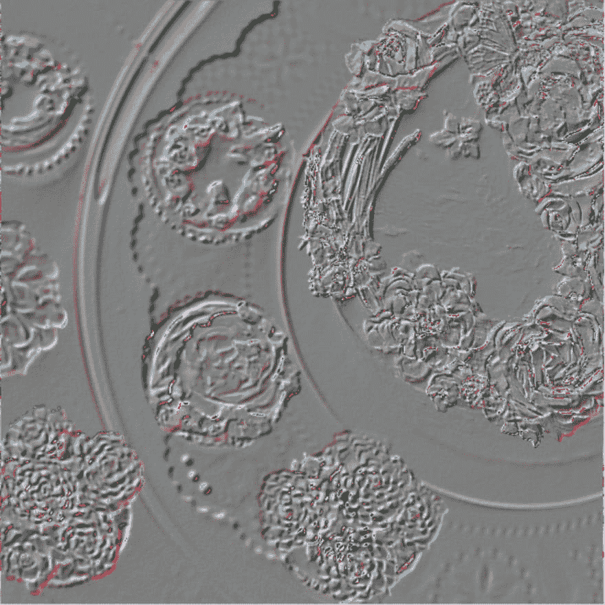

# AssemblyScript:让 JavaScript 程序员更容易访问 WebAssembly

> 原文：<https://dev.to/gonzaloruizdevilla/assemblyscript-making-webassembly-more-accessible-to-javascript-programmers-bp8>

*TL；dr:这是对 AssemblyScript 的介绍:我解释了什么是 WebAssembly，为什么 AssemblyScript 可能是 JavaScript 开发人员构建 WebAssembly 的一个有趣的替代方案，最后，为了比较 JavaScript 和 AssemblyScript，我评论了我为此开发的一个小的图像操作项目。*

webAssembly 是 Web 领域最大的革命之一，尽管它既不是 Web 也不是 Assembly。WebAssembly，也称为 Wasm，是一种快速、高效、安全的低级 Web 字节码。

这意味着，一方面，它不是汇编语言，而是字节码。虽然从不是高级语言的意义上来说，它们是相似的，但它们很容易理解，这是机器码不会发生的事情。因此，它们可以被归类为介于高级语言和机器代码之间的中间语言类别。汇编语言和字节码的主要区别在于，前者是为 CPU 创建的，而后者是为虚拟机创建的。也就是说，一个针对硬件，而另一个针对软件。

确实有字节码文本版本，命名为 WebAssembly Text Format(或者就叫 Wat！).

此外，尽管人们通常说 Wasm 是用于 web 的，但事实是它不仅仅用于 Web，因为它也可以用于桌面应用程序、无服务器应用程序，甚至加密和智能合同。

# 高效

WebAssembly 被设计成二进制文件格式，易于下载和编译成机器代码。它还允许在下载代码的同时编译代码。这个特性被称为流编译。

使用 JavaScript 中的 Wasm 模块非常简单，如下所示:

```
async function run() {
  const {instance} = await WebAssembly.instantiateStreaming(
    fetch("./add.wasm"),
    env: { abort: () => console.log("Abort!") }
  );
  const r = instance.exports.add(1, 2);
  console.log(r);
}
run(); 
```

Das 苏尔马建议的以下加载 Wasm 模块的方法将允许您健壮地使用流编译。即使 Content-Type 没有正确设置为`application/wasm`(例如，Firefox 通常会失败)，甚至如果您使用的是 Safari(它还不支持`instantiateStreaming`)，它也会工作。

```
async function maybeInstantiateStreaming(path, ...opts) {
  // Start the download asap.
  const f = fetch(path);
  try {
    // This will throw either if `instantiateStreaming` is
    // undefined or the `Content-Type` header is wrong.
    return WebAssembly.instantiateStreaming(
      f,
      ...opts
    );
  } catch(_e) {
    // If it fails for any reason, fall back to downloading
    // the entire module as an ArrayBuffer.
    return WebAssembly.instantiate(
      await f.then(f => f.arrayBuffer()),
      ...opts
     );
  }
} 
```

为了提供一个保护我们免受恶意攻击的安全环境，网络上已经做了很多工作，Wasm 也是基于同样的原则设计的。例如，和 JavaScript 一样，Wasm 是在沙箱环境中执行的，这使得它与生产环境隔离开来。因此，例如，有必要使用 [Web 文件 API](https://developer.mozilla.org/en-US/docs/Web/API/File) 来访问文件系统，这正是 JavaScript 需要做的。

# 字节码

Wasm 设计的主要目标是什么？以二进制代码编码(从大小和加载时间的角度来看非常有效)，以本机速度执行，并且还利用了不同平台中可用的通用硬件能力。

为了实现这些目标，Wasm 的作者不得不构建一些新的东西(使用 asm.js 作为起点)，而不是使用 LLVM、Java 或。Net 字节码。因此，他们开发了一种新的二进制指令，旨在成为 C、C++或 Rust 等高级语言编译的可移植目标。

# “Wat”想编程 WebAssembly 应该怎么做？

一个人知道的永远不会太多，所以如果你想学 Wat，那就去学吧！然而，如果你喜欢 JavaScript，看看下面的例子，如果我说你喜欢 Wat 的替代品，你可以纠正我

```
(;
  Filename: add.wat
  This is a block comment.
;)
(module
  (func $add (param $p1 i32) (param $p2 i32) (result i32)
    local.get $p1 ;; Push parameter $p1 onto the stack
    local.get $p2 ;; Push parameter $p2 onto the stack
    i32.add ;; Pop two values off the stack and push their sum
    ;; The top of the stack is the return value
  )
  (export "add" (func $add))
) 
```

# 汇编脚本

AssemblyScript 将 TypeScript 的严格子集(JavaScript 的类型化超集)编译为 WebAssembly。这意味着我们可以利用 JavaScript 知识来开发 Wasm。

为了说明 JavaScript 和 AssemblyScript 有多么相似，我准备了这个小项目，用普通 JavaScript 和编译成 Wasm 的 AssemblyScript 中的代码操作一张图片。可以在这里找到:[[https://github . com/gonzaloruizdevilla/image-manipulation-assembly script](https://github.com/gonzaloruizdevilla/image-manipulation-assemblyscript)]

在该项目中，您将看到一张图片，它被加载到一个 html 画布中，还有几个按钮，当单击这些按钮时，它们会对图片应用不同的过滤器。这些按钮将使用 JavaScript 或 AssemblyScript 生成的 Wasm 模块执行过滤器。

[](https://res.cloudinary.com/practicaldev/image/fetch/s--n04J5iqT--/c_limit%2Cf_auto%2Cfl_progressive%2Cq_auto%2Cw_880/https://thepracticaldev.s3.amazonaws.com/i/if2bwuqecwnzvlr8nvag.png)

应用不同的过滤器，我们得到这样的图像:
[](https://res.cloudinary.com/practicaldev/image/fetch/s--RIFys0C1--/c_limit%2Cf_auto%2Cfl_progressive%2Cq_auto%2Cw_880/https://thepracticaldev.s3.amazonaws.com/i/u0z68it5hgeqqksye50j.png)

[](https://res.cloudinary.com/practicaldev/image/fetch/s--r-4SR2VE--/c_limit%2Cf_auto%2Cfl_progressive%2Cq_auto%2Cw_880/https://thepracticaldev.s3.amazonaws.com/i/9c5qsbdkegw8ib174r8i.png)

[](https://res.cloudinary.com/practicaldev/image/fetch/s--gyRA_yVT--/c_limit%2Cf_auto%2Cfl_progressive%2Cq_auto%2Cw_880/https://thepracticaldev.s3.amazonaws.com/i/bitdiwlq9op41wx75f4v.png)

为了使用该项目，只需从 Github 中克隆出来，然后安装 AssemblyScript 依赖项，编译 index.ts AssemblyScript 文件，指令如下:

```
npm install
npm run asbuild 
```

有趣的是，当从 JavaScript 代码调用 Wasm 函数时，调用的参数必须是以下类型:

*   i32: 32 位整数
*   i64: 64 位整数
*   f32: 32 位浮点型
*   f64: 64 位浮点

显然，这意味着我们不能把图像作为调用的参数传递。为了能够使用 Wasm 中的图片信息，首先，它应该存储在使用 WebAssembly 创建的共享内存区域中。记忆类。这个共享内存对象被用作 Wasm 实例化函数的参数，如下面的代码所示:

```
//A memory created by JavaScript or in WebAssembly code will be accessible and mutable from both JavaScript and WebAssembly.

const memory = new WebAssembly.Memory({ initial:initial * 2 });

//Instantiating Wasm module

const importObject = { env: { memory, abort: () => console.log("Abort!") }};
const {instance} = await WebAssembly.instantiateStreaming(
    fetch("./build/untouched.wasm"),
    importObject
);

//Creating a typed array reference to write into the memory buffer
const mem = new Uint8Array(memory.buffer); 
```

在调用 Wasm 过滤器之前，画布中的图片数据被检索并复制到共享内存中。之后，调用 Wasm 过滤器，然后读取结果并存储在 imageData 中。最后，我们将 imageData 发送到 canvas context，重新绘制图像。

## JavaScript 版本

```
//retrieve image pixels (4 bytes per pixel: RBGA)
const data = imageData.data;
//copy to bytes to shared memory
mem.set(data);

//invoque 'fn'  Wasm filter. We need to inform of the image byte size
const byteSize = data.length;
instance.exports[fn](byteSize, ...args);

//copy the response from the shared memory into the canvas imageData
data.set(mem.slice(byteSize, 2*byteSize))
//update canvas
ctx.putImageData(imageData, 0, 0); 
```

JavaScript 和 AssemblyScript 中实现了四种不同的滤镜功能:反转、灰度、棕褐色和卷积(这一个用于应用模糊、边缘检测和浮雕滤镜)。如下图所示，它们非常相似:

```
function invert(data) {
    for (var i = 0; i < data.length; i += 4) {
        data[i]     = 255 - data[i];     
        data[i + 1] = 255 - data[i + 1]; 
        data[i + 2] = 255 - data[i + 2]; 
    }
};

function grayscale(data){
    for (var i = 0; i < data.length; i += 4) {
        const avg = 0.3  * data[i] + 0.59 * data[i + 1] + 0.11 * data[i + 2];
        data[i]     = avg;  
        data[i + 1] = avg; 
        data[i + 2] = avg; 
    }
}

function sepia(data){
    for (var i = 0; i < data.length; i += 4) {
        const avg = 0.3  * data[i] + 0.59 * data[i + 1] + 0.11 * data[i + 2];
        data[i]     = avg + 100;  
        data[i + 1] = avg + 50; 
        data[i + 2] = avg; 
    }
}

function addConvolveValue(pos, i, data, length){
    return pos >= 0 && pos < length ? data[pos] : data[i];
}

function convolve(data, w, offset, v00, v01, v02, v10, v11, v12, v20, v21, v22){
    console.log( w, offset, v00, v01, v02, v10, v11, v12, v20, v21, v22)
    const divisor = (v00 + v01 + v02 + v10 + v11 + v12 + v20 + v21 + v22) || 1;
    const length = data.length;
    let res = 0;
    let newData = new Uint8Array(length)
    for(let i = 0; i < length; i++){
        if ((i + 1) % 4 === 0) {
            newData[i] = data[i];
            continue;
        }
        let res = v00 * addConvolveValue(i - w * 4 - 4, i, data, length) +
                    v01 * addConvolveValue(i - w * 4, i, data, length) +
                    v02 * addConvolveValue(i - w * 4 + 4, i, data, length) +
                    v10 * addConvolveValue(i - 4, i, data, length) +
                    v11 * data[i] +
                    v12 * addConvolveValue(i + 4, i, data, length) +
                    v20 * addConvolveValue(i + w * 4 - 4, i, data, length) +
                    v21 * addConvolveValue(i + w * 4 , i, data, length) +
                    v22 * addConvolveValue(i + w * 4 + 4, i, data, length);
        res /= divisor;
        res += offset;
        newData[i] = res;
    }
    data.set(newData)
} 
```

## 汇编脚本版本

```
/// <reference path="../node_modules/assemblyscript/dist/assemblyscript.d.ts" />

export function invert(byteSize: i32): i32 {
  for (var i = 0; i < byteSize; i += 4) {
    let pos = i + byteSize; 
    store<u8>(pos, 255 - load<u8>(i));
    store<u8>(pos + 1, 255 - load<u8>(i + 1));
    store<u8>(pos + 2, 255 - load<u8>(i + 2));
    store<u8>(pos + 3, 255);
  }
  return 0;
}

export function grayscale(byteSize: i32): i32 {
  for (var i = 0; i < byteSize; i += 4) {
    let pos = i+byteSize;
    const avg = u8(0.3  *  load<u8>(i) + 0.59 * load<u8>(i + 1) + 0.11 * load<u8>(i + 2));
    store<u8>(pos, avg);
    store<u8>(pos + 1, avg);
    store<u8>(pos + 2, avg);
    store<u8>(pos + 3, 255);
  }
  return 0;
}

export function sepia(byteSize: i32): i32 {
  for (var i = 0; i < byteSize; i += 4) {
    let pos = i+byteSize;
    const avg = 0.3  *  load<u8>(i) + 0.59 * load<u8>(i + 1) + 0.11 * load<u8>(i + 2);
    store<u8>(pos, u8(min(avg + 100, 255)));
    store<u8>(pos + 1, u8(min(avg + 50, 255)));
    store<u8>(pos + 2, u8(avg));
    store<u8>(pos + 3, 255);
  }
  return 0;
}

@inline
function addConvolveValue(pos:i32, oldValue:u8, length:i32): i32 {
  return pos >= 0 && pos < length ? load<u8>(pos) : oldValue;
}

export function convolve(byteSize:i32, w:i32, offset:i32, v00:i32, v01:i32, v02:i32, v10:i32, v11:i32, v12:i32, v20:i32, v21:i32, v22:i32): i32 {
  let divisor = (v00 + v01 + v02 + v10 + v11 + v12 + v20 + v21 + v22) || 0;
  if (divisor === 0) {
    divisor = 1;
  }
  for(let i = 0; i < byteSize; i++){
      if ((i + 1) % 4 === 0) {
        store<u8>(i+byteSize, load<u8>(i));

      } else {
        let oldValue = load<u8>(i);
        let prev = i - w * 4;
        let next = i + w * 4;
        let res = v00 * addConvolveValue(prev - 4, oldValue, byteSize)  +
                  v01 * addConvolveValue(prev, oldValue, byteSize)      +
                  v02 * addConvolveValue(prev + 4, oldValue, byteSize)  +
                  v10 * addConvolveValue(i - 4, oldValue, byteSize)     +
                  v11 * oldValue +
                  v12 * addConvolveValue(i + 4, oldValue, byteSize)     +
                  v20 * addConvolveValue(next - 4, oldValue, byteSize)  +
                  v21 * addConvolveValue(next , oldValue, byteSize)     +
                  v22 * addConvolveValue(next + 4, oldValue, byteSize);
        res /= divisor;
        res += offset;
        store<u8>(i+byteSize, u8(res));
      }
  }
  return 0;
} 
```

如您所见，AssemblyScript 代码非常相似，但类型和工作在较低的级别，这使得开发人员可以利用 Wasm 的所有潜力。所以，现在，轮到你开始使用 AssemblyScript 并增强你对 Wasm 技术的信心了，Wasm 技术在未来几年的 web 开发中将变得越来越重要！