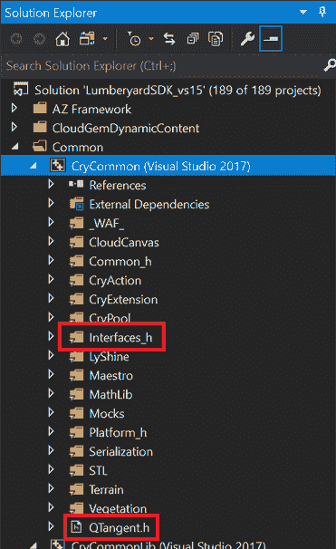
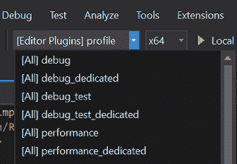

# 贮木场和晶圆厂

> 原文：<https://dev.to/jeikabu/lumberyard-and-waf-2cko>

学习如何使用 Lumberyard 的构建系统是开发的一个关键部分。Waf 被定位为“元构建系统”——一个构建系统的框架。

## 晶圆基础知识

在[用户指南](https://docs.aws.amazon.com/lumberyard/latest/userguide/waf-intro.html)中广泛记录了 Lumberyard 的构建系统。

关键文件/文件类型:

| 文件 | 描述 | 细节 |
| --- | --- | --- |
| `wscript` | 模块脚本 | [文档](https://docs.aws.amazon.com/lumberyard/latest/userguide/waf-files-module-files-wscript.html) |
| `*.waf_files` | 模块的文件列表 | [文档](https://docs.aws.amazon.com/lumberyard/latest/userguide/waf-files-filelist.html) |
| `Tools/build/waf-1.x.y/` | 构建脚本源代码(Python) |  |
| `_WAF_/specs/` | 规格——用模块列表构建配置 | [规格格式](https://docs.aws.amazon.com/lumberyard/latest/userguide/waf-files-spec-file.html) |

键盘命令:

```
# Help and list of commands  ./lmbr_waf.bat  --help  # List all commands  ./lmbr_waf.bat  --list  # GUI to create/edit `dev/_WAF_/usersettings.options`  ./lmbr_waf.bat  show_option_dialog  # Configure the project using `usersettings.options`  ./lmbr_waf.bat  configure  # Regenerate Visual Studio solution in `visual_studio_solution_folder` (default: `dev/Solutions/`)  ./lmbr_waf.bat  msvs 
```

<svg width="20px" height="20px" viewBox="0 0 24 24" class="highlight-action crayons-icon highlight-action--fullscreen-on"><title>Enter fullscreen mode</title></svg> <svg width="20px" height="20px" viewBox="0 0 24 24" class="highlight-action crayons-icon highlight-action--fullscreen-off"><title>Exit fullscreen mode</title></svg>

晶圆制造相关命令遵循格式`(build|clean|package|deploy)_PLATFORM[_ARCH]_TOOLCHAIN_CONFIG` :

```
./lmbr_waf.bat  clean_win_x64_vs2017_profile  # Use _WAF_/specs/engine_and_editor.json spec  ./lmbr_waf.bat  build_win_x64_vs2017_profile  -p  engine_and_editor  ./lmbr_waf.bat  build_win_x64_vs2017_profile  --project-spec=engine_and_editor 
```

<svg width="20px" height="20px" viewBox="0 0 24 24" class="highlight-action crayons-icon highlight-action--fullscreen-on"><title>Enter fullscreen mode</title></svg> <svg width="20px" height="20px" viewBox="0 0 24 24" class="highlight-action crayons-icon highlight-action--fullscreen-off"><title>Exit fullscreen mode</title></svg>

`usersettings.options`中的设置可以被覆盖:

```
./lmbr_waf.bat  build_win_x64_vs2017_profile  --enabled-game-projects=SamplesProject 
```

<svg width="20px" height="20px" viewBox="0 0 24 24" class="highlight-action crayons-icon highlight-action--fullscreen-on"><title>Enter fullscreen mode</title></svg> <svg width="20px" height="20px" viewBox="0 0 24 24" class="highlight-action crayons-icon highlight-action--fullscreen-off"><title>Exit fullscreen mode</title></svg>

## 添加/删除文件

检查项目的`wscript`以获得文件列表。这里是`Code\CryEngine\CryCommon\wscript` :

```
def build(bld):
    bld.CryFileContainer(
        # SNIP
        target = 'CryCommon',
        vs_filter = 'Common',
        file_list = 'crycommon.waf_files',
        # SNIP ) 
```

<svg width="20px" height="20px" viewBox="0 0 24 24" class="highlight-action crayons-icon highlight-action--fullscreen-on"><title>Enter fullscreen mode</title></svg> <svg width="20px" height="20px" viewBox="0 0 24 24" class="highlight-action crayons-icon highlight-action--fullscreen-off"><title>Exit fullscreen mode</title></svg>

`crycommon.waf_files`JSON 是否指定了文件和 VS 解决方案过滤器:

```
{  "none":  {  "Root":  [  "QTangent.h"  ],  "Interfaces_h":  [  "InputTypes.h",  "GameplayEventBus.h",  "InputEventBus.h",  "InputNotificationBus.h",  ... 
```

<svg width="20px" height="20px" viewBox="0 0 24 24" class="highlight-action crayons-icon highlight-action--fullscreen-on"><title>Enter fullscreen mode</title></svg> <svg width="20px" height="20px" viewBox="0 0 24 24" class="highlight-action crayons-icon highlight-action--fullscreen-off"><title>Exit fullscreen mode</title></svg>

重新生成 Visual Studio 项目:

```
# If `generate_vs_projects_automatically` is enabled  ./lmbr_waf.bat  configure  # Otherwise  ./lmbr_waf.bat  msvs 
```

<svg width="20px" height="20px" viewBox="0 0 24 24" class="highlight-action crayons-icon highlight-action--fullscreen-on"><title>Enter fullscreen mode</title></svg> <svg width="20px" height="20px" viewBox="0 0 24 24" class="highlight-action crayons-icon highlight-action--fullscreen-off"><title>Exit fullscreen mode</title></svg>

创建一个带有`Common`过滤器的解决方案，该过滤器包含一个根中带有`QTangent.h`的“CryCommon”项目和一个`Interfaces_h`子过滤器:

[](https://res.cloudinary.com/practicaldev/image/fetch/s--k2PV2QMh--/c_limit%2Cf_auto%2Cfl_progressive%2Cq_auto%2Cw_880/https://rendered-obsolete.github.io/assets/lmbr_vs_waf_files.png)

## 添加一个规范

很容易创建一个新的规范来构建特定的模块子集。贮木场用户指南有很好的文档:

*   [“添加规格”](https://docs.aws.amazon.com/lumberyard/latest/userguide/waf-using-spec.html)
*   [规格格式](https://docs.aws.amazon.com/lumberyard/latest/userguide/waf-files-spec-file.html)

例如，我们可以创建一个规范来构建编辑器插件——否则只能用`all`规范来构建。

1.  创建`_WAF_/specs/editor_plugins.json`:

```
{  "description":  "Editor Plugins",  "visual_studio_name":  "Editor Plugins",  "modules"  :  [  "AssetTagging",  "ComponentEntityEditorPlugin",  "CryDesigner",  "DeploymentTool",  "EditorAnimation",  "EditorAssetImporter",  "EditorModularBehaviorTree",  "EditorUI_QT",  "FBXPlugin",  "FFMPEGPlugin",  "MaglevControlPanel",  "MetricsPlugin",  "ParticleEditorPlugin",  "PerforcePlugin",  "ProjectSettingsTool",  "UiCanvasEditor"  ]  } 
```

<svg width="20px" height="20px" viewBox="0 0 24 24" class="highlight-action crayons-icon highlight-action--fullscreen-on"><title>Enter fullscreen mode</title></svg> <svg width="20px" height="20px" viewBox="0 0 24 24" class="highlight-action crayons-icon highlight-action--fullscreen-off"><title>Exit fullscreen mode</title></svg>

1.  通过`./lmbr_waf.bat show_option_dialog`的 **Visual Studio 项目生成器**选项卡将新规范添加到`specs_to_include_in_project_generation`。或者，在`_WAF_/user_settings.options` :

    ```
    [Visual Studio Project Generator]
    specs_to_include_in_project_generation = all,editor_plugins 
    ```

2.  生成 Visual Studio 文件:

    ```
    ./lmbr_waf.bat  msvs  # Or, if `generate_vs_projects_automatically` is enabled  ./lmbr_waf.bat  configure 
    ```

3.  构建:在 Visual Studio 中选择`[Editor Plugins]`配置。或者:

    ```
    ./lmbr_waf.bat  build_win_x64_vs2017_profile  -p  editor_plugins 
    ```

## 升级

随着 [Lumberyard 1.21 发布](https://forums.awsgametech.com/t/lumberyard-release-notes-beta-1-21-september-2019/)，现在也是进行简单引擎升级的好时机。

1.  Update git repo

    ```
    # Assumes you're working on a fork. If not, skip this and replace `upsteam` with `origin`  git  remote  add  upstream  https://github.com/aws/lumberyard.git  git  fetch  --all  git  checkout  master  git  pull  upstream  master 
    ```

2.  可选地，如果你订阅了[“从轨道上用核武器摧毁它”](https://www.google.com/search?q=nuke+it+from+orbit)学派:

    ```
    Remove-Item  -Recurse  -Path  ./dev,./3rdParty  # Restore dev/ and 3rdParty/  git  reset  --hard  # Remove untracked files/directories  git  clean  -fd 
    ```

3.  更新二进制文件和第三方依赖关系

    ```
    ./git_bootstrap.exe  # If it doesn't start automatically  ./SetupAssistant.bat 
    ```

4.  重新初始化晶圆

    ```
    cd  dev/  ./lmbr_waf.bat  configure 
    ```

## 提示

*   这些配置的名称相当长。您可以嵌入**解决方案配置**下拉列表([从此处开始](https://visualstudioextensions.vlasovstudio.com/2014/08/14/adjusting-the-width-of-solution-configurations-drop-down-list-in-the-visual-studio-toolbar/)):

    1.  **工具** > **定制……**
    2.  **命令**标签，**工具栏**:“标准”
    3.  在*预览中:*选择**解决方案配置**
    4.  点击**修改选择**按钮
    5.  下面是 **150** 的*宽度*:
*   如果你是授权的 Playstation/Xbox 开发者，你可以访问 Lumberyard PS4/Xbone 代码(来自 [FAQ](https://aws.amazon.com/lumberyard/faq/#Q._How_do_I_get_started_with_Xbox_and_PlayStation_game_development.3F) ):

    > 如果你是微软 Xbox 授权开发者，请将你的姓名、工作室名称和授权电子邮件地址发送至[lumberyard-consoles@amazon.com](mailto:lumberyard-consoles@amazon.com)。如果你是索尼 PlayStation 的授权开发者，请访问 SCE DevNet。在中间件目录下，点击 Amazon Lumberyard 的“确认状态”。