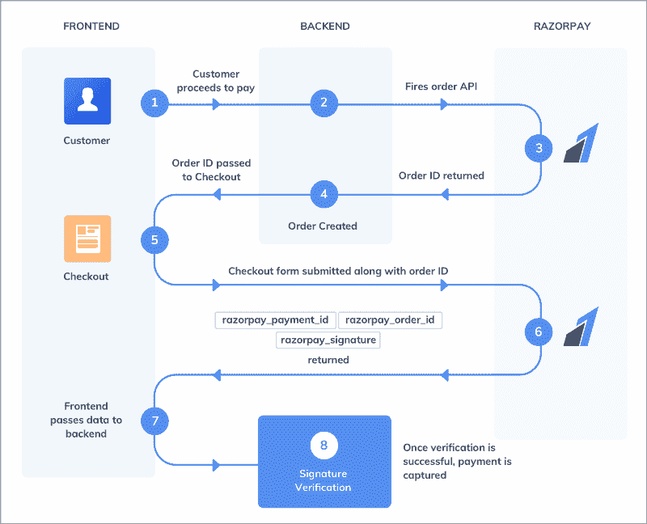
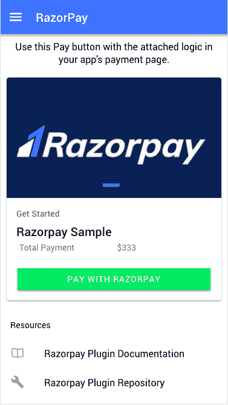

# 如何在 Ionic 4 应用和 PWA 中集成 Razorpay

> 原文：<https://dev.to/enappd/how-to-integrate-razorpay-in-ionic-4-apps-and-pwa-4dge>

* * *

**Razorpay** 是一家支付公司，为印度的在线商家提供支付解决方案。Razorpay 于 2014 年在我们自己的城市斋浦尔成立😃。他们是 Y Combinator 2015 年启动计划冬季批次的一部分。Razorpay 允许在线企业通过多种支付模式接受、处理和支付数字支付，如借记卡、信用卡、网上银行、UPI 和预付费数字钱包。Razorpay 支付解决方案可以通过 web 和移动应用程序进行集成。

> Razorpay 目前只为印度的企业服务，但这并没有让它变小。功能性和开发者友好性 Razorpay 可以被称为印度的条纹。

不要混淆单一货币支付的印度业务。Razorpay 接受几乎所有货币的支付。

### 什么是离子 4？

你可能已经知道离子，但我把它放在这里只是为了初学者。 **Ionic** 是 Drifty Co .的 Max Lynch、Ben Sperry 和 Adam Bradley 于 2013 年创建的一款用于混合移动应用开发的完整开源 SDK。Ionic 提供使用 CSS、HTML5 和 Sass 等 Web 技术开发混合移动应用的工具和服务。可以使用这些 Web 技术构建应用程序，然后通过本地应用程序商店分发，并利用 Cordova 安装在设备上。

所以，换句话说——如果你用 Android 创建原生应用，你就用 Java 编码。如果你在 iOS 中创建原生应用，你用 Obj-C 或 Swift 编码。这两种语言都是强大但复杂的语言。有了 Cordova(和 Ionic ),你可以为你的应用程序编写一段代码，它可以在 iOS 和 Android(以及 windows！)，HTML、CSS 和 JS 的简单性也是如此。

### Ionic 4 和支付网关

Ionic 4 可以创建各种各样的应用程序，因此可以在 Ionic 4 应用程序中实现各种各样的支付网关。比较流行的有 PayPal，Stripe，Razorpay，Braintree，应用内购买等。关于支付网关的更多细节，你可以阅读我在 Ionic 4 上关于[支付网关解决方案的概述博客，或者在](https://medium.com/enappd/payment-solutions-in-ionic-8c4bb28ce5cc) [PayPal](https://medium.com/enappd/paypal-integration-in-ionic-4-for-apps-and-pwa-ffeeb2b00b49) 和 [Stripe](https://medium.com/enappd/integrating-stripe-payment-in-ionic-4-for-apps-and-pwa-de05142c523e) 上的详细博客。

Razorpay 可以集成在网站和移动应用程序中。在这篇博客中，我们将学习如何在 Ionic 4 应用程序和 Ionic 4 PWA 中集成 Razorpay 支付网关。


<figure>

<figcaption class="imageCaption">Ionic 4 and Razorpay make a great team</figcaption>

</figure>

### Razorpay 集成方法

Razorpay 遵循标准的支付流程，类似于 Stripe



<figure>

<figcaption class="imageCaption">Razorpay payments flow</figcaption>

</figure>

在开始与我们的产品集成之前，您可能需要考虑可用的集成途径:

1.  [与收银台整合](https://razorpay.com/docs/payment-gateway/integrations-guide/checkout)

网站中最流行的方法。这类似于贝宝支付按钮，弹出一个自动生成的表格，并负责验证等本身。


<figure>

<figcaption class="imageCaption">Razorpay Checkout flow</figcaption>

</figure>

[2。与移动应用](https://razorpay.com/docs/payment-gateway/integrations-guide/mobile)集成—使用标准 SDK

[3。与 Razorpay APIs 集成](https://razorpay.com/docs/payment-gateway/integrations-guide/s2s)

这需要在你的 Razorpay 账户中特别启用。这本质上是服务器到服务器的支付通信。

[4。与插件](https://razorpay.com/docs/ecommerce-plugins)集成——各种插件可用于 Woocommerce、Magento、Wix 等。

在 Ionic 4 应用中集成 Razorpay 非常简单明了。它使用了[**razor pay-Cordova-plugin**](https://github.com/razorpay/razorpay-cordova)，它在应用程序和 PWA 中都可以工作。

让我们一步一步地开始

> 本教程的完整源代码可以在 [Ionic4-razorpay Github 资源库中找到。](https://github.com/enappd/ionic4-razorpay.git)

### 先决条件

*   为 Razorpay 集成创建 Ionic 4 应用程序
*   API 密钥的 Razorpay 开发人员帐户

#### 创建一个基本的 Ionic 4 应用程序

创建一个基本的 Ionic 4 应用程序非常容易。假设您的系统中已经安装了所有的基本要求，运行

```
$ ionic start MyApp sidemenu
```

这将创建标题为`MyApp`和侧菜单模板的应用程序。

> 关于如何创建一个基本的 Ionic 4 应用程序的更多细节，请参考我的博客[如何创建一个 Ionic 4 应用程序](https://medium.com/enappd/how-to-create-an-ionic-4-app-for-beginners-e181e116190a)

稍加修改，我的主页看起来是这样的。



<figure>

<figcaption class="imageCaption">Razorpay payment home page</figcaption>

</figure>

文件结构看起来像这样，只是一个想法


<figure>

<figcaption class="imageCaption">File structure for Razorpay Ionic 4 sample app</figcaption>

</figure>

这个 HTML 的主要功能部分就是你上面看到的支付按钮，它调用了`razor.page.ts`文件中的`payWithRazor()`函数。HTML 看起来如下