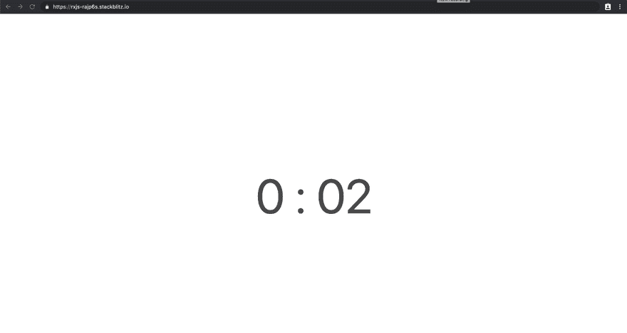

# 一个简单的 RxJS 倒计时

> 原文：<https://dev.to/gc_psk/a-simple-countdown-with-rxjs-26o5>

## 在本教程中，我们将使用 RxJS 用几行代码构建一个非常简单的定时器应用程序。

### 预览

在我们开始之前，您可以使用令人惊叹的 Stackblitz 查看结果。你可以在[这个链接](https://rxjs-rajp6s.stackblitz.io/)看到最终结果的预览。

当你登陆页面时，计时器自动启动，你可以点击时间来停止它，再次点击重新启动计时器。

当时间结束时，会提示用户休息一下！这是一个非常简单的例子，所以计时器不会重新启动。

### 常数

让我们首先定义一些我们将要使用的常数:

*   我们定义`K`是因为我们会经常用到它，因为我们要处理毫秒，所以我们把`1000`赋值为值
*   时间间隔是指更新计时器所需的时间。如果我们将它设置为`5000`，定时器将每 5 秒更新一次
*   我们设置分钟，我们希望我们的计时器长，它的时间以毫秒为单位

```
const K = 1000;  
const INTERVAL = K;  
const MINUTES = 25;  
const TIME = MINUTES * K * 60; 
```

<svg width="20px" height="20px" viewBox="0 0 24 24" class="highlight-action crayons-icon highlight-action--fullscreen-on"><title>Enter fullscreen mode</title></svg> <svg width="20px" height="20px" viewBox="0 0 24 24" class="highlight-action crayons-icon highlight-action--fullscreen-off"><title>Exit fullscreen mode</title></svg>

### 状态变量

为了在暂停/恢复定时器时保持定时器的状态，我们定义了两个变量:

```
let current: number;  
let time = TIME; 
```

<svg width="20px" height="20px" viewBox="0 0 24 24" class="highlight-action crayons-icon highlight-action--fullscreen-on"><title>Enter fullscreen mode</title></svg> <svg width="20px" height="20px" viewBox="0 0 24 24" class="highlight-action crayons-icon highlight-action--fullscreen-off"><title>Exit fullscreen mode</title></svg>

*   `current`将每秒不断更新
*   `time`将在计时器停止时更新

### 助手功能

我们定义了一些由我们的流使用的助手函数。我们希望:

*   将剩余时间转换为毫秒和秒
*   具有显示剩余分钟和秒钟的功能

```
const toMinutes = (ms: number) =>   
    Math.floor(ms / K / 60);

const toSeconds = (ms: number) =>   
    Math.floor(ms / K) % 60;

const toSecondsString = (ms: number) => {  
    const seconds = toSeconds(ms);  
    return seconds < 10 ? `0${seconds}` : seconds.toString();  
}

const toMs = (t: number) => t * INTERVAL;

const currentInterval = () => time / INTERVAL;  

const toRemainingSeconds = (t: number) => currentInterval() - t; 
```

<svg width="20px" height="20px" viewBox="0 0 24 24" class="highlight-action crayons-icon highlight-action--fullscreen-on"><title>Enter fullscreen mode</title></svg> <svg width="20px" height="20px" viewBox="0 0 24 24" class="highlight-action crayons-icon highlight-action--fullscreen-off"><title>Exit fullscreen mode</title></svg>

### 定义接收流

首先，我们定义`timer$`流:

*   我们使用可观察的创造者`timer`，它每`INTERVAL`次发射一次，这基本上意味着它将每秒发射一次

该流将把从`timer`发出的毫秒转换成剩余的秒。

```
const toggle$ = new BehaviorSubject(true);  
const remainingSeconds$ = toggle$.pipe(  
    switchMap((running: boolean) => {  
        return running ? timer(0, INTERVAL) : NEVER;  
    }),  
    map(toRemainingSeconds),  
    takeWhile(t => t >= 0)  
); 
```

<svg width="20px" height="20px" viewBox="0 0 24 24" class="highlight-action crayons-icon highlight-action--fullscreen-on"><title>Enter fullscreen mode</title></svg> <svg width="20px" height="20px" viewBox="0 0 24 24" class="highlight-action crayons-icon highlight-action--fullscreen-off"><title>Exit fullscreen mode</title></svg>

让我们详细解释一下这是做什么的:

```
**toggle$** -> true...false...true

-----

**switchMap** to:

 **if toggle is true -> timer(0, INTERVAL = 1000)** -> 0...1000...2000   
 **if toggle is false ? ->** NEVER = do not continue

----

**map(toRemainingSeconds)** -> ms elapsed mapped to remaining seconds (ex. 1500)

---------

**takeWhile(remainingSeconds)** -> complete once **remainingSeconds$'s** value  is no more >= 0 
```

<svg width="20px" height="20px" viewBox="0 0 24 24" class="highlight-action crayons-icon highlight-action--fullscreen-on"><title>Enter fullscreen mode</title></svg> <svg width="20px" height="20px" viewBox="0 0 24 24" class="highlight-action crayons-icon highlight-action--fullscreen-off"><title>Exit fullscreen mode</title></svg>

让我们考虑一下所使用的运算符:

*   映射器`toSeconds`将把可观测值返回的毫秒数转换成剩余的秒数
*   通过使用运算符`takeWhile`,我们基本上是在告诉`remainingSeconds$`可观测值继续前进，直到剩余的秒数大于或等于 0
*   此后，`remainingSeconds$`将发出它的完成回调，我们可以用它来用一些其他内容替换计时器

在创建我们将显示的相对分钟和秒钟之前，我们希望能够停止和恢复计时器。

如果`toggle$`以`true`为值发出，计时器继续运行，而如果它以`false`发出，它将停止，因为它将发出可观测的`NEVER`，而不是映射到`remainingSeconds$`。

### 暂停和恢复定时器

通过使用`fromEvent`，我们可以监听点击事件，并通过切换其当前值来更新行为主体。

```
const toggleElement = document.querySelector('.timer');

fromEvent(toggleElement, ‘click’).subscribe(() => {  
    toggle$.next(!toggle$.value);  
}); 
```

<svg width="20px" height="20px" viewBox="0 0 24 24" class="highlight-action crayons-icon highlight-action--fullscreen-on"><title>Enter fullscreen mode</title></svg> <svg width="20px" height="20px" viewBox="0 0 24 24" class="highlight-action crayons-icon highlight-action--fullscreen-off"><title>Exit fullscreen mode</title></svg>

但是`toggle$`还做了其他事情:

*   每次计时器停止时，我们都希望用当前时间更新时间变量，这样下次计时器重新启动时，它将从当前时间重新启动。

```
toggle$.pipe(  
    filter((toggled: boolean) => !toggled)  
).subscribe(() => {  
    time = current;  
}); 
```

<svg width="20px" height="20px" viewBox="0 0 24 24" class="highlight-action crayons-icon highlight-action--fullscreen-on"><title>Enter fullscreen mode</title></svg> <svg width="20px" height="20px" viewBox="0 0 24 24" class="highlight-action crayons-icon highlight-action--fullscreen-off"><title>Exit fullscreen mode</title></svg>

现在，我们可以定义我们将要用来显示分钟和秒钟的毫秒可观测值:

```
const ms$ = time$.pipe(  
    map(toMs),  
    tap(t => current = t)  
); 
```

<svg width="20px" height="20px" viewBox="0 0 24 24" class="highlight-action crayons-icon highlight-action--fullscreen-on"><title>Enter fullscreen mode</title></svg> <svg width="20px" height="20px" viewBox="0 0 24 24" class="highlight-action crayons-icon highlight-action--fullscreen-off"><title>Exit fullscreen mode</title></svg>

每次`ms$`发出时，我们使用`tap`操作符来更新有状态变量`current`。

接下来，我们将通过重用本文前面定义的助手方法来定义分钟和秒钟。

```
const minutes$ = ms$.pipe(  
    map(toMinutesDisplay),  
    map(s => s.toString()),  
    startWith(toMinutesDisplay(time).toString())  
);

const seconds$ = ms$.pipe(  
    map(toSecondsDisplayString),  
    startWith(toSecondsDisplayString(time).toString())  
); 
```

<svg width="20px" height="20px" viewBox="0 0 24 24" class="highlight-action crayons-icon highlight-action--fullscreen-on"><title>Enter fullscreen mode</title></svg> <svg width="20px" height="20px" viewBox="0 0 24 24" class="highlight-action crayons-icon highlight-action--fullscreen-off"><title>Exit fullscreen mode</title></svg>

就是这样！我们的流已经准备好了，现在可以更新 DOM 了。

### 更新 DOM

我们定义了一个名为`updateDom`的简单函数，它将一个可观察对象作为第一个参数，将一个 HTML 元素作为第二个参数。每次源发出，都会更新节点的`innerHTML`。

HTML:

```
<div class="timer">
    <span class="minutes"></span>
    <span>:</span>
    <span class="seconds"></span>
</div> 
```

<svg width="20px" height="20px" viewBox="0 0 24 24" class="highlight-action crayons-icon highlight-action--fullscreen-on"><title>Enter fullscreen mode</title></svg> <svg width="20px" height="20px" viewBox="0 0 24 24" class="highlight-action crayons-icon highlight-action--fullscreen-off"><title>Exit fullscreen mode</title></svg>

```
// DOM nodes
const minutesElement = document.querySelector('.minutes');  
const secondsElement = document.querySelector('.seconds');

updateDom(minutes$, minutesElement);  
updateDom(seconds$, secondsElement);

function updateDom(source$: Observable<string>, element: Element) {  
    source$.subscribe((value) => element.innerHTML = value);  
} 
```

<svg width="20px" height="20px" viewBox="0 0 24 24" class="highlight-action crayons-icon highlight-action--fullscreen-on"><title>Enter fullscreen mode</title></svg> <svg width="20px" height="20px" viewBox="0 0 24 24" class="highlight-action crayons-icon highlight-action--fullscreen-off"><title>Exit fullscreen mode</title></svg>

最后，我们希望在计时器停止时显示一条消息:

```
timer$.subscribe({  
    complete: () => updateDom(of('Take a break!'), toggleElement)  
}); 
```

<svg width="20px" height="20px" viewBox="0 0 24 24" class="highlight-action crayons-icon highlight-action--fullscreen-on"><title>Enter fullscreen mode</title></svg> <svg width="20px" height="20px" viewBox="0 0 24 24" class="highlight-action crayons-icon highlight-action--fullscreen-off"><title>Exit fullscreen mode</title></svg>

[](https://res.cloudinary.com/practicaldev/image/fetch/s--fG3sgPl5--/c_limit%2Cf_auto%2Cfl_progressive%2Cq_66%2Cw_880/https://cdn-images-1.medium.com/max/1600/1%2Aviwakc1HIU6SKXtrXgTLPw.gif)

你可以在 [Stackblitz](https://medium.com/r/?url=https%3A%2F%2Fstackblitz.com%2Fedit%2Frxjs-rajp6s%3Ffile%3Dindex.ts) 上找到完整的代码片段。

希望你喜欢这篇文章，如果你同意，不同意，或者如果你想做任何不同的事情，请留言！

* * *

如果您需要任何澄清，或者如果您认为有些事情不清楚或错误，请留下评论！

我希望你喜欢这篇文章！如果你有，请在 [Medium](https://medium.com/@.gc) 、 [Twitter](https://twitter.com/gc_psk) 或 [my website](https://frontend.consulting/articles) 上关注我，获取更多关于软件开发、前端、RxJS、Typescript 等方面的文章！