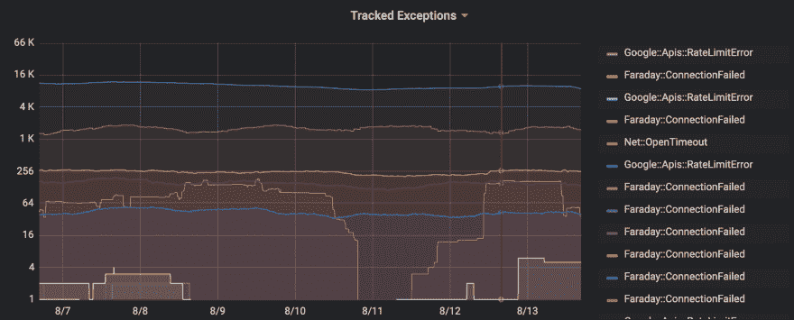

# 快速失败和经常失败:大规模处理 API 错误

> 原文：<https://dev.to/akshaynathan/fail-fast-and-fail-often-handling-api-errors-at-scale-17mb>

在 [Monolist](https://monolist.co) ，我们正在建立软件工程师的理想收件箱。我们的用户依靠我们来展示他们使用的所有工具和服务的所有相关和可操作的任务和上下文。对于一个典型的工程师来说，这包括电子邮件、未完成的 Slack 消息、Github pull 请求和吉拉问题或 Asana 任务。

为此，我们每天发出数百万个 API 请求，分布在十几个不同的服务上。这些请求是通过运行在跨许多主机的多个 Sidekiq 作业处理容器上的 ruby 代码发出的。(下面的帖子使用 Ruby 和 Sidekiq 作为例子，但是学到的知识适用于任何语言和作业处理框架。)

随着这些请求的成功，需要进行更多的处理来决定哪些数据与用户相关，以及如何向用户呈现这些数据。在构建 Monolist 的过程中，我们学到了很多关于如何可扩展地做到这一点的知识，这可能是另一篇博客文章的好主题。然而，在这篇文章中，我想分享我们关于如何处理每天失败的 100，000 个请求的经验。

## 提前重试但重试正确

使用 API 时，我们通常会看到两类错误:暂时错误是指在将来某个时候重复相同的请求时可能不会发生的错误。相比之下，在每个后续请求中，会不断地出现持久性错误。例如，连接超时是一个短暂的错误，可能会在重试时得到解决。但是，401 错误可能表示用户未通过身份验证，不会自动解决。

通常，持久性错误需要我们更改业务逻辑来发出成功的请求，而暂时性错误将在下一次重试时成功，无需干预。

在 Monolist，我们依赖 Sidekiq 的默认重试语义来处理这两类错误。对于持续的错误，我们部署代码修复并让下一次重试成功。我们每天会看到大约 10 个这样的错误，随着我们新的集成变得更加稳定，失败率会降低。我们每天 10 万个错误中的其余错误都是短暂的。虽然这些错误通常会在 1 或 2 次重试后解决，但我们必须仔细设计我们的系统，以成功处理这一故障量。

我们相信快速和经常的失败，而不是让失败的状态沿着我们的代码路径传播，带来意想不到的后果。因此，我们为意外的 api 响应抛出异常，并避免在我们的工作器中捕获它们。

下面是我们用来同步用户收件箱和 Gitplace 的简化代码片段。给定一个用户和一个 api 客户端，我们向 Gitplace 轮询用户的 pull 请求，并为我们找到的每个请求创建 Monolist 动作项。

```
def poll_gitplace(user, client)
  client.get_pull_requests.each do |pull_request|
    comments = client.get_pull_request_comments(pull_request)

    create_action_item(user, pull_request, comments)
  end
end 
```

注意，如果第 3 行的 api 调用失败，Sidekiq 将自动重试整个作业，希望下次能够成功。但是这个代码有什么问题吗？

答案在第 5 行。假设在注释 api 调用失败之前，作业第一次通过了 4 个拉请求。因为 Sidekiq 会天真地重试整个 worker，所以我们将在下次重试时复制所有 4 个已经创建的操作项！

显然，这并不可取。当依靠重试来解决短暂的错误时，我们的作业必须是幂等的。幂等作业在成功重新运行时没有其他副作用。换句话说，我们应该能够运行我们的作业 N 次，不管 N 是多少，我们都期望得到相同的结果。

```
def poll_gitplace(user, client)
  client.get_pull_requests.each do |pull_request|
    comments = client.get_pull_request_comments(pull_request)

    unless user.action_items.find { |s| s.gitplace_id == pull_request.id }
      create_action_item(user, pull_request, comments)
    end
  end
end 
```

现在，当我们的作业重新运行时，我们将只创建尚未创建的操作项。这意味着 Sidekiq 可以任意多次运行我们的作业，我们用户的最终结果仍然是正确的。

## 永远进步

虽然我们已经修复了一个 bug，但是上面的代码还存在另一个更加隐蔽和危险的问题。假设我们有一个用户有 1000 个拉取请求。如果我们在检索第 999 个 pull 请求的注释时遇到一个短暂的错误，比如说网络超时，那么当作业重试时，我们将重新开始并进行另外 1000 次 api 调用。

更有问题的是，即使我们的暂时错误率很低，api 调用数量的增加也会增加我们遇到暂时错误的机会。因此，速度最慢、占用资源最多的作业不仅最有可能被重试，而且每次重试成功的可能性也最小！即使使用 Sidekiq 的自动指数回退，当我们有数百甚至数千个昂贵的任务失败并一起重试时，这也会削弱我们的队列。

这个问题的解决方案通常是特定于 API 的，但是遵循一个共同的原则:总是跟踪您的昂贵工作并取得进展。

```
def poll_gitplace(user, client)
  time = user.gitplace_last_sync

  client.get_pull_requests({ created_after: time }).each do |pull_request|
    comments = client.get_pull_request_comments(pull_request)

    unless user.action_items.find { |s| s.github_id == pull_request.id }
      create_action_item(user, pull_request, comments)
    end

    time = pull_request.created_at
  end
ensure
  user.update!({ gitplace_last_sync: time })
end 
```

在上面的代码示例中，我们存储了最后同步的 pull request created_at 字段。当轮询 Gitplace 时，我们只检索在最后一个同步请求之后创建的 pull 请求。然后，我们确保存储的进度跟踪器得到更新，不管是否有异常。这样，即使我们的作业重试，我们也只会发出必要的 api 请求来继续。

注意:这种方法确实有并发性的含义，但不在本文的讨论范围之内。

## 追踪你的失败

虽然我们的代码现在可以处理我们可能遇到的所有短暂错误，但我们的监控系统却是另一番景象。在 Monolist，我们使用 Sentry 进行异常跟踪和警报，但是无论您的团队如何处理异常，以下策略都适用。

显然，我们不能让 100，000 个不相关的异常每天充斥我们的岗哨。然而，我们不能在代码中捕获异常，因为我们仍然需要它们向上传播到 Sidekiq，以便重试作业。我们也不想盲目地忽略这些异常——虽然每个递增的短暂错误通常只是噪音，但我们想知道短暂错误的比率是否有显著变化，以提醒我们集成、网络或服务中的一些更大问题。

```
def track_exception(exception)
  redis.hincrby("tracked_exceptions", exception.class.to_s, 1)
  raise Monolist::TrackedException.new(exception)
end

def poll_gitplace(user, client)
  time = user.gitplace_last_sync

  client.get_pull_requests({ created_after: time }).each do |pull_request|
    comments = client.get_pull_request_comments(pull_request)

    unless user.action_items.find { |s| s.github_id == pull_request.id }
      create_action_item(user, pull_request, comments)
    end

    time = pull_request.created_at
  end
rescue Gitplace::ConnectionTimeout => e
  track_exception(e)
ensure
  user.update!({ gitplace_last_sync: time })
end 
```

最后，我们提出了一个简单的解决方案，在这个方案中，我们显式地跟踪我们所知道的每一个短暂的异常。我们将异常包装在 Monolist::TrackedException 包装器中，我们将它添加到了哨兵黑名单中，这样我们就不会在哨兵中看到它们。由于 Monolist::TrackedException 仍然是一个异常，Sidekiq 仍然会像往常一样重试作业。同时，我们在 Redis 中增加一个计数器来跟踪我们看到的异常的数量。

[](https://res.cloudinary.com/practicaldev/image/fetch/s--IClgP62q--/c_limit%2Cf_auto%2Cfl_progressive%2Cq_auto%2Cw_880/https://thepracticaldev.s3.amazonaws.com/i/77zl031dpf57zdcj5zhs.png)

在我们的监控系统中，我们将 Redis 中的“tracked_exceptions”键暴露给了我们的 Prometheus 实例。这使我们能够将如上图所示的图表添加到我们的仪表板中，并在异常率发生显著变化时发出警报。

## 结论

虽然我们在 Monolist 上接触的 api 千差万别，但我们始终发现，我们的集成质量在很大程度上取决于我们对 API 错误的适应能力，以及我们能对最终用户隐藏多少复杂性。

通过抽象出重试行为，确保作业是等幂的，并确保我们总是离成功越来越近，我们的最终用户完全不会注意到错误，并可以专注于保持生产力、编写代码，并在工作中做到最好。

不相信我？自己试试 Monolist 吧。

### 喜欢这个帖子？点击这里，加入我们的邮件列表了解更多内容[。](http://eepurl.com/gFxG3n)