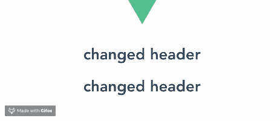

# 使用 Vue.js 中的事件总线在组件之间传递数据

> 原文：<https://dev.to/bnevilleoneill/using-event-bus-in-vue-js-to-pass-data-between-components-39k4>

**由[nwo se lotana](https://blog.logrocket.com/author/nwoselotanna/)撰写**

### 先决条件

这篇文章适合所有阶段的开发者，包括初学者。在阅读本文之前，这里有一些你应该已经具备的东西:

*   已安装 node . js 10 . x 及以上版本。您可以通过在终端/命令提示符下运行以下命令来验证您是否拥有该版本:

```
node -v 
```

<svg width="20px" height="20px" viewBox="0 0 24 24" class="highlight-action crayons-icon highlight-action--fullscreen-on"><title>Enter fullscreen mode</title></svg> <svg width="20px" height="20px" viewBox="0 0 24 24" class="highlight-action crayons-icon highlight-action--fullscreen-off"><title>Exit fullscreen mode</title></svg>

*   Visual Studio 代码编辑器或类似的代码编辑器。
*   Vue 的最新版本全球安装在您的机器上
*   安装在您机器上的 Vue CLI 3.0。为此，请先卸载旧版本的 CLI:

```
npm uninstall -g vue-cli 
```

<svg width="20px" height="20px" viewBox="0 0 24 24" class="highlight-action crayons-icon highlight-action--fullscreen-on"><title>Enter fullscreen mode</title></svg> <svg width="20px" height="20px" viewBox="0 0 24 24" class="highlight-action crayons-icon highlight-action--fullscreen-off"><title>Exit fullscreen mode</title></svg>

然后安装新的:

```
npm install -g @vue/cli 
```

<svg width="20px" height="20px" viewBox="0 0 24 24" class="highlight-action crayons-icon highlight-action--fullscreen-on"><title>Enter fullscreen mode</title></svg> <svg width="20px" height="20px" viewBox="0 0 24 24" class="highlight-action crayons-icon highlight-action--fullscreen-off"><title>Exit fullscreen mode</title></svg>

*   在这里下载一个 Vue starter 项目[。](https://github.com/viclotana/vue-canvas)
*   解压缩下载的项目
*   导航到解压缩后的文件，并运行命令以保持所有依赖项最新:

```
npm install 
```

<svg width="20px" height="20px" viewBox="0 0 24 24" class="highlight-action crayons-icon highlight-action--fullscreen-on"><title>Enter fullscreen mode</title></svg> <svg width="20px" height="20px" viewBox="0 0 24 24" class="highlight-action crayons-icon highlight-action--fullscreen-off"><title>Exit fullscreen mode</title></svg>

### 发射器问题

Vue 通过使用事件发射器的父组件在两个子组件之间进行通信。

当您在子组件中设置一个事件并在父组件中设置一个侦听器时，反应会通过父组件向下传递到嵌套组件。

虽然这是一个有价值的解决方案，但随着项目的增长，它会变得很笨拙。

### 解决方案:事件总线

从本质上讲，事件总线是一个 Vue.js 实例，它可以在一个组件中发出事件，然后在另一个组件中直接侦听和响应发出的事件，而不需要父组件的帮助。

根据定义，使用事件总线比使用事件发射器更有效，因为它需要更少的代码来运行。

我们将创建一个事件总线实例作为一个单独的文件，将其导入到将要共享数据的两个组件中，然后允许这两个组件通过这个共享实例在一个安全的私有通道中进行通信。

这就是通常所说的发布-订阅方法。

[](https://logrocket.com/signup/)

### 演示

今天，我们将通过创建和使用事件总线来促进两个组件之间的通信。

### 事件总线入门

首先，我们想要创建事件总线。我们将在我们的`main.js`文件中这样做。定义之后，您的`main.js`文件应该是这样的:

```
import Vue from 'vue'
import App from './App.vue'
Vue.config.productionTip = false
export const bus = new Vue();
new Vue({
  render: h => h(App),
}).$mount('#app') 
```

<svg width="20px" height="20px" viewBox="0 0 24 24" class="highlight-action crayons-icon highlight-action--fullscreen-on"><title>Enter fullscreen mode</title></svg> <svg width="20px" height="20px" viewBox="0 0 24 24" class="highlight-action crayons-icon highlight-action--fullscreen-off"><title>Exit fullscreen mode</title></svg>

正如您所看到的，我们已经创建了一个新的 Vue 实例——一个安全的抽象，在这里我们可以处理组件之间的通信，而不涉及通信中的父组件。

### 创建一个新组件

我们需要两个子组件进行通信。然而，您会注意到在您的起始项目中只有一个`test.vue`组件。

创建一个新文件，将其命名为`test2.vue`，并将下面的代码块粘贴到其中:

```
<template>
  <div>
  </div>
</template>
<script>
export default {
  name: 'Test2',
  props: {
    msg: String
  }
}
</script>
<!-- Add "scoped" attribute to limit CSS to this component only -->
<style scoped>
h3 {
  margin: 40px 0 0;
}
ul {
  list-style-type: none;
  padding: 0;
}
li {
  display: inline-block;
  margin: 0 10px;
}
a {
  color: #42b983;
}
</style> 
```

<svg width="20px" height="20px" viewBox="0 0 24 24" class="highlight-action crayons-icon highlight-action--fullscreen-on"><title>Enter fullscreen mode</title></svg> <svg width="20px" height="20px" viewBox="0 0 24 24" class="highlight-action crayons-icon highlight-action--fullscreen-off"><title>Exit fullscreen mode</title></svg>

现在，转到您的`App.vue`文件，像导入`Test.vue`文件一样导入它。将文件注册在如下组件下:

```
<template>
  <div id="app">
    
    <Test v-bind:header="header"/>
    <Test2 v-bind:header="header"/>
  </div>
</template>
<script>
import Test from './components/Test.vue';
import Test2 from './components/Test2.vue';
export default {
  name: 'app',
  components: {
    Test, Test2
  },
  data (){
    return {
      header:'initial header'
    }
  }
}
</script>
<style>
#app {
  font-family: 'Avenir', Helvetica, Arial, sans-serif;
  -webkit-font-smoothing: antialiased;
  -moz-osx-font-smoothing: grayscale;
  text-align: center;
  color: #2c3e50;
  margin-top: 60px;
}
</style> 
```

<svg width="20px" height="20px" viewBox="0 0 24 24" class="highlight-action crayons-icon highlight-action--fullscreen-on"><title>Enter fullscreen mode</title></svg> <svg width="20px" height="20px" viewBox="0 0 24 24" class="highlight-action crayons-icon highlight-action--fullscreen-off"><title>Exit fullscreen mode</title></svg>

### 设置事件

现在您的两个组件已经准备好了，您可以在 Test2 组件中监听事件的同时，通过 Test 组件中的发射来设置事件。

打开您的`Test.vue`文件，并将下面的代码块复制到其中:

```
<template>
  <div>
      <h1 v-on:click="changeHeader">{{header}}</h1>
  </div>
</template>
<script>
import { bus } from '../main'
export default {
  name: 'Test',
  props: {
    header:{
        type: String
    } 
  },
  methods: {
      changeHeader (){
          this.header = "changed header";
          bus.$emit('changeIt', 'changed header');
      }
  }
}
</script> 
```

<svg width="20px" height="20px" viewBox="0 0 24 24" class="highlight-action crayons-icon highlight-action--fullscreen-on"><title>Enter fullscreen mode</title></svg> <svg width="20px" height="20px" viewBox="0 0 24 24" class="highlight-action crayons-icon highlight-action--fullscreen-off"><title>Exit fullscreen mode</title></svg>

在这里，您将看到事件总线是从`main.js`导入的，模板通过 props 显示一个 header 元素，并且其上有一个 click 事件指向方法部分中的逻辑。

组件的手动更改发生在方法部分内部，并通过事件总线发出一个事件。

该语句告诉 Vue 发出一个名为`changeIt`的事件，并将字符串`changed header`作为参数传递。

### 倾听事件并做出反应

设置事件后，我们需要让第二个组件监听事件并对其做出反应。打开您的`Test2.vue`文件，复制下面的代码块:

```
<template>
  <div> <h1>{{header}}</h1>
  </div>
</template>
<script>
import { bus } from '../main';
export default {
  name: 'Test2',
  props: {
    header:{
        type: String
    } 
  },
  created (){
    bus.$on('changeIt', (data) => {
      this.header = data;
    })
  }
}
</script> 
```

<svg width="20px" height="20px" viewBox="0 0 24 24" class="highlight-action crayons-icon highlight-action--fullscreen-on"><title>Enter fullscreen mode</title></svg> <svg width="20px" height="20px" viewBox="0 0 24 24" class="highlight-action crayons-icon highlight-action--fullscreen-off"><title>Exit fullscreen mode</title></svg>

当事件总线导入时，我们在模板中看到的只是插值符号。没有 Vue 指令或绑定。

我们将使用一个生命周期挂钩来初始化应用程序装载到 DOM 时的监听过程。生命周期挂钩是在应用程序初始化时调用创建的。

`$on`语句现在正在监听一个`changeIt`事件，向下传递数据参数，并将其设置为新的头。

[](https://res.cloudinary.com/practicaldev/image/fetch/s--Jt1RY8Wh--/c_limit%2Cf_auto%2Cfl_progressive%2Cq_66%2Cw_880/https://blog.logrocket.com/wp-content/uploads/2019/09/changed-header-nocdn.gif)

当您单击界面中的第一个标题时，两个标题都会改变。

### 删除监听器

在销毁 Vue 实例之前，Vue 会自动卸载并删除这些侦听器。但是，如果您想要手动销毁它们，您可以运行这个简单的命令:

```
bus.$off(); 
```

<svg width="20px" height="20px" viewBox="0 0 24 24" class="highlight-action crayons-icon highlight-action--fullscreen-on"><title>Enter fullscreen mode</title></svg> <svg width="20px" height="20px" viewBox="0 0 24 24" class="highlight-action crayons-icon highlight-action--fullscreen-off"><title>Exit fullscreen mode</title></svg>

本教程的完整代码可以在 GitHub 上找到。

### 结论

这是对 Vue.js 中事件总线的介绍。事件总线是一种安全的方式，可以实现组件之间的独立通信，而无需通过中心或父组件。

事件总线也比其他方法更干净，涉及的代码更少，提供了一个很好的抽象平台。

* * *

**编者按:**看到这个帖子有问题？你可以在这里找到正确的版本。

## Plug: [LogRocket](https://logrocket.com/signup/) ，一款适用于网络应用的 DVR

[](https://res.cloudinary.com/practicaldev/image/fetch/s--6FG5kvEL--/c_limit%2Cf_auto%2Cfl_progressive%2Cq_auto%2Cw_880/https://i2.wp.com/blog.logrocket.com/wp-content/uploads/2017/03/1d0cd-1s_rmyo6nbrasp-xtvbaxfg.png%3Fresize%3D1200%252C677%26ssl%3D1)

[log rocket](https://logrocket.com/signup/)是一个前端日志工具，让你重放问题，就像它们发生在你自己的浏览器中一样。LogRocket 不需要猜测错误发生的原因，也不需要向用户询问截图和日志转储，而是让您重放会话以快速了解哪里出错了。它可以与任何应用程序完美配合，不管是什么框架，并且有插件可以记录来自 Redux、Vuex 和@ngrx/store 的额外上下文。

除了记录 Redux 动作和状态，LogRocket 还记录控制台日志、JavaScript 错误、stacktraces、带有头+体的网络请求/响应、浏览器元数据、自定义日志。它还使用 DOM 来记录页面上的 HTML 和 CSS，甚至为最复杂的单页面应用程序重新创建像素级完美视频。

[免费试用](https://logrocket.com/signup/)。

* * *

使用 Vue.js 中的事件总线在组件之间传递数据的帖子[最早出现在](https://blog.logrocket.com/using-event-bus-in-vue-js-to-pass-data-between-components/) [LogRocket 博客](https://blog.logrocket.com)上。