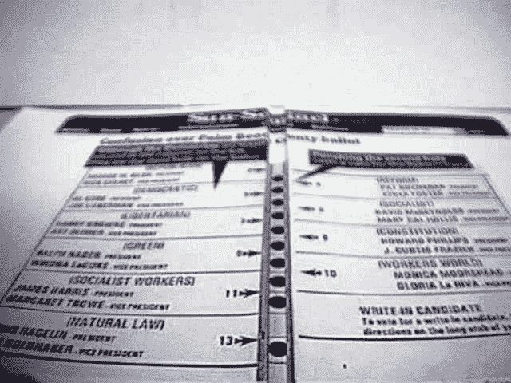
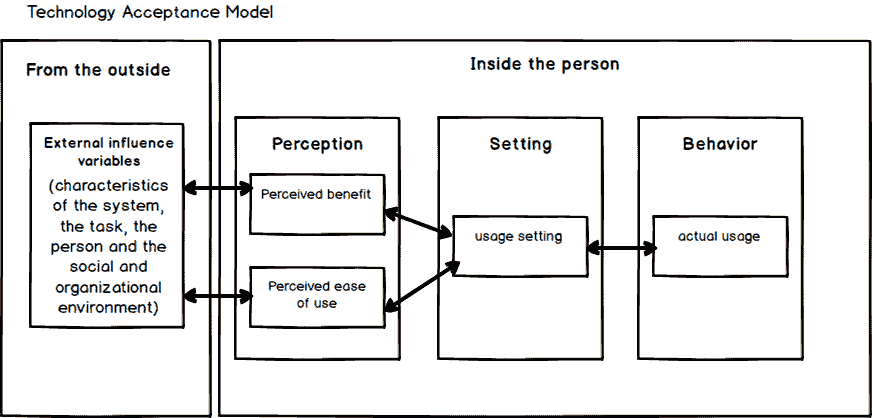
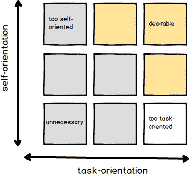

# 为期一年的 UX 系列培训# 1——可用性和用户体验介绍。

> 原文:[https://dev . to/bin console/450-hours-of-UX-training-in-a-multi-part-dev-to-series-1-introduction-to-usability-and-user-experience-5c gi](https://dev.to/binconsole/450-hours-of-ux-training-in-a-multi-part-dev-to-series-1-introduction-to-usability-and-user-experience-5cgi)

#### 为什么可用性？

By[gzuckeir](https://en.wikipedia.org/wiki/User:Gzuckier "en:User:Gzuckier")， [CC BY-SA 3.0](http://creativecommons.org/licenses/by-sa/3.0/ "Creative Commons Attribution-Share Alike 3.0") ，[链接](https://commons.wikimedia.org/w/index.php?curid=216161)

> 2000 年，为了适应佛罗里达州大量合格的总统候选人，LePore 设计了一种交错的两页格式，候选人的名字交替出现在中央打孔按钮栏的两侧。保守派错误地评论说，同样的选票在 1996 年的选举中被成功使用；事实上，它从未在棕榈滩县的竞选中被用于竞争公职的候选人之间。2000 年，这一令人困惑的设计导致总统选举中错误投票的数量增加(否则这些投票将成为决定性的逆转),并因此声名狼藉。《棕榈滩邮报》的一项研究推测，被棕榈滩县的蝴蝶投票弄糊涂的选民让阿尔·戈尔失去了总统职位。

### 日常用品的设计

当功能被隐藏时，当功能多于按键时，可用性问题就出现了。

### 通过感知到的启示进行直观使用

说明如何使用对象的对象方面。“当用于简单的物体、图片、标签或说明时，设计者就失败了”(诺曼，1989)

### 自然映射

*   控制和它们的效果之间的关系是清楚的，并且导致直接的理解
*   使用外部类比和文化标准(如红色交通灯)

[T2】](https://res.cloudinary.com/practicaldev/image/fetch/s--xbvsd588--/c_limit%2Cf_auto%2Cfl_progressive%2Cq_auto%2Cw_880/https://thepracticaldev.s3.amazonaws.com/i/db5lxs9r4e7osb3axoyb.png)

### 优秀设计的原则

*   *可见性*:设备的状态和功能可见。
*   *反馈*:对行动结果的完整和持续的反馈。
*   *启示*:对象清楚地说明了如何使用它，从而允许直观的使用
*   *良好的映射:*控件和它们的效果之间的关系很清楚
*   一个好的概念模型:它支持我们对设备如何工作的理解，并允许我们预测我们行为的影响。

### 可用性定义(UXQB)

> 在特定的使用环境中，特定用户使用交互系统来有效、高效和满意地实现特定目标的程度。

#### 定义可用性 ISO

> “系统、产品或服务在多大程度上可以被特定用户使用，以在特定的使用环境中有效、高效和满意地实现特定目标”。(/[https://www.iso.org/obp/ui/#iso:std:iso:9241:](https://www.iso.org/obp/ui/#iso:std:iso:9241:)-11:ed-2:v1:en/)

#### 技术验收模型

[T2】](https://res.cloudinary.com/practicaldev/image/fetch/s--mnP-TjF6--/c_limit%2Cf_auto%2Cfl_progressive%2Cq_auto%2Cw_880/https://thepracticaldev.s3.amazonaws.com/i/6n8qs10lsdb0mf1d8avj.png)

有用性和技术接受度

> 如果用户认为一个高度可用的系统增加了其他人对其工作生活的控制，从而导致技能下降或自主性降低，那么这个高度可用的系统很可能会被拒绝

### 用户体验

两种品质决定欲望

*   工作取向

    *   有用性和可用性
        *   决定一个系统是否为任务服务
*   自我定位

    *   满足人类需求
        *   决定一个系统是否为大众服务

[T2】](https://res.cloudinary.com/practicaldev/image/fetch/s--lCbhAQ_k--/c_limit%2Cf_auto%2Cfl_progressive%2Cq_auto%2Cw_880/https://thepracticaldev.s3.amazonaws.com/i/3e2e1ot4yfo09pkkicxw.png)

### 日常使用产品的动机

我有一项任务要完成。

*   *用户需求*
    *   我需要为我的家人做晚餐。
    *   我想在这方面有效率
    *   我想对目标实现的进度感到满意

*我想满足自己的需求*

*   *人类需求*
    *   我希望我的家人吃得健康。
    *   我想做一个好妈妈/爸爸
    *   我想让别人认为我是个好厨师
    *   我想玩得开心

### 人类的需求

*   自主性(独立和自决的感觉)
*   能力(感觉“有能力”)
*   归属感(与他人的关系和亲密感)
*   自我实现(发展和赋予生命意义的感觉)
*   安全感(安全感和控制感)
*   奢侈(富有和能够负担最多的感觉)
*   受欢迎程度(被喜欢、被尊重和有影响力的感觉)
*   身体健康(感觉健康)
*   自尊(自尊的感觉)
*   刺激(快乐和享受的感觉)

### 决定 UX 的产品和交互方面

*   实用品质:有用且可用
*   “使用的乐趣”，“使用的乐趣”，乐趣，互动的乐趣
*   视觉吸引力、美感
*   刺激:
    *   新颖、新颖、有创意、勇敢、令人惊讶
    *   具有挑战性，能够学习新事物，发展能力
*   有社交能力，能表达我的一些想法，有助于我树立积极的形象，积极的自我表达
*   连接，包括，社区感觉
*   “唤起”、“反思”:象征价值，发人深省，唤起记忆，产生故事

用户对产品、交互系统或服务的实际和/或预期使用的感知和反应。

[T2】](https://res.cloudinary.com/practicaldev/image/fetch/s--aU4ungr1--/c_limit%2Cf_auto%2Cfl_progressive%2Cq_auto%2Cw_880/https://thepracticaldev.s3.amazonaws.com/i/o1dt4ia5texd4p40d562.png)

### *以用户为中心的设计原则*

1.  全面了解用户、工作任务和工作环境作为基础
2.  用户参与设计和开发过程
3.  基于以用户为中心的评估的持续改进和定制
4.  迭代过程
5.  考虑整个 UX
6.  跨学科知识和观点