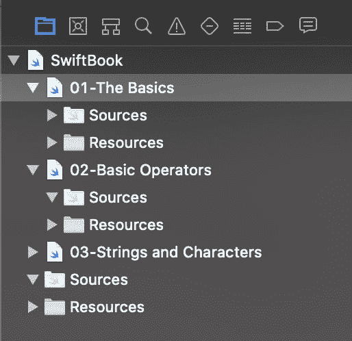
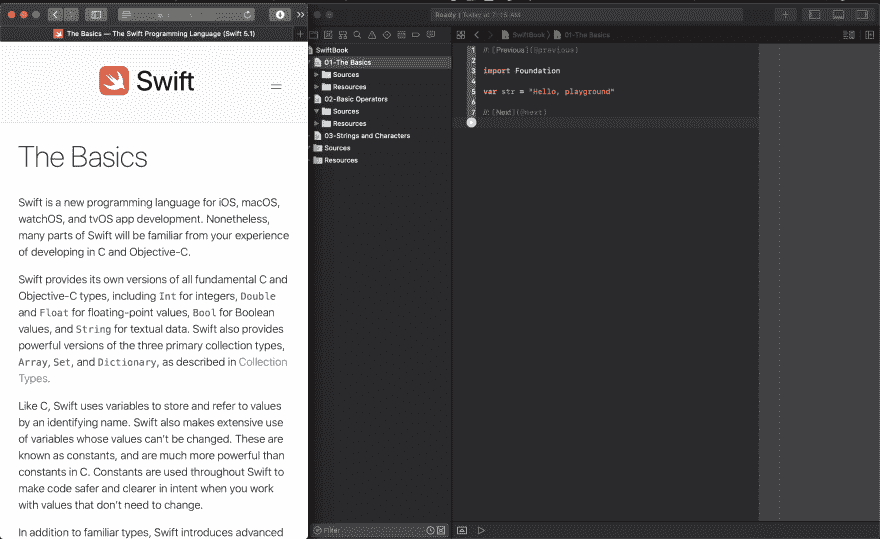

# Swift 编程语言指南:简介

> 原文：<https://dev.to/loufranco/the-swift-programming-language-companion-introduction-4k0a>

这是一个系列的一部分，将有助于指导你阅读来自苹果的 Swift 编程语言。

本指南的目标读者是不了解 Swift 并且可能不了解任何其他编程语言的人。

我之前写道[进入 iOS 应用程序开发的最佳方式](https://dev.to/loufranco/do-you-know-enough-swift-to-jump-into-an-app-tutorial-96i)是从 Swift 开始，而不是应用程序教程。苹果的书足够好，可以开始读了——这本指南旨在帮助你积极地阅读它。当你看完这本书的时候，你应该已经*写了*很多 Swift，而不仅仅是读了它。

### 第一步:设置阅读环境

你需要能够同时看到这本书和一个 Xcode 游乐场。这可以在你的 Mac 上并排显示，或者你可以在 iPad 上阅读这本书。

### 第二步:搭建 Xcode 游乐场

1.  打开 Xcode
2.  选择**文件>新建游乐场...**
3.  选择**空白**
4.  称之为 **SwiftBook.playground**
5.  使用 CMD-1 打开项目导航器的左侧栏。CMD-0 将隐藏/显示这个侧边栏。
6.  选择**文件>新建游乐场页面**两次(这样你就有三个页面)
7.  将页面命名为“01-基础”、“02-基本运算符”和“03-字符串和字符”。*注意:Playgrounds 会根据名称自动排序页面，所以使用 00-Title 格式可以保持页面和书的顺序一致。*
8.  在项目导航器中选择“01-基础”

它应该是这样的:

[](https://res.cloudinary.com/practicaldev/image/fetch/s--bDjJjpdb--/c_limit%2Cf_auto%2Cfl_progressive%2Cq_auto%2Cw_880/https://thepracticaldev.s3.amazonaws.com/i/1dzkl6h0dpobhecewse7.png)

### 第三步:设置

我有一台 13 英寸的 MacBook Pro，所以有点紧。在我看来是这样的。

[](https://res.cloudinary.com/practicaldev/image/fetch/s--G9gFjm2o--/c_limit%2Cf_auto%2Cfl_progressive%2Cq_auto%2Cw_880/https://thepracticaldev.s3.amazonaws.com/i/b6fj2qkj0pb8d0gip037.png)

### 第四步:测试你的操场

应该有这样一行代码

```
var str = "Hello, playground" 
```

<svg width="20px" height="20px" viewBox="0 0 24 24" class="highlight-action crayons-icon highlight-action--fullscreen-on"><title>Enter fullscreen mode</title></svg> <svg width="20px" height="20px" viewBox="0 0 24 24" class="highlight-action crayons-icon highlight-action--fullscreen-off"><title>Exit fullscreen mode</title></svg>

将光标放在该行的末尾，然后键入 SHIFT-ENTER。这将运行操场，直到该行代码(注意左边的播放头——您也可以使用鼠标点击它)

### 第五步:读取并编码

读这本书。不要把书中的任何代码复制到操场上——自己输入。在继续之前，确保你理解它。

键入一行代码后，可以键入 SHIFT-ENTER 来运行该行代码。右边会给你看结果。

### 接下来是什么

下一篇文章将是“基础知识”的一个伙伴。如果你需要任何帮助，请在下面评论。