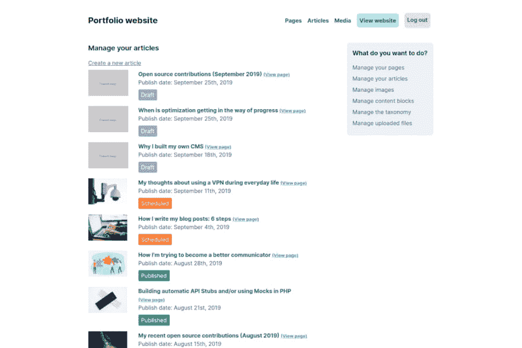

# 为什么我要建立自己的 CMS

> 原文：<https://dev.to/roelofjanelsinga/why-i-built-my-own-cms-m01>

# 我为什么要建立自己的 CMS

我一直反对建立自己的内容管理系统(CMS)。当任何人要求我构建类似的东西时，我只是用现成的解决方案，比如 WordPress。这对我来说已经足够了，因为我不是为自己建网站。我一直相信，通过创建 HTML 文件并将其作为内容提供，我可以更容易地创建我的内容。建立一个 CMS 只需要我花费时间和精力来设置它，连接到数据库，并定期更新它。那么，为什么我最终创建了自己的 CMS 呢？这有两个原因:

*   如果我需要什么，我可以建造它。
*   如果我不喜欢，我可以改变它。

但是您可以使用任何其他 CMS 来实现这一点。是的，你说得对。我对此无话可说，因为你这么说完全正确。然而，对我来说，建立我自己的 CMS 的原因比“我可以做得更好”更深一层。我想学习在有限的环境中构建应用程序时解决问题。

## 这一切是如何开始的

一开始，它甚至不是一个 CMS。它只是我的作品集网站，运行在一个 Laravel 应用程序上，用一个数据库来保存数据。我已经两年没有更新我的作品集网站了，我的博客在一个子域上运行。我给我的网站改头换面，并想为我的博客做同样的事情，使它融入我的网站。这是一场斗争，所以我决定将博客的数据读入 laravel 应用程序，并从我的文件夹而不是我的专用博客中提供数据。

### 我迁移到基于文件的系统的原因

这真的很有效...直到我把我的网站从 GitHub 上撤下来做了一些调整。现在，我没有任何博客帖子、作品集项目或任何其他内容。所有这些内容都保存在一个受防火墙保护的远程数据库中。这意味着我必须下载两个不同的数据库，并在我的本地机器上运行。我不想这么做，因为我为什么要为了我的投资组合网站而经历这么多麻烦呢？相反，我将所有内容复制到 HTML 文件中，并从文件系统中提供它们。这很有效，也很快。所有的内容都可以通过版本控制获得，无论我在哪个系统上开发我的网站，内容总是在那里。

## 它怎么变成了 CMS

那么为什么我要把它做成一个独立的 CMS 模块呢？这就是故事变得有趣的地方。这时候我开了第二个博客[新手植物护理](https://plantcareforbeginners.com)。我确信我可以利用 HTML 和 Markdown 文件来提供静态内容，并通过我的代码编辑器来编辑我的帖子的内容。这帮助我决定，我想复制和粘贴我的投资组合网站，包括这个新网站的博客部分。这就是我所做的，你仍然可以在这个新博客中找到我的旧网站的参考。我复制/粘贴了我的文件夹，删除了所有我不需要的东西，开始为工厂网站写内容。但是...我发现了一个漏洞。当我修复它的时候，我想:“现在我必须在两个地方修复这个 bug，真烦人”。这导致我将 CMS 提取到 Composer 包中。这个过程是在几天内完成的，慢慢地将网站的一部分移植到软件包中。最后，我有了一个完全没有头的 CMS 来管理两个网站的所有内容:我的个人博客和植物博客。

### 当我懒得在笔记本电脑上写文章时

这时候我想:“你知道吗，我也想能够在我的手机上编辑我的内容！”。那时，编辑内容的唯一方法是通过代码编辑器在我的笔记本电脑上修改 HTML 和 Markdown 文件。这种方法效果很好，但是如果我有写作的灵感，但又不在电脑旁边，该怎么办呢？我可以在他们的文件编辑器中编辑 GitHub 上的帖子，但是每次修改都需要提交，我一次只写了几个句子。对于一篇文章来说，这将导致大量的提交，并不理想。最初，我开始在 Google Drive 上写文章。这在很长一段时间里都很有效。我对此感到厌倦的原因是，在完成博文后，我必须将其复制/粘贴到 Markdown 文件中，将 WYSIWYG(所见即所得)内容转换为 Markdown，然后提交并推送更改。我可以在我的手机上写内容，但我不能从我的手机上发布它。

### 我想在任何地方写作和出版

我需要的是一种能够直接在浏览器中编辑我的内容，然后从我的手机上发布给全世界的方式，所以我开始工作。我创建了一个新包，名为[roelofjan-El singa/flat-file-CMS-GUI](https://github.com/roelofjan-elsinga/flat-file-cms-gui)。这将只是一个图形用户界面(GUI ),利用我的无头 CMS 允许我在浏览器中编辑我的所有内容。我不断添加新功能，比如可以从 HTML 或 Markdown 编辑器中进行选择。这有助于我支持我以前的一些帖子，这些帖子都是用 HTML 文件写的。因为我所有的新帖子都是用 markdown 编写的，所以我在 GUI 中添加了一个 Markdown 编辑器，它允许我在任何地方创建和编辑帖子。headless CMS 可以解析文件并以 HTML 格式返回内容，以允许我的博客向读者显示它们，但它也可以只返回原始数据，这样我就可以在 HTML 或 Markdown 编辑器中编辑内容。

## 更加自动化，帮助我专注写作

你可能已经注意到了，我的文章在页面顶部都有一个特色图片，这些图片也显示在所有博客文章的概览中。概览中的图像实际上是最大宽度为 300 像素的缩略图。当我通过代码编辑器处理博客帖子时，我必须手动调整图像大小，以创建 1200 像素宽的特色图像和 300 像素宽的缩略图。这很快就过时了，当我的 CMS 的 GUI 准备好的时候，我建立了一个可以自动为我做这件事的服务。我所要做的就是上传一张图片，然后告诉系统我是否想要那张图片的缩略图。上传后，我可以复制链接并把它放在我的减价文件中。系统将自动在概视图中显示正确的缩略图。应用程序可以自动为我做更多繁琐的工作，太棒了！

所以最后，建立我自己的 CMS 只是一个巧合。我可以补充一个非常愉快的巧合。此时此刻，我有 3 个网站在 CMS 上运行，我在一个系统中发现的任何错误都可以同时在所有这些系统中修复。这真的帮助我变得更有效率。作为一个额外的好处，我试图尽可能容易地对 CMS 进行扩展，这样网站的特定功能可以以任何需要的方式利用无头 CMS。

## 投稿

如果你有兴趣为 CMS 做贡献，请不要犹豫。您可以在 Github 上找到这些组件:

*   [无头 CMS](https://github.com/roelofjan-elsinga/flat-file-cms)
*   [CMS 的 GUI 扩展](https://github.com/roelofjan-elsinga/flat-file-cms-gui)
*   [文章发布模块](https://github.com/roelofjan-elsinga/flat-file-cms-publish)

我希望在以下领域有所贡献:

*   安全性
*   编写文档
*   编写测试
*   常规错误修复
*   添加额外模块的更简单方式

如果您有任何其他反馈或想要与我联系，您可以通过 [Twitter](https://twitter.com/RJElsinga) 联系我。