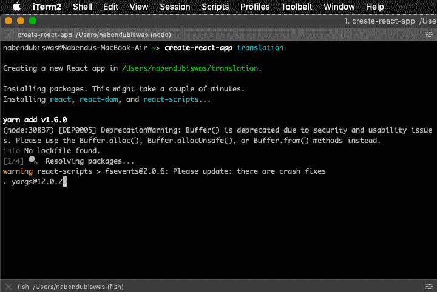
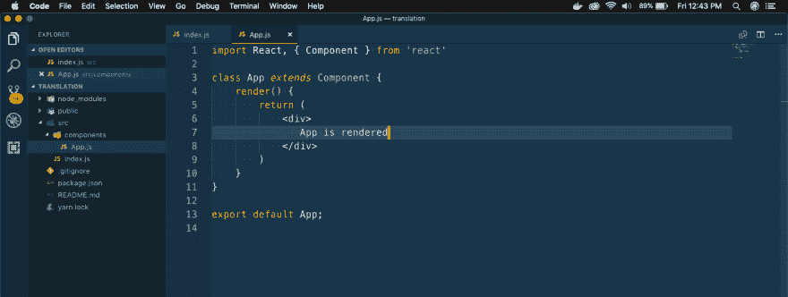
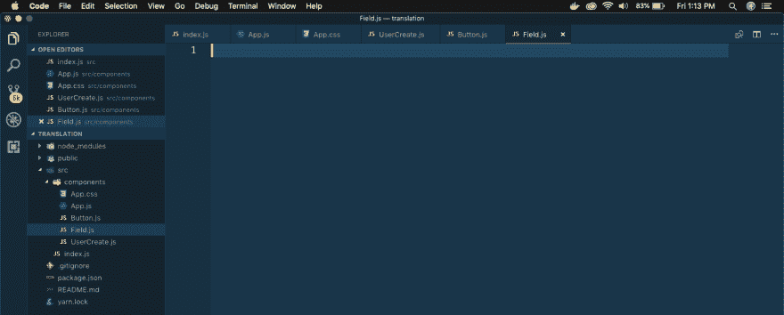
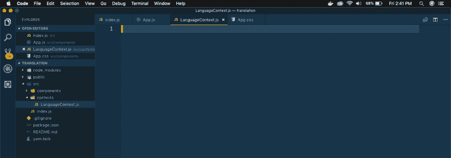

# 通过构建简单的翻译应用程序了解 React 上下文系统

> 原文：<https://dev.to/nabendu82/understanding-react-context-system-by-building-simple-translation-app-1end>

欢迎来到全新系列。在这里，我们将使用 ReactJS 中的新上下文系统创建一个小的翻译应用程序。

这个系列的灵感来自于 Stephen Grider 在 [udemy](https://www.udemy.com/react-redux/learn/lecture/12700535#overview) 的“Modern React with Redux”系列中的一个例子。

所以，打开你的终端，创建一个新的 react 应用**翻译**。

[](https://res.cloudinary.com/practicaldev/image/fetch/s--3RhRn8Ip--/c_limit%2Cf_auto%2Cfl_progressive%2Cq_auto%2Cw_880/https://cdn-images-1.medium.com/max/2000/1%2AmKl26AeDXV6jD0UN1lcNOg.png)T3】翻译 app

下一张 cd 进入翻译，在那个文件夹中打开你的代码编辑器，做一个 **npm start**

然后转到代码编辑器中的 **src** 目录，删除其中的所有内容。

[ ](https://res.cloudinary.com/practicaldev/image/fetch/s--TRnYUn2v--/c_limit%2Cf_auto%2Cfl_progressive%2Cq_auto%2Cw_880/https://cdn-images-1.medium.com/max/2880/1%2AaLx18PhK22K2pas4KoUXFA.png) *删除一切*

接下来在 **src** 目录中创建一个 **index.js** ，并添加 React 的样板代码。

```
import React from 'react';
import ReactDOM from 'react-dom';
import App from './components/App';

ReactDOM.render(
    <App />, document.querySelector('#root')
); 
```

然后我们在 **src** 目录下创建一个**组件**文件夹。在这里，创建一个 **App.js** 文件。

[ ](https://res.cloudinary.com/practicaldev/image/fetch/s--64oSNaPZ--/c_limit%2Cf_auto%2Cfl_progressive%2Cq_auto%2Cw_880/https://cdn-images-1.medium.com/max/2880/1%2ABplNKKM-6jqdjwYTIuE7XA.png) *组件 foler*

**App.js** 内容如下。

```
import React, { Component } from 'react'

class App extends Component {
    render() {
        return (
            <div>
               App is rendered
            </div>
        )
    }
}

export default App; 
```

在此之后，只需确认，在浏览器中检查，基本设置已经完成。

[ ](https://res.cloudinary.com/practicaldev/image/fetch/s--TkBTLp-V--/c_limit%2Cf_auto%2Cfl_progressive%2Cq_auto%2Cw_880/https://cdn-images-1.medium.com/max/2880/1%2A8UtT6VcqkHQczqKZLO6tWQ.png) * App 渲染*

接下来，我们将更新我们的 **App.js** 来包含一个基本语言选择器

```
import React, { Component } from 'react';
import './App.css';

class App extends Component {
    state = { language: 'english' };

    onLangChange = (lang) => {
        this.setState({ language: lang });
    }

    render() {
        return (
            <div className="main__container">
               <div className="lang__flags">
                <span>Select a language :</span>
                <span onClick={() =>  this.onLangChange('english')}>🇺🇸</span>
                <span onClick={() => this.onLangChange('hindi')}>🇮🇳</span>
               </div>
               {this.state.language}
            </div>
        )
    }
}

export default App; 
```

另外，在同一个目录下创建一个文件 **App.css** 并添加下面的代码。

```
.main__container {
    display: grid;
    place-content: center;
    grid-gap: 10px;
}

.lang__flags {
    font-size: 1.5rem;
    font-weight: bold;
} 
```

我们的应用程序现在看起来如下，有两个可点击的改变文本的标志。

[ ](https://res.cloudinary.com/practicaldev/image/fetch/s--fsMcF1FZ--/c_limit%2Cf_auto%2Cfl_progressive%2Cq_auto%2Cw_880/https://cdn-images-1.medium.com/max/2880/1%2AVnNfc5-bEjVUG9TC1BLbkg.png) *基本布局*

接下来，我们在组件目录中创建三个新文件— **UserCreate.js** 、 **Button.js** 和 **Field.js** 。

[ ](https://res.cloudinary.com/practicaldev/image/fetch/s--qKsmh9lC--/c_limit%2Cf_auto%2Cfl_progressive%2Cq_auto%2Cw_880/https://cdn-images-1.medium.com/max/2880/1%2ARYFHX5nFbiPK8hrBUxrueg.png) *新文件*

现在，我们将在这些文件中快速添加代码，以显示包含输入框和提交按钮的基本表单。

将以下代码放入 **UserCreate.js**

```
import React from 'react';
import Field from './Field';
import Button from './Button';

const UserCreate = () => {
    return (
        <div className="ui__form">
            <Field />
            <Button />
        </div>
    )
}

export default UserCreate 
```

然后在 **Field.js** 中放入这段代码。

```
import React, { Component } from 'react'

class Field extends Component {
    render() {
        return (
            <div>
                <label>Name </label>
                <input />
            </div>
        )
    }
}

export default Field; 
```

然后在 **Button.js** 中放入以下代码。

```
import React, { Component } from 'react';

class Button extends Component {
  render() {
    return (
      <button>Submit</button>
    )
  }
}

export default Button; 
```

我们还将在 **App.css** 中为这个表单添加一些样式

```
…
…

.ui__form {
    display: grid;
    grid-gap: 10px;
    background: #f9f9f9;
    border: 1px solid #c1c1c1;
    margin: 2rem auto 0 auto;
    width: 600px;
    padding: 1em;
  }

  .ui__form input {
    background: #fff;
    border: 1px solid #9c9c9c;
    font-size:1rem;
    padding: 0.7em;
  }
  .ui__form input:focus {
    outline: 3px solid gold;
    width:80%;
  }
  .ui__form label {
      font-size:1.2rem;
      font-weight: 900;
  }
  .ui__form button {
    background: lightgrey;
    border-radius: 2%;
    font-size:1.2rem;
    padding: 0.7em;
    width: 30%;
    border: 0;
  }
  .ui__form button:hover {
    background: gold;
  }
  .err__msg{
      font-size: 1rem;
      color:red;
  }

  h3{
    text-align: center;
  } 
```

现在，转到 **App.js** 来连接 **UserCreate** 组件。

```
render() {
        return (
            <div className="main__container">
               <div className="lang__flags">
                <span>Select a language :</span>
                <span onClick={() => this.onLangChange('english')}>🇺🇸</span>
                <span onClick={() => this.onLangChange('hindi')}>🇮🇳</span>
               </div>
               **<UserCreate />**
            </div>
        )
    } 
```

现在，我们的应用程序显示了这个美丽的形式。

[ ](https://res.cloudinary.com/practicaldev/image/fetch/s--kzQlla2Q--/c_limit%2Cf_auto%2Cfl_progressive%2Cq_auto%2Cw_880/https://cdn-images-1.medium.com/max/2880/1%2AFr6NB2q4RacM-GZWT1xXpg.png) *美丽形态*

现在，我们将使用上下文系统将数据从 **App** 组件传递到**按钮**和**字段**组件。

如果没有上下文系统，我们必须将它从 **App** 传递到 **UserCreate** ，再从那里传递到**按钮**和**字段**组件。

现在，在 **src** 目录下创建一个新文件夹 **contexts** 和一个文件 **LanguageContext.js** 。

[ ](https://res.cloudinary.com/practicaldev/image/fetch/s--IXG9wdzP--/c_limit%2Cf_auto%2Cfl_progressive%2Cq_auto%2Cw_880/https://cdn-images-1.medium.com/max/2880/1%2Aus5HxW40-zax_mBvv6cdhw.png) *语言语境*

接下来，我们将在文件 **LanguageContext.js** 中创建上下文对象，并将**英语**作为默认值传递。

```
import React from 'react';

export default React.createContext('english'); 
```

接下来，我们在我们的 **Button.js** 文件中使用这个上下文对象。

```
import React, { Component } from 'react';
import LanguageContext from '../contexts/LanguageContext';

class Button extends Component {
  static contextType = LanguageContext;

  render() {
    const text = this.context === 'english' ? 'Submit' : 'जमा करें';
    return (
      <button>{text}</button>
    )
  }
}

export default Button; 
```

现在，是时候更新我们的 **Field.js** 文件来使用这个上下文对象了。

```
import React, { Component } from 'react';
import LanguageContext from '../contexts/LanguageContext';

class Field extends Component {
    static contextType = LanguageContext;

    render() {
        const text = this.context === 'english' ? 'Name' : 'नाम';

        return (
            <div>
                <label>{text}</label>
                <input />
            </div>
        )
    }
}

export default Field; 
```

语句`static contextType = LanguageContext`是使用上下文对象的样板文件。

接下来，我们将返回到我们的 **App.js** 文件，并使用 **LanguageContext** 对象。我们需要用**提供者**包装**用户创建**我们的组件，并传递值，在本例中是语言的当前值。

```
import React, { Component } from 'react';
import UserCreate from './UserCreate';
import LanguageContext from '../contexts/LanguageContext';
import './App.css';

class App extends Component {
    state = { language: 'english' };

    onLangChange = (lang) => {
        this.setState({ language: lang });
    }

    render() {
        return (
            <div className="main__container">
               <div className="lang__flags">
                <span>Select a language :</span>
                <span onClick={() => this.onLangChange('english')}>🇺🇸</span>
                <span onClick={() => this.onLangChange('hindi')}>🇮🇳</span>
               </div>
               <LanguageContext.Provider value={this.state.language}>
                <UserCreate />
               </LanguageContext.Provider>
            </div>
        )
    }
}

export default App; 
```

在我们的子组件(在我们的例子中是字段和按钮)中有另一种消费或显示数据的方式，它是通过消费者而不是上下文对象。我们不在这里探索它。

我们的应用程序现在已经完成，所以前往 [http://localhost:3000/](http://localhost:3000/) 并点击印度国旗，文本会变为印地语。

[ ](https://res.cloudinary.com/practicaldev/image/fetch/s--I4dCFytk--/c_limit%2Cf_auto%2Cfl_progressive%2Cq_auto%2Cw_880/https://cdn-images-1.medium.com/max/2880/1%2AbuhlqlH28RbHDbjYMa-5ig.png) *文字翻译过来。*

这就完成了我们的小应用程序，你可以在这里找到源代码。