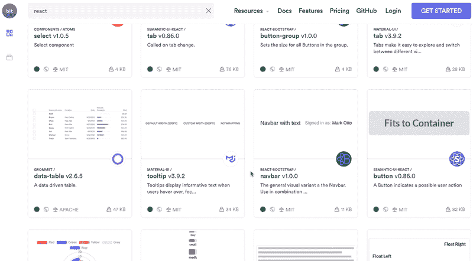
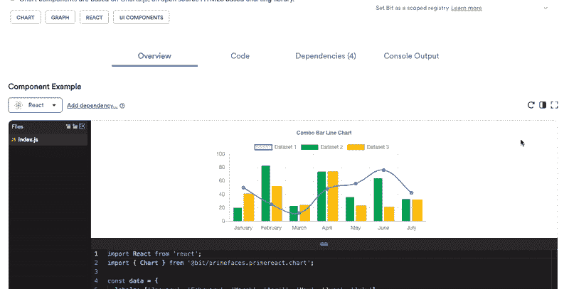
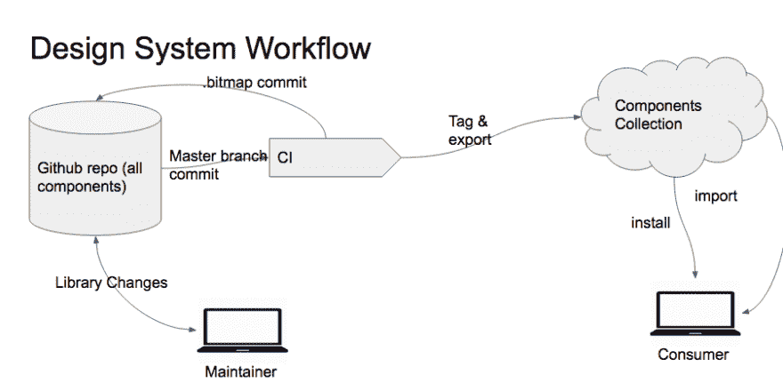

# 如何轻松地跨项目和存储库重用组件

> 原文:[https://dev . to/gite den/how-to-easy-reuse-components-cross-projects-and-repositories-5f4m](https://dev.to/giteden/how-to-easily-reuse-components-across-projects-and-repositories-5f4m)

### 构建、分发和协作组件以构建多个项目和应用程序——实用指南。

组件[推动现代应用的开发](https://itnext.io/a-guide-to-component-driven-development-cdd-1516f65d8b55)。除了作为为你的用户形成[体验的 UI 元素](https://blog.bitsrc.io/building-a-consistent-ui-design-system-4481fb37470f)之外，它们也是[可重用和模块化的代码单元](https://addyosmani.com/first/)，它们应该经常在不止一个项目中使用。

当你开始进入为你的组织构建一个[共享组件架构](https://blog.bitsrc.io/sharing-components-is-caring-f8235cf1a0c)的世界时，你最终不得不解决一些棘手的问题，比如如何独立开发组件但避免太多存储库的开销，如何版本化、发布和单独管理每个组件，如何帮助其他人发现和采用组件等等。

[T2】](https://res.cloudinary.com/practicaldev/image/fetch/s--NcOCKixN--/c_limit%2Cf_auto%2Cfl_progressive%2Cq_auto%2Cw_880/https://cdn-images-1.medium.com/max/2000/0%2Ankut1cR3cVxOEimY)

[T2】](https://res.cloudinary.com/practicaldev/image/fetch/s--t3z5qsFP--/c_limit%2Cf_auto%2Cfl_progressive%2Cq_auto%2Cw_880/https://cdn-images-1.medium.com/max/2000/0%2A0cWDJApJ-f3C8NhB.png)

这些都是很深的问题，从组件开发的 monorepo 体验到组件的跨存储库管理，等等。在本帖中，我们将看到如何利用有用的工具和工作流来开发、分发和采用跨项目的组件。

## 框架/无框架

你基本上有两个选择。第一种是使用 React、Angular 或 Vue 之类的框架。好处是您可以享受成熟框架的所有搭建和优势。

但是，您也可以选择 [web 组件](https://blog.bitsrc.io/9-web-component-ui-libraries-you-should-know-in-2019-9d4476c3f103)和它们的[工具，如模板等](https://blog.bitsrc.io/7-tools-for-developing-web-components-in-2019-1d5b7360654d)。优点是这些组件是框架无关的，这有助于在不同的项目中重用和标准化您的组件。

## 针对多个存储库的 Monorepo 体验？

你必须弄清楚哪种架构适合你。为了避免在独立存储库中开发每个组件的开销，[许多团队选择](https://blog.bitsrc.io/do-we-really-use-reusable-components-959a252a0a98)将组件分组到组件库中。

像 [Bit (GitHub)](https://github.com/teambit/bit) 这样的指定工具可以让您完全独立地开发、构建和测试库中的各个组件。使用 Bit，任何存储库(和库)中的每个组件都可以作为一个独立的单元来跟踪，并自动将其与所有依赖项打包在一起。然后，组件可以独立地链接到一个编译器(零配置需要(！))，因此它们可以被孤立地构建、测试和渲染。然后，可以对组件进行版本控制，并从存储库中单独发布。当您更新单个组件时，Bit“知道”哪些其他组件依赖于它，并帮助您只更新组件的必要依赖图。

它还提供了额外的“类似 monorepo”的功能，这些功能对于代码共享非常有用，例如自动本地链接、多组件配置控制、子集和增量构建、循环依赖处理、动态工作区、单 NPM 安装等等。

另一个选择是将所有的[项目重构为一个 monorepo](https://blog.bitsrc.io/sharing-components-is-caring-f8235cf1a0c) ，但是这是一个巨大的决定，不仅仅是为了共享代码。您还可以使用其他强大的辅助工具(如 Lerna)来对 repo 中的组件进行版本控制和发布，但是大多数工具都需要大量的重构和配置，并且不能控制组件的依赖图。无论哪种方式，试着看看什么有效。

## 跨存储库的分发和消耗

当你发布你的组件时，事情还远没有结束。你必须确保人们能够找到、使用和更新这些组件。

否则，你可能会白白投入这些工作；大多数人不会花太多心思去寻找你的组件，也不会采用那些他们不能修改的组件。深入整个库并仅针对一个组件进行更新可能是一个繁琐的过程。

## 设置共享组件门户；弄得好看点！

[T2】](https://res.cloudinary.com/practicaldev/image/fetch/s--l8xQEyg3--/c_limit%2Cf_auto%2Cfl_progressive%2Cq_66%2Cw_880/https://cdn-images-1.medium.com/max/2000/0%2ATilCCJsC56-IB69s.gif)

*在[bit . dev](https://bit.dev)T3】中创建你的组件中枢*

为了将所有人聚集在您的共享组件上，并整合组件的发现和消费，您可以创建自己的组件门户，或者只使用像 [bit.dev](https://bit.dev/) 这样的基于云的门户。

这种门户提供的关键要素是:

*   查找团队共享的组件。

*   了解他们的 API 并使用实时渲染的示例。

*   在不同的项目中使用单独的组件。

*   理想情况下，为每个组件运行构建和测试。

如果你自己构建它，可能需要一段时间，但这是可能的。如果您选择 [bit.dev](https://bit.dev/) ，您将获得上述所有开箱即用的功能以及管理权限、控制工作流等功能。它将托管您的组件，运行它们的 CI，让您保存和使用呈现的代码示例，提取组件的 API 文档，并让您使用 npm/yarn 安装它们。

[T2】](https://res.cloudinary.com/practicaldev/image/fetch/s--Hvl_qpjN--/c_limit%2Cf_auto%2Cfl_progressive%2Cq_66%2Cw_880/https://cdn-images-1.medium.com/max/2000/0%2ANPpjz0Jyl-ukCOmU.gif)

*[bit . dev](https://bit.dev)——寻找、学习、尝试、安装组件*

## 启用单个或批量组件更新；不是整个图书馆

您可以利用 Bit 来版本化和发布存储库中的单个组件，甚至可以批量发布多个组件。

当您对一个组件进行更改时，Bit 将允许您只更新组件本身的版本以及存储库中依赖于它的组件的版本，因此您不必修改整个库。

然后，这些组件的消费者可以只获得他们安装的组件(及其依赖组件)的更新，而不必为整个库带来多余的更新。

## 启用来自任何消费库的组件修改和更新；管理和控制跨项目的变更

当您将组件发布到 [bit.dev](https://bit.dev/) 时，您可以做的不仅仅是将它们作为包安装；您可以将组件的实际源代码导入到任何消费存储库中。**没有上下文切换**，你也不必回到发布回购来建议你的改变。

这个组件的“克隆”版本带有所有相关的文件和依赖项、一个链接的编译器，并按位进行版本控制和管理。因此，您可以只编辑代码并独立运行 build+测试。

当您对结果满意时，只需对新版本进行 bit 标记，并将其导出回 bit.dev。然后，这些更改可以更新到任何其他项目中，包括原始的发布库。可以在 repo 中使用 Git 合并更改，这样就可以很容易地在任何地方同步组件更改。

## 面向开发者的组件设计系统

当你构建和共享组件时，你实际上是在构建一个 [UI 组件设计系统](https://codeburst.io/ui-design-system-and-component-library-where-things-break-d9c55dc6e386)。这个系统有能力使你的开发标准化，并为你的应用程序的用户提供一致和愉快的视觉和功能体验。

只是[而不仅仅是一个库](https://codeburst.io/ui-design-system-and-component-library-where-things-break-d9c55dc6e386)，你在组织内获得了一个活生生的组件生态系统。你得到的不是一个静态的 docs 站点，而是一个可视化组件的组件中心，在这里每个人都可以很容易地找到、查看甚至使用你构建的实际组件。

## 可视化设计系统与实际代码组件

[T2】](https://res.cloudinary.com/practicaldev/image/fetch/s--j_Obm4KU--/c_limit%2Cf_auto%2Cfl_progressive%2Cq_auto%2Cw_880/https://cdn-images-1.medium.com/max/2708/0%2A9enzdHDn0oXDClut.png)

*UI 组件设计系统:构建、发布、采用*

通过 bit.dev，实际的代码组件(React、Vue、Angular)被渲染和可视化，以便开发人员和设计人员可以准确地了解他们的组件在用户看来是什么样子、如何表现以及感觉如何。他们甚至可以在任何时候，在一个可编辑的操场上玩这些组件。

开发人员可以从他们和设计人员可以看到可视化组件的同一个地方轻松地找到并安装组件。

当开发人员对特定组件进行更改和更新版本时，设计人员可以立即看到新版本并监控更改，以确保实际组件适合他们的设计系统。

当开发人员在必要时可以灵活地对组件进行更改，并从他们自己的项目中提出更新建议时，这就创造了一种平衡，而设计人员可以随着时间的推移协作检查更改。

## 构件库设计系统工作流程

使用 Bit 可以在库中独立地构建、打包和发布组件。然后，您可以将它们导出到 bit.dev，在那里它们成为由实际的源代码组件组成的可视化设计系统。

[T2】](https://res.cloudinary.com/practicaldev/image/fetch/s--fTMHVDMS--/c_limit%2Cf_auto%2Cfl_progressive%2Cq_auto%2Cw_880/https://cdn-images-1.medium.com/max/2000/0%2A6aYnxx_muzTkiGQR.png)

通过 bit.dev design，系统组件可以安装在其他项目中，或者导入到这些项目中进行更改，然后可以通过 bit.dev 同步回库。此工作流程有几个主要优势:

*   **模块化组件开发**:自动封装存储库中的组件及其所有依赖关系，链接一个编译器与 0 build 配置，你可以轻松开始构建、测试和更新 repo 中的组件，只需要它们的依赖关系。然后，您可以批量发布您的组件，每个组件都作为一个独立的包。

*   **简化的组件发现和消费**:将您的组件整合到一个门户中，从该门户中发现和消费它们。轻松更新和控制跨项目的变更。

*   **增加组件的采用和协作**:让你自己和你团队中的其他人直接从他们自己的项目中对组件提出修改建议，而不需要在复杂的库中进行上下文切换。增加组件的采用和使用，减少复制粘贴，提高跨应用程序和屏幕的 UI 标准化和一致性。

## 结论

跨项目和存储库重用组件就是在您的项目和团队成员之间创建一个高效的组件经济。无论你是使用一个库还是在项目间直接共享组件，同样的 3 个关键仍然存在:将组件开发为可重用的单元，分发它们以便人们可以找到并使用它们，让你自己和其他人采用这些组件并协作进行更改。

请随时查看 GitHub 上的 [Bit，并随时联系任何问题、评论或反馈。快乐组件开发！🐥](https://github.com/teambit/bit)