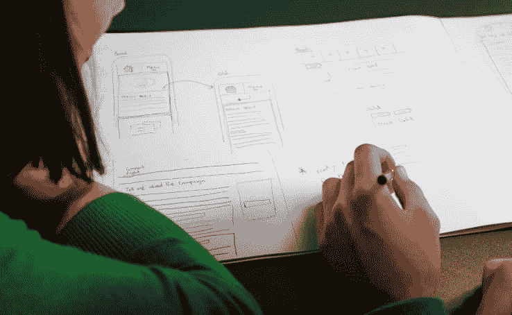

# 价值在于服务，而不在于应用

> 原文:[https://dev . to/browser London/the-value-is-in-the-service-not-the-app-46k 7](https://dev.to/browserlondon/the-value-is-in-the-service-not-the-app-46k7)

我们是一家数字产品代理商，所以开发应用程序和数字服务是我们的专长。不出所料，这意味着一旦客户决定这正是他们所需要的，他们就会主动来找我们；毕竟，如果你不是在市场上买西装，你是不会走进裁缝店的。

这意味着我们谈论了很多关于[应用](https://www.browserlondon.com/case-study/twine/)和[平台](https://www.browserlondon.com/case-study/lightning-api/)和技术的话题，但通常，我们真正兴奋的是围绕数字服务或产品设计的问题或想法。

毕竟，app 只是一台执行工作的机器。它本身并没有内在价值。相反，增加价值的是底层服务设计——为客户解决问题的方法的一部分。技术，应用程序，仅仅是用户消费或访问服务的一种方式。

有时候，我认为企业会忽略这个简单的事实。相反，似乎[越来越普遍的是](https://www.allbusiness.com/10-reasons-small-business-mobile-app-104508-1.html)带着一种根深蒂固的假设运行，即无论问题是什么，应用程序都是唯一的答案。技术将治愈所有疾病。

我想挑战这种信念，因为我在数字战略和开发方面 12 年的经验告诉我，事实并非如此。

## **把你的问题带给我**

更确切地说，最好的解决方案始于对一个问题的关注，当没有解决方案时，问题会得到更好的解决。

[T2】](https://res.cloudinary.com/practicaldev/image/fetch/s--HUfhaR02--/c_limit%2Cf_auto%2Cfl_progressive%2Cq_auto%2Cw_880/https://assets.browserlondon.com/app/uploads/2013/12/Screen-Shot-2016-03-14-at-18.28.33.png)

本质上，只要告诉我问题；谁遇到了问题，他们*需要*做什么。仅仅使用这两块试金石，我们就可以开始一个[以用户为中心的](https://www.browserlondon.com/blog/2016/06/01/user-experience-design-getting-basics-right/)服务设计过程，从底层开始，向上建立对什么和为什么的全面理解，问题的解决方案通常会自然而然地随之而来。

剧透警报；解决方案可能不是一个新的移动应用程序。

事实上，我可以举出多个例子，客户已经找到我们寻求定制的应用程序版本，但是，一旦我们抓住了他们的想法或问题，我们就能够引导他们使用现有的服务或平台来解决他们的问题(通常只需与我们签约的一小部分成本)。同样，我记得有些客户一直在寻求解决一个问题，但是经过检查，我们发现这个问题是由更深层的原因引起的，但解决这个问题也更有价值。

这些例子强调了为什么在开始任何编码工作之前，与客户密切合作来编写和开发一份完整的项目简介*是有用的。这样做的好处是双重的。*

作为设计合作伙伴，该机构可以真正理解服务的目的及其所基于的业务案例和模型，这两者都是有效服务设计的关键原则。另一方面，客户通常会发现，外部机构参与这一过程会让他们对数字产品或应用的最初想法有新的认识，让项目团队能够更好地确定关键功能，并为这些功能制定计划，以便在产品构建过程中交付。

## **发现阶段的价值**

这种协作性的简短写作过程通常被称为[发现阶段](https://www.browserlondon.com/services/research-analysis/)，这可以作为一个完整的创意到产品项目的第一部分，也可以作为一个独立的范围界定和可行性过程。

[T2】](https://res.cloudinary.com/practicaldev/image/fetch/s--PB__wFJ8--/c_limit%2Cf_auto%2Cfl_progressive%2Cq_auto%2Cw_880/https://assets.browserlondon.com/app/uploads/2017/07/Screen-Shot-2017-07-27-at-15.16.20.png)

当我们接近发现阶段时，我们牢记三个重要原则。

*   **视野开阔**–尽可能全面、全面地看待问题或产品创意至关重要。这意味着考虑问题背后的一切，包括操作流程和人为因素。

*   **质疑假设**——不带偏见地解决问题是很有用的，比如什么能做什么不能做，什么能改变什么不能改变。

*   运用一个框架——运用一个结构化的思维过程可以帮助你将大问题分解成更小、更易处理的小块。我们经常在团队中使用要完成的工作和[设计思维](https://dev.to/browserlondon/design-thinking-4439)框架。

一旦我们经历了这个过程——探索组织的出路，同时保持对用户和问题的清晰关注——就有可能看到解决方案或最终产品的形状。如果这是一个定制的应用程序、平台或数字服务，很好，但同样重要的是要接受这样一个想法，即对于客户和用户来说，最好的解决方案可以是一个新的内部系统或现成的服务或产品。

* * *

帖子[的价值在服务中，而不是 app](https://www.browserlondon.com/blog/2019/09/17/value-in-service-not-app/) 最先出现在[浏览器伦敦](https://www.browserlondon.com)上。