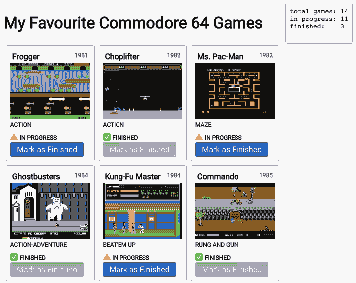
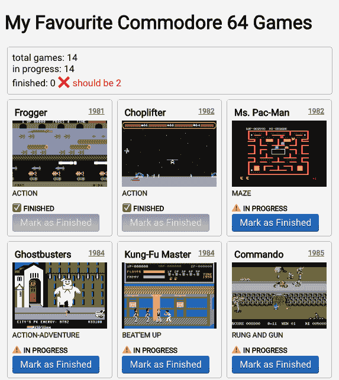
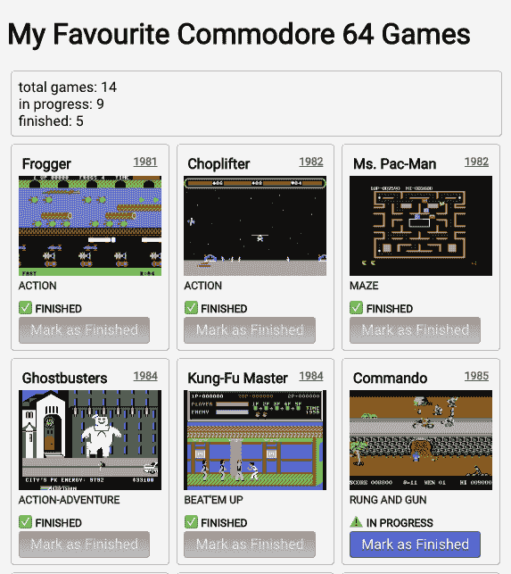

# 与 React 上下文共享远程数据

> 原文:[https://dev . to/juliang/sharing-remote-data-with-react-context-3859](https://dev.to/juliang/sharing-remote-data-with-react-context-3859)

在本系列中，我们没有使用状态管理库或提出一个通用的解决方案，而是从最低限度开始，根据需要构建我们的状态管理。

* * *

*   在第一篇文章中，我们描述了如何用钩子装载和显示数据。
*   在第二篇文章中，我们学习了如何用钩子来[改变远程数据。](https://dev.to/juliang/changing-remote-data-with-hooks-565p)
*   在这第三篇文章中，我们将看到如何使用 React Context 在组件之间共享数据，而不使用全局变量、单例变量或求助于像 MobX 或 Redux 这样的状态管理库。
*   在第四篇文章中，我们将看到如何使用 [SWR](https://swr.now.sh/) 在组件之间共享数据，这可能是我们从一开始就应该做的。

* * *

最终代码可以在这个 [GitHub repo](https://github.com/JulianG/minimal-state-management-demo) 中找到。它是 TypeScript，但是类型注释很少。**另外，请注意这不是生产代码。**为了专注于状态管理，许多其他方面没有被考虑(例如[依赖倒置](https://en.wikipedia.org/wiki/Dependency_inversion_principle)，测试或优化)。

## [](#sharing-remote-data-with-react-context)与 React 上下文共享远程数据

⚠️ **在我们开始**之前，你可能想看看[回购](https://github.com/JulianG/minimal-state-management-demo/tree/07-adding-styles-and-images/src)中的这个标签。该项目已从上一篇文章有所改善，一些造型和游戏截图。

还记得我们的游戏列表吗？**还有第三个要求:**我们希望在页面顶部附近显示一个标志，指示游戏总数，多少已经完成，多少正在进行中。大概是这样的:

[T2】](https://res.cloudinary.com/practicaldev/image/fetch/s--IJFYysQF--/c_limit%2Cf_auto%2Cfl_progressive%2Cq_auto%2Cw_880/https://thepracticaldev.s3.amazonaws.com/i/onbdxd66zfp7scwt3ebe.png)

### [](#lifting-state-to-a-common-ancestor)解除国家对共同祖先的限制

**但是首先**让我们想象一下我们的应用程序变得有点复杂，我们决定把它分成独立的组件。我们将创建一个`GamesScreen`和一个`GameGrid`组件。

```
App
 +- GamesScreen (useGames hook here)
         +- Totals
         +- GameGrid 
```

<svg width="20px" height="20px" viewBox="0 0 24 24" class="highlight-action crayons-icon highlight-action--fullscreen-on"><title>Enter fullscreen mode</title></svg> <svg width="20px" height="20px" viewBox="0 0 24 24" class="highlight-action crayons-icon highlight-action--fullscreen-off"><title>Exit fullscreen mode</title></svg>

现在我们的`App`组件不负责获取游戏列表。我们在`GamesScreen`中这样做。

```
export const App = () => {
  return (
    <>
      <h1>My Favourite Commodore 64 Games</h1>
      <GamesScreen />
    </>
  );
}; 
```

<svg width="20px" height="20px" viewBox="0 0 24 24" class="highlight-action crayons-icon highlight-action--fullscreen-on"><title>Enter fullscreen mode</title></svg> <svg width="20px" height="20px" viewBox="0 0 24 24" class="highlight-action crayons-icon highlight-action--fullscreen-off"><title>Exit fullscreen mode</title></svg>

新的`GamesScreen`组件使用我们的`useGames`定制钩子来保存状态，处理错误和挂起状态，并最终呈现两个子组件。

```
export const GamesScreen = () => {
  const { games, error, isPending, markAsFinished } = useGames();

  return (
    <>
      {error && <pre>ERROR! {error}...</pre>}
      {isPending && <pre>LOADING...</pre>}
      <Totals games={games} />
      <GameGrid games={games} markAsFinished={markAsFinished} />
    </>
  );
}; 
```

<svg width="20px" height="20px" viewBox="0 0 24 24" class="highlight-action crayons-icon highlight-action--fullscreen-on"><title>Enter fullscreen mode</title></svg> <svg width="20px" height="20px" viewBox="0 0 24 24" class="highlight-action crayons-icon highlight-action--fullscreen-off"><title>Exit fullscreen mode</title></svg>

我们提取了一些代码到一个组件中。

```
type GameGridProps = { games: Game[]; markAsFinished: (id: number) => void };

export const GameGrid = ({ games, markAsFinished }: GameGridProps) => {
  return (
    <div className="gamegrid">
      {games.map(game => (
        <GameComponent key={game.id} game={game} markAsFinished={markAsFinished} />
      ))}
    </div>
  );
}; 
```

<svg width="20px" height="20px" viewBox="0 0 24 24" class="highlight-action crayons-icon highlight-action--fullscreen-on"><title>Enter fullscreen mode</title></svg> <svg width="20px" height="20px" viewBox="0 0 24 24" class="highlight-action crayons-icon highlight-action--fullscreen-off"><title>Exit fullscreen mode</title></svg>

最后我们可以创建一个新的`Totals`组件:

```
type TotalsProps = { games: Game[] };

export const Totals = ({ games }: TotalsProps) => {
  const totalGames = games.length;
  const inProgress = games.filter(g => g.status === 'in-progress').length;
  const finished = games.filter(g => g.status === 'finished').length;

  return (
    <div className="card">
      total games: {totalGames}<br />
      in progress️: {inProgress}<br />
      finished: {finished}
    </div>
  );
}; 
```

<svg width="20px" height="20px" viewBox="0 0 24 24" class="highlight-action crayons-icon highlight-action--fullscreen-on"><title>Enter fullscreen mode</title></svg> <svg width="20px" height="20px" viewBox="0 0 24 24" class="highlight-action crayons-icon highlight-action--fullscreen-off"><title>Exit fullscreen mode</title></svg>

结果代码可以在 repo 中的 [08-lifting-state](https://github.com/JulianG/minimal-state-management-demo/tree/08-lifting-state/src) 标签下找到。

### [](#sharing-state-using-hooks-the-wrong-way)共享状态使用钩子(错误方式)

如果两个兄弟组件需要访问同一个状态，我们只需要知道这些。

但是如果我们有一个更复杂的组件树呢？

如果共享状态的组件相距很远，那么为每个组件获取所需的道具可能会导致[道具钻取](https://kentcdodds.com/blog/prop-drilling)。让我们想象一个更复杂的结构:

```
App
 +- GamesScreen (useGames hook here)
     +- MenuBar❗
         +- SomeOtherMenuComponent ❗
             +- Totals (requires the list of games)
     +- GamesPageContent❗
         +- SomeOtherComponent❗
             +- GameGrid (requires the list of games and the markAsFinished function) 
```

<svg width="20px" height="20px" viewBox="0 0 24 24" class="highlight-action crayons-icon highlight-action--fullscreen-on"><title>Enter fullscreen mode</title></svg> <svg width="20px" height="20px" viewBox="0 0 24 24" class="highlight-action crayons-icon highlight-action--fullscreen-off"><title>Exit fullscreen mode</title></svg>

在上面的结构中，我们需要将状态保存在`GamesScreen`中，因为它是`GameGrid`和`Totals`最近的共同祖先。

问题是为了传递需要的道具，`MenuBar`、`SomeOtherMenuComponent`、`GamesPageContent`、`SomeOtherComponent`会需要带有`games`列表和`markAsFinished`函数的道具，只是为了传递给一些子组件。

我们不想那样做。我们可以用 [React Context](https://reactjs.org/docs/context.html) 来解决这个问题。

**注意:**为了保持演示库和本文的简单，我们不会创建任何标有❗️.的中间组件

我们将**假装**中的`GameGrid`和`Total`组件相距甚远。

我们当前的**games screen . tsx**T2】

```
export const GamesScreen = () => {
  const { games, error, isPending, markAsFinished } = useGames(); ❌

  return (
    <>
      {error && <pre>ERROR! {error}...</pre>} ❌
      {isPending && <pre>LOADING...</pre>} ❌
      <Totals games={games} />
      <GameGrid games={games} markAsFinished={markAsFinished} />
    </>
  );
}; 
```

<svg width="20px" height="20px" viewBox="0 0 24 24" class="highlight-action crayons-icon highlight-action--fullscreen-on"><title>Enter fullscreen mode</title></svg> <svg width="20px" height="20px" viewBox="0 0 24 24" class="highlight-action crayons-icon highlight-action--fullscreen-off"><title>Exit fullscreen mode</title></svg>

如果`Totals`和`GameGrid`相距很远，则它们没有共同的父代(只有在树中更高位置的共同祖先)。这意味着我们不能在这里调用`useGames`钩子并传递一些道具而不求助于道具训练，如上所述。

现在我们将在每个组件内部调用`useGames`:

更新**games screen . tsx**T2】

```
export const GamesScreen = () => {
  return (
    <>
      <Totals />
      <GameGrid />
    </>
  );
}; 
```

<svg width="20px" height="20px" viewBox="0 0 24 24" class="highlight-action crayons-icon highlight-action--fullscreen-on"><title>Enter fullscreen mode</title></svg> <svg width="20px" height="20px" viewBox="0 0 24 24" class="highlight-action crayons-icon highlight-action--fullscreen-off"><title>Exit fullscreen mode</title></svg>

更新**game grid . tsx**T2】

```
export const GameGrid = () => {
  const { games, error, isPending, markAsFinished } = useGames();

  return (
    <div className="gamegrid">
      {error && <pre>ERROR! {error}...</pre>}
      {isPending && <pre>LOADING...</pre>}
      {games.map(game => (
        <GameComponent key={game.id} game={game} markAsFinished={markAsFinished} />
      ))}
    </div>
  );
}; 
```

<svg width="20px" height="20px" viewBox="0 0 24 24" class="highlight-action crayons-icon highlight-action--fullscreen-on"><title>Enter fullscreen mode</title></svg> <svg width="20px" height="20px" viewBox="0 0 24 24" class="highlight-action crayons-icon highlight-action--fullscreen-off"><title>Exit fullscreen mode</title></svg>

更新后的`GameGrid`组件没有收到任何 props，但是现在它必须自己处理错误和挂起状态。

更新 **Totals.tsx**

```
export const Totals = () => {
  const { games } = useGames();

  const totalGames = games.length;
  const inProgress = games.filter(g => g.status === 'in-progress').length;
  const finished = games.filter(g => g.status === 'finished').length;

  return (
    <div className="card">
      total games: {totalGames}
      <br />
      in progress️: {inProgress}
      <br />
      finished: {finished}
    </div>
  );
}; 
```

<svg width="20px" height="20px" viewBox="0 0 24 24" class="highlight-action crayons-icon highlight-action--fullscreen-on"><title>Enter fullscreen mode</title></svg> <svg width="20px" height="20px" viewBox="0 0 24 24" class="highlight-action crayons-icon highlight-action--fullscreen-off"><title>Exit fullscreen mode</title></svg>

在`Totals`组件中，我们只使用自定义钩子中的`{games}`,因为我们不需要`markAsFinished`函数，也不担心这个小组件的错误和挂起状态。

您可以使用 [09-duplicating-state](https://github.com/JulianG/minimal-state-management-demo/tree/09-duplicating-state/src) 标签检查 repo 中的代码。

**等等，这不是关于 React 上下文吗？**

上面的代码可以工作，因为这两个组件现在访问相同的服务器 API 并请求相同的游戏列表。两次。然而，当我们将一些游戏标记为完成时，只有`GameGrid`组件反映了这一点。`Totals`组件没有更新。

[T2】](https://res.cloudinary.com/practicaldev/image/fetch/s--llnTAVhT--/c_limit%2Cf_auto%2Cfl_progressive%2Cq_auto%2Cw_880/https://thepracticaldev.s3.amazonaws.com/i/x8ads85i0ay7ijcfym2q.png)

例如，在将两个游戏标记为完成后，`GameGrid`组件如预期的那样显示它们已经完成，但是`Totals`组件继续报告零个游戏完成。

这就是为什么我们只需要获取和更新一个游戏列表。

### [](#sharing-state-using-react-context-the-right-way)使用 React 上下文共享状态(正确方式)

好的。让我们看看如何使用 React 上下文来实现这一点。

我们将更新我们的`GamesScreen`组件。

```
export const GamesScreen = () => {
  return (
    <GamesContextProvider>
      <Totals />
      <GameGrid />
    </GamesContextProvider>
  );
}; 
```

<svg width="20px" height="20px" viewBox="0 0 24 24" class="highlight-action crayons-icon highlight-action--fullscreen-on"><title>Enter fullscreen mode</title></svg> <svg width="20px" height="20px" viewBox="0 0 24 24" class="highlight-action crayons-icon highlight-action--fullscreen-off"><title>Exit fullscreen mode</title></svg>

我们没有将`Totals`和`GameGrid`包装在片段`<>`中，而是将它们包装在一个新的`GamesContextProvider`组件中，接下来我们将创建这个组件。

**game context . tsx**

```
type GamesContext = ReturnType<typeof useGames>;

export const gamesContext = React.createContext<GamesContext>({
  games: [],
  error: null,
  isPending: true,
  markAsFinished: () => {}
});

export const GamesContextProvider: React.FC = ({ children }) => {
  return <gamesContext.Provider value={useGames()}>{children}</gamesContext.Provider>;
}; 
```

<svg width="20px" height="20px" viewBox="0 0 24 24" class="highlight-action crayons-icon highlight-action--fullscreen-on"><title>Enter fullscreen mode</title></svg> <svg width="20px" height="20px" viewBox="0 0 24 24" class="highlight-action crayons-icon highlight-action--fullscreen-off"><title>Exit fullscreen mode</title></svg>

*更多信息参见[使用 React 上下文](https://reactjs.org/docs/context.html)和 [React 钩子参考:使用上下文](https://reactjs.org/docs/hooks-reference.html#usecontext)。*

这是我们能做的最简单的事情。然后我们更新我们的`GameGrid`和`Totals`组件，以使用这样的上下文:

```
import { gamesContext } from '../GamesContext';

export const GameGrid = () => {
//const { games, error, isPending, markAsFinished } = useGames();
  const { games, error, isPending, markAsFinished } = React.useContext(gamesContext); 
```

<svg width="20px" height="20px" viewBox="0 0 24 24" class="highlight-action crayons-icon highlight-action--fullscreen-on"><title>Enter fullscreen mode</title></svg> <svg width="20px" height="20px" viewBox="0 0 24 24" class="highlight-action crayons-icon highlight-action--fullscreen-off"><title>Exit fullscreen mode</title></svg>

但是有一个问题。如果我们忘记在`GamesContextProvider`中包装这个组件或者如果将来有人不小心移除了它，就不会有任何错误。游戏列表永远不会被加载，上下文永远不会改变它的值。

你可以试试。检查一下 [10-minimal-context](https://github.com/JulianG/minimal-state-management-demo/tree/10-minimal-context/src) 标签，编辑 **GamesScreen.tsx** 移除上下文提供者，查看游戏是否永远不会加载。

更好的方法是使用`undefined`作为我们上下文的默认值。

```
type GamesContext = ReturnType<typeof useGames>;

const gamesContext = React.createContext<GamesContext | undefined>(undefined);

export const useGamesContext = (): GamesContext => {
  const context = React.useContext(gamesContext);
  if (!context) {
    throw new Error(
      'useGameContext must be used in a component within a GameContextProvider.'
    );
  }
  return context;
}; 
```

<svg width="20px" height="20px" viewBox="0 0 24 24" class="highlight-action crayons-icon highlight-action--fullscreen-on"><title>Enter fullscreen mode</title></svg> <svg width="20px" height="20px" viewBox="0 0 24 24" class="highlight-action crayons-icon highlight-action--fullscreen-off"><title>Exit fullscreen mode</title></svg>

我们还创建了一个定制的`useGamesContext`钩子，如果上下文未定义，它就会抛出，这种情况只有在缺少提供者时才会发生。

```
import { useGamesContext } from '../GamesContext';

export const GameGrid = () => {
//const { games, error, isPending, markAsFinished } = React.useContext(gamesContext);
  const { games, error, isPending, markAsFinished } = useGamesContext(); 
```

<svg width="20px" height="20px" viewBox="0 0 24 24" class="highlight-action crayons-icon highlight-action--fullscreen-on"><title>Enter fullscreen mode</title></svg> <svg width="20px" height="20px" viewBox="0 0 24 24" class="highlight-action crayons-icon highlight-action--fullscreen-off"><title>Exit fullscreen mode</title></svg>

我们在`Totals`组件中做同样的事情。

```
import { useGamesContext } from '../GamesContext';

export const Totals = () => {
//const { games } = React.useContext(gamesContext);
  const { games } = useGamesContext(); 
```

<svg width="20px" height="20px" viewBox="0 0 24 24" class="highlight-action crayons-icon highlight-action--fullscreen-on"><title>Enter fullscreen mode</title></svg> <svg width="20px" height="20px" viewBox="0 0 24 24" class="highlight-action crayons-icon highlight-action--fullscreen-off"><title>Exit fullscreen mode</title></svg>

就是这样！代码的最终版本可以在 [11-safe-context](https://github.com/JulianG/minimal-state-management-demo/tree/11-safe-context/src) 标签中找到。

[T2】](https://res.cloudinary.com/practicaldev/image/fetch/s--CJd7n5Z6--/c_limit%2Cf_auto%2Cfl_progressive%2Cq_auto%2Cw_880/https://thepracticaldev.s3.amazonaws.com/i/12mn1tgnprhg8x012zft.png)

## [](#conclusion)结论

我们已经设法在我们应用程序中共享状态，而没有使它全球化，也没有遭受适当的钻探。任何需要访问游戏列表的组件都可以使用提供的自定义钩子。这个钩子公开了一个函数，以一种安全的方式改变这样的数据，同时根据我们的业务逻辑立即将它保存在服务器上。

## [](#resources)资源

延伸阅读:

*   [使用状态挂钩](https://reactjs.org/docs/hooks-state.html)
*   [使用效果挂钩](https://reactjs.org/docs/hooks-effect.html)
*   [钩子 API 引用](https://reactjs.org/docs/hooks-reference.html)
*   [何时使用备忘录和使用回拨](https://kentcdodds.com/blog/usememo-and-usecallback/)
*   [用 React.useEffect 取消承诺](https://juliangaramendy.dev/use-promise-subscription/)
*   [使用 React 上下文](https://reactjs.org/docs/context.html)
*   [React 钩子引用:使用上下文](https://reactjs.org/docs/hooks-reference.html#usecontext)
*   [React 上下文 API vs. Redux](https://daveceddia.com/context-api-vs-redux/)
*   [如何有效使用 React 上下文](https://kentcdodds.com/blog/how-to-use-react-context-effectively)