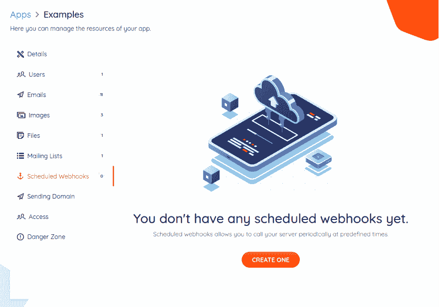
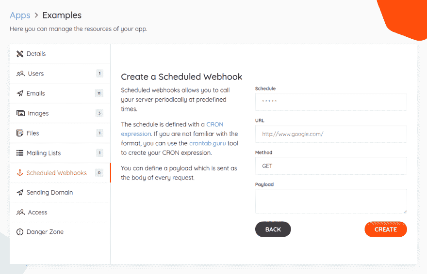
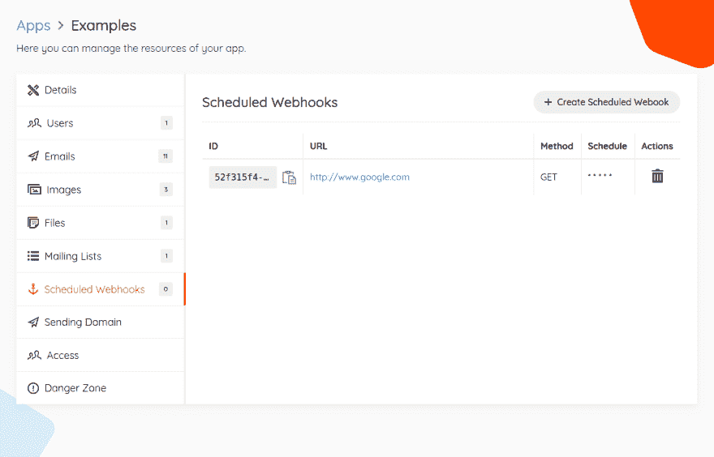
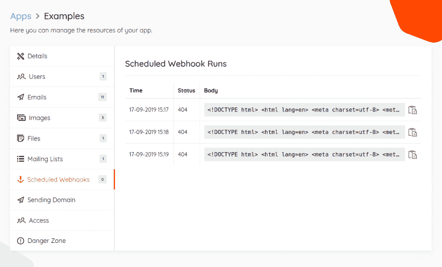

# 基本 API:定期任务

> 原文:[https://dev.to/gdotdesign/periodic-jobs-with-base-31ak](https://dev.to/gdotdesign/periodic-jobs-with-base-31ak)

您是否需要在任何项目中实施定期作业？如果你这样做了，你可能会使用某种调度程序，如 [sidekiq](https://github.com/mperham/sidekiq) 或 [node-cron](https://github.com/kelektiv/node-cron) ，你知道在任何语言中设置一个调度程序都是乏味的，让它们正确运行是一项艰巨的任务。

在 [Base](https://www.base-api.io) 中，你现在可以在你的任何项目中创建**预定的 webhooks** 来轻松快速地完成同样的事情。

## 什么是预定 webhooks？

它们允许您指定一个 HTTP 请求，该请求将按照预定义的时间表发送——更准确地说是一个 CRON 表达式。

ℹ️:如果你不知道什么是 CRON 表达式，那么你可以在这篇维基百科文章中读到。

## 设置预定的 webhook

转到 [www.base-api.io](https://www.base-api.io) 并创建一个项目。

一旦你有了项目，导航到**预定 Webhooks** 部分:

[T2】](https://res.cloudinary.com/practicaldev/image/fetch/s--gEkJyF4W--/c_limit%2Cf_auto%2Cfl_progressive%2Cq_auto%2Cw_880/https://thepracticaldev.s3.amazonaws.com/i/6mvb6skybxsrrr2262d3.png)

然后按下**“创建一个”**按钮:

[T2】](https://res.cloudinary.com/practicaldev/image/fetch/s--48n5f3co--/c_limit%2Cf_auto%2Cfl_progressive%2Cq_auto%2Cw_880/https://thepracticaldev.s3.amazonaws.com/i/ubm7v6r6a267xxyvrosn.png)

填写 webhook 的详细信息，然后按下**“创建”**按钮:

[T2】](https://res.cloudinary.com/practicaldev/image/fetch/s--BywP-wKd--/c_limit%2Cf_auto%2Cfl_progressive%2Cq_auto%2Cw_880/https://thepracticaldev.s3.amazonaws.com/i/qo62fx5iojr81b5oiayr.png)

就是这样！请求将在指定的时间发送到给定的 URL。

## 检查运行情况

所有的请求都会被记录下来，一旦 webhook 运行几次，就可以通过点击 url 查看这些请求:

[T2】](https://res.cloudinary.com/practicaldev/image/fetch/s--Op8TeusH--/c_limit%2Cf_auto%2Cfl_progressive%2Cq_auto%2Cw_880/https://thepracticaldev.s3.amazonaws.com/i/sb7kgx1rey9wmlt035tq.png)

* * *

希望这对一些项目有用！

如果您有任何问题或想法，请随时告诉我，并在接下来的几周内关注更多精彩的功能！📻