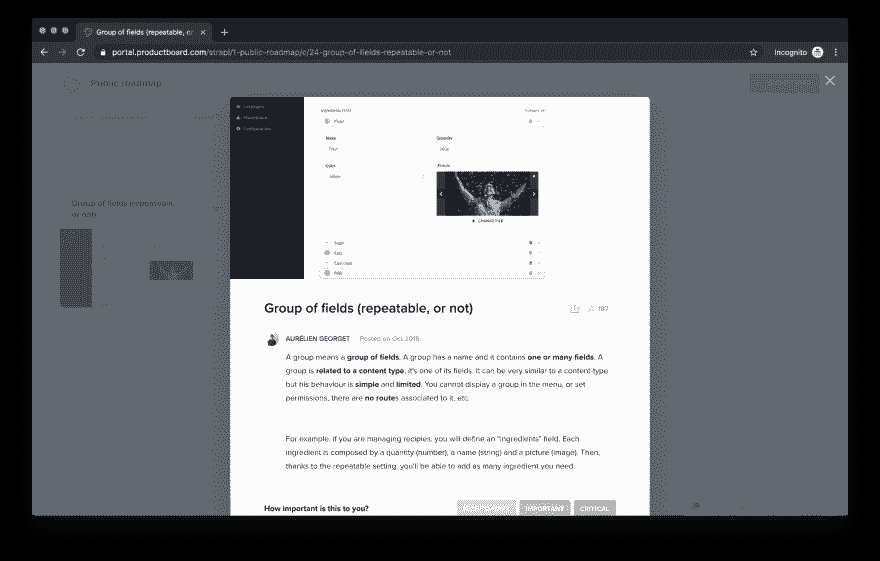
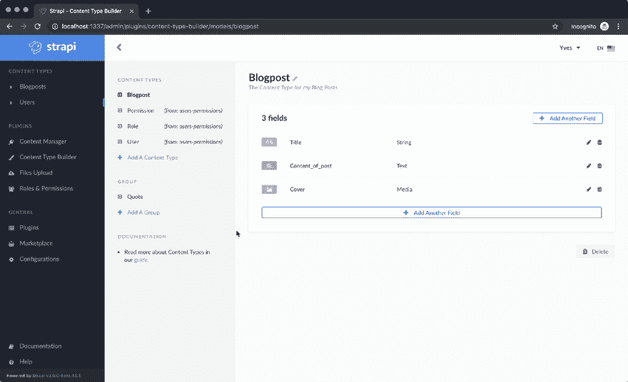
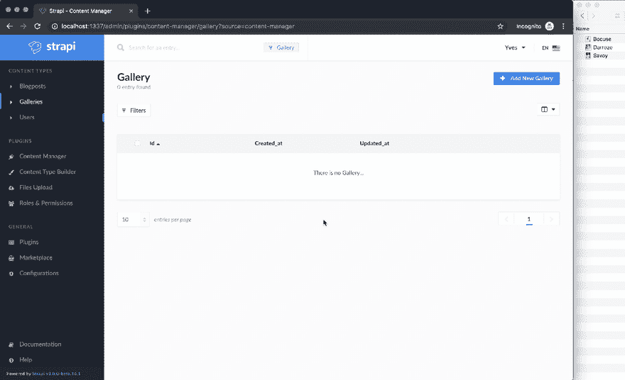
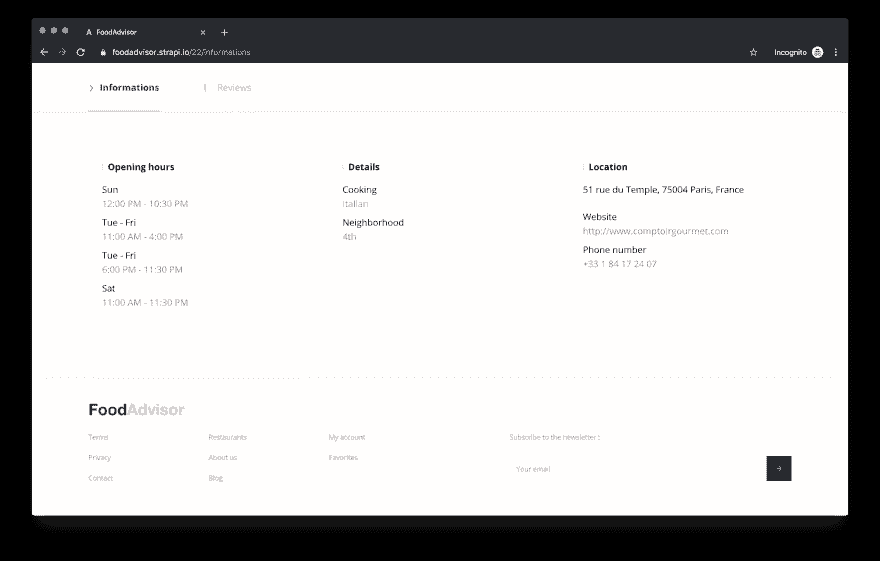
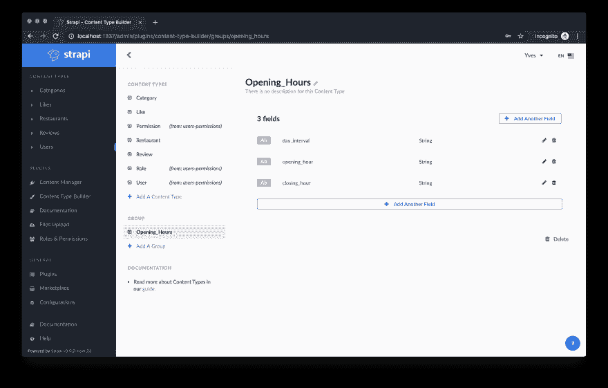
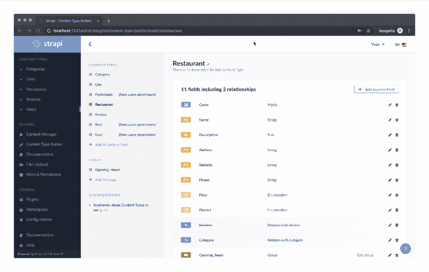
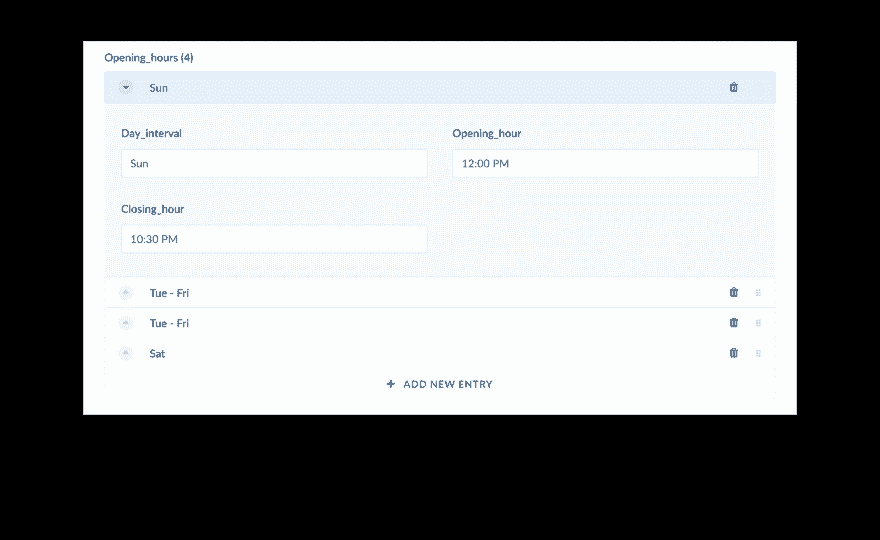
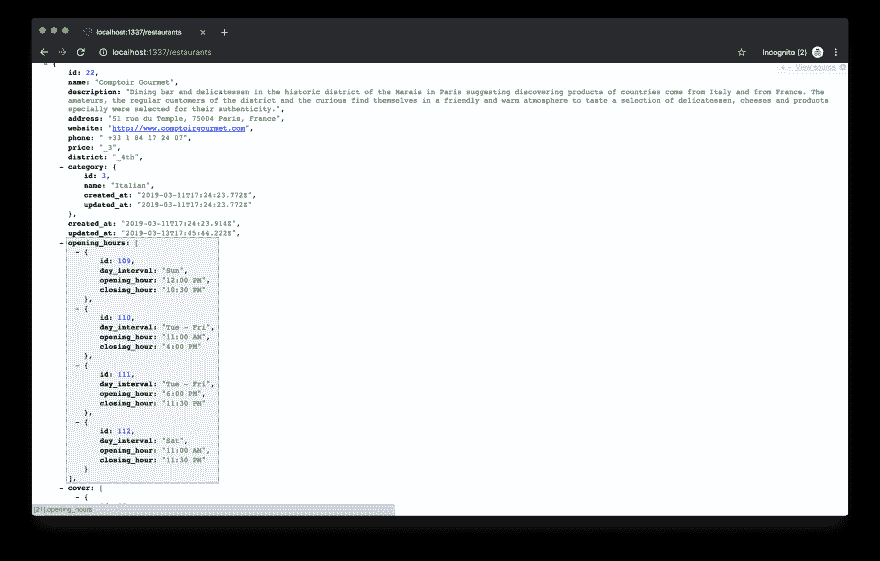
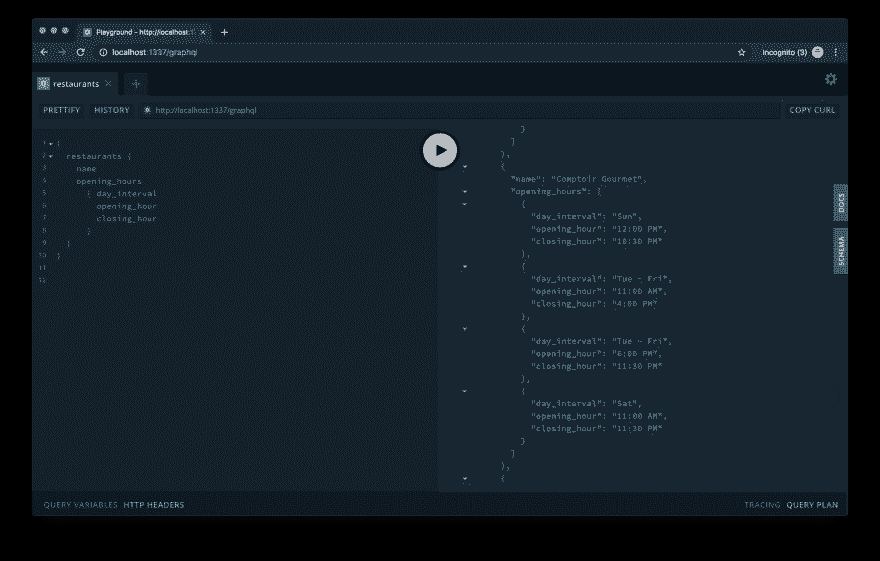
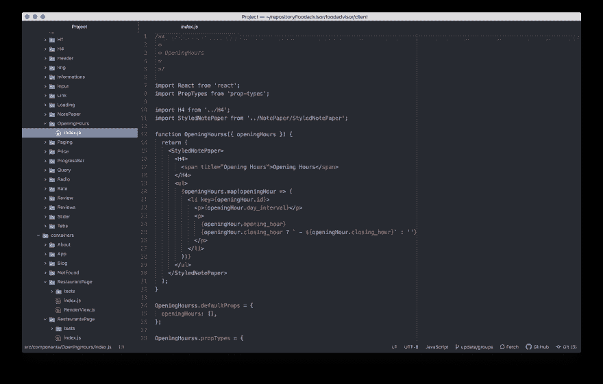

# 引入无障碍可重复组功能

> 原文:[https://dev . to/strapi/introducing-less-free-repeatable-groups-feature-3e8a](https://dev.to/strapi/introducing-hassle-free-repeatable-groups-feature-3e8a)

[T2】](https://res.cloudinary.com/practicaldev/image/fetch/s--Mt4LJheG--/c_limit%2Cf_auto%2Cfl_progressive%2Cq_auto%2Cw_880/https://blog.strapi.io/conteimg/2019/09/cover_newsletter_reduces.png)

今天我们很高兴正式宣布 Strapi beta 的发布。这个版本包含了许多错误修复，都致力于改善开发人员使用 Strapi 时的体验，但最重要的是，它包含了一个新的高度要求的特性。

在路线图上，[超过 180 名用户](https://portal.productboard.com/strapi/1-public-roadmap/c/24-group-of-fields-repeatable-or-not)发送了关于他们的用例以及该特性对他们有多重要的见解。

[T2】](https://res.cloudinary.com/practicaldev/image/fetch/s--Cle00_Ay--/c_limit%2Cf_auto%2Cfl_progressive%2Cq_auto%2Cw_880/https://blog.strapi.io/conteimg/2019/09/Repeatable-Groups-Productboard-2.png)

我们听取了您的意见，我们很高兴引入了**可重复组特性**，它允许您**分组字段并使用 Strapi 复制它们**。

这就是为什么你也应该感到兴奋！

## [](#flexibility-in-the-data-structure)数据结构中的灵活性

使用**可重复组特性**，您可以通过对字段进行分组来迎接一种新的灵活的内容组织方式。

作为开发人员，您将能够预配置组，以便在整个项目中重用它们。作为内容管理员，您将能够使用预配置的组动态、快速地构建页面。

让我们深入了解这项新功能提供的可能性。

## [](#a-new-way-to-create-rich-layouts)创建丰富布局的新方法

您可以从内容类型构建器中快速创建自己的组。在群组列表视图中，您只需点击“添加群组”即可通过设置群组名称并选择您想要添加到群组中的字段来开始构建您的新群组。

[T2】](https://res.cloudinary.com/practicaldev/image/fetch/s--aJwFQXhC--/c_limit%2Cf_auto%2Cfl_progressive%2Cq_66%2Cw_880/https://blog.strapi.io/conteimg/2019/09/create_a_group.gif)

整个过程在内容类型生成器中处理。

##### [](#adding-a-group-to-a-content-type-is-also-very-easy)向内容类型添加组也非常容易。

**分组字段是内容类型**内的字段。创建组后，您可以将其添加到您的内容类型中。

[T2】](https://res.cloudinary.com/practicaldev/image/fetch/s--1N7FBTGs--/c_limit%2Cf_auto%2Cfl_progressive%2Cq_66%2Cw_880/https://blog.strapi.io/conteimg/2019/09/2019-09-11-18.52.50.gif)

您也可以调整设置，使其可重复。
这样，您将能够在内容管理器中复制该字段。

[T2】](https://res.cloudinary.com/practicaldev/image/fetch/s--ngHfQNsz--/c_limit%2Cf_auto%2Cfl_progressive%2Cq_66%2Cw_880/https://blog.strapi.io/conteimg/2019/09/Replicate_entry.gif)

## [](#customize-the-ui-experience-to-fit-your-specific-needs)定制用户界面体验，满足您的特定需求

在内容管理器中，组在内容类型旁边的选项卡中有自己的专用空间。当您在内容管理器中时，在组视图中，您将能够通过简单地拖放您的字段来重新排列您的组的布局。

[T2】](https://res.cloudinary.com/practicaldev/image/fetch/s--_tPz3TX2--/c_limit%2Cf_auto%2Cfl_progressive%2Cq_66%2Cw_880/https://blog.strapi.io/conteimg/2019/09/edit_layout.gif)

## [](#foodadvisor-setting-up-the-opening-hours)FoodAdvisor -设置营业时间

为了详细描述可重复组特性的可能性，让我们深入研究我们的示例应用程序 [Foodadvisor](https://foodadvisor.strapi.io/) 。

FoodAdvisor 上显示的每家餐厅都有一个单独的页面，我们在那里显示关于营业时间、细节和位置的信息。我们将在开放时间使用可重复组特性，并将它们从普通 HTML 转换为可重复组。

[T2】](https://res.cloudinary.com/practicaldev/image/fetch/s--JJeUWjq5--/c_limit%2Cf_auto%2Cfl_progressive%2Cq_auto%2Cw_880/https://blog.strapi.io/conteimg/2019/09/FoodAdvisor---Informations.png)

我们开始吧！

我们首先要创建一个组:营业时间组。该小组的结构如下所示。

**群组名称—** “开放时间”

**字段结构**

*   需要“日间隔”(*字符串*)
*   “开始时间”(*字符串*)可选
*   “closing _ hour”(*string*)可选

[T2】](https://res.cloudinary.com/practicaldev/image/fetch/s--9lG9JLeK--/c_limit%2Cf_auto%2Cfl_progressive%2Cq_auto%2Cw_880/https://blog.strapi.io/conteimg/2019/09/FoodAdvisor---group-field-structure.png)

修改后，内容类型餐馆的新结构将是:

**内容类型名称—** “餐厅”

**字段结构**

*   “封面”(媒体)
*   “名称”(字符串)
*   “描述”(文本)
*   “地址”(字符串)
*   “网站”(字符串)
*   “电话”(字符串)
*   “价格”(枚举)
*   “区”(枚举)
*   “审查”(关系)
*   “类别”(关系)
*   ~~《营业时间》(正文)~~
*   “营业时间”(集团)
    *   需要“日间隔”(*字符串*)
    *   “开始时间”(*字符串*)可选
    *   “closing _ hour”(*string*)可选

[T2】](https://res.cloudinary.com/practicaldev/image/fetch/s--3ueSdcuQ--/c_limit%2Cf_auto%2Cfl_progressive%2Cq_66%2Cw_880/https://blog.strapi.io/conteimg/2019/09/Restaurant_CT_structure.gif)

当前营业时间文本字段中包含的数据如下所示:

```
<li><p>Tue - Thu</p><p>12:00 PM - 10:30 PM</p></li>
<li><p>Fri - Sat</p><p>12:00 PM - 11:00 PM</p></li> 
```

将此文本切换到一个可重复的组将使其结构如下:

```
Entry #1 (of the opening_hours repeatable group field)
    day_interval: "Sun"
    opening_hour: "12:00 PM"
    closing_hour: "10:30 PM"
Entry #2
    day_interval: "Tue-Fri"
    opening_hour: "12:00 PM"
    closing_hour: "11:00 PM" 
```

以下是内容管理器中营业时间字段的视图:
[](https://res.cloudinary.com/practicaldev/image/fetch/s--LHGWAaPp--/c_limit%2Cf_auto%2Cfl_progressive%2Cq_auto%2Cw_880/https://blog.strapi.io/conteimg/2019/09/data_look-1.png)

这是 API 在 REST 和 GraphQL 中的样子:
[](https://res.cloudinary.com/practicaldev/image/fetch/s--0GO2-Jj_--/c_limit%2Cf_auto%2Cfl_progressive%2Cq_auto%2Cw_880/https://blog.strapi.io/conteimg/2019/09/Screen-Shot-2019-09-12-at-09.51.43.png)

[T2】](https://res.cloudinary.com/practicaldev/image/fetch/s--Pa0xQ5_B--/c_limit%2Cf_auto%2Cfl_progressive%2Cq_auto%2Cw_880/https://blog.strapi.io/conteimg/2019/09/Screen-Shot-2019-09-12-at-10.06.41.png)

数据结构的变化也对前端有影响。HTML 是在 Strapi 管理面板中编写的。

前端收到的 JSON 响应不会一样。前端将不得不遍历“opening_hours”数组，而不是将 HTML 原样注入 DOM。然后前端会自动创建`li`和`p`标签。

[T2】](https://res.cloudinary.com/practicaldev/image/fetch/s--XCgG0YYY--/c_limit%2Cf_auto%2Cfl_progressive%2Cq_auto%2Cw_880/https://blog.strapi.io/conteimg/2019/09/Screen-Shot-2019-09-12-at-10.23.40.png)

## [](#upgrade-to-beta16)升级到 beta.16

如果您已经在使用 Strapi 构建您的项目，我们建议您使用下面详细的迁移指南[这里](https://strapi.io/documentation/3.0.0-beta.x/migration-guide/migration-guide-beta.15-to-beta.16.html)迁移到这个版本。

## [](#how-to-get-started)如何入门

如果您是 Strapi 的新手，请尝试一下！

看看[入门](https://strapi.io/documentation/3.0.0-beta.x/getting-started/quick-start.html#_1-install-strapi-globally)指南，或者从下面的命令行开始:

```
yarn create strapi-app my-app --quickstart 
```

## [](#be-involved)被牵连

#### [](#contribute)投稿！

如果你以前从未参与过开源项目，那么参与其中可能会很可怕，而且不一定包括编码。

> 即使你喜欢写代码，其他类型的贡献也是参与项目和结识其他社区成员的好方法。建立这些关系会给你机会在项目的不同部分工作。*[https://open source . guide](https://opensource.guide)*

例如，我们总是对来自开发者的相关客座博文开放，并分享杀手级内容！

如果你有问题或者只是想问声好👋我们总是很高兴收到你的来信，或者你可以在下面评论。
请分享这篇文章，帮助更多人发现它。

## [](#thanks-to-the-community)感谢社区

Strapi 是 200 多名社区成员的产品。感谢所有帮助我们修复这个版本的测试人员！我们尽最大努力找到并杀死所有的臭虫🐛我们发现在上线之前，最好的 QA 总是来自目光敏锐的不妥协测试人员。谢谢你。