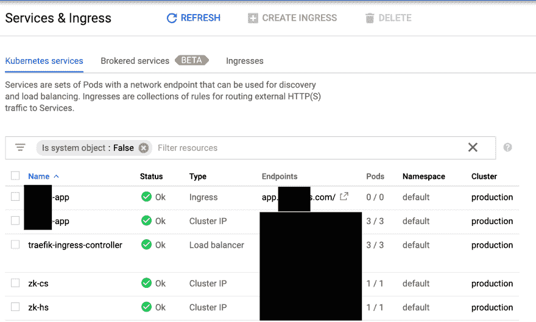

# 将应用部署到您的个人云中

> 原文：<https://dev.to/rhanarion/deploy-an-app-into-your-personal-cloud-390l>

作为这一长串博客的最后一步，我们将在 docker 容器中部署一个简单的 webapp 到我的个人云中。这里的上下文是使用 Traefik/Let's Encrypt 的 personal cloud 设置([使用 Traefik、Let's Encrypt 和 Zookeeper](https://rhazn.com/posts/run-a-personal-cloud-with-traefik-lets-encrypt-and-zookeeper/) 运行 personal cloud)。

在之前的博文中，我也描述了我是如何构建这个应用程序的([在 docker](https://rhazn.com/posts/build-a-progressive-web-app-in-docker-with-nginx-to-deploy-to-kubernetes-or-docker-swarm/) 中构建 PWA)。

# App 部署

部署运行 docker 容器。如果你按照我的个人云设置，请确保使用多个副本，因为现有虚拟机的性质意味着一个副本可能会随机关闭。

请注意，该映像将由 gitlab ci 设置和更新，如下所述:([使用 gitlab ci](https://rhazn.com/posts/deploy-to-google-kubernetes-engine-using-gitlab-ci/) 部署到 google kubernetes 引擎)。

```
kind: Deployment
apiVersion: extensions/v1beta1
metadata:
  name: ???-app
spec:
  replicas: 3
  template:
    metadata:
      labels:
        app: ???-app
    spec:
      terminationGracePeriodSeconds: 60
      containers:
      - name: ???-app
        image: "eu.gcr.io/???/app:latest" 
```

<svg width="20px" height="20px" viewBox="0 0 24 24" class="highlight-action crayons-icon highlight-action--fullscreen-on"><title>Enter fullscreen mode</title></svg> <svg width="20px" height="20px" viewBox="0 0 24 24" class="highlight-action crayons-icon highlight-action--fullscreen-off"><title>Exit fullscreen mode</title></svg>

# 服务和 traefik 入口

```
apiVersion: v1
kind: Service
metadata:
name: ???-app
spec:
selector:
    app: ???-app
ports:
- name: web
    port: 80
    targetPort: 80
---
apiVersion: extensions/v1beta1
kind: Ingress
metadata:
name: ???-app
annotations:
    kubernetes.io/ingress.class: traefik
    traefik.frontend.passHostHeader: "false"
    traefik.frontend.priority: "1"
spec:
rules:
- host: app.???.com
    http:
    paths:
    - path: /
        backend:
        serviceName: ???-app
        servicePort: web 
```

<svg width="20px" height="20px" viewBox="0 0 24 24" class="highlight-action crayons-icon highlight-action--fullscreen-on"><title>Enter fullscreen mode</title></svg> <svg width="20px" height="20px" viewBox="0 0 24 24" class="highlight-action crayons-icon highlight-action--fullscreen-off"><title>Exit fullscreen mode</title></svg>

# 更新 traefik 配置

更新 traefik 配置非常重要，因此 traefik 从 Let's encrypt 为该应用程序申请了一个新的 HTTPS 证书。您需要将这一行添加到这里描述的 traefik toml 文件中([用 traefik 运行个人云，让我们加密和 Zookeeper](https://rhazn.com/posts/run-a-personal-cloud-with-traefik-lets-encrypt-and-zookeeper/) ):

```
[[acme.domains]]
    main = "app.???.com" 
```

<svg width="20px" height="20px" viewBox="0 0 24 24" class="highlight-action crayons-icon highlight-action--fullscreen-on"><title>Enter fullscreen mode</title></svg> <svg width="20px" height="20px" viewBox="0 0 24 24" class="highlight-action crayons-icon highlight-action--fullscreen-off"><title>Exit fullscreen mode</title></svg>

# [DNA](#dns)

现在您只需将您的域的 A 记录指向 traefik 外部 IP，其余的将由您的个人云自动处理:)。

[](https://res.cloudinary.com/practicaldev/image/fetch/s--4Rgepx_t--/c_limit%2Cf_auto%2Cfl_progressive%2Cq_auto%2Cw_880/https://rhazn.com/img/posts/deploy-an-app-into-your-personal-cloud/final-result.png)

# 关于我

我是一个全栈开发者和数字产品爱好者，我可以自由工作，并总是在寻找下一个令人兴奋的项目:)。

你可以通过电子邮件(pheltweg@gmail.com 或者推特 https://twitter.com/rhanarion T2 联系我。