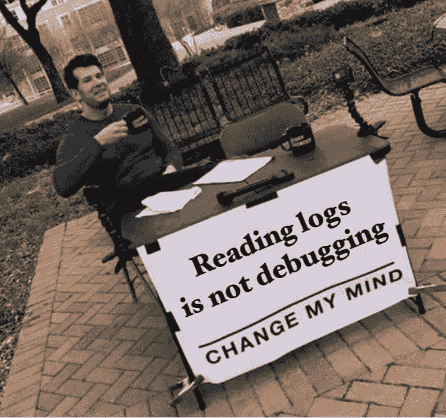
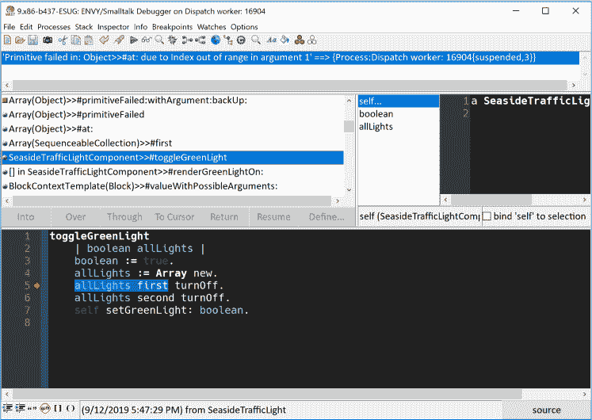
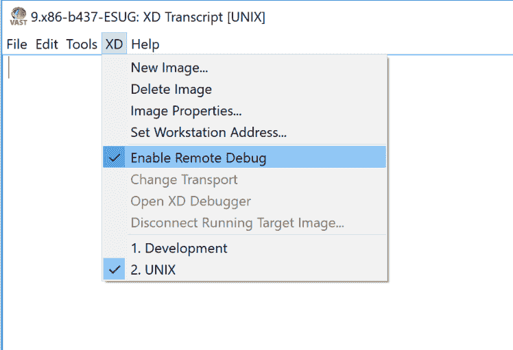
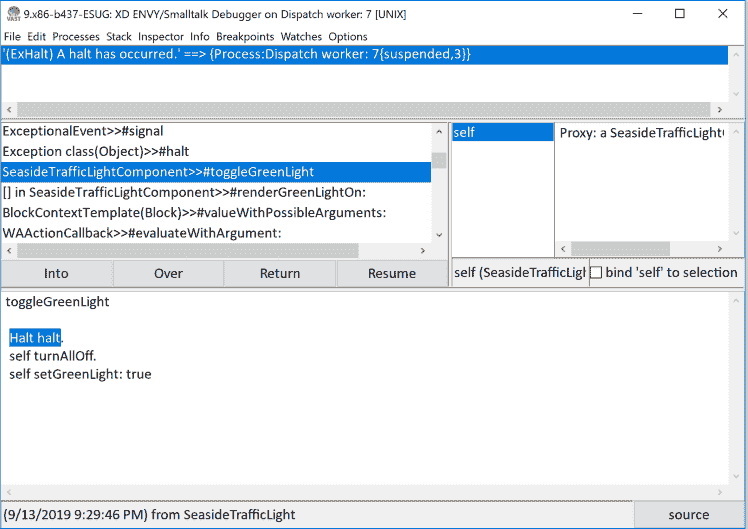

# 现在是 2019 年:停止阅读文本，开始调试！

> 原文：<https://dev.to/martinezpeck/it-s-2019-stop-reading-text-and-start-debugging-2460>

如果您是一名程序员，我相信您已经发现自己通过将字符串写入 console / stdout / file 来“调试”系统很多次了。这些信息通常是类似“传到这里！”、“错误分支”、“现在即将进入循环”，甚至可能还有一些“fuc ..”或者也叫“WTF”。

如果您“幸运”并且您的系统投入生产，很可能您必须支持和维护它。有多少次，您发现自己通过读取数百个日志文件来“调试”生产中的错误？

> 那不是调试。那是文本阅读。

[](https://res.cloudinary.com/practicaldev/image/fetch/s--BUOzZWK_--/c_limit%2Cf_auto%2Cfl_progressive%2Cq_auto%2Cw_880/https://i1.wp.com/marianopeck.blog/wp-content/uploads/2019/09/textDebugging.jpg%3Fw%3D748%26ssl%3D1)

想象一下，如果您可以(用真正的调试器)实时调试一个部署的应用程序，会怎么样？并且该应用程序甚至可以远程运行。或者假设应用程序有一个错误，而不是编写基于文本的堆栈跟踪，您可以转储执行堆栈的快照(及其所有变量和状态)，然后在您的开发环境中进行事后分析(是的，再次使用真正的调试器)？

这是将来调试的工作方式吗？不。我已经做了好几年了。Smalltalk 至少从 1995 年就有这种能力了。

> 不要给控制台发短信。查询流程。

### 文本阅读和穷人调试有什么问题？

我可以为此写一整篇博文，但这里有一些想法:

*   这是一项非常无益且令人不快的任务。如果您必须执行停止-更改(添加日志)-启动循环，情况会更糟。
*   这很容易出错。例如，在添加或删除打印语句时，您可能已经破坏了代码。
*   每当你完成你的“调试”，你必须花时间回滚所有的变化。更糟糕的是，您可能会忘记一些调试代码，而这些代码将会投入生产。
*   当你看着一根木头时，你是盲目的。您没有关于执行堆栈的信息(此时这个变量的状态是什么？不知道..).由于打印了每一帧的临时变量，你最多只能得到“一些”信息。
*   这对任务关键型系统来说是不够的。很多时候，当出现错误和系统停机时，每小时可能会损失数百万美元。

你认为读日志真的有帮助吗？也许吧。但我希望我已经让你相信我们可以做得更好。

### 演示:一个简单的 web 应用

在这篇文章中，我将使用一个演示 web 应用程序(用 [Seaside framework](https://github.com/seasidest/seaside) 编写),它代表一个简单的交通灯。当您单击三个灯中的一个时，被单击的一个灯打开，其他灯关闭:

[](https://res.cloudinary.com/practicaldev/image/fetch/s--7l_5xzvH--/c_limit%2Cf_auto%2Cfl_progressive%2Cq_auto%2Cw_880/https://i2.wp.com/marianopeck.blog/wp-content/uploads/2019/09/Screen-Shot-2019-09-11-at-9.43.39-AM-1-3806457451-1568224546506.png%3Fw%3D748%26ssl%3D1)

一个重要的细节是，出于演示的目的，我们在单击绿色按钮时调用的一个方法上放了一个错误:

```
toggleGreenLight
    | boolean allLights |
    boolean := true.
    allLights := Array new.
    allLights first turnOff.
    allLights second turnOff.
    self setGreenLight: boolean. 
```

<svg width="20px" height="20px" viewBox="0 0 24 24" class="highlight-action crayons-icon highlight-action--fullscreen-on"><title>Enter fullscreen mode</title></svg> <svg width="20px" height="20px" viewBox="0 0 24 24" class="highlight-action crayons-icon highlight-action--fullscreen-off"><title>Exit fullscreen mode</title></svg>

你发现了吗？没有吗？然后继续读；)在这个例子中，我们看到了一个特定的错误，但是我将显示的所有内容都完全一样，就好像这是任何类型的运行时错误一样。

现在，我们需要另一台机器作为“生产”服务器，我们可以在其中部署我们的应用程序，并看看如何调试它。为此，我将使用可以在世界任何地方运行的树莓 Pi。这也有助于我展示这些独特的调试技术对于物联网来说有多酷。

我将在这里展示的调试特性是 [VASmalltalk](https://www.instantiations.com/products/vasmalltalk/index.html) 的一部分，但其中一些特性存在于其他 Smalltalk 方言中。

### 场景 1:在开发中运行

这很简单。他让应用程序在我们的开发环境中本地运行，如果我们单击绿色按钮，就会得到一个调试器:

*   

在这种情况下，没有多少魔力。好吧，至少对那些话不多的人来说是这样。对于不爱说话的人来说，这里有一些魔力。例如，您可以检查对象，向它们发送消息，评估代码，**更改代码**，然后继续执行。是，没有停止-编译-启动循环。就像他们说的，现场编码。你现在明白为什么我们(爱说话的人)喜欢在调试器中开发了吗？

### 场景 2:使用文本日志在生产中运行

我们现在在我们的生产机器上运行我们的应用程序(在这个例子中是一个 Raspberry Pi ),我们将使用传统的日志文件进行错误处理。

下面您可以看到生成的日志文件的摘录(这里称为`walkback.log`)。这可能是您最熟悉的内容:

*   

仔细看一下上面的日志文件，可以看出我在本文前面提到的局限性。

### 场景 3:使用二进制堆栈转储在生产上运行

终于！！！有趣的事情开始了:)在这种情况下，当我单击绿色按钮时，应用程序没有生成日志文件，而是生成了二进制文件`seaside.sdf`。该文件包含异常发生时执行堆栈的快照。

神奇的是，以后我可以使用任何开发环境，打开调试器，附加那个`seaside.sdf`文件，然后进行事后分析！

*   

在本例中，我将文件从服务器复制到我的开发机器上，结果如下:

*   

您可以注意到，在这个调试器上，`Into`、`Over`和所有导航按钮都被禁用了。这是因为这是一个堆栈的快照，所以您不能真正改变它(等待下一节！).然而，您可以看到这比处理日志文件要友好得多。在这里，你可以看到我可以检查对象，我可以看到他们的状态，等等…

此时，错误应该是清楚的:变量`allLights`是空的，因此向它发送`first`会抛出一个异常。这里的修正是简单地使用一个现有的方法`turnAllOff` :

```
toggleGreenLight

    self turnAllOff.
    self setGreenLight: true 
```

<svg width="20px" height="20px" viewBox="0 0 24 24" class="highlight-action crayons-icon highlight-action--fullscreen-on"><title>Enter fullscreen mode</title></svg> <svg width="20px" height="20px" viewBox="0 0 24 24" class="highlight-action crayons-icon highlight-action--fullscreen-off"><title>Exit fullscreen mode</title></svg>

> 总结一下:我有一个本地调试器，当远程服务器上触发异常时，它会打开执行堆栈的快照。

### 场景 4:通过实时远程调试在生产环境中运行

前面的二进制堆栈转储非常适合对生产错误进行事后分析，但是如果我们想要实时调试服务器上正在发生的事情呢？还是在物联网板中？那么，我们可以使用远程调试器功能。

对于这个演示，我想做的是在某个地方暂停执行(就像一个断点)，这样我就可以打开一个调试器，看看发生了什么。为此，我在方法的开头添加了一个`Halt halt`:

```
toggleGreenLight
    Halt halt. 
    self turnAllOff.
    self setGreenLight: true 
```

<svg width="20px" height="20px" viewBox="0 0 24 24" class="highlight-action crayons-icon highlight-action--fullscreen-on"><title>Enter fullscreen mode</title></svg> <svg width="20px" height="20px" viewBox="0 0 24 24" class="highlight-action crayons-icon highlight-action--fullscreen-off"><title>Exit fullscreen mode</title></svg>

远程调试器通过 TCP 工作，这意味着:

1.  “目标”(远程系统)必须知道“开发”环境的 IP(或主机名)。
2.  我们需要在网络中打开某个端口。
3.  我们可以远程调试在全球任何地方运行的任何远程系统。在这种情况下，树莓派就在我旁边，但如果它在 14k 公里以外，情况也会一样。

我需要做的第一件事是告诉我的“开发”环境监听可能的远程连接:

*   

现在，我只需运行 web 应用程序并单击绿色按钮。浏览器看起来就像在“等待”按钮的回调。

[](https://res.cloudinary.com/practicaldev/image/fetch/s--v2FB_zUE--/c_limit%2Cf_auto%2Cfl_progressive%2Cq_auto%2Cw_880/https://i1.wp.com/marianopeck.blog/wp-content/uploads/2019/09/Screen-Shot-2019-09-11-at-11.34.02-AM.png%3Fw%3D748%26ssl%3D1)

但是…如果我现在去我的开发机器…我看到一个调试器进来了！！！

[](https://res.cloudinary.com/practicaldev/image/fetch/s--sFCNyRZK--/c_limit%2Cf_auto%2Cfl_progressive%2Cq_auto%2Cw_880/https://i1.wp.com/marianopeck.blog/wp-content/uploads/2019/09/Screen-Shot-2019-09-13-at-9.37.42-PM.png%3Ffit%3D748%252C529%26ssl%3D1)

`Into`、`Over`及其余按钮现已可用。同样，我可以检查对象，查看它们的状态，并向它们发送消息。但是除此之外，我可以**改变代码**并恢复执行(就像我在本地机器上开发时所做的那样！).例如，让我们更改代码，现在绿灯是红色的:

[](https://res.cloudinary.com/practicaldev/image/fetch/s--jrzUDWS8--/c_limit%2Cf_auto%2Cfl_progressive%2Cq_auto%2Cw_880/https://i1.wp.com/marianopeck.blog/wp-content/uploads/2019/09/Screen-Shot-2019-09-13-at-9.38.47-PM.png%3Ffit%3D748%252C547%26ssl%3D1)

然后我就点击`Resume`按钮。调试器消失，web 浏览器继续呈现(但现在，很明显，绿灯是红色的):

[](https://res.cloudinary.com/practicaldev/image/fetch/s--2HI4lmub--/c_limit%2Cf_auto%2Cfl_progressive%2Cq_auto%2Cw_880/https://i0.wp.com/marianopeck.blog/wp-content/uploads/2019/09/Screen-Shot-2019-09-11-at-11.43.31-AM.png%3Fresize%3D273%252C351%26ssl%3D1)

> 总结一下:我有一个本地调试器，当远程服务器上触发异常时，它会打开一个实时执行堆栈。我甚至可以修改代码并恢复异常以继续正常执行。

### 太神奇难以置信？我作弊了吗？

文字和截图可能不足以恰当地展示所有这些功能，因此，我录制了这个简短的视频来展示现场工作的情况:

[https://www.youtube.com/embed/XZiJTdxrsvY](https://www.youtube.com/embed/XZiJTdxrsvY)

### 其他可能的用途？

我只展示了几个场景，但还有更多！我知道的其他一些人:

*   [调试继续集成测试失败](https://marianopeck.blog/2012/07/25/reviving-ci-test-failures-in-local-machine/):有时测试在 CI 上失败，但在您的本地机器上没有。所以…我们只是给失败的测试添加了堆栈转储。这样，您只需下载堆栈文件，然后看看发生了什么。
*   在社区之间共享“错误”:不是共享普通的字符串堆栈，而是共享堆栈转储。
*   [调试 AWS Lamba 服务](https://gitlab.com/macta/PharoLambda)。
*   在物联网上调试。

### 结论

我们这样做已经很多年了。 [VASmalltalk](https://www.instantiations.com/products/vasmalltalk/) 的二进制堆栈转储和远程调试可以追溯到 1995 年左右。是的，24 年前。 [Pharo](https://pharo.org) 和[宝石](https://gemtalksystems.com/products/gs64/) Smalltalks 都有相似的特点。事实上，我在 2012 年与人合著了 Pharo 开发(T7 ),该开发(T8)获得了 ESUG 创新技术奖(T9)的第一名。

原来这就是“**调试到未来**的样子。这个双关语有双重含义:Smalltalk 很久以前就允许这种调试，尽管对于没有尝试过的程序员来说，这看起来像是一种未来的方法。此外，根据帖子中显示的想法，您可以看到现在如何进行堆栈跟踪，但要在很久以后才进行调试，甚至是在不同的环境中，有点像计算过程的假死状态。

作为一名软件专业人员也意味着关心你选择使用的工具。我可以使用`vim`并且知道很多很棒的热键，但是我也有一个很好的显示器和鼠标，所以为什么我不能享受和利用一些现代的东西呢？

我希望你使用 Smalltalk(那会很酷)，但至少要争取在你使用的任何语言中都有像样的调试能力。

人们现在使用时髦的词语“技术债务”。嗯，我保证用调试器代替文本编辑器和`grep`确实有助于减少这种情况。

最后，不要停留在这只是一些“酷”的想法。这很酷，但它也给企业和客户带来了很多价值。

是时候前进了。

PS:感谢所有 BA-ST Slack 组和实例化团队，他们在想法、报价、修改和更多方面给了我很多帮助！