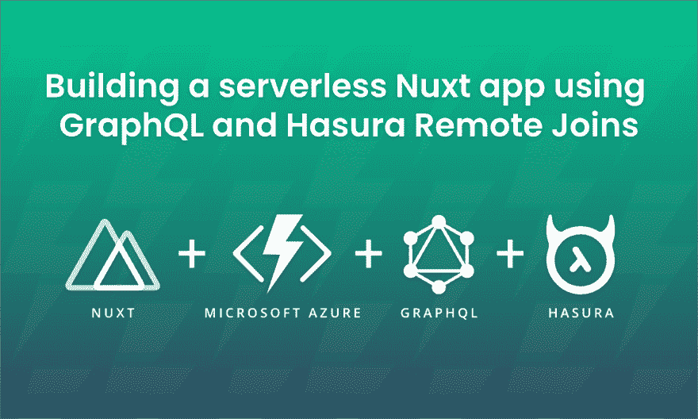
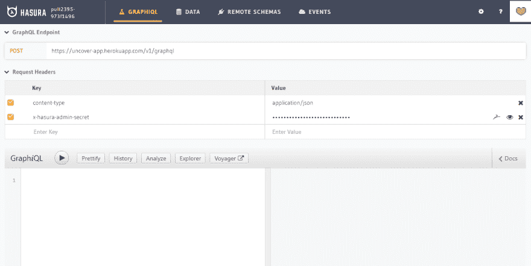
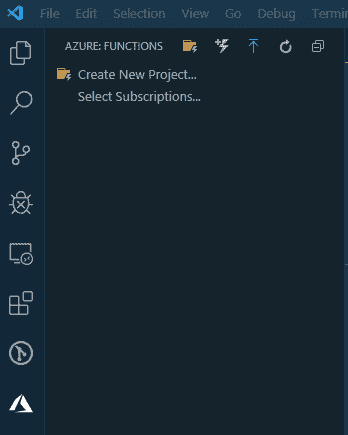
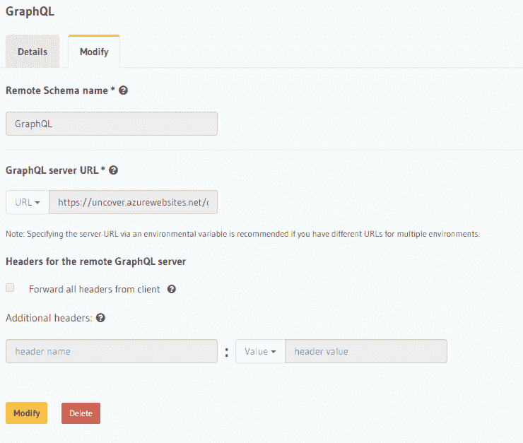
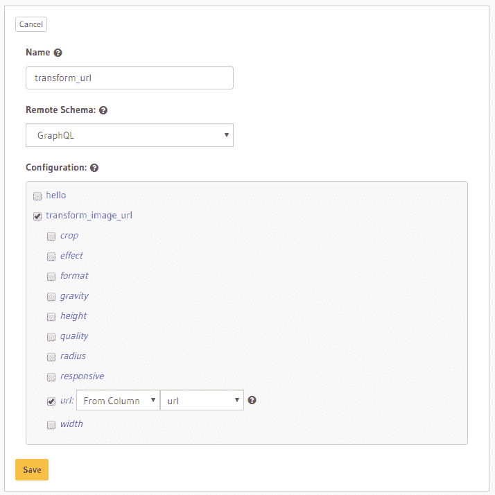
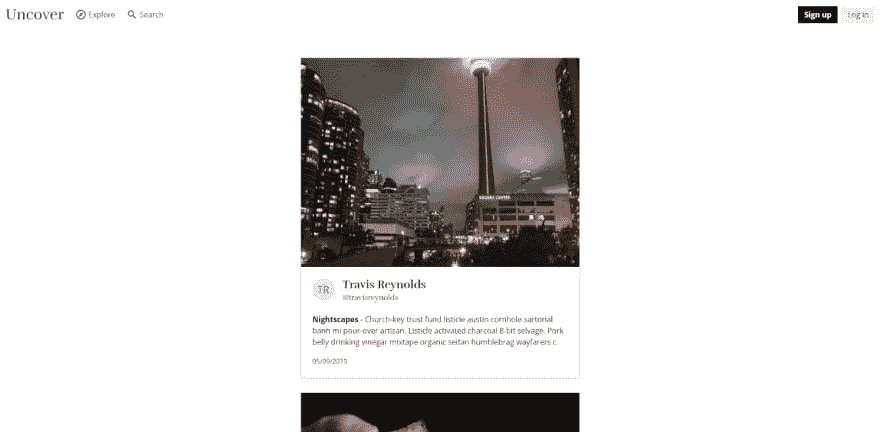

# 使用 GraphQL 和 Hasura 远程连接构建无服务器 Nuxt 应用程序

> 原文:[https://dev . to/hasura HQ/building-a-server less-nuxt-app-using-graph QL-and-hasura-remote-joins-57a 0](https://dev.to/hasurahq/building-a-serverless-nuxt-app-using-graphql-and-hasura-remote-joins-57a0)

[T2】](https://res.cloudinary.com/practicaldev/image/fetch/s---ORX4iSZ--/c_limit%2Cf_auto%2Cfl_progressive%2Cq_auto%2Cw_880/https://blog.hasura.io/conteimg/2019/09/hasura-azure-w_o-border.png)

*本教程由 [Travis Reynolds](https://travisreynolds.dev/) 撰写，并作为 [Hasura 技术作者计划](https://blog.hasura.io/the-hasura-technical-writer-program/)的一部分发布，该计划旨在支持为开源 Hasura GraphQL 引擎编写指南和教程的作者。*

在本指南中，我们将构建一个简单的 Instagram 风格的 Nuxt 应用程序，用户可以上传图片，喜欢并为其他人的图片添加评论。图像将被存储在一个 API 上，我们将使用 Hasura 远程连接来转换图像 URL，这样我们就可以从数据库中查询我们想要的精确大小的图像，而不必使用专用的库来转换 URL 客户端。

远程连接是一个即将到来的 Hasura 特性，它允许你跨数据库连接外部服务。点击这里查看官方博客。

## [](#prerequisites)先决条件

我们将使用一个预建的 Nuxt 应用程序作为前端，所以一些关于 VueJS 和 SSR 框架的经验将是有帮助的——尽管不是必需的。

对于后端，我们将使用:

*   用于 GraphQL APIs 和远程连接的 Hasura
*   Heroku
*   Azure 函数创建远程模式和事件处理程序，
*   用于身份验证的 Auth0
*   Cloudinary 来承载我们的图像。

我们开始吧！

> *你可以在这里查看试玩 app:*【https://uncover-nuxt.herokuapp.com/ T2】

首先，下载[样本库](https://github.com/thetre97/uncover)。在这里，我们有几个文件夹:

*   迁移——我们将使用这些来为我们的数据库设置表
*   功能——我们将部署到 Azure 的功能应用
*   揭开 Nuxt 前端应用程序

## [](#setting-up-the-database)设置数据库

我们将使用 Heroku 来部署一个 Hasura 实例。已经有一个很好的 [**快速入门指南**](https://docs.hasura.io/1.0/graphql/manual/deployment/heroku/index.html) 关于部署到 Heroku——遵循这个，但是我们需要改变一件事。目前，远程加入功能仍在预览中，所以我们将需要使用从 Github PR 创建的 Docker 映像。访问 [PR](https://github.com/hasura/graphql-engine/pull/2395) 并找到 hasura-bot 的最新版本。它看起来有点像`hasura/graphql-engine:pull2395-<version>`。截至本文写作时，为`hasura/graphql-engine:pull2395-973f1496`。记下这一点，然后将 Dockerfile `FROM`值编辑为 PR 版本。

```
FROM hasura/graphql-engine:pull2395-973f1496 
```

我们现在可以将它部署到**Heroku**——遵循**快速入门指南**的其余部分。

一旦部署了 Hasura，请遵循下一篇关于 [**保护 Hasura 控制台**](https://docs.hasura.io/1.0/graphql/manual/deployment/heroku/securing-graphql-endpoint.html) 的文章。

干得好！我们现在可以在`<app-name>.herokuapp.com/console`访问我们的应用程序。我的 app 叫**揭开 App** ，所以我可以在[【https://uncover-app.herokuapp.com/console】](https://uncover-app.herokuapp.com/console)到达控制台。继续使用您的管理员密码登录(来自上面的快速入门指南)。

<figure>[](https://res.cloudinary.com/practicaldev/image/fetch/s--gxoj80dR--/c_limit%2Cf_auto%2Cfl_progressive%2Cq_auto%2Cw_880/https://lh3.googleusercontent.com/T3nML9BPg4W2-Df8QzaVyi3cc8jpVrpuJZ2Kurimt56gmQ9Nki1Wm__PN-WaSpePXKBQN4SiHuOU3K8w4cB2-DZUyuO3pyHYla9TCbZwmPzRhw509C18AFFRD7xXb3sSQ2rUj4nE) 

<figcaption>哈苏拉控制台</figcaption>

</figure>

我们需要向 Heroku 添加一个环境变量:这将决定任何未授权用户将被赋予什么角色——因此我们可以相应地添加权限:

```
HASURA_GRAPHQL_UNAUTHORIZED_ROLE = public 
```

现在我们需要将迁移应用到 Hasura。由于我们使用 PR docker 镜像，我们需要下载该版本的 Hasura CLI。通过以下链接下载适用于您平台的 CLI:

*   [Mac](https://51302-137724480-gh.circle-artifacts.com/0/cli/binaries/cli-hasura-darwin-amd64)
*   [Linux](https://51302-137724480-gh.circle-artifacts.com/0/cli/binaries/cli-hasura-linux-amd64)
*   [窗户](https://51302-137724480-gh.circle-artifacts.com/0/cli/binaries/cli-hasura-windows-amd64.exe)

我使用的是 Linux，我已经将 CLI 下载到了我的 uncover 文件夹中。

现在我们可以将这些迁移应用到 Hasura——只需运行下面的命令，替换您的端点和管理员密码:

```
./cli-hasura-linux-amd64 migrate apply --endpoint <your-endpoint> --admin-secret <your-secret> 
```

运行这个命令需要几秒钟，一旦完成，您应该能够在 Hasura 控制台中看到我们的应用程序所需的所有表格。

[T2】](https://res.cloudinary.com/practicaldev/image/fetch/s--yeSRcxRj--/c_limit%2Cf_auto%2Cfl_progressive%2Cq_auto%2Cw_880/https://lh6.googleusercontent.com/DinrwIb41bpkpCmGPsQQE5CtptpLxqMFDXx9GhJmSW1qIE7_RAlnAdLyNKNxq8i3XetRtuvQmb0MFiF4NaNTwb3cxOME4HNeynSYscnQXObIP33jrRoPwqetxGIyWxindZTBy_bP)

## [](#setting-up-auth0)设置 Auth0

接下来，我们需要设置 Auth0 来管理认证——请参考官方指南来进行配置。添加 `http://localhost:3000/login/callback`作为允许的回调 URL 和允许的 Web 源。

请务必记下创建的应用程序 ID 和域——我们稍后会用到它们。

[T2】](https://res.cloudinary.com/practicaldev/image/fetch/s--_-kmLh7j--/c_limit%2Cf_auto%2Cfl_progressive%2Cq_auto%2Cw_880/https://lh4.googleusercontent.com/rZVzoPetZpOlGTIGa77KSeduDyHY6ly9DZ7Wka0slJyVn7cRl-ORwWdo_2g20WamYOL7w-ITvX8mtXE0-SF7ZoeP_oTiDHbd3m_kBeotcv2PUmK_ZnGkPE0Hug6nox9b-Vk55M5Z)

## [](#cloudinary)云淡风轻

我们将使用 Cloudinary 来托管我们的图像，并对它们进行转换。访问他们的网站创建一个账户。登录后，记下您的云名称。

[T2】](https://res.cloudinary.com/practicaldev/image/fetch/s--1Hz3F3wt--/c_limit%2Cf_auto%2Cfl_progressive%2Cq_auto%2Cw_880/https://lh6.googleusercontent.com/kfeEx46YdJtroCz79Z4KW5fhT-1Zzm3ZJZf_QhmPXU7Q9D6fUzzCZzCgEK0meu8wLkxVq4yGwU-Ue-ySt6XtvLfQDAR3YndhezkROitBH4E0QBF77WmRm6X1zWlGtGHiy1H1eUYz)

我们将需要创建一个上传预设，以允许从我们的应用程序未签名的上传，所以单击导航栏中的设置图标。现在选择上传选项卡，向下滚动到上传预设:选项卡。单击“启用未签名的上传”,记下刚刚创建的预设的名称——它的模式将是“未签名的”。

[T2】](https://res.cloudinary.com/practicaldev/image/fetch/s--3IkWqaS---/c_limit%2Cf_auto%2Cfl_progressive%2Cq_auto%2Cw_880/https://lh4.googleusercontent.com/rpP77_VR-ESa8cKVauIgkamZIRnluvgy9f0DXwYzEjnoSMDbzxu-XH9g8s_xKnz3xGUKfkdFPvMn8rPXo6GmybsJ6QZ4d8LLXLYqxcpzATozbkCiHoPCCFiQ9eak1MsRlR7pVmgG)

我们现在可以开始设置我们的函数应用程序，它将运行我们的“远程”GraphQL 服务器。

为此我将使用 **Azure + VSCode** ，但是你也可以使用 **Zeit Now** 、 **AWS Lambda** 等等。

## [](#azure-setup)Azure 设置

如果您已经拥有 Azure 的有效帐户和订阅，您可以跳过这些后续步骤。

参观[https://azure.microsoft.com/en-gb/free](https://azure.microsoft.com/en-gb/free)，点击**开始免费**。Azure 通过有效订阅为您提供大量免费服务，包括每月 100 万次功能执行——这对我们的演示应用来说绰绰有余。

您可以创建新的 Microsoft 帐户，也可以登录现有的帐户。我将为此创建一个新帐户。只需按照几个步骤添加电子邮件地址、密码和电子邮件验证。

下一步，您将继续设置您的免费帐户。填写必要的细节，然后你需要添加一个电话号码，和一个验证卡-

> 别担心，这个演示应用程序根本不会向您收费。除非您升级，否则不会向您收费。

同意 T&C 的说法(当然是在仔细通读之后...)并点击**报名**。在下一个屏幕上，点击**进入门户**，你应该会看到这样一个屏幕:

[T2】](https://res.cloudinary.com/practicaldev/image/fetch/s--x4QSrC4z--/c_limit%2Cf_auto%2Cfl_progressive%2Cq_auto%2Cw_880/https://lh6.googleusercontent.com/ABl_OEVkRhLgRD05kmfqwcKFxEW5IifYHLUaCK53EFDDMyci_Bjeg8JzWlSJQCSq4e3SAso6tR-GGUDZZ70TROpyjVBItTzvdClIYu-xg8yOFUOOmw2EaeZ4IISe2GaPLTApy3mp)

我们现在可以离开这一点，我们将从 VS 代码中管理我们的函数应用程序。

## [](#functions-cli)函数 CLI

要在本地运行我们的功能应用程序，我们需要安装“核心工具”包。这方面的说明可以在[这里](https://docs.microsoft.com/en-gb/azure/azure-functions/functions-run-local)找到。

安装完成后，打开代码，进入扩展页面。搜索 **Azure Functions** `ms-azuretools.vscode-azurefunctions`并安装此包。你会注意到这个包需要的另一个扩展也被安装了，Azure Account。

[T2】](https://res.cloudinary.com/practicaldev/image/fetch/s--R8M-X-LO--/c_limit%2Cf_auto%2Cfl_progressive%2Cq_auto%2Cw_880/https://lh5.googleusercontent.com/0oIF0VoD4lSzFWwaiaYWnhQtP8dqEoL2Zle6yw-bSq8JeqB1AKZYOZx47qUOq3PfYW1eHrP_j-lqvECU_cudMdHP2FSGgnQL33k8HfP_uYtW0X4-XNtztXmQjA4Tha4mRSdIZFLr)

一旦这些完成安装，按 F1，并在中键入**符号。你应该会看到一个名为 **Azure 的选项:登录**——导航到这里，然后按 enter。将会打开一个浏览器窗口，要求您使用 Azure 帐户进行身份验证。选择我们刚刚设置的帐户，您将被重定向到确认登录的页面。**

[T2】](https://res.cloudinary.com/practicaldev/image/fetch/s--4MFK3Tw5--/c_limit%2Cf_auto%2Cfl_progressive%2Cq_auto%2Cw_880/https://lh4.googleusercontent.com/smmX0iKH-oMvRFkg57V-0ooWn0DnfM4V5lkUxLyNpGNZXqI9XHyq7l7dtIMt8gfxQ_a9NrNw8tEczCL6aQjTctFCXMX17UhbcrgXJONSeo7GxhL878LdNN3bQ-VisqwSbdxi1h2o)

太好了，我们都准备好了！现在我们可以部署我们的功能应用程序了。

打开包含该函数的文件夹中的代码，并在左侧菜单中选择 Azure 图标。

[T2】](https://res.cloudinary.com/practicaldev/image/fetch/s--c08XThze--/c_limit%2Cf_auto%2Cfl_progressive%2Cq_auto%2Cw_880/https://lh5.googleusercontent.com/ldt56I4iwCRtCK4mARZEqyje6sNiZgr-M4Rw6ZG9IVI_gBvWUqVfs94Od3bIA8Sp31QziZWJ8uoUmv0e3csBoR-K3fbmnkGuKg1LmAPrfXqf4vYnudwbIjiR_r80uq5kVnMVVB6s)

到目前为止，我们还没有为该扩展添加任何订阅。点击**选择订阅**，选择要显示的订阅。我的叫做**免费试用**，所以我选择了那个，然后点击**确定**。

现在，您将看到您的订阅显示在侧面板中。点击右键，选择**在 Azure 中创建功能应用**。在弹出窗口中，命名您的功能应用程序(注意这也将是您的 URL 的一部分)，并选择一个位置。点击回车键，扩展将为你设置一个完整的新功能应用，配置所有必要的资源组/存储帐户等。您需要等待几分钟才能完成设置，但设置完成后，您就可以部署您的应用了。

*如果你想手动配置，你可以选择在 Azure(高级)创建选项中创建功能应用。*

因为这些功能是用 Webpack 构建的，所以我们需要在部署之前运行一个构建命令。但在此之前，我们需要设置一些环境变量。创建一个名为`local.settings.json`的新文件，将以下内容粘贴到其中:

```
{
  "IsEncrypted": false,
  "Values": {
    "CLOUDINARY_NAME": "<unsigned upload preset name>"
  }
} 
```

打开终端， **cd** 进入我们的函数文件夹，运行下面的命令:

```
cd functions
yarn # Or npm i
yarn build # Or npm run build 
```

现在，您将在我们的根 graphql 文件夹中看到一个 index.js。

再次打开 Azure 侧边栏，在功能部分选择蓝色的上传箭头。单击此按钮后，会出现一个弹出窗口，询问我们要部署什么文件夹。选择“功能”文件夹，然后选择您刚刚创建的功能应用程序。

在下一个确认框中点击**部署**，我们的 app 将开始部署我们的功能。

此过程完成后，将出现一条通知，确认部署成功。确保点击**查看输出**，并复制显示的 Http 触发器 URL——这是我们的 GraphQL 服务器的 URL。接下来，我们需要将本地设置上传到我们的功能应用程序。点击 F1，输入 **Azure Functions:上传本地设置**。点击回车，并确保从我们的功能文件夹中选择`local.settings.json`。选择我们的功能应用程序，然后按 enter。现在扩展将本地设置添加到远程功能应用程序中。

## [](#remote-join)远程加入

访问你的 **Hasura 控制台**，点击**远程模式**标签。点击**添加**，并为您的远程模式键入一个名称- **GraphQL** 即可。然后将你的功能 app URL([https://<app-name>. azure websites . net/graph QL](https://uncover.azurewebsites.net/graphql))粘贴到 URL 输入中。现在我们可以点击**添加远程模式**，我们已经加入了两个 GraphQL 模式！

[T2】](https://res.cloudinary.com/practicaldev/image/fetch/s--3-QaHLv3--/c_limit%2Cf_auto%2Cfl_progressive%2Cq_auto%2Cw_880/https://lh6.googleusercontent.com/UK6Y5EanMqycCHXEIZVH7RLwbqfiRJ5a75UKdjFGCqUQWT8tMsNTT2puuGXGRxOA-j1Bm-MuwGPtVzuk1sDpJ4BsZG6NgN2NoO2rK5y7GT161h8khjWh_OYiYc0CRxDJeUpacgLD)

接下来，单击数据选项卡。浏览到图像表，并选择**关系**选项卡。在页面的底部，有一个叫做**远程关系**的部分。有趣的部分来了...

单击 Add，将关系命名为`transform_url`，并选择我们的 GraphQL 远程模式。

现在我们必须配置它。我们想使用`transform_image_url`解析器，所以选择它。现在我们需要将我们的 url 传递给它进行转换。为此，找到`url`参数，并选择它。确保出现的列设置为`From Column`和`url`，然后点击保存。

[T2】](https://res.cloudinary.com/practicaldev/image/fetch/s--7pJqFNT0--/c_limit%2Cf_auto%2Cfl_progressive%2Cq_auto%2Cw_880/https://lh6.googleusercontent.com/MAcOpJfLmItDvB_AlpY-_VeZ1yjHJJIrZ8LGgbftfCDWclTBr22NvL8Le66mqysEznO1Y1hEaHdqii61AXk_Dtz0Aro2cH4eXwldwYh859FnzBWDcnmTuWXw6mr8al5aph9DkJFn)

在这里，我们告诉 Hasura，我们希望使用 images 表中的`url`列作为远程模式中`url`的参数。

## [](#nuxt-frontend)Nuxt 前端

下一步是运行我们的 Nuxt 应用程序。

在 VS 代码中打开 uncover 目录，在项目的根目录下添加一个新的`.env`文件。

您需要添加以下值:

```
APP_URL=http://localhost:3000 
```

```
AUTH0_CLIENT_DOMAIN=<auth0-application-domain>
AUTH0_CLIENT_ID=<auth0-application-id>
APOLLO_ENDPOINT=<hasura-endpoint (https://<app-name>.herokuapp.com/v1/graphql)>
APOLLO_WSS_ENDPOINT=<hasura-wss-endpoint (wss://<app-name>.herokuapp.com/v1/graphql)>
CLOUDINARY_PRESET=<unsigned-upload-preset>
CLOUDINARY_NAME=<account-name> 
```

现在我们可以运行应用程序了！

```
cd uncover
yarn # or npm i
yarn develop # or npm run develop 
```

可以在 [http://localhost:3000](http://localhost:3000) 上查看 app。

[T2】](https://res.cloudinary.com/practicaldev/image/fetch/s--37AJd-sN--/c_limit%2Cf_auto%2Cfl_progressive%2Cq_auto%2Cw_880/https://lh6.googleusercontent.com/iS-5Tqhgm0NnJp6YGeNaF9Z0bdNe7ukWXy-Pt6nCpSriQZ_X-W1uJ56_WACpaLAzXtthpqVGdjjMPwiUORJJgwpO0TLoGlg43BcNQpC6UVxVzKuTc0HrSJHGRSbC-62QX0R7AMuP)

用于从远程连接获取数据的 GraphQL 查询如下所示:

```
query AllImages {
  images {
    id
    created_at
    title
    description
    altText
    placeholder: transform_url (width: 300, height: 200, quality: 20, gravity: "center", crop: "fill") # Remote Join Field
    card: transform_url (width: 600, height: 400, gravity: "center", crop: "fill") # Remote Join Field
    full: transform_url (width: 1200, height: 800, gravity: "center", crop: "fill") # Remote Join Field
    user {
      profile {
        username
        last_name
        first_name
      }
    }
  }
} 
```

我们这里有一些不同的疑问。首先，我们查询数据库中的所有图像。然后，我们获取将在我们的应用程序中使用的数据——例如，标题、描述、它所属的用户以及他们的个人资料。然后我们多次查询`transform_url`字段。

首先，我们查询它以获得一个占位符图像 URL——这是一个小而低质量的图像，可以快速加载。它将首先显示为较高质量的图像加载(例如，像 Medium.com 图像)。然后我们查询卡片图像——这是将在时间轴中显示的更高质量的图像。最后，我们有了完整的图像。当用户点击一个图像时，这将在 lightbox 中使用。

## [](#summary)总结

远程连接在这里非常有用，因为我们可以在不同的别名下多次查询它，以获得不同的转换后的 URL，使用无服务器函数来完成繁重的工作。如果我们不使用远程连接，我们首先必须安装特定于图像 CDN 的客户端库，这通常非常大——例如,`vue-cloudinary`包将向我们的 Nuxt 应用添加大约 22kb。然后，当我们查询图像 url 时，我们将需要遍历每个图像对象，并在每次查看图像时使用客户端库来生成 transform _ urls 这会花费宝贵的加载时间。

相反，我们立即获得了开始显示图像所需的所有信息。

## [](#about-the-author)关于作者

Travis Reynolds 是一名来自英国朴茨茅斯的自由前端工程师，但他也经常摆弄 NodeJS 和 GraphQL 他喜欢学习新的东西，这可能对他未来的项目有所帮助。你可以通过 [travisreynolds.dev](https://travisreynolds.dev) 查看他不常更新的博客。