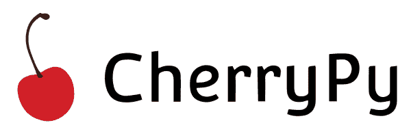
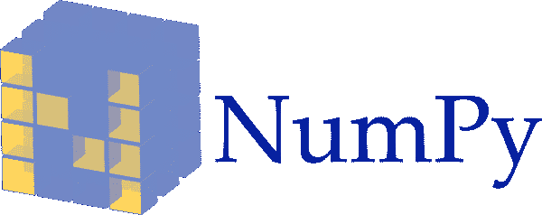
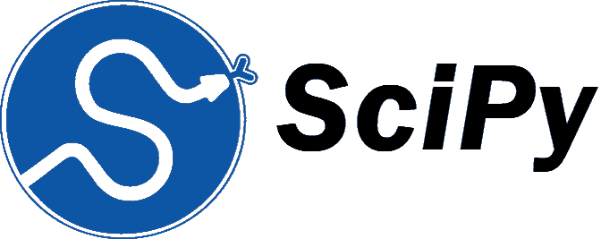
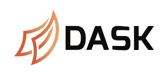

# Web 开发和数据科学的 16 个最佳 Python 框架

> 原文：<https://dev.to/x-team/16-best-python-frameworks-for-web-development-and-data-science-33aj>

除了 JavaScript 和 Java，Python 是当今最流行的编程语言之一。原因很容易理解:Python 易学易读。它允许您用最少的代码快速构建复杂的 web 应用程序。

此外，Python 越来越成为人工智能、机器学习和数据科学的首选语言。考虑到 Python 的语法几乎和数学语法一样接近，这种语言不仅被程序员使用，也被数学家、经济学家和统计学家使用。

下面是一些最流行的 Python 框架和工具的列表，分为两个主要应用:web 开发和人工智能、机器学习、数据科学。

## 用于 Web 开发的 Python

### 姜戈

*   [官方网站](https://www.djangoproject.com/) | [PyPi](https://pypi.org/project/Django/) | [GitHub](https://github.com/django/django)

Django 是一个全栈的高级 Python web 框架，允许开发人员快速高效地创建复杂的应用程序。它的一些关键特性包括身份验证机制、URL 路由、模板引擎、对象关系映射器(ORM)和数据库模式迁移。

Django 完全是从头开始编写的，不依赖于其他 Python 库。它的设计理念基于框架各层之间的松散耦合、尽可能少的代码、快速开发和尽可能少的冗余。

### 金字塔

*   [官方网站](https://trypyramid.com/) | [PyPi](https://pypi.org/project/pyramid/) | [GitHub](https://github.com/Pylons/pyramid)

Pyramid 是一个轻量级的 Python 框架，想把小的 web 应用做成大的 web 应用。除了扩展 web 应用程序之外，Pyramid 还非常适合为您的想法和从事 API 项目的开发人员制作原型。该框架已被 Mozilla、SurveyMonkey、Yelp 和 Dropbox 等科技巨头使用。

因为它是如此的轻量级，如果你刚开始，金字塔是一个很好的框架。但它的配置、扩展和附加系统允许该框架与您的应用程序无缝扩展。

### 涡轮齿轮

*   [官方网站](http://www.turbogears.org/) | [PiPy](https://pypi.org/project/TurboGears2/) | [GitHub](https://github.com/TurboGears/tg2devtools)

TurboGears 是一个 Python web 应用程序框架，旨在改进 Django 和 Rails 等其他 web 应用程序框架的局限性。它可以从单个文件应用程序开始，扩展到更复杂应用程序的全栈解决方案。

TurboGears 使用一个支持多数据库的 ORM，支持水平数据分区(分片)，一个新的小部件系统，使构建 AJAX 应用程序更容易，以及一个设计者友好的模板系统。

### Web2py

*   [官方网站](http://www.web2py.com/) | [PiPy](https://pypi.org/search/?q=web2py) | [GitHub](https://github.com/web2py/web2py)

Web2py 是一个用于数据库驱动的应用程序的全栈 Web 框架。它自带基于 web 的 IDE，包括代码编辑器、调试器和一键部署。

Web2py 跨平台工作。你可以在 Windows、Mac、Linux/Unix、Amazon EC2 和 Google App Engine 上运行它。它支持国际化和一个在错误发生时发出票证的票证框架。

### 瓶子

*   [官方网站](https://bottlepy.org/)|[PiPy](https://pypi.org/project/bottle/)|【GitHub[(【https://github.com/bottlepy/bottle】T5】)

Bottle 是一个快速轻量级的 WSGI Python 微框架。它在单个源文件中实现所有内容，除了 Python 标准库之外，它没有任何依赖关系。

Bottle 的默认特性包括基于 WSGI 标准的基本抽象、实用程序、模板和路由。网飞使用这个框架来构建它的网络界面。

### 烧瓶

*   [官方网站](http://flask.pocoo.org/) | [PiPy](https://pypi.org/project/Flask/) | [GitHub](https://github.com/pallets/flask)

Flask 是一个基于 Werkzeug 的 Python 微框架。它带有内置的开发服务器和调试器、集成的单元测试支持、RESTful 请求调度等等。

flask 100%符合 WSGI 1.0，并且是基于 Unicode 的。LinkedIn、Pinterest 等大公司都在用。

### 樱桃派

*   [官方网站](https://cherrypy.org/) | [PiPy](https://pypi.org/project/CherryPy/) | [GitHub](https://github.com/cherrypy/cherrypy)

CherryPy 是一个面向对象的 web 应用框架。它允许开发人员像构建任何其他面向对象的 Python 程序一样构建 web 应用程序。该框架于 2002 年首次发布，并一直保持快速和稳定。

CherryPy 支持的 web 应用程序是一个独立的 Python 应用程序，拥有自己的多线程 web 服务器。它可以在任何支持 Python 的操作系统上运行。

## 用于机器学习、人工智能和数据科学的 Python

Python 是人工智能、机器学习和数据科学的未来。尽管学术学者和研究人员连续多年使用 MATLAB，但他们现在已经转向 Python 及其优秀的数学库。Python 相对于它在数据科学领域的主要竞争对手的优势在于，Python 有一个庞大的社区，也可以用于 web 开发和自动化。

### NumPy

*   [官方网站](http://www.numpy.org/) | [PiPy](https://pypi.org/project/numpy/) | [GitHub](https://github.com/numpy/numpy)

NumPy 是使用 Python 进行科学计算的基础包。它支持大型多维数组，并拥有大量可以对这些数组进行操作的高级数学函数。

此外，NumPy 拥有用于集成 C/C++代码和 Fortran 代码的工具，并且可以处理线性代数、傅立叶变换和随机数功能。

### 图案

*   [官方网站](https://www.clips.uantwerpen.be/pattern) | [PiPy](https://pypi.org/project/Pattern/) | [GitHub](https://github.com/clips/pattern)

Pattern 是 Python 的 web 挖掘模块。它拥有用于抓取、自然语言处理(NLP)、机器学习、网络分析和可视化的工具。

该模块是免费的，附带了[大量的文档](https://www.clips.uantwerpen.be/resources)，并捆绑了 50 多个示例和 350 多个单元测试。

### Scikit-Learn

*   [官方网站](https://scikit-learn.org/) | [PiPy](https://pypi.org/project/scikit-learn/) | [GitHub](https://github.com/scikit-learn/scikit-learn)

Scikit-Learn 是一个非常快速的 Python 机器学习库。它的工具允许简单有效的数据挖掘和分析。

Scikit-Learn 的主要特性是回归、聚类、模型选择、预处理和分类。

### Keras

*   [官方网站](https://keras.io/) | [PiPy](https://pypi.org/project/Keras/) | [GitHub](https://github.com/keras-team/keras)

Keras 是一个神经网络库。它可以运行在 TensorFlow、微软认知工具包或 PlaidML 之上。对于那些开始机器学习之旅的人来说，它被认为是最好的工具之一，因为它比其他 ML 库更容易理解。

Keras 有四个主要原则:用户友好性、模块化、可扩展性和可计算性。但是，它没有其他 Python 库快。

### 幕府

*   [官方网站](http://shogun-toolbox.org/) | [PiPy](https://pypi.org/project/shogun-ml/) | [GitHub](https://github.com/shogun-toolbox/shogun)

幕府将军是一个用 C++编写的 ML 软件库，它提供了各种编程语言的接口，包括 Python。

它有各种各样的机器学习的统一方法，都是基于可理解的算法。它的主要焦点是支持向量机(SVM)。

### Cython

*   [官方网站](https://cython.org/) | [PiPy](https://pypi.org/project/Cython/) | [GitHub](https://github.com/cython/cython)

正如你可能从它的名字中猜到的那样，Cython 是 Python 的超集，旨在为主要用 Python 编写的代码提供类似 C 的性能。

它基于 Pyrex 的翻译器允许开发人员为 Python 编写 C 扩展。Cython 被认为是数学代码的最佳选择，并提供与 IPython 和 Jupyter 的集成支持。

*   [官方网站](https://www.scipy.org/) | [PiPy](https://pypi.org/project/scipy/) | [GitHub](https://github.com/scipy/scipy)

SciPy 是一个基于 Python 的数学、科学和工程开源软件生态系统。它包含优化、线性代数、积分、插值、ODE 求解器等模块。

它使用像 NumPy、IPython 和 Pandas 这样的包。如果你想在计算机上处理数字，并显示或发布结果，这是一个很好的图书馆。

### Dask

*   [官方网站](https://dask.org/) | [PiPy](https://pypi.org/project/dask/) | [GitHub](https://github.com/dask/dask)

Dask 为分析提供了先进的并行技术。它支持大规模性能，并与 NumPy、Pandas 和 Scikit-Learn 等项目相集成。

Dask 的调度程序允许您扩展到千节点集群。它的算法已经在世界上一些最强大的超级计算机上进行了测试。

### Numba

*   [官方网站](http://numba.pydata.org/) | [PiPy](https://pypi.org/project/numba/) | [GitHub](https://github.com/numba/numba)

Numba 是一个针对 Python 的优化编译器，它使用 LLVM 编译器基础设施将 Python 编译成 CPU 和 GPU 机器代码。

Numba 主要用于使用 NumPy 数组的科学研究。它在专门为 ML 或数据科学应用构建的硬件上工作得特别好。

* * *

这些是一些最流行的 Python 库和框架。如您所见，Python 是一种非常通用的语言。它在 web 开发、人工智能、数据科学和机器学习中的应用，以及它可理解和易读的语法，使它成为世界上最受欢迎的编程语言之一。

你用的是哪个 Python 框架？我错过了什么吗？请在下面的评论中告诉我！