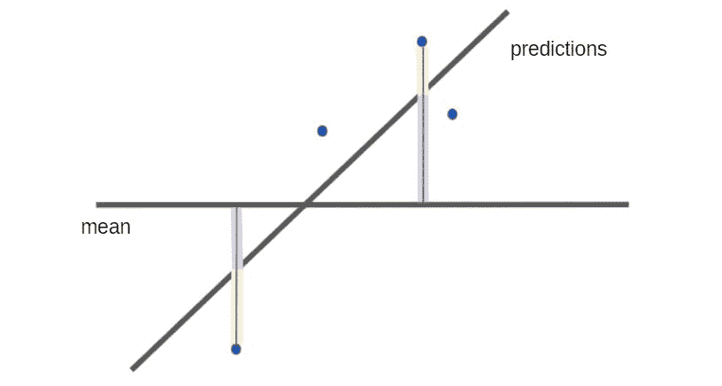
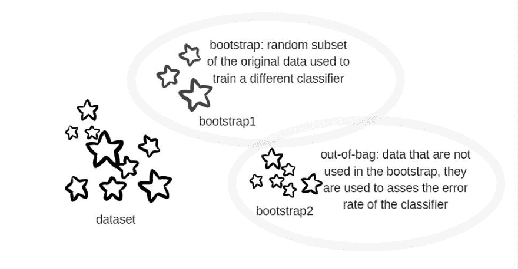
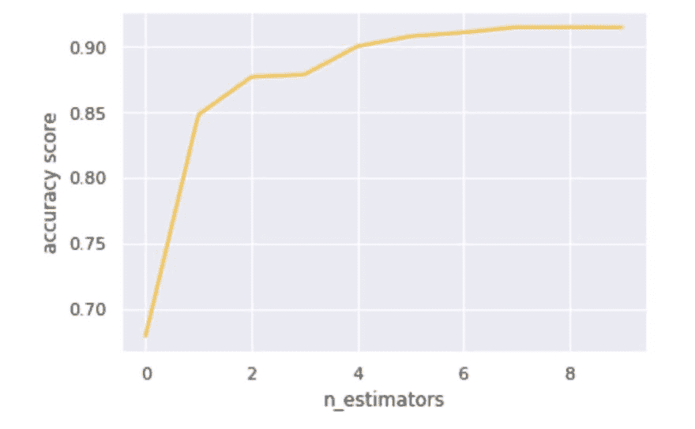

# 您想了解更多关于随机森林的信息吗？- fastai 第 2 课

> 原文:[https://dev . to/oya ne 806/do-you-want-to-learn-more-about-random-forests-fastai-lesson 2-5b ph](https://dev.to/oyane806/do-you-want-to-learn-more-about-random-forests-fastai-lesson2-5bph)

你好，

目前在跟 [fast.ai](http://course18.fast.ai/ml.html) 学习机器学习。这是第二课！

我把我的笔记分为四类:RMSE & R，决策树，一包小助推器，超参数调整。最好的学习方法是能够重新解释所有这些，并将这些新知识应用到 Kaggle 比赛中。

# [](#1-rmse-amp-r%C2%B2)1。RMSE & R

**RMSE** =残差的标准差。

[T2】](https://res.cloudinary.com/practicaldev/image/fetch/s--JRwEu1al--/c_limit%2Cf_auto%2Cfl_progressive%2Cq_66%2Cw_880/https://thepracticaldev.s3.amazonaws.com/i/jpwmikxw7006qn6o6xkw.gif)

残差是实际数据和预测数据之间的差值。在下图中是黄色的。每个残差都是平方的，这使得异常值的影响更强，并防止负残差和正残差相互抵消。

**R** 衡量与简单平均值相比，模型能在多大程度上解释数据。

[T2】](https://res.cloudinary.com/practicaldev/image/fetch/s--3NX9NONu--/c_limit%2Cf_auto%2Cfl_progressive%2Cq_66%2Cw_880/https://thepracticaldev.s3.amazonaws.com/i/t20zo8sffe2z3ix18yio.gif)

[T2】](https://res.cloudinary.com/practicaldev/image/fetch/s--X5JRZm4y--/c_limit%2Cf_auto%2Cfl_progressive%2Cq_auto%2Cw_880/https://thepracticaldev.s3.amazonaws.com/i/aur32j4yysevupikhbby.JPG)

SSres 是残差的平方和，在上图中用黄色表示。SStot 是与数据方差成比例的平方和，它们表示为上图中黄色和紫色部分的总和。

当 SSres 与 SStot 一样大(R 接近 0)时，这意味着该模型并不比用于预测的简单均值更好。

r 是你的模型有多好与朴素均值模型有多好的比率。

# [](#2-a-simple-decision-tree)2。简单的决策树

[T2】](https://res.cloudinary.com/practicaldev/image/fetch/s--2YvDG57J--/c_limit%2Cf_auto%2Cfl_progressive%2Cq_auto%2Cw_880/https://thepracticaldev.s3.amazonaws.com/i/eapo4irs9rn5rsrn6fsf.png)

一棵树由一系列二元决策组成。

该算法为每个变量(耦合器 _ 系统、外壳等)、该变量的每个可能值(< 0.1、< 0.2 等)计算两个新节点的加权平均值(此处为第一次分割 16815 x 0.414 + 3185 x 0.109)。它保留了最佳分数的变量和值。

# [](#3-bag-of-little-bootstraps)3。一包小靴子

为了改进一个简单的决策树，我们可以创建一个森林，使用一种叫做 bagging 的统计技术。关键是在不同的数据子集上构建多个模型，这些模型比什么都没有要好，并且其中的误差尽可能彼此不相关。

当取这些模型的平均值时，精确度优于简单决策树的精确度。

一个 **bootstrap** 是原始数据的一个随机子集，有时用替换来绘制。一些样本可能在每次分割中出现多次。这个想法是，一个 bootstrap 只包含整个观察集的一部分。Bootstrap 用于每次在不同的观察集合上训练不同的分类器。

未使用的部分形成**出袋**，可用于评估分类器的错误率。Set `oob_score=True`将为模型创建一个名为`oob_score_`的属性。这是非常有用的超参数调整。在这种情况下，不需要验证集。

[T2】](https://res.cloudinary.com/practicaldev/image/fetch/s--LyqhkKne--/c_limit%2Cf_auto%2Cfl_progressive%2Cq_auto%2Cw_880/https://thepracticaldev.s3.amazonaws.com/i/me7sj35oq0uyfht4400j.JPG)

在 scikit-learn 中，还有一个名为`ExtraTreeClassifier`的类，它是一个极度随机化的树模型。它不是尝试每个变量的每个分裂，而是随机尝试几个变量的几个分裂，这使得训练更快，并且可以建立更多的树——更好的泛化能力。

👉小贴士:先从 20 或 30 棵树开始，然后试着种 1000 棵树。

在下图中，我们可以看到预测精度随着随机森林中树木数量的增加而提高。

[T2】](https://res.cloudinary.com/practicaldev/image/fetch/s--LOIxTgRp--/c_limit%2Cf_auto%2Cfl_progressive%2Cq_auto%2Cw_880/https://thepracticaldev.s3.amazonaws.com/i/ov67uziehl4nyrkw3686.JPG)

# [](#4-hyperparameters-tuning)4。超参数调谐

`n_estimators=40`代表平均的树数。

`max_depth=3`表示决策树将只使用 3 级决策。

当一个叶子节点有 3 个或更少的样本时，它停止进一步训练树(在我们一直下降到 1 之前)。每一个树将会更好地概括，但是在它自己身上会稍微不那么强大。

👉提示:效果较好的数字是 1、3、5、10、25，但这是相对于整体数据集大小而言的。

这个想法是树与树之间的相关性越小越好。对于行采样，每个新树都基于一组随机的行。对于列采样，对于每个单独的二进制拆分，我们从不同的列子集中进行选择。在这种情况下，将只使用一半的列。

👉提示:可以使用的值是 1、0.5、log2 或 sqrt。

Scikit-learn 有一个名为 **grid-search** 的函数，它列出了您想要调整的所有超参数以及您想要尝试的这些超参数的所有值。它将在所有这些超参数的每个可能组合上运行模型，并告诉哪一个是最好的。

**训练集/验证集/测试集**:训练集用于训练模型，验证集用于调整超参数，测试集有助于在最后检查调整后的模型是否适用于未知数据

创建定型集和验证集有不同的方法:

*   制袋材料
*   k 倍交叉验证

[T2】](https://res.cloudinary.com/practicaldev/image/fetch/s--8uDUKUkG--/c_limit%2Cf_auto%2Cfl_progressive%2Cq_auto%2Cw_880/https://thepracticaldev.s3.amazonaws.com/i/rm10okii013boihnxzyl.JPG)

当处理一个新的数据项目时，我们希望快速迭代，如果运行模型需要超过 10 秒，那么创建一个数据子集是一个很好的实践。

```
X_train, _ = split_vals(df_trn, 20000)
y_train, _ = split_vals(y_trn, 20000) 
```

* * *

*可以在 Instagram 上关注我 [@oyane806](https://www.instagram.com/oyane806/) ！*