# 面向初学者的 AWS 静态网站托管第 2 部分:设置域名

> 原文:[https://dev . to/exam pro/AWS-static-website-hosting-for-初学者-part-2-setting-up-a-domain-4 jif](https://dev.to/exampro/aws-static-website-hosting-for-beginners-part-2-setting-up-a-domain-4jif)

### 注册域名-静态网站托管第二部分

这是面向初学者的静态网站托管的第 2 部分。在第一部分中，我们用 AWS 生成的 url 设置了一个基本网站。在这一节中，我们将把 URL 替换为我们自己的域。

如果你还没有这样做，请检查第 1 部分。

 [## 面向初学者的 AWS 静态网站托管第 1 部分

### ashwin🇨🇦5 月 19 日 1915 分钟阅读

#beginners #aws #career #webdev](/exampro/aws-static-website-hosting-for-beginners-5hl5)

要在 AWS 上托管您的静态站点，您需要做的第一件事是为它注册一个域。这可以通过多种不同的方式来实现。“注册”一个域名基本上意味着在一段特定的时间内拥有它的所有权。

我们使用的域名必须与我们将要托管的网站名称相匹配。例如，要在亚马逊 S3 上托管您的 example.com 网站，您可以创建一个名为 example.com 的存储桶。要在 www.example.com 的名下托管一个网站，你可以把这个桶命名为 www.example.com 的 T2。

*   在 AWS 控制台中，下拉“服务”表并导航至 53 号公路

[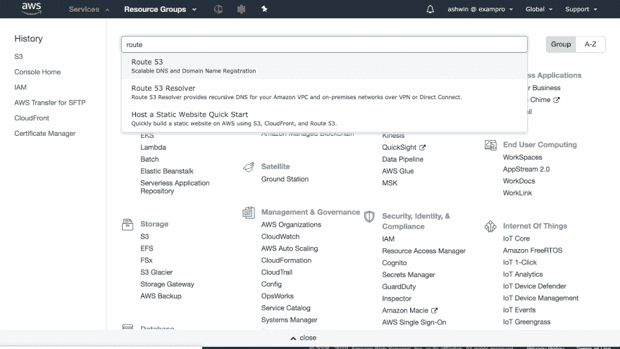T2】](https://res.cloudinary.com/practicaldev/image/fetch/s--sz4rpwJw--/c_limit%2Cf_auto%2Cfl_progressive%2Cq_auto%2Cw_880/https://s3.amazonaws.com/exampro/workshops/simg/register-domain/1.png)

* * *

*   如果你还没有域名，你可以直接从这里购买

*   键入您选择的域名，并选择一个 TLD(顶级域名),例如. com

*   检查以查看域的可用性

*   不同的 TLD 有不同的相关费用，例如网络对战忍者

[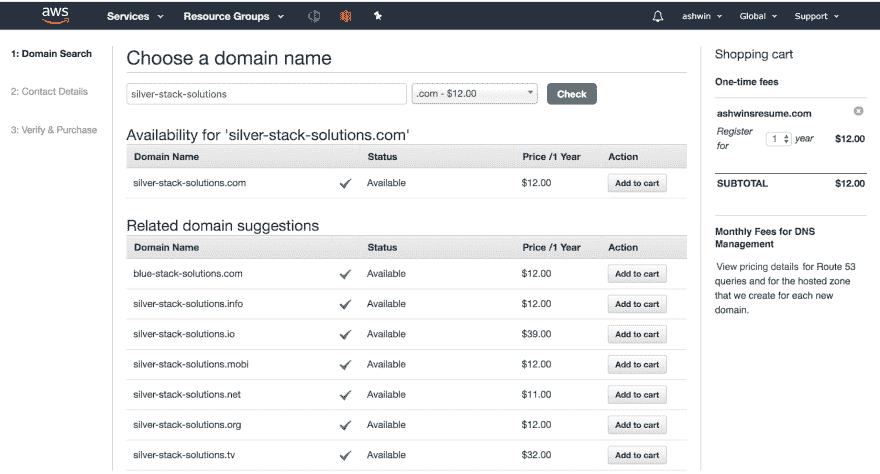T2】](https://res.cloudinary.com/practicaldev/image/fetch/s--XQRjLRtN--/c_limit%2Cf_auto%2Cfl_progressive%2Cq_auto%2Cw_880/https://s3.amazonaws.com/exampro/workshops/simg/register-domain/3.png)

* * *

*   一旦你找到一个你喜欢的可用域名，将其添加到你的 Route 53 购物车并点击“继续”

*   按照接下来的几个步骤，完成您的域名购买。

[T2】](https://res.cloudinary.com/practicaldev/image/fetch/s--B_bKOMUN--/c_limit%2Cf_auto%2Cfl_progressive%2Cq_auto%2Cw_880/https://s3.amazonaws.com/exampro/workshops/simg/register-domain/4.png)

* * *

*   它现在应该列在您的 route 53 控制台列表中

### 替代:从第三方域名提供商导入

如果你像我一样，从 freenom.com 或任何其他第三方域名提供商那里得到了一个域名，请做以下事情:

[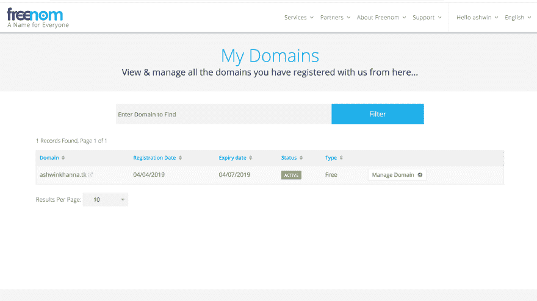T2】](https://res.cloudinary.com/practicaldev/image/fetch/s--shAaMFMw--/c_limit%2Cf_auto%2Cfl_progressive%2Cq_auto%2Cw_880/https://s3.amazonaws.com/exampro/workshops/simg/register-domain/8.png)

* * *

*   转到 53 号公路，选择“创建新的托管区域”

*   在表单字段中，输入您拥有的域名，例如“yourDomain.com”

*   将“类型”保留为 public 并创建

* * *

*   打开您的新托管区域并复制您的名称服务器值

[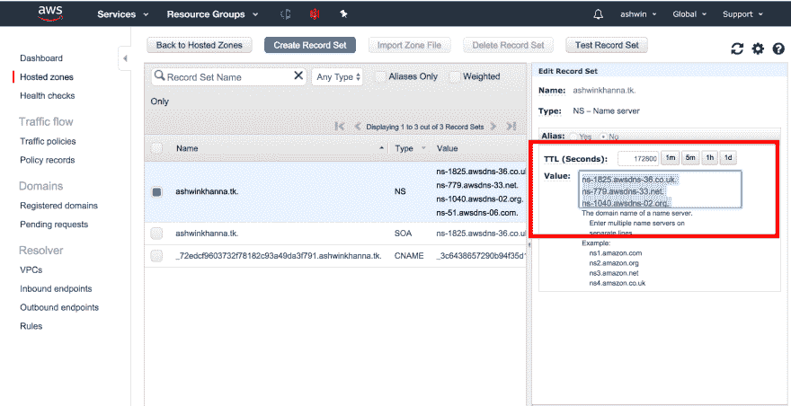T2】](https://res.cloudinary.com/practicaldev/image/fetch/s--KPJuJCtj--/c_limit%2Cf_auto%2Cfl_progressive%2Cq_auto%2Cw_880/https://s3.amazonaws.com/exampro/workshops/simg/register-domain/9.png)

* * *

*   将您的名称服务器值粘贴到域提供商自定义名称服务器设置中，以便可以在 AWS 托管区域中传递 DNS 解析

[T2】](https://res.cloudinary.com/practicaldev/image/fetch/s--hii7c1AV--/c_limit%2Cf_auto%2Cfl_progressive%2Cq_auto%2Cw_880/https://s3.amazonaws.com/exampro/workshops/simg/register-domain/10.png)

* * *

### 创建通配符证书

我们现在需要设置一个 SSL 证书，以便我们的域是安全的和经过验证的

* * *

*   在 AWS 控制台中搜索“ACM”，代表:AWS 证书管理器。这是保存所有 SSL 证书的地方。

* * *

*   单击“申请证书”

* * *

*   在随后的页面上，选择“请求公共证书”

[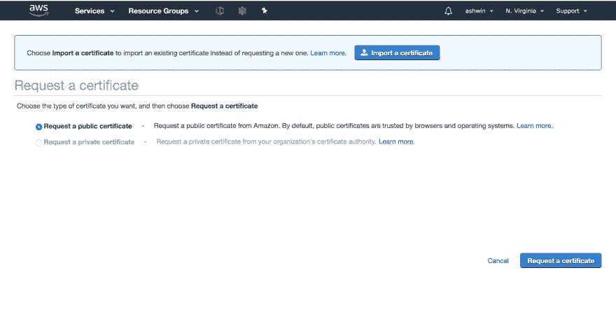T2】](https://res.cloudinary.com/practicaldev/image/fetch/s--grBYu4r_--/c_limit%2Cf_auto%2Cfl_progressive%2Cq_auto%2Cw_880/https://s3.amazonaws.com/exampro/workshops/simg/wildcard-acm/req-a-cert.png)

* * *

*   在域名文本字段中，我们将输入一个通配符域。输入您新购买的域名，但在前面加上

    `*.`

    ，例如*。silver-stack-solutions.com

*   通配符为您处理子域。这意味着

    `www.`

    将作为我们域名通配符的一部分来处理

*   提示:使用“添加另一个域”按钮，您可以添加保护多个域地址到一个单一的 ACM。通配符只保护您的域名及其前面的前缀。他们实际上并不保护裸域名，例如 silver-stack-solutions.com 不受保护，但是 www.silver-stack-solutions.com 受保护。我们将在本系列教程的后面部分更深入地了解这个概念，特别是在处理重定向时。

* * *

[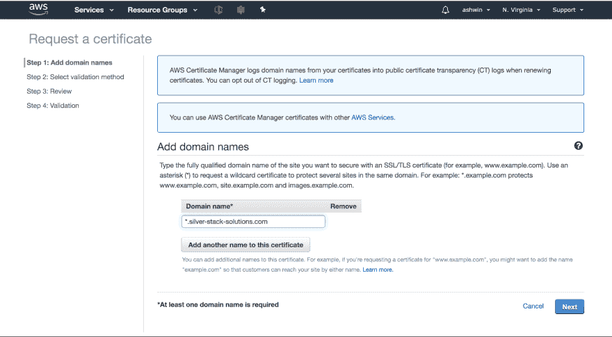T2】](https://res.cloudinary.com/practicaldev/image/fetch/s--3QvfNiOL--/c_limit%2Cf_auto%2Cfl_progressive%2Cq_auto%2Cw_880/https://s3.amazonaws.com/exampro/workshops/simg/wildcard-acm/acm-add-domain-name.png)

* * *

*   点击“下一步”

* * *

*   现在，您将进入一个显示两个选项的页面。选中“DNS 验证”

* * *

[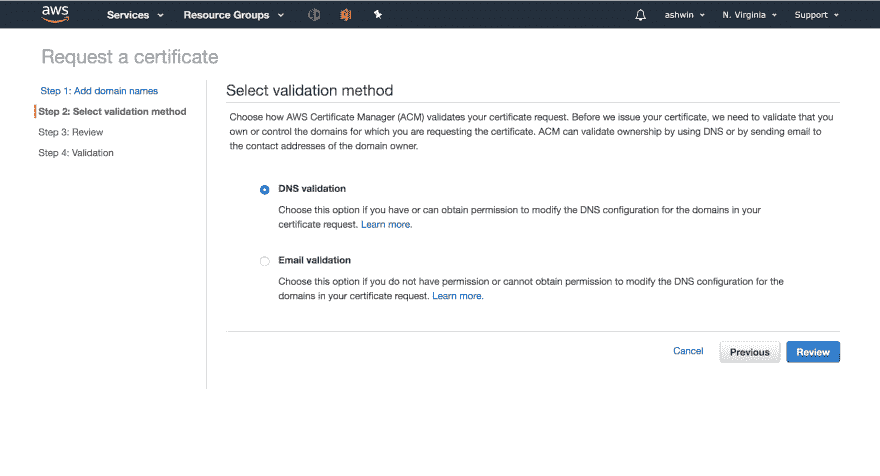T2】](https://res.cloudinary.com/practicaldev/image/fetch/s--54_9mRQk--/c_limit%2Cf_auto%2Cfl_progressive%2Cq_auto%2Cw_880/https://s3.amazonaws.com/exampro/workshops/simg/wildcard-acm/dns-validation.png)

* * *

*   继续并点击“回顾”

* * *

*   浏览您的详细信息后，在最后一个设置页面上单击“确认并请求”

* * *

[T2】](https://res.cloudinary.com/practicaldev/image/fetch/s--5Mrv5Ymw--/c_limit%2Cf_auto%2Cfl_progressive%2Cq_auto%2Cw_880/https://s3.amazonaws.com/exampro/workshops/simg/wildcard-acm/review.png)

* * *

[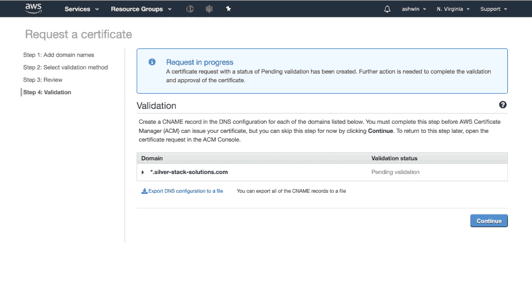T2】](https://res.cloudinary.com/practicaldev/image/fetch/s--eszE_-ak--/c_limit%2Cf_auto%2Cfl_progressive%2Cq_auto%2Cw_880/https://s3.amazonaws.com/exampro/workshops/simg/wildcard-acm/req-in-progress.png)

* * *

*   现在，您应该在 ACM 控制台中列出了您的通配符域，该域正在等待验证

* * *

### 验证域证书的所有权

* * *

*   从 ACM 控制台中选择您的证书，然后单击下拉箭头将其展开

*   您应该看到一个蓝色的大按钮，上面写着“在 53 号公路上创建记录”，单击它

    *   每个记录都包含关于您希望如何为一个域(如 example.com)或子域(如[www.example.com](http://www.example.com)或 test.example.com)路由流量的信息。记录存储在您的域的托管区域中。

[T2】](https://res.cloudinary.com/practicaldev/image/fetch/s--8JX0pHJy--/c_limit%2Cf_auto%2Cfl_progressive%2Cq_auto%2Cw_880/https://s3.amazonaws.com/exampro/workshops/simg/verify-acm/1.png)

* * *

*   将打开一个模式，显示您的域名验证 DNS 记录的详细信息

*   只需点击“创建”

[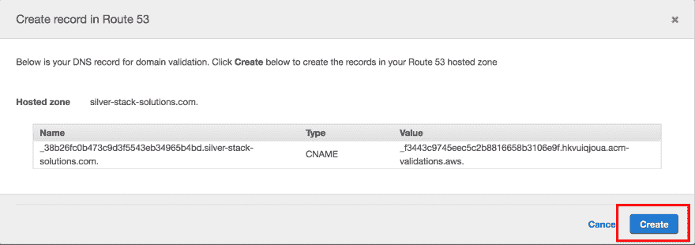T2】](https://res.cloudinary.com/practicaldev/image/fetch/s--H_UQuaSD--/c_limit%2Cf_auto%2Cfl_progressive%2Cq_auto%2Cw_880/https://s3.amazonaws.com/exampro/workshops/simg/verify-acm/2.png)

* * *

*   请耐心等待，因为这可能需要一点时间

*   最后，您应该有一个为您的域发布的 ACM。它应该在您的 ACM 控制台中列为状态:“已发布”

*   第二次重复该过程，并发布第二个 ACM，除了这一次，不要使用通配符，只使用裸域，即 yourDomain.com(或者如果您已经通过向现有证书添加另一个域来这样做，请跳过这一步)

* * *

*   拥有通配符 ACM 证书对于我们在 CloudFront 发行版中的下一步至关重要

## T2】

### 创建一个云锋分布

这将做两件事:让你的网站在世界任何地方都能快速加载，并允许你使用 HTTPS，HTTP 的安全版本。就像 S3 被组织成“桶”，CloudFront 被组织成“分布”。您需要为您的网站创建一个分发包，并将其指向您的 S3 存储桶，以便它可以使用您的 S3 存储桶的内容。

* * *

*   导航到 CloudFront

[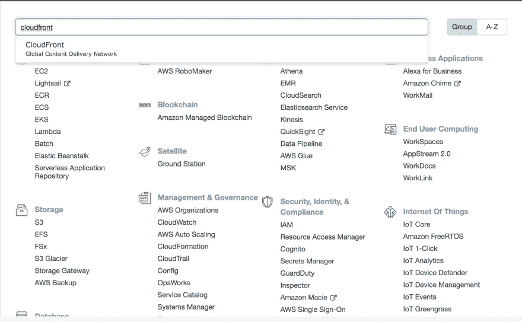T2】](https://res.cloudinary.com/practicaldev/image/fetch/s--MWioLhOx--/c_limit%2Cf_auto%2Cfl_progressive%2Cq_auto%2Cw_880/https://s3.amazonaws.com/exampro/workshops/simg/cloudfront/create-distribution/1.png)

* * *

*   点击“创建分销”按钮开始，并选择你想要一个网络分销，而不是 RTMP。

[T2】](https://res.cloudinary.com/practicaldev/image/fetch/s--bFhZzobG--/c_limit%2Cf_auto%2Cfl_progressive%2Cq_auto%2Cw_880/https://s3.amazonaws.com/exampro/workshops/simg/cloudfront/create-distribution/2.png)

* * *

*   您现在应该会看到一个包含多个配置选项的长表单。

*   选择“原始域名”下拉列表。

*   你应该看到你的 S3 水桶上市。不要选择其中任何一个

[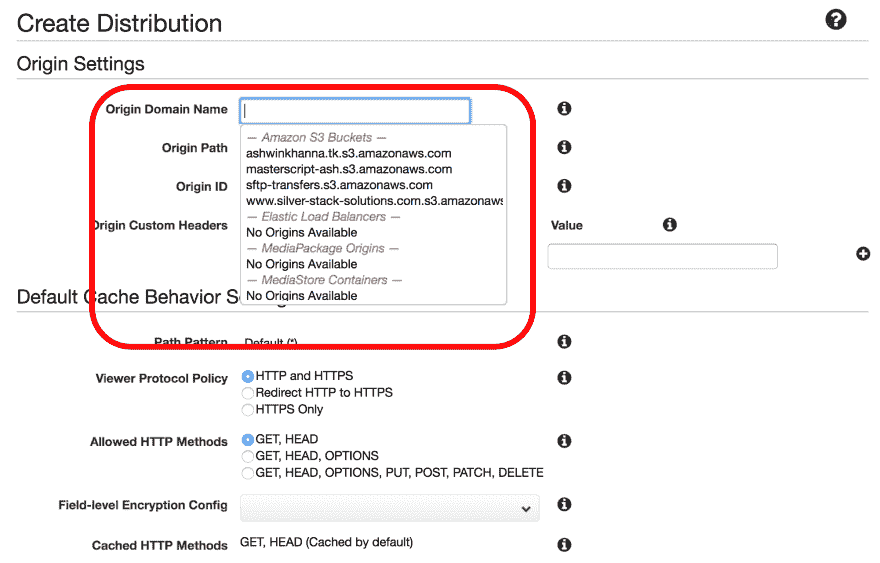T2】](https://res.cloudinary.com/practicaldev/image/fetch/s--YRNwKyXb--/c_limit%2Cf_auto%2Cfl_progressive%2Cq_auto%2Cw_880/https://s3.amazonaws.com/exampro/workshops/simg/cloudfront/create-distribution/3.png)

* * *

*   相反，您将需要复制您的 S3 桶的端点，位于 S3 属性选项卡下的静态网站托管

[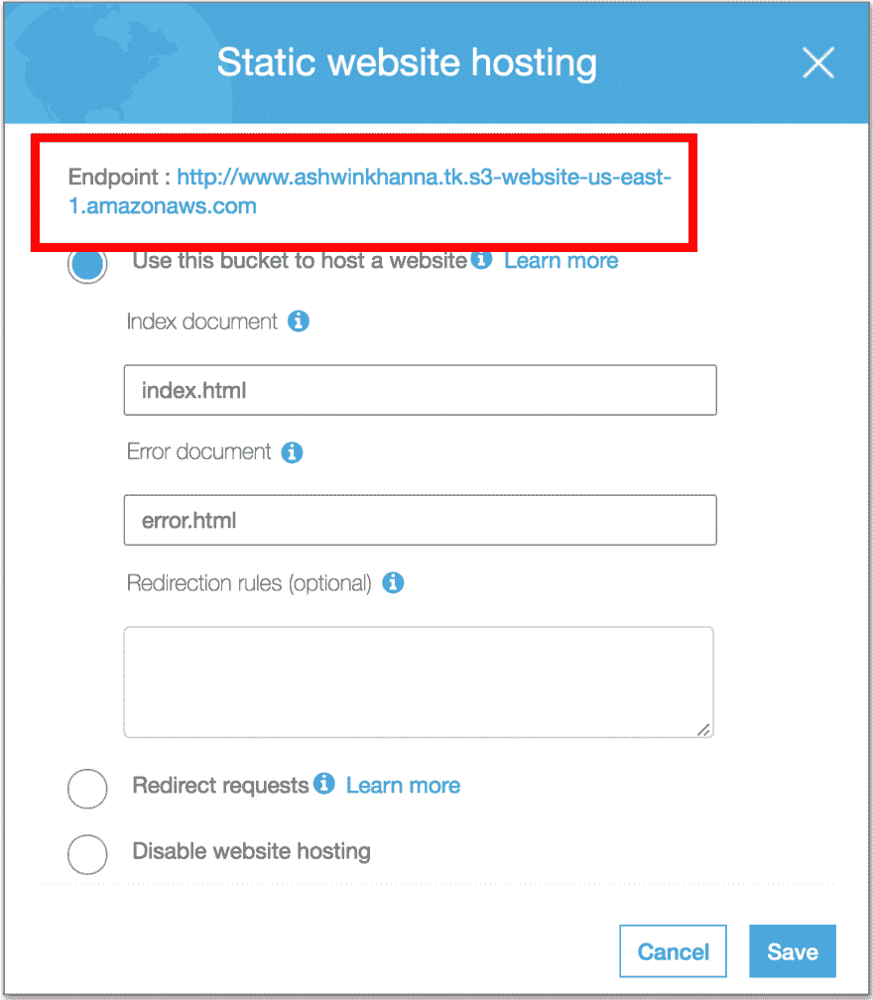T2】](https://res.cloudinary.com/practicaldev/image/fetch/s--uD6Wo0Jd--/c_limit%2Cf_auto%2Cfl_progressive%2Cq_auto%2Cw_880/https://s3.amazonaws.com/exampro/workshops/simg/cloudfront/create-distribution/4.png)

*   在属性的“静态网站托管”部分找到端点 URL，并将其粘贴到“原始默认名称”字段。删除端点前面的“http://”。来源 ID 文本字段将在文本字段中自动生成您的 S3 时段名称。

*   在“查看器协议策略”选项中，选中“将 HTTP 重定向到 HTTPS”

[T2】](https://res.cloudinary.com/practicaldev/image/fetch/s--Srsxq-SW--/c_limit%2Cf_auto%2Cfl_progressive%2Cq_auto%2Cw_880/https://s3.amazonaws.com/exampro/workshops/simg/cloudfront/create-distribution/5.png)

* * *

*   我们需要填写的下一个字段是“备用域名(CNAMEs)”

*   在 CNAME 字段中输入您的域名，例如，“ [www.ashwinkhanna.tk](http://www.ashwinkhanna.tk)

*   这应该与您的存储桶名称相匹配

*   在 CNAME 下面，我们需要将它与适当的 ACM 证书链接，选中“自定义 SSL 证书”选项

*   将列出一个包含所有 ACM 证书的下拉列表，选择合适的证书。如果你的 CNAME 有 [www](http://www) 。那么您应该选择我们在上一节中生成的通配符 ACM。

*   在下拉文本字段中，选择您新创建的公共通配符证书

[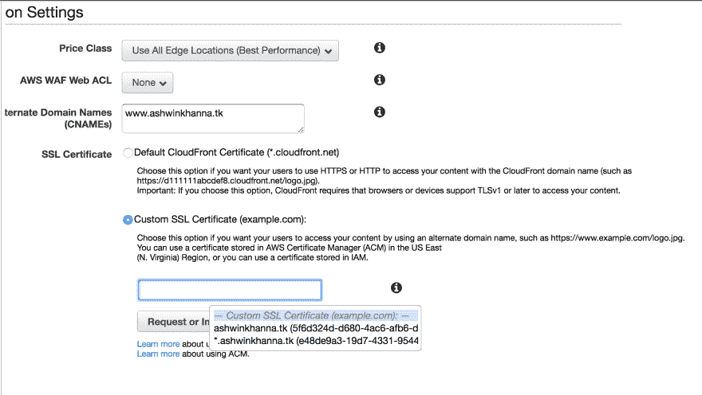T2】](https://res.cloudinary.com/practicaldev/image/fetch/s--35Jc08wA--/c_limit%2Cf_auto%2Cfl_progressive%2Cq_auto%2Cw_880/https://s3.amazonaws.com/exampro/workshops/simg/cloudfront/create-distribution/6.png)

* * *

*   进一步向下滚动表单，找到“默认根对象”字段，输入“index.html”

*   单击“创建分发”

[T2】](https://res.cloudinary.com/practicaldev/image/fetch/s--sEnFY2BK--/c_limit%2Cf_auto%2Cfl_progressive%2Cq_auto%2Cw_880/https://s3.amazonaws.com/exampro/workshops/simg/cloudfront/create-distribution/7.png)

* * *

*   回到你的 CloudFront 控制台。您现在应该可以看到正在进行的分发状态。部署可能需要 5 到 20 分钟，请耐心等待。

[T2】](https://res.cloudinary.com/practicaldev/image/fetch/s--sEnFY2BK--/c_limit%2Cf_auto%2Cfl_progressive%2Cq_auto%2Cw_880/https://s3.amazonaws.com/exampro/workshops/simg/cloudfront/create-distribution/7.png)

* * *

*   一旦进度完成，分发状态应该是“已启用”

[T2】](https://res.cloudinary.com/practicaldev/image/fetch/s--ME6LPkwC--/c_limit%2Cf_auto%2Cfl_progressive%2Cq_auto%2Cw_880/https://s3.amazonaws.com/exampro/workshops/simg/cloudfront/create-distribution/9.png)

* * *

### 点域到云锋

* * *

*   导航回 53 号公路，选择托管区

* * *

*   我们需要添加一个新的记录集来指向 CloudFront
*   点击“创建记录集”

[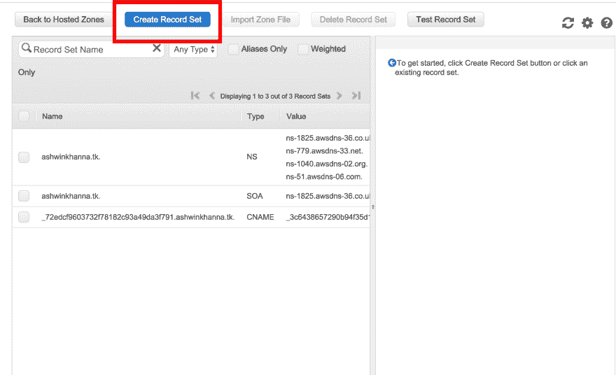T2】](https://res.cloudinary.com/practicaldev/image/fetch/s--HTujKeyY--/c_limit%2Cf_auto%2Cfl_progressive%2Cq_auto%2Cw_880/https://s3.amazonaws.com/exampro/workshops/simg/cloudfront/point-route53-cloudfront/1.png)

* * *

*   在“名称”文本字段中，用前缀 www 设置我们的域

*   在“类型”下拉字段中，选择“iPv4 地址”

*   下面有一个“别名”字段，有两个选项

    *   选择“是”
    *   这将导致“别名目标”字段出现
*   在这里，我们需要粘贴 cloudfront 域名，它将以. net 结尾

    *   要找到 cloudfront 域名，请转到 CloudFront 控制台，单击您新列出的发行版，您应该会被带到详细信息页面。从这里复制您的域名字段，并将其粘贴到“别名目标”

[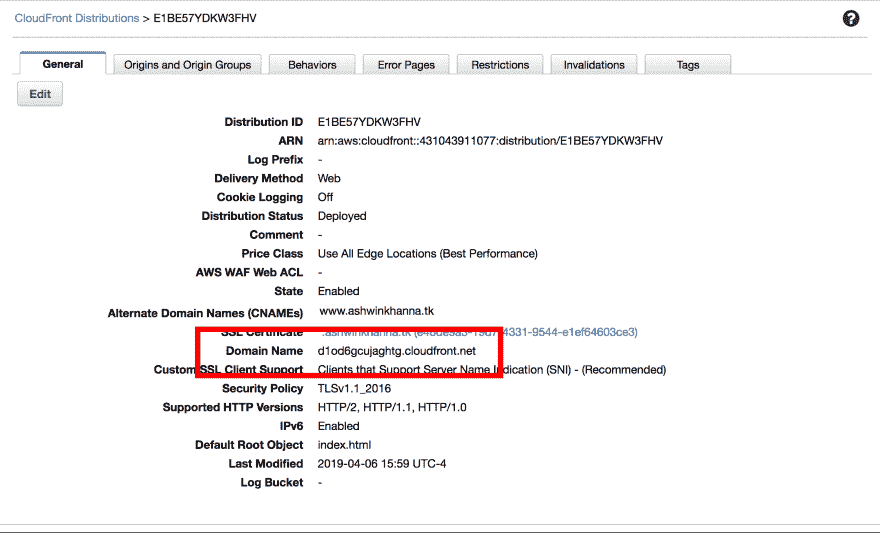T2】](https://res.cloudinary.com/practicaldev/image/fetch/s--QzlhAFMd--/c_limit%2Cf_auto%2Cfl_progressive%2Cq_auto%2Cw_880/https://s3.amazonaws.com/exampro/workshops/simg/cloudfront/point-route53-cloudfront/3.png)

*   “创建”新记录

[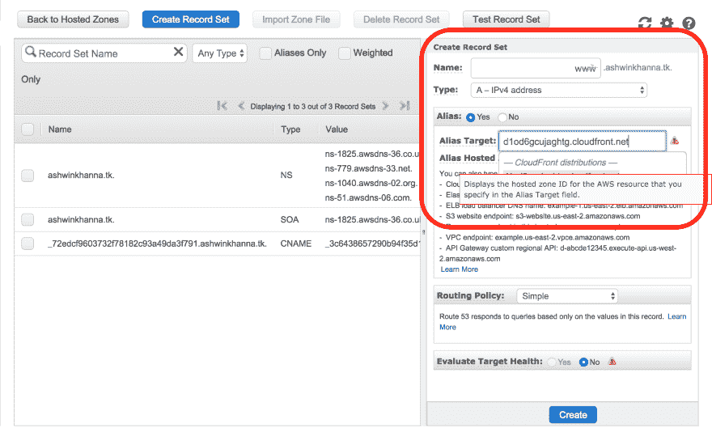T2】](https://res.cloudinary.com/practicaldev/image/fetch/s--wRlbtFDt--/c_limit%2Cf_auto%2Cfl_progressive%2Cq_auto%2Cw_880/https://s3.amazonaws.com/exampro/workshops/simg/cloudfront/point-route53-cloudfront/2.png)

* * *

*   这可能需要一点时间来创建，因为 DNS 使用一种称为缓存的技术来避免系统过载

*   在您的网络浏览器中输入您的域名

*   它应该会在 URL 的开头显示“https://”来打开您的网站

[T2】](https://res.cloudinary.com/practicaldev/image/fetch/s--uCVEeRg---/c_limit%2Cf_auto%2Cfl_progressive%2Cq_auto%2Cw_880/https://s3.amazonaws.com/exampro/workshops/simg/cloudfront/point-route53-cloudfront/4.png)

*   请注意，URL 现在是我们的域，而不是 AWS 为我们生成的旧域

* * *

### 结论

* * *

我希望这篇教程对读者有所帮助，并扩展了我的第一篇教程的内容。在未来，我还计划添加关于文件传输协议的教程，以便使用 AWS cli 和 Cloudfront 缓存失效将文件上传到 S3。

* * *