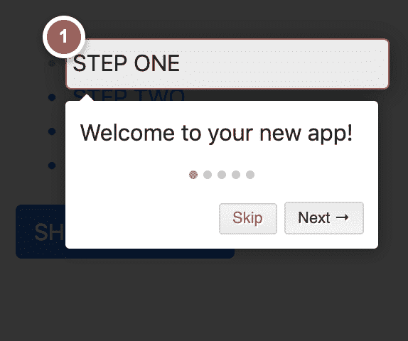

# 使用 Angular 中的 Intro.js 向用户展示如何使用您的应用程序

> 原文:[https://dev . to/dev Pato/show-how-to-use-your-app-with-step-by-step-by-guide-intro-js-in-angular-2f6k](https://dev.to/devpato/show-how-to-use-your-app-with-step-by-step-guide-with-intro-js-in-angular-2f6k)

使用 Intro 的分步指南和功能介绍。射流研究…

在 Angular 应用程序中开发新产品或新功能？如果你的答案是“是”，那么这篇教程就是为你准备的！

## 为什么使用 INTRO。JS？

当新用户访问您的网站或产品时，您应该使用分步指南演示您的产品功能。即使当你开发和/或添加一个新的特性到你的产品中，你也应该能够通过创建一个用户友好的解决方案向你的用户展示新的特性。Intro.js 的开发是为了让 web 和移动开发人员能够轻松地创建逐步介绍。

首先，我们从以下位置克隆回购应用程序:

[https://github.com/devpato/intro.js-Angular-INITIAL](https://github.com/devpato/intro.js-Angular-INITIAL)

1.  我们安装了 Intro.js & types NPM 包。

    `npm install intro.js @types/intro.js --save`

2.  在项目根目录下打开 angular.json 文件，然后添加 Intro.js CSS 和 js 文件。

```
 ...  ...  "styles":  [  "src/styles.scss",  "node_modules/intro.js/introjs.css"  ],  "scripts":  [  "node_modules/intro.js/intro.js"  ],  ...  ... 
```

<svg width="20px" height="20px" viewBox="0 0 24 24" class="highlight-action crayons-icon highlight-action--fullscreen-on"><title>Enter fullscreen mode</title></svg> <svg width="20px" height="20px" viewBox="0 0 24 24" class="highlight-action crayons-icon highlight-action--fullscreen-off"><title>Exit fullscreen mode</title></svg>

1.  将 Intro.js 导入到文件顶部的 **app.component.ts** 中。

    `javascript import * as introJs from 'intro.js/intro.js';`

2.  在同一个文件中，如下声明一个新变量:

    `javascript introJS = introJs();`

3.  现在，在同一个文件中，在 ngOnInit 中添加下面一行:

    `this.introJS.start();`

    您的文件应该如下所示:

```
 @Component({
             selector: 'app-root',
             templateUrl: './app.component.html',
             styleUrls: ['./app.component.scss']
          })
          export class AppComponent implements OnInit {
             introJS = introJs();
             constructor() {}

             ngOnInit() {
                this.introJS.start();
             }
          } 
```

<svg width="20px" height="20px" viewBox="0 0 24 24" class="highlight-action crayons-icon highlight-action--fullscreen-on"><title>Enter fullscreen mode</title></svg> <svg width="20px" height="20px" viewBox="0 0 24 24" class="highlight-action crayons-icon highlight-action--fullscreen-off"><title>Exit fullscreen mode</title></svg>

1.  现在，转到您的**app.component.html**文件，并更改下面一行:

    `<h1 id="step1">PAGE TITLE</h1>`

    至

    `<h1 id="step1" data-intro="Welcome to your new app!">PAGE TITLE</h1>`

2.  该运行我们的 angular 应用程序了。在终端中键入:

    `ng serve --o`

    你应该看到这样的东西:
    [](https://res.cloudinary.com/practicaldev/image/fetch/s--DtmFuoRo--/c_limit%2Cf_auto%2Cfl_progressive%2Cq_auto%2Cw_880/https://thepracticaldev.s3.amazonaws.com/i/yvojfih3q4cul6pab9x6.png)

    咿呀！！很棒吧？是时候做些有趣的事情了！

3.  返回到您的 **app.component.ts** 并在构造函数中添加以下代码。

```
 this.introJS.setOptions({
          steps: [
          {
             element: '#step1',
             intro: 'Welcome to your new app!',
             position: 'bottom'
          },
          {
             element: '#step2',
             intro: "Ok, wasn't that fun?",
             position: 'right'
          },
          {
             element: '#step3',
             intro: "let's keep going",
             position: 'top'
          },
          {
             element: '#step4',
             intro: 'More features, more fun.',
             position: 'right'
          }
       ],
       showProgress: true
      }); 
```

<svg width="20px" height="20px" viewBox="0 0 24 24" class="highlight-action crayons-icon highlight-action--fullscreen-on"><title>Enter fullscreen mode</title></svg> <svg width="20px" height="20px" viewBox="0 0 24 24" class="highlight-action crayons-icon highlight-action--fullscreen-off"><title>Exit fullscreen mode</title></svg>

1.  转到您的应用程序(您的服务器应该已经在运行)。您应该会看到类似这样的内容:

    [T2】](https://res.cloudinary.com/practicaldev/image/fetch/s--HZeNZ-8j--/c_limit%2Cf_auto%2Cfl_progressive%2Cq_auto%2Cw_880/https://thepracticaldev.s3.amazonaws.com/i/f94sf22we4obbzvf8dbx.png)

    点击这些步骤，你会看到 Intro.js 是如何施展它的魔力的。

    现在你在想:我如何手动显示步骤，而不是
    页面加载？

2.  将 Intro.js 导入到文件顶部的 **sidebar.component.ts** 中。

    `javascript import * as introJs from 'intro.js/intro.js';`

3.  就像我们之前做的一样，在 **sidebar.component.ts** 文件中，如下声明一个新变量:

    `javascript introJS = introJs();`

4.  在同一个文件中，在函数中添加以下步骤:
    **【startSteps()】**

    ```
     this.introJS
          .setOptions({
           steps: [
           {
             element: '#step1-li',
             intro: 'Welcome to steps on the sidebar!',
             position: 'bottom'
           },
           {
             element: '#step2-li',
             intro: "Ok, wasn't that fun?",
             position: 'right'
           },
           {
             element: '#step3-li',
             intro: "let's keep going",
             position: 'top'
           },
           {
             element: '#step4-li',
             intro: 'More features, more fun.',
             position: 'right'
           }
         ],
         hidePrev: true,
         hideNext: false
        })
        .start(); 
    ```

5.  现在，让我们添加一个调用 startSteps()函数的按钮。

`html <button class="btn btn-primary" (click)="startSteps()">SHOW ME
STEPS</button>`

你的**sidebar.component.html**应该是这样的

```
 <div class="sidebar-component">
    <ul>
      <li id="step1-li">
        STEP ONE
      </li>
      <li id="step2-li">
        STEP TWO
      </li>
      <li id="step3-li">
        STEP THREE
      </li>
      <li id="step4-li">
        STEP FOUR
      </li>
    </ul>
    <button class="btn btn-primary" (click)="startSteps()">SHOW ME 
    STEPS</button>
   </div> 
```

<svg width="20px" height="20px" viewBox="0 0 24 24" class="highlight-action crayons-icon highlight-action--fullscreen-on"><title>Enter fullscreen mode</title></svg> <svg width="20px" height="20px" viewBox="0 0 24 24" class="highlight-action crayons-icon highlight-action--fullscreen-off"><title>Exit fullscreen mode</title></svg>

上我们的 app 吧！点击蓝色按钮，上面写着“向我展示步骤”。

您将看到以下内容:

[T2】](https://res.cloudinary.com/practicaldev/image/fetch/s--sEzGprH5--/c_limit%2Cf_auto%2Cfl_progressive%2Cq_auto%2Cw_880/https://thepracticaldev.s3.amazonaws.com/i/nylv1nufojsq87skkw7c.png)

最后，您可能想知道如何在不同的组件之间设置步骤。

在你的 **sidebar.components.ts** 中，你有一系列
选项，添加这个选项。

```
 {  //  As  you  can  see,  thanks  to  the  element  ID  //  I  can  set  a  step  in  an  element  of  an  other  component  element:  '#step1',  intro:  'Accessed  and  element  in  another  component'  } 
```

<svg width="20px" height="20px" viewBox="0 0 24 24" class="highlight-action crayons-icon highlight-action--fullscreen-on"><title>Enter fullscreen mode</title></svg> <svg width="20px" height="20px" viewBox="0 0 24 24" class="highlight-action crayons-icon highlight-action--fullscreen-off"><title>Exit fullscreen mode</title></svg>

回到您的应用程序，再次单击蓝色按钮，并按照步骤查看最后一步如何跳转到不同组件中的主标题。

由于 Intro.js 将对象的元素属性字符串与 DOM 中元素的 ID 相匹配，这是可能的。

欲了解更多信息:

[https://introjs.com/](https://introjs.com/)
T3】https://github.com/usablica/intro.jsT5[https://introjs.com/docs/](https://introjs.com/docs/)

最终代码回购:
[https://github.com/devpato/intro.js-Angular-Final](https://github.com/devpato/intro.js-Angular-Final)

别忘了对教程表示点爱:)

[T2】](https://res.cloudinary.com/practicaldev/image/fetch/s--ZJtqNImH--/c_limit%2Cf_auto%2Cfl_progressive%2Cq_auto%2Cw_880/https://thepracticaldev.s3.amazonaws.com/i/5a87eog40zvcsimuaew4.png)