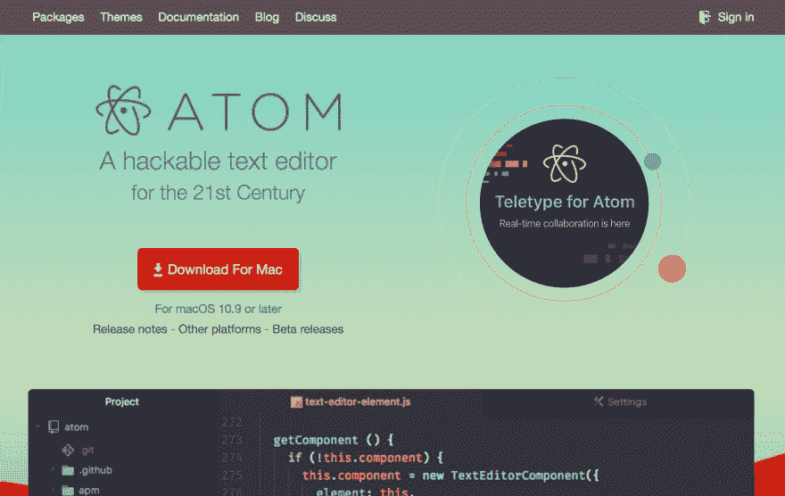
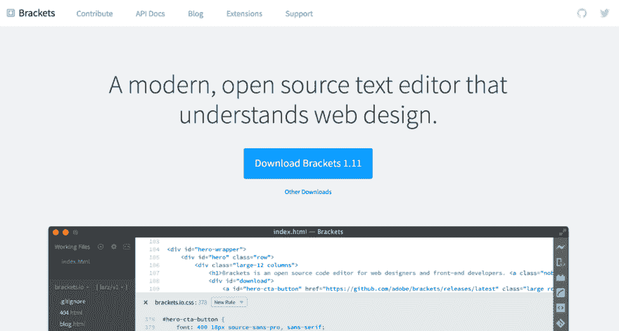
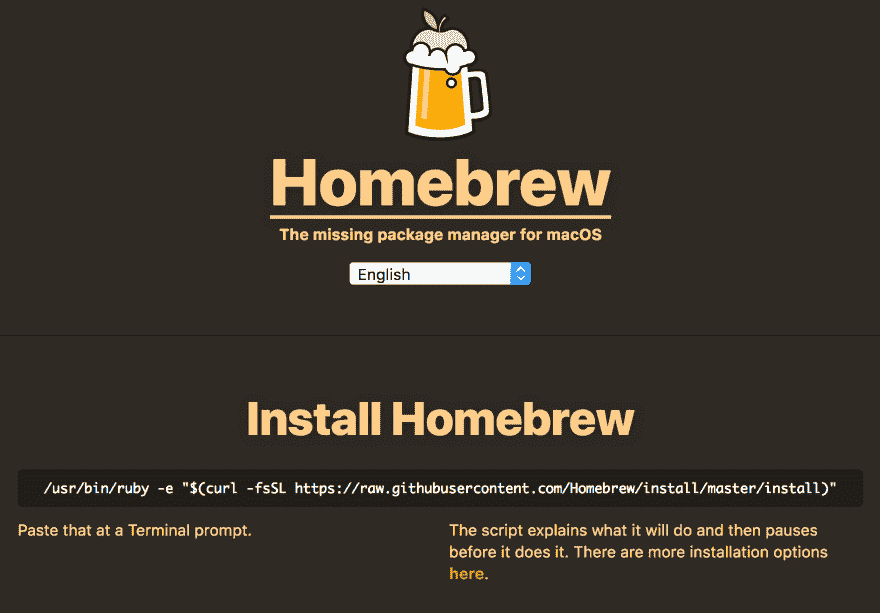
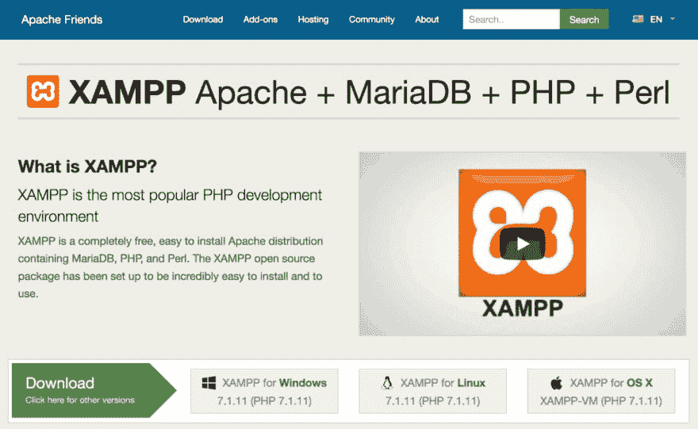
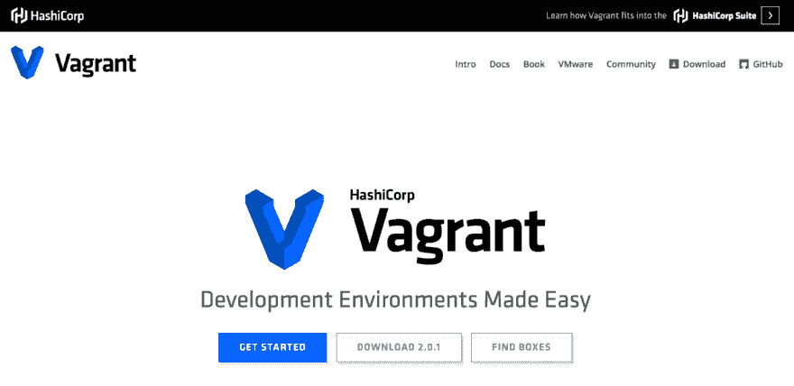
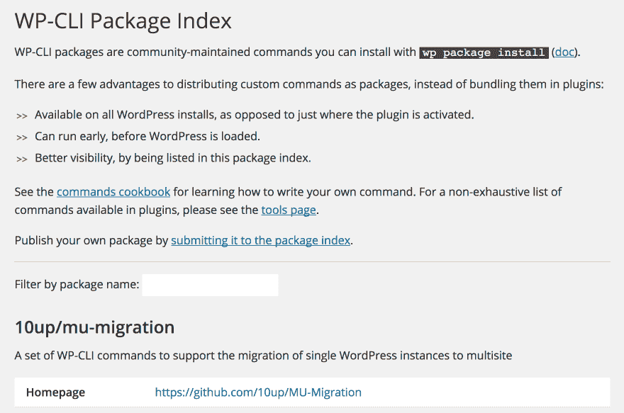
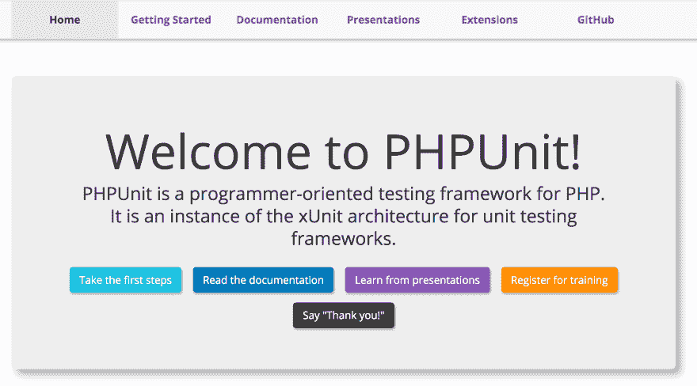
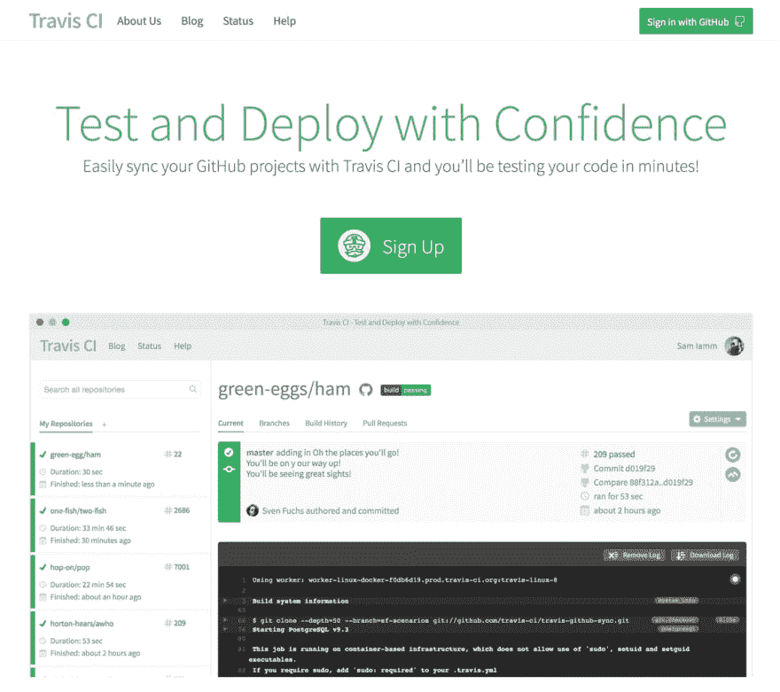

# 你应该在插件开发中使用的 9 个工具

> 原文:[https://dev . to/pagely/9-tools-you-should-use-in-your-plugin-development-566h](https://dev.to/pagely/9-tools-you-should-be-using-in-your-plugin-development-566h)

这是你应该用于插件开发的九个工具。一些是 WordPress 特有的，但是不管你开发什么，大多数都是可用的。

## 我们如何选择插件开发工具

插件开发是一件严肃的事情，不管你是在构建一个开源的还是其他的。任何使用你的插件的人都希望你的代码能够流畅、快速地运行，并且与他们的 WordPress 设置保持一致。

WordPress 标准有很多[和相当多的工具来帮助你更容易地满足它们。如果你了解了你所掌握的可能性，你就可以专注于用代码而不是在你的代码中解决问题*。*](https://make.wordpress.org/core/handbook/best-practices/coding-standards/php/)

我们对任何开发工具的标准是:

1.  背后有一个足够大的社区，如果出了问题，你可以得到帮助。
2.  现有教程解释了如何使用它。
3.  开发人员已经将其用于生产准备工作，而不仅仅是实验项目。
4.  可选地(但最好是)，至少有一两个杰出的 WordPress 开发者以某种方式支持它。

现在是时候看看在插件开发中应该使用什么工具了。通过为你的工作流程选择正确的解决方案，你将能够快速有效地生产出适合现代代码和 WordPress 标准的插件。

## 你应该在插件开发中使用的 9 个工具

我们将这九个工具分成了四个部分(编写、运行、自动化和测试代码)，它们应该是您工作流程的一部分。我们建议试用每种工具，看看哪种最适合您和您的项目。

无论您选择什么，所有这些都值得学习，以便您可以管理自己的开发人员工具箱。此外，下面的工具是完全免费使用的——就像我们之前关于基本 web 开发解决方案的文章一样。

### 编写代码:开源编码编辑器

从技术上讲，代码可以在任何纯文本编辑器中编写。然而，当使用专用的代码编辑器时，这样做更容易，因为它们提供了无数的功能来帮助加速您的工作。

在选择编码编辑器时，您会希望寻找一些特性，比如语法高亮、特定语言的代码片段和 [Git 同步](https://github.com/)。几年前，使用这些功能意味着支付额外费用。当然，你仍然可以找到一流的付费编辑，但现在可以零支出找到有竞争力的编辑。

#### 1\. [Atom](https://atom.io/)

 **[T2】](https://res.cloudinary.com/practicaldev/image/fetch/s--dR_Cp214--/c_limit%2Cf_auto%2Cfl_progressive%2Cq_auto%2Cw_880/https://pagely.com/wp-content/uploads/2017/11/atom.png)

[Atom](https://atom.io/) 是 [GitHub](https://pagely.com/kb/en/what-is-github/) 的开源、可黑客攻击的编辑器。它的设计使用户可以完全定制它，以满足他们的确切要求。它可以通过[社区‘包’](https://atom.io/packages)(想想插件)来扩展，这使你能够添加对非标准特性的支持。

即便如此，它仍然是一个令人印象深刻的开箱即用的工具。首先，有许多受支持的[操作系统(OS)](https://github.com/atom/atom/releases/tag/v1.22.1) 和包格式，以及一个用于查看项目文件的直观的文件系统浏览器。此外，还有一个智能自动完成工具来帮助您更快地编写代码，还有一个高级的“查找和替换”功能，这样您就可以在整个项目中快速更新相同的字符串。[广泛而全面的文档](https://atom.io/docs)概述了使用 Atom 的许多方面。

至于安装包，我们推荐一些特定于 WordPress 的包( [WordPress API](https://atom.io/packages/wordpress-api) 和[自动完成 WordPress 钩子](https://atom.io/packages/autocomplete-wordpress-hooks)，以及更多特定于代码的包，如[自动完成 PHP](https://atom.io/packages/atom-autocomplete-php) 和[自动完成 HTML](https://atom.io/packages/autoclose-html) 。

#### 2.[括号**T2】**](http://brackets.io/)

 **[T2】](https://res.cloudinary.com/practicaldev/image/fetch/s--bpxXcjYY--/c_limit%2Cf_auto%2Cfl_progressive%2Cq_auto%2Cw_880/https://pagely.com/wp-content/uploads/2017/11/brackets.png)

[括号](http://brackets.io/)是另一款出色的编辑器，由 Adobe 出品。此处的功能集侧重于实时编辑，使您能够在工作时查看浏览器中的实时更改。该工具提供了内嵌编辑器(使你能够在相关的代码片段之间跳转)和预处理器支持，来帮助渲染[【SCSS】](https://fileinfo.com/extension/scss)和 [LESS](http://lesscss.org/) 文件。

与 Atom 的包相比，[括号提供了“扩展”](https://registry.brackets.io/)。在我们看来， [WordPress 提示](https://github.com/Tusko/brackets-wp-hint/)是任何 WordPress 开发者必备的附加软件。最后，Brackets 有一个[专用的 wiki](https://github.com/adobe/brackets/wiki/Troubleshooting) 来帮助你启动和运行，并在你遇到困难时帮助你。

### 运行代码:本地开发程序

虽然在一个实时服务器上开发是可能的，但是这样做的效率是非常低的。最好将您的本地计算机设置为支持 PHP 和 MySQL，这样您就可以在实际网站上试用之前快速编写和测试代码。您可以选择手动配置您的计算机，或者使用程序自动管理服务器元素。除非您非常熟悉 Linux 服务器管理，否则第二个选项通常是最佳选择。

记住这一点，让我们来看看几个您可能感兴趣的解决方案。

#### 3.[家酿](https://brew.sh/)(仅限 macOS)

[T2】](https://res.cloudinary.com/practicaldev/image/fetch/s--P5WwQhwb--/c_limit%2Cf_auto%2Cfl_progressive%2Cq_auto%2Cw_880/https://pagely.com/wp-content/uploads/2017/11/homebrew.png)

简而言之，[包管理器](https://mallinson.ca/osx-web-development/)帮助你建立你自己的本地服务器开发，而不依赖于你计算机的默认设置。它们从终端运行，使您能够快速下载和配置不同的服务器包(如 PHP 和 MySQL)以在您的计算机上运行。

[家酿](https://brew.sh/)是 Mac 用户首选的软件包管理器。主页简明扼要地概述了软件包管理器的工作，但简而言之，它安装了超过[4000 个文件](https://github.com/Homebrew/homebrew-core/tree/master/Formula)，这些文件是你在电脑上开发时需要的。该脚本本身非常用户友好，将引导您完成安装过程。

对于 Windows 用户来说， [Scoop](http://scoop.sh/) 是平台对自制软件的回应，而[命令行可以用来](https://siglarblog.wordpress.com/2016/10/19/installing-web-server-on-windows-10/)快速安装必要的组件。

#### **4。** [**XAMPP**](https://www.apachefriends.org/index.html)

[T2】](https://res.cloudinary.com/practicaldev/image/fetch/s--dFTVONSJ--/c_limit%2Cf_auto%2Cfl_progressive%2Cq_auto%2Cw_880/https://pagely.com/wp-content/uploads/2017/11/xampp.png)

XAMPP 是一个常年的服务器分发计划，使你能够运行一个独立的服务器，并在其上进行本地开发。有一些变化(包括为各种平台设计的 [WAMP](https://bitnami.com/stack/wamp/installer) 、 [MAMP](https://www.mamp.info/en/) 和[灯](https://bitnami.com/stack/lamp/installer))，但 XAMPP 提供了最大的性价比。

你可以很快建立并运行一个本地的 WordPress 环境，一个主要的好处是 XAMPP 提供了一个接近服务器的体验，同时给你灵活性来调整你的安装以满足你的需求。

#### **5。** [**流浪汉**](https://www.vagrantup.com/)

[T2】](https://res.cloudinary.com/practicaldev/image/fetch/s--zamrgAiC--/c_limit%2Cf_auto%2Cfl_progressive%2Cq_auto%2Cw_880/https://pagely.com/wp-content/uploads/2017/11/vagrant.png)

对于那些希望将 WordPress 开发提升到下一个层次的人来说，[vagger](https://www.vagrantup.com/)提供了比其他选项更好的服务器环境控制。设置是一个稍微复杂一点的[，但是对于大多数开发人员来说不应该遥不可及。](https://premium.wpmudev.org/blog/vagrant-wordpress-test-environment/)

vagger 的主要好处是为您提供微调设置的能力，以确保在各种不同的服务器设置上的广泛兼容性。根据你的项目，这对于获得一个稳定可靠的插件来说是非常宝贵的。

#### **6。**[**desktop server**](https://serverpress.com/)

[T2】](https://res.cloudinary.com/practicaldev/image/fetch/s--M3YN1Y9U--/c_limit%2Cf_auto%2Cfl_progressive%2Cq_auto%2Cw_880/https://pagely.com/wp-content/uploads/2017/11/desktopserver.png)

本部分的最后一个工具是[桌面服务器](https://serverpress.com/)。这是一种新型的本地开发工具，本质上是一个完整的 WordPress 安装程序，可以在几秒钟内部署。它是跨平台的，基础版完全免费。

与 XAMPP 相比，DesktopServer 有许多更先进的功能，包括测试收发电子邮件的方式。然而，它仍然非常简单易用。我们建议通读[详细文档](http://docs.serverpress.com/),以便快速使用该工具。

### 自动化代码:终端包

如果你真的想把你的开发提升到一个新的水平，你应该考虑终端包。终端(或“命令行”)起初可能看起来令人生畏，因为它缺乏熟悉的图形用户界面(GUI)。然而，它可以节省您几个小时的时间，同时通过自动化改进您的代码结构。

例如，可以帮助[【scaffold】](https://developer.wordpress.org/cli/commands/scaffold/)一个项目(例如，使用起始代码生成必要的插件文件)，并允许使用定制的默认设置快速创建新网站。你也可以进行一般的 WordPress 管理，并测试你的代码是否符合 WordPress 自己的标准。我们来看看一些解决方法。

#### **7。** [**WP-CLI**](http://wp-cli.org/)

[T2】](https://res.cloudinary.com/practicaldev/image/fetch/s--oYoWvcDK--/c_limit%2Cf_auto%2Cfl_progressive%2Cq_auto%2Cw_880/https://pagely.com/wp-content/uploads/2017/11/wp-cli.png)

如果你经常创建新的 WordPress 站点来测试你的插件， [WP-CLI](http://wp-cli.org/) 是加速你开发工作流程的必备工具。像包管理器一样，WP-CLI 是一个命令行工具，使您能够在终端中运行脚本。不同的是，WP-CLI 是专门针对 WordPress 相关任务的。

有相当多的命令可以让你在没有浏览器的情况下从头开始安装 WordPress，导入和导出数据库，搜索和替换数据库值，甚至管理插件和主题。甚至有一些命令可以和[许多流行的 WordPress 插件](https://make.wordpress.org/cli/handbook/tools/)一起工作。此外，[安装只需](http://wp-cli.org/#installing)几分钟。

一旦你启动并运行了 WP-CLI，你可以通过使用 [WP-CLI 社区包](http://wp-cli.org/package-index/)完成更多工作:

[T2】](https://res.cloudinary.com/practicaldev/image/fetch/s--F3fl6GCG--/c_limit%2Cf_auto%2Cfl_progressive%2Cq_auto%2Cw_880/https://pagely.com/wp-content/uploads/2017/11/wp-cli-package.png)

这些基本上是用于特定任务的附加命令。我们最喜欢的与[“代码林挺”](https://github.com/wpup/wp-cli-lint)有关，因为它检查你的代码，自动纠正简单的格式错误以符合 WordPress 的标准，并让你知道还有什么需要你手动修复。

你可以在 [WP-CLI 包索引](http://wp-cli.org/package-index/)查看所有可用的社区包，每个包都有自己专用的安装说明，所以一定要仔细遵循。

### 测试代码:编写测试脚本

编写像预期的那样没有错误地工作的插件听起来像是一个白日梦，尽管它不像听起来那么遥不可及。虽然创造一个完全完美的软件产品是不可能的，但是推出一个相当可靠的软件产品是有可能的。

编写测试驱动的代码意味着你包含的每一个特性都要经过一系列的测试和数据试验，看看它的反应如何。如果您添加了一段新代码，并且出现了问题，您可以立即得到通知，并在最初的开发阶段纠正问题。当然，有一些代码测试选项你可以集成到你的 WordPress 插件中。我们来看两个。

### **8。** [**PHPUnit**](https://phpunit.de/)

[T2】](https://res.cloudinary.com/practicaldev/image/fetch/s--x_Xj4k0---/c_limit%2Cf_auto%2Cfl_progressive%2Cq_auto%2Cw_880/https://pagely.com/wp-content/uploads/2017/11/phpunit.png)

[PHPUnit](https://phpunit.de/) 是一个基于 PHP 的代码的测试框架工具，比如 WordPress。为了弄清楚它是如何与你的代码联系起来工作的，并理解这个概念，你可能想在进入 WordPress 特有的工作之前写一个[几个简单的测试](https://phpunit.de/getting-started.html)。

著名的 WordPress 开发者 Pippin Williamson 写了一整本关于如何将 PHPUnit 集成到你自己的插件中的指南。你可以按照他的一步一步的指导去做，这样你就知道你的插件在压力下会表现得很好。从那以后，你可能想要仔细阅读[丰富的文档](https://phpunit.de/documentation.html)，以了解你需要知道的关于这个工具的一切。

#### **9。** [**特拉维斯词**](https://travis-ci.org/)

[T2】](https://res.cloudinary.com/practicaldev/image/fetch/s--vT-U1bj_--/c_limit%2Cf_auto%2Cfl_progressive%2Cq_auto%2Cw_880/https://pagely.com/wp-content/uploads/2017/11/travis-cl.png)

Travis CI 是 PHPUnit 的补充[工具，当您提交对](https://docs.travis-ci.com/user/languages/php/) [GitHub](https://github.com/) 的更改时，它会自动运行您的测试。它对所有开源项目都是免费的，将帮助您确保您的代码不会在各种服务器环境下崩溃。

该工具基于持续集成(CI)工作，本质上是频繁实现的小代码合并，而不是不规则的大规模提交。测试过程将在虚拟服务器中克隆您的 [GitHub](https://pagely.com/kb/en/what-is-github/) 存储库，执行一些构建和测试，如果代码通过，然后将它部署到您的服务器上。在掌握该工具时，[在线文档](https://docs.travis-ci.com/user/getting-started/)将是你的朋友，无论你的专业水平如何，都值得一读。

## 结论

让您的技能与现代开发工具保持同步可以让您保持竞争力，同时改进您自己的工作。通过在工作流程中采用这些工具，您可以显著改进您的插件开发。

在现代开源编辑器、本地服务器环境、终端包和代码测试之间，有相当多的工具可以帮助你提高 WordPress 插件代码的质量。我们最喜欢的一些包括 [Atom](https://atom.io/) 、 [DesktopServer](https://serverpress.com/) 、 [WP-CLI](http://wp-cli.org/) 和 [PHPUnit](https://phpunit.de/) 。****