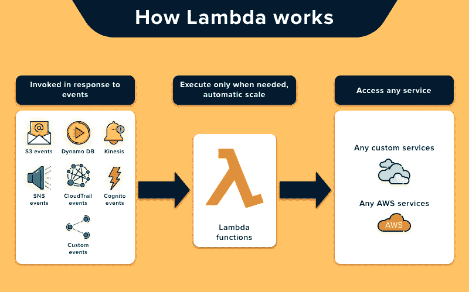

# 无服务器终极(入门)指南

> 原文：<https://dev.to/johndemian/the-ultimate-basic-guide-to-serverless-527f>

在过去的几年里，我一直在与 Dashbird 的一群令人敬畏的人一起工作，在那里我们每天醒来，通过为无服务器社区面临的当前问题创建解决方案，使无服务器技术变得更好。我已经写了几十篇关于好处、问题和为什么你应该选择无服务器以及如何使它工作得更好的不同理由的文章。本文将总结开始使用无服务器时需要知道的一切。

让我们从最开始说起:

## 什么是无服务器

就定义而言，无服务器通常被认为是功能即服务(FaaS)。那不完全正确。无服务器是如此之多。它应该被看作是一个基于事件的运行代码的系统。也就是说，您使用各种服务来创建业务逻辑，而不关心任何服务器。你把基础设施完全抽象化了。完美的例子可以是在 S3 上托管静态网站，使用无服务器数据库，如 DynamoDB 或 Aurora Serverless，当然，运行代码而不用 Lambda 管理服务器。

如果您有突然的流量高峰，需要立即检测和处理，无服务器是伟大的。如果完全没有流量，应用程序甚至会完全关闭。您只需为您使用的资源付费。没有使用，没有成本，相当简单！

[](https://res.cloudinary.com/practicaldev/image/fetch/s--0m9IuI5W--/c_limit%2Cf_auto%2Cfl_progressive%2Cq_auto%2Cw_880/https://www.cleveroad.cimg/article-previews/how-works-3.png)
Cleveroad.com的形象

## 无服务器服务提供商

这里有一些最流行的无服务器平台，可以帮助开发者了解当前可用的选项

## [1。AWSλ](https://aws.amazon.com/lambda/)

## [2。微软 Azure](https://azure.microsoft.com/en-us/)

## [3。谷歌应用引擎](https://cloud.google.com/appengine/)

## [4。谷歌云功能](https://cloud.google.com/functions/)

## [5。IBM OpenWhisk](https://console.bluemix.net/openwhisk/)

要了解每个平台的更多信息，请查看[这篇](%E2%80%9Dhttps://dashbird.io/blog/serverless-platforms-2018/%E2%80%9D)帖子。

## 无服务器入门

开始在无服务器上工作几乎不费吹灰之力。虽然有许多服务可供选择，但我将讨论 AWS 和 AWS Lambda，以使我们双方的事情更容易。我将从描述 AWS Lambda 的局限性开始，这样你将确切地知道你能推动你的系统到什么程度。

功能内存分配:128 MB 到 3，008 MB，增量为 64 MB。
函数超时:900 秒(15 分钟)
函数环境变量:4 KB
函数基于资源的策略:20 KB
函数层数:5 层
函数突发并发:500 - 3000(因地区而异)
调用负载:6 MB(同步)/ 256 KB(异步)
部署包大小:50 MB(压缩)或 250 MB(未压缩)
/tmp 目录存储:512 MB
执行进程/线程

既然我们已经解决了这个问题，让我们进入下一部分。

## 如何创建一个简单的 Lambda 函数

有两种方法可以做到这一点，一种是通过 AWS 接口直接上传您的代码，这是一种不错的方法，但让我们面对它，对于一个拥有多个微服务的大项目，您将无法做到这一点，这些微服务有许多小功能。
因此，虽然一个一个上传功能还可以，但你需要的是一个平台，让你能够连接到 AWS(或任何其他服务提供商)，并利用它来充分利用无服务器技术提供的一切。

## 无服务器平台

虽然名字令人困惑，但无服务器平台是构建、开发和扩展无服务器应用程序的绝佳方式。它是免费使用的，围绕它的社区支持真的令人难以置信。

当选择一个无服务器框架时，有许多不同的方法可以选择，除了拥有超过 25000 个 github stars 和作为部署无服务器应用程序的头号工具，我推荐无服务器技术，因为它的云无关方法。虽然我不一定患有供应商锁定综合症，但每个人都在抱怨，我喜欢这个想法，即能够在许多不同的服务上部署，而不必跨越障碍、障碍和中间的一切。

设置项目非常简单，一旦在您的系统上安装了无服务器，您就可以使用:
来初始化无服务器框架

```
serverless login 
```

这将让你设置并登录到 AWS，然后你可以开始发布你的 Lambdas。从现在开始，您可以从头开始构建您的应用程序，或者使用任何一个样板文件。

```
serverless create --template aws-nodejs --path sls-express-mongodb 
```

这将安装和预配置您需要的几乎所有东西，以便在一个可以有效支持您的整个应用程序的强大 API 上有一个良好的开端。

这里列出了一些很棒的教程，可以帮助您立即开始使用无服务器:

### 1.[使用 AWS Lambda 和 AWS SES 构建无服务器联系表单](%E2%80%9Dhttps://dashbird.io/blog/building-a-serverless-contact-form-with-aws-lambda-and-aws-ses/%E2%80%9D)

### [2。使用 AWS 的无服务器-使用 Lambda 和 S3 动态调整图像大小](%E2%80%9Dhttps://dashbird.io/blog/a-crash-course-on-serverless-with-aws-image-resize-on-the-fly-with-lambda-and-s3/%E2%80%9D)

### [3。Express 和 MongoDB 的无服务器 API 速成班](%E2%80%9Dhttps://dashbird.io/blog/a-crash-course-on-serverless-apis-with-express-and-mongodb/%E2%80%9D)

### [4。在 15 分钟内创建您的第一个无服务器网站](%E2%80%9Dhttps://dashbird.io/blog/create-your-first-website-in-15-minutes/)

### [5。带 AWS 的无服务器-使用 SNS 消息触发 Lambda](%E2%80%9Dhttps://dashbird.io/blog/a-crash-course-on-serverless-with-aws-triggering-lambda-with-sns-messaging/%E2%80%9D)

好的，这就是我所知道的关于这个主题的全部内容，但是因为有太多的更新，我会尽量保持更新。如果你认为缺少任何资源，请在 twitter [@johndemian](https://dev.to/johndemian) 上给我提个醒。