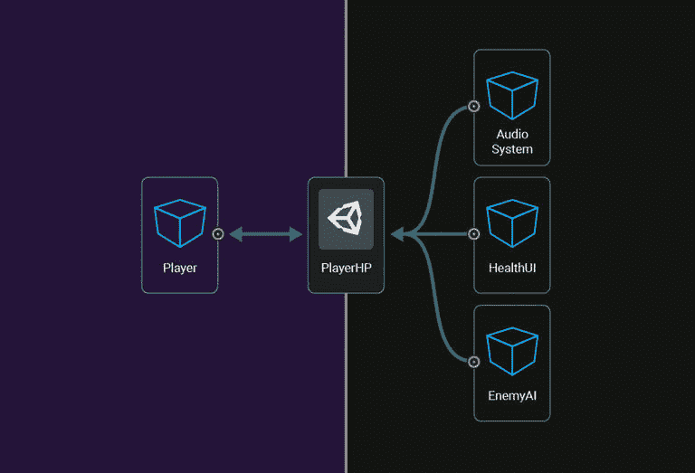
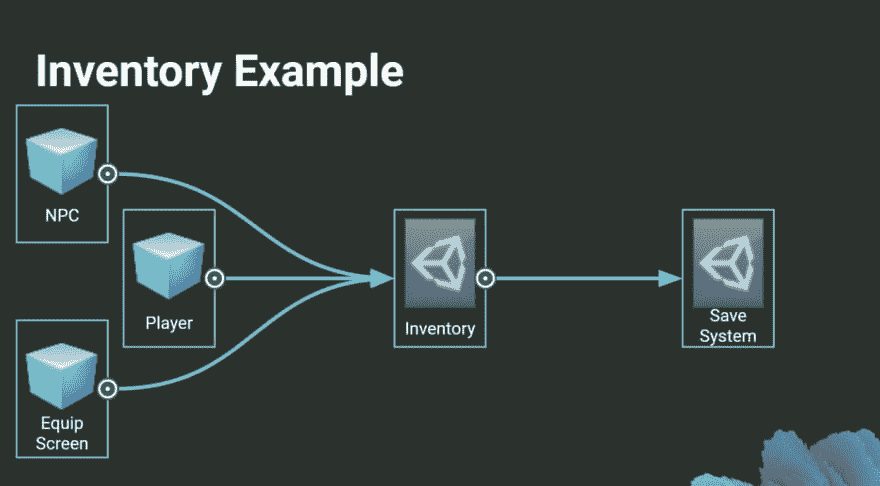
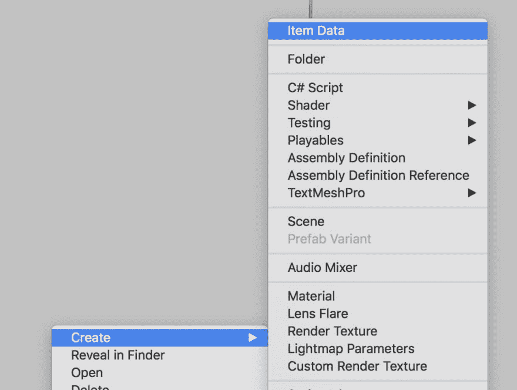
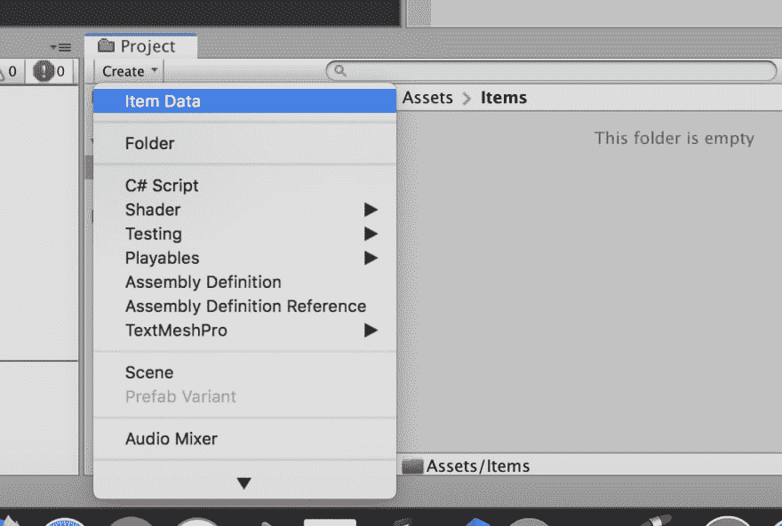
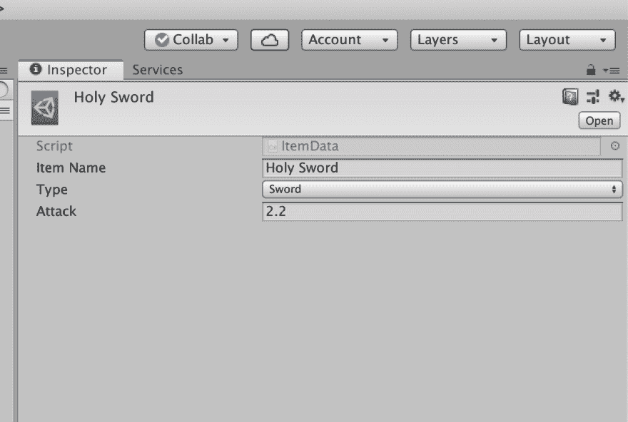
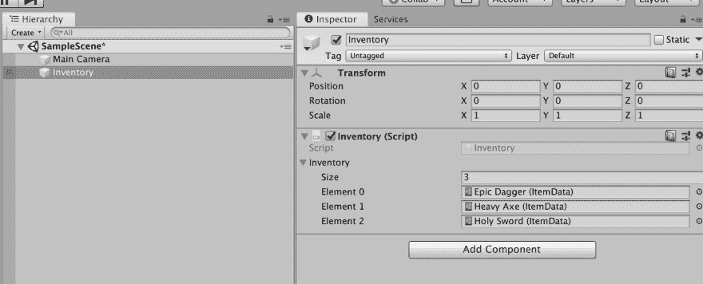
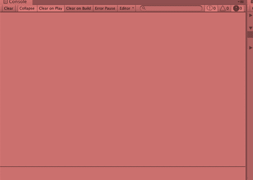
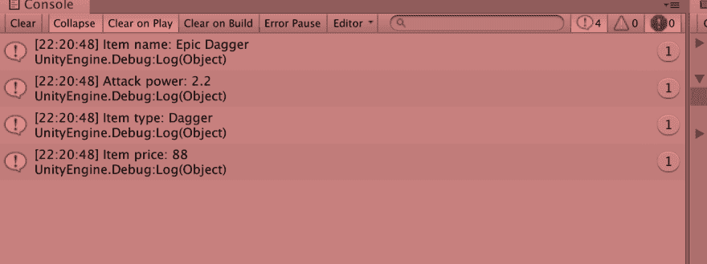

# MVC 与可脚本化对象的统一第 1 部分

> 原文:[https://dev . to/ce muka/MVC-in-unity-with-scriptable-objects-part-1-3h 86](https://dev.to/cemuka/mvc-in-unity-with-scriptable-objects-part-1-3h86)

欢迎学习带有脚本化对象的 Unity 中 MVC 的第一部分。我将使这部分仅成为可脚本化的对象，它将保持简单明了。

首先，听听 unity 的说法:

> 如果你想创建不需要附加到游戏对象的对象，你可以从这个类派生。
> 
> 这对于仅用于存储数据的资产最为有用。

那我们应该问问。

### [](#why)为什么？

unity 自带的可脚本化对象。它有内置的特性可以在编辑器中使用。

我喜欢你在开发周期中使用 unity 编辑器的方式。您可以使自己的编辑器工具和默认编辑器工具易于配置。有了可脚本化的对象，您可以进一步利用它，制作您的自定义数据资产，并在编辑器中使用它或将其用作数据容器。

[T2】](https://res.cloudinary.com/practicaldev/image/fetch/s--moeql68B--/c_limit%2Cf_auto%2Cfl_progressive%2Cq_auto%2Cw_880/https://unity.com/sites/default/files/styles/16_9_s_scale_width/public/2018-10/architect_game_scriptable_objects-2.jpg%3Fitok%3DM1i7qf19)

上图是 unity 中一个可脚本化对象的使用示例。单人房。在项目文件中创建的资产文件可以负责将信息传送到游戏中的许多其他系统，并且它会持续存在。youtube 上有一个关于 SO 的很棒的演示，如果你想了解更多(它的名字[在一场光荣的可脚本化的对象革命](https://www.youtube.com/watch?v=6vmRwLYWNRo):)中推翻了 MonoBehaviour 暴政)。

[T2】](https://res.cloudinary.com/practicaldev/image/fetch/s--hJKPKHz4--/c_limit%2Cf_auto%2Cfl_progressive%2Cq_auto%2Cw_880/https://blogs.unity3d.com/wp-content/uploads/2017/11/Screenshot-2017-11-14-12.50.24-1.png)

上面显示了另一个很好的例子。在这里，其他的`MonoBehaviour`对象具有对库存对象的引用，并且保存系统具有所有这些对象。这张图片来自另一个伟大的演讲，[带有可脚本化对象的游戏架构](https://www.youtube.com/watch?v=raQ3iHhE_Kk)，我强烈推荐看看他的方法。

另一个很棒的地方是你不会想用 over。json 或者。所以一旦你理解了它的特性。这使得它成为 unity 中完美的配置机制。

所以让我们在一个行动中使用它。

```
using UnityEngine;

public class ItemData : ScriptableObject
{
    public string itemName;
    public ItemType type;
    public float attack;        
}

public enum ItemType
{
    Dagger,
    Axe,
    Sword,
    Staff
} 
```

我们创建了一个名为`ItemData`的类和一些类似 rpg 游戏中的属性。我们将在项目文件夹中创建一些项目，并从脚本中访问它们以显示在控制台上。但在此之前，我们已经为我们的`ItemData`类添加了一个重要的成分。

```
using UnityEngine;

[CreateAssetMenu]
public class ItemData : ScriptableObject
{
    public string itemName;
    public ItemType type;
    public float attack;        
}

public enum ItemType
{
    Dagger,
    Axe,
    Sword,
    Staff
} 
```

`CreateAssetMenu`属性是我们在`ItemData`类上添加的，是给 unity 指定我们要从这个 SO 类的项目文件夹中创建一个文件，否则，你不能创建。右键单击编辑器中的资产文件或使用项目文件夹中的创建按钮。

[T2】](https://res.cloudinary.com/practicaldev/image/fetch/s--PMLpr8El--/c_limit%2Cf_auto%2Cfl_progressive%2Cq_auto%2Cw_880/https://thepracticaldev.s3.amazonaws.com/i/5ovncrjzyvuaxtofqncu.png)

[T2】](https://res.cloudinary.com/practicaldev/image/fetch/s--EfkbcB2U--/c_limit%2Cf_auto%2Cfl_progressive%2Cq_auto%2Cw_880/https://thepracticaldev.s3.amazonaws.com/i/d8njgbircw7k10ioi3b1.png)

让我们创建一个名为`Items`的文件夹，并尝试在项目文件夹中创建一个`ItemData`。

[T2】](https://res.cloudinary.com/practicaldev/image/fetch/s--et0zrvP---/c_limit%2Cf_auto%2Cfl_progressive%2Cq_auto%2Cw_880/https://thepracticaldev.s3.amazonaws.com/i/pb0e73au9u2tdfcs0j1p.png)

我将创建另一个脚本来保存这些名为`Inventory`的数据文件。

```
using UnityEngine;

public class Inventory : MonoBehaviour
{
    public ItemData[] inventory;
} 
```

增加一个在控制台上显示物品信息的方法，并控制物品清单的长度。

```
using UnityEngine;

public class Inventory : MonoBehaviour
{
    public ItemData[] inventory;

    int index = 0;

    public void NextItemInfo()
    {
        if (index > inventory.Length)
        {
            index = 0;
        }

        Debug.Log("Item name: " + inventory[index].name);
        Debug.Log ("Attack power: " + inventory[index].attack);

        switch(inventory[index].type)
        {
            case ItemType.Axe: 
            Debug.Log("Item type: Axe"); 
            break;

            case ItemType.Dagger: 
            Debug.Log("Item type: Dagger");
            break;

            case ItemType.Staff: 
            Debug.Log("Item type: Staff");
            break;

            case ItemType.Sword: 
            Debug.Log("Item type: Sword"); 
            break;
        }

        index ++;
    }

} 
```

我将使用空格键来使用我们的方法。这很容易使它与团结一致。在`Update`中，我们将检查我们的键是否被按下，感谢`Input`类。

```
using UnityEngine;

public class Inventory : MonoBehaviour
{
    public ItemData[] inventory;

    int index = 0;

    private void Update() 
    {
        if (Input.GetKeyDown(KeyCode.Space))    
        {
            NextItemInfo();
        }
    }

    public void NextItemInfo()
    {
        if (index > inventory.Length)
        {
            index = 0;
        }

        Debug.Log("Item name: " + inventory[index].name);
        Debug.Log ("Attack power: " + inventory[index].attack);

        switch(inventory[index].type)
        {
            case ItemType.Axe: 
            Debug.Log("Item type: Axe"); 
            break;

            case ItemType.Dagger: 
            Debug.Log("Item type: Dagger");
            break;

            case ItemType.Staff: 
            Debug.Log("Item type: Staff");
            break;

            case ItemType.Sword: 
            Debug.Log("Item type: Sword"); 
            break;
        }

        index ++;
    }

} 
```

现在，是时候切换回 unity editor 了。我们将用我们在`Items`文件夹中创建的`ItemData`文件填充我们的`inventory`数组。但是首先，让我们在场景中创建一个空对象，并附上我们的`Inventory`脚本。

[T2】](https://res.cloudinary.com/practicaldev/image/fetch/s--BBUW8DO5--/c_limit%2Cf_auto%2Cfl_progressive%2Cq_auto%2Cw_880/https://thepracticaldev.s3.amazonaws.com/i/osgifbcap19vetyt1e4w.png)

让我们试一试。点击播放进行测试。

[T2】](https://res.cloudinary.com/practicaldev/image/fetch/s--u06fyBIn--/c_limit%2Cf_auto%2Cfl_progressive%2Cq_66%2Cw_880/https://thepracticaldev.s3.amazonaws.com/i/744ibudz5gful8lkx4jz.gif)

起作用了！现在我想告诉你，你不仅可以在 SO 中携带变量，而且我们还会在`ItemData`中添加一个方法来计算价格。在[这里](https://docs.unity3d.com/ScriptReference/ScriptableObject.html)和[这里](https://docs.unity3d.com/2018.3/Documentation/Manual/class-ScriptableObject.html)查阅更多文档。

```
using UnityEngine;

[CreateAssetMenu]
public class ItemData : ScriptableObject
{
    public string itemName;
    public ItemType type;
    public float attack;        

    public float GetPrice()
    {
        return attack * 40;
    }
} 
```

然后在`Inventory`让我们使用我们的新方法:

```
using UnityEngine;

public class Inventory : MonoBehaviour
{
    public ItemData[] inventory;

    int index = 0;

    private void Update() 
    {
        if (Input.GetKeyDown(KeyCode.Space))    
        {
            NextItemInfo();
        }
    }

    public void NextItemInfo()
    {
        if (index == inventory.Length)
        {
            index = 0;
        }

        Debug.Log("Item name: " + inventory[index].name);
        Debug.Log ("Attack power: " + inventory[index].attack);

        switch(inventory[index].type)
        {
            case ItemType.Axe: 
            Debug.Log("Item type: Axe"); 
            break;

            case ItemType.Dagger: 
            Debug.Log("Item type: Dagger");
            break;

            case ItemType.Staff: 
            Debug.Log("Item type: Staff");
            break;

            case ItemType.Sword: 
            Debug.Log("Item type: Sword"); 
            break;
        }
        Debug.Log("Item price: " + inventory[index].GetPrice());

        index ++;
    }

} 
```

现在点击播放看看结果。

[T2】](https://res.cloudinary.com/practicaldev/image/fetch/s--BnhMn6xH--/c_limit%2Cf_auto%2Cfl_progressive%2Cq_auto%2Cw_880/https://thepracticaldev.s3.amazonaws.com/i/bivnekdo4yacrqxc2q6c.png)

在 [github](https://github.com/cemuka/intro-to-so) 上查看 unity 项目！

这是我们第一部分的结尾。下一部分我们将介绍 unity 中的 MVC。但是因为我们熟悉 SO，我们将添加一些 SO 香料使它更健壮，这就是 unity ninja 的做法😎👾