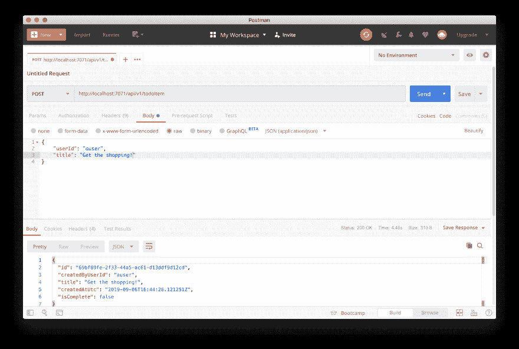
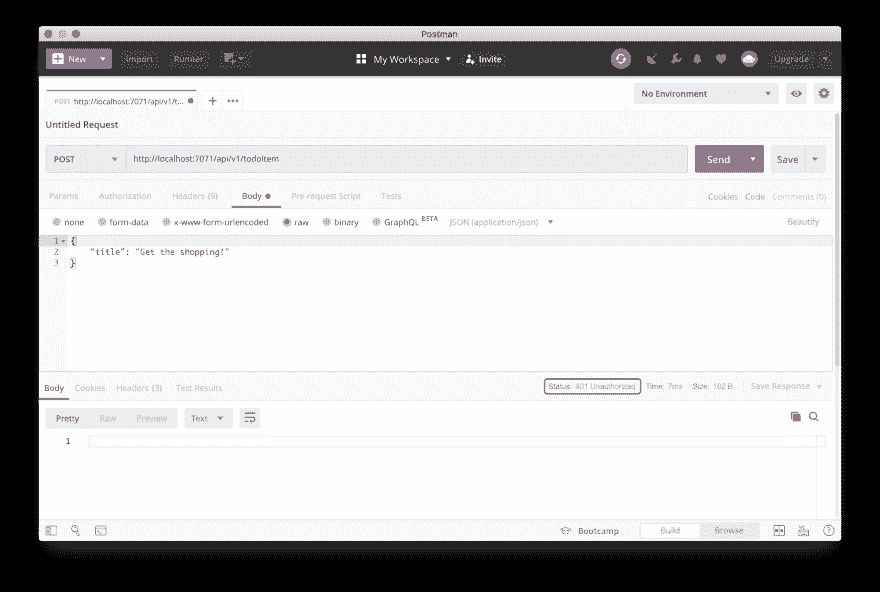
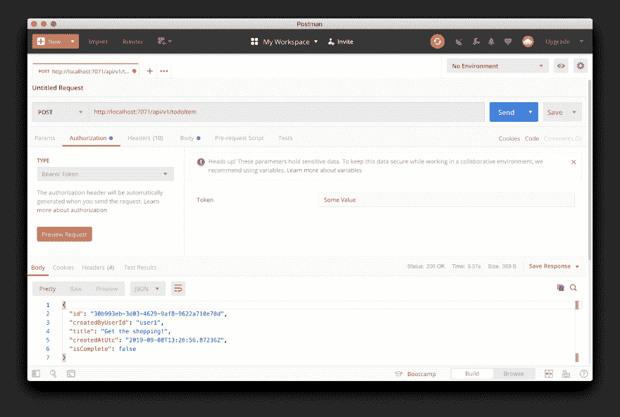
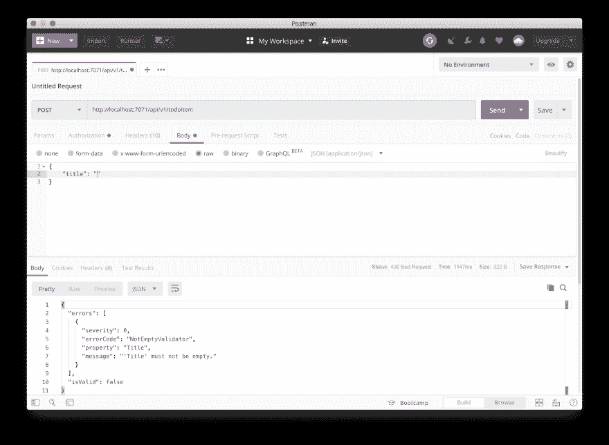
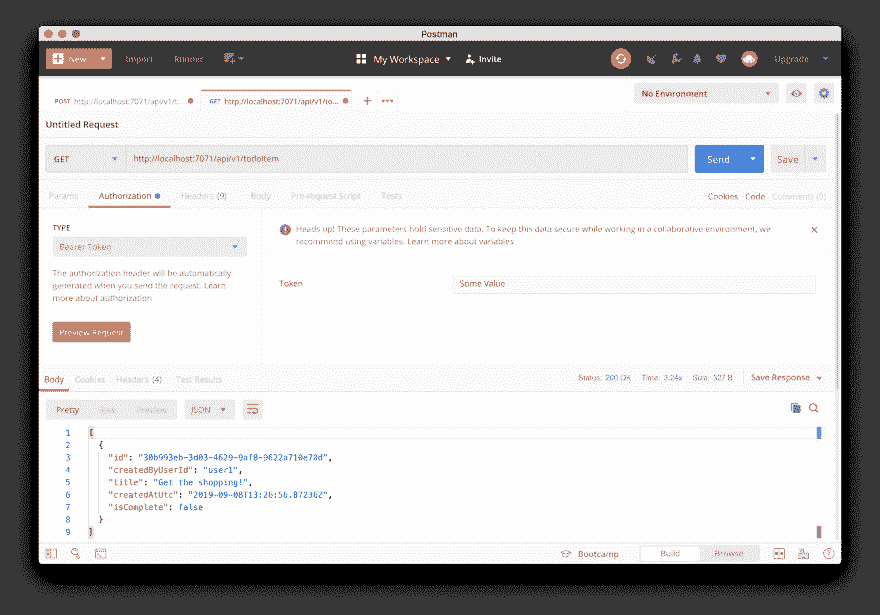
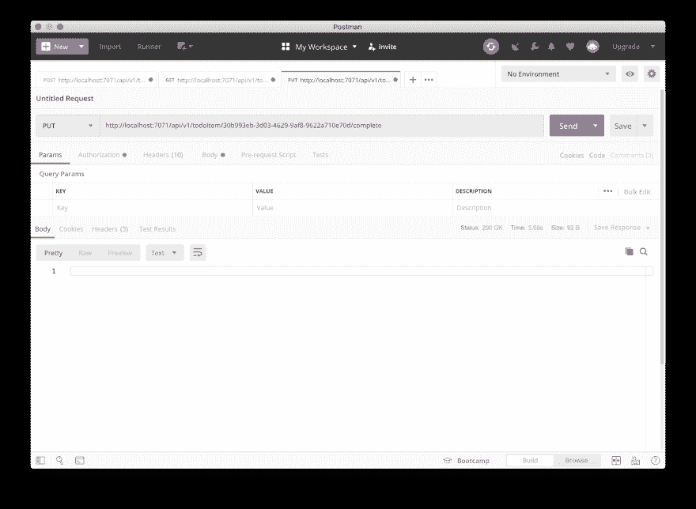
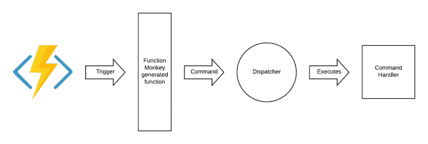
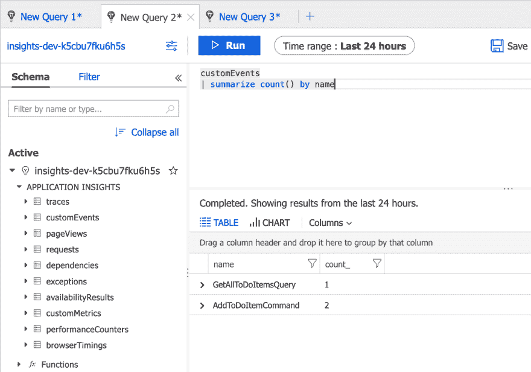
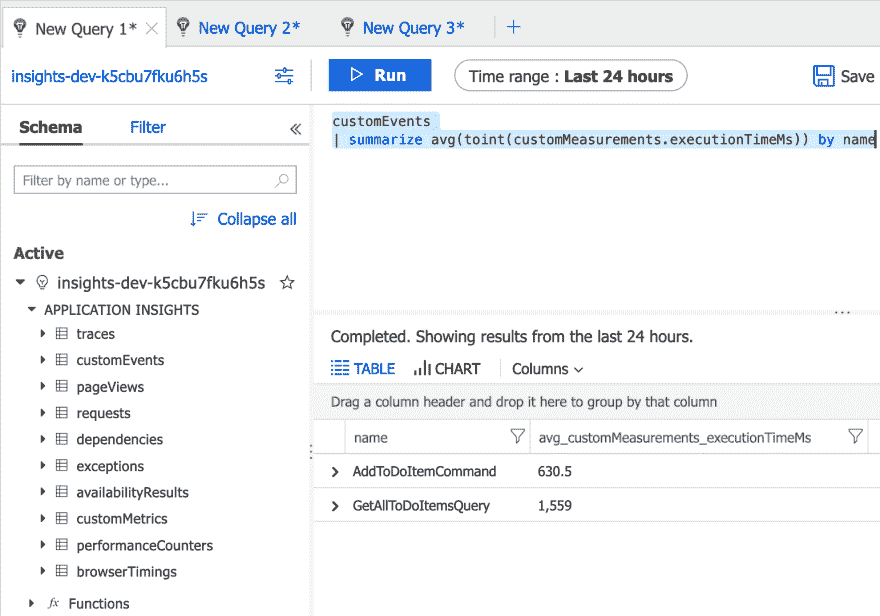

# 用 C#开发优雅的 Azure 函数和 Monkey 函数

> 原文：<https://dev.to/jamesrandall/elegant-azure-functions-development-in-c-with-function-monkey-1ea7>

> 本文是 [#ServerlessSeptember](https://dev.to/azure/serverless-september-content-collection-2fhb) 的一部分。在这个无服务器的内容集合中，您可以找到其他有用的文章、详细的教程和视频。9 月份，每天都有来自社区成员和云倡导者的新文章发布，没错，每天都有。
> 
> 在[https://docs.microsoft.com/azure/azure-functions/](https://docs.microsoft.com/azure/azure-functions/?WT.mc_id=servsept_devto-blog-cxa)了解更多关于微软 Azure 如何实现你的无服务器功能。

Azure Functions 的托管环境、基于消费的计费和基于事件的编程模型使其成为许多云应用程序的理想计算平台，简单性使其非常容易上手和尝试想法。然而，如果不小心，代码库很容易包含大量重复的样板文件和不一致的地方。此外，HTTP 函数相当原始的性质可能会使构建 REST API 变得困难，因为你需要提供许多像 ASP.Net 核心这样免费获得的管道(Azure Functions 的一个非常受欢迎的功能是能够运行 ASP.Net 核心——我相信它最终会到来，但还不是现在！).

Azure 函数的许多例子都集中在简单的用例上，并没有真正解决这些问题。因此，您会经常看到触发器、日志记录、序列化和其他横切关注点与业务问题纠缠在一起，这一切都变得有点混乱。虽然这对于小项目来说可能没什么问题，但当您有很多功能时，这可能会成为维护的噩梦，限制重用，并使您难以在不同的环境中托管业务逻辑。

为了解决这个问题，我创建了[Function Monkey](https://functionmonkey.azurefromthetrenches.com)——这是一个框架，它允许你使用命令和中介模式编写 Azure 函数，这种方式自然会导致关注点的清晰分离，并且还提供了构建 REST APIs 的基础设施，并使用声明式构建器风格的方法来创建基于 Azure 函数的无服务器应用程序。

为了演示这是如何工作的，我将展示如何使用 Function Monkey 在 C#中构建一个简单的 ToDo 应用程序的后端，该应用程序使用 Cosmos DB 作为数据存储，然后展示如何使用命令 dispatcher / mediator 来解决其他横切关注点。

这篇文章中有很多代码，完整项目的代码可以在 [GitHub](https://github.com/JamesRandall/FunctionMonkey-ToDo) 上找到。

## 创建 REST API

首先，使用您选择的 IDE 或编辑器(我使用 Rider)，创建一个空的 Azure Functions 应用程序，然后安装两个 NuGet 包:

```
dotnet add package FunctionMonkey -v 3.0.11-beta5
dotnet add package FunctionMonkey.Compiler -v 3.0.12-beta5 
```

Enter fullscreen mode Exit fullscreen mode

*注意:我们在这里添加了 Function Monkey 的测试版，因此如果您使用的是 IDE，您可能需要启用预发布包 3.x 系列的一个新增功能是支持服务总线会话，但是这需要参考微软的测试版。azure . web jobs . extensions . service bus 包，Function Monkey 包将尽快移出预览版，但在所有其他方面，它们都已准备好投入生产。*

我们将首先创建一个模型来表示 ToDo 项。在项目中创建一个名为 Models 的文件夹，并在该文件夹中创建一个名为 ToDoItem:
的类

```
using System;

namespace ToDo.Models
{
    public class ToDoItem
    {
        public string Id { get; set; }

        public string CreatedByUserId { get; set; }

        public string Title { get; set; }

        public DateTime CreatedAtUtc { get; set; }

        public bool IsComplete { get; set; }
    }
} 
```

Enter fullscreen mode Exit fullscreen mode

接下来在项目中创建一个名为 Commands 的文件夹，并在该文件夹中创建一个名为 AddToDoItem 的类，该类包含为给定用户创建命令所需的状态:

```
using System;
using AzureFromTheTrenches.Commanding.Abstractions;
using ToDo.Models;

namespace ToDo.Commands
{
    public class AddToDoItemCommand : ICommand<ToDoItem>
    {
        public string UserId { get; set; }

        public string Title { get; set; }
    }
} 
```

Enter fullscreen mode Exit fullscreen mode

ICommand 是一个函数猴子定义的接口，它将一个类标识为一个命令，在这种情况下，我们还为该命令声明一个响应类型，并将其设置为我们的 ToDoItem 模型——我们将返回新创建的项。如果您的命令没有响应，那么它们就是一个非泛型变量，可用于声明一个没有响应的命令。

现在我们有了一个表示 ToDo 项的机制和一种表达我们创建一个项的意图的方法，我们需要实现将实现它的功能。首先创建一个名为 Services 的文件夹，并在其中创建一个名为 IToDoItemRepository 的接口:

```
using System;
using System.Threading.Tasks;
using ToDo.Models;

namespace ToDo.Services
{
    internal interface IToDoItemRepository
    {
        Task Upsert(ToDoItem toDoItem);
    }
} 
```

Enter fullscreen mode Exit fullscreen mode

对于这个简单的应用程序，我们将使用 [Azure Cosmos DB](https://docs.microsoft.com/en-us/azure/cosmos-db/) 作为我们的数据库，因此在我们可以填充我们的存储库的实现之前，我们需要添加 Cosmos DB 包:

```
dotnet add package FunctionMonkey Microsoft.Azure.Cosmos 
```

Enter fullscreen mode Exit fullscreen mode

这将添加最新的 3.x 版本的 Cosmos 客户端，这是对以前版本的一个很大的改进，有许多可用性和性能增强。

你需要创建一个 Cosmos 账户，里面有一个数据库和一个文档容器，如果你是 Cosmos 新手，你可以按照下面的说明来操作。当您创建资源时，记下 Cosmos 连接字符串、数据库名称和容器名称，因为我们将在接下来的步骤中用到它们。

现在，我们需要一种方法将 Cosmos 的连接信息获取到我们的存储库中。为此，我们将在项目的根目录下创建一个名为 ApplicationSettings 的类:

```
namespace ToDo
{
    internal class ApplicationSettings
    {
        public string CosmosConnectionString { get; set; }

        public string CosmosDatabaseName { get; set; }

        public string CosmosContainerName { get; set; }
    }
} 
```

Enter fullscreen mode Exit fullscreen mode

现在，我们可以在名为 todoitemreposity:
的服务文件夹中创建我们的存储库接口的实现

```
using System;
using System.Collections.Concurrent;
using System.Threading.Tasks;
using Microsoft.Azure.Cosmos;
using ToDo.Models;

namespace ToDo.Services
{
    internal class ToDoItemRepository : IToDoItemRepository
    {
        private readonly CosmosClient _cosmosClient;
        private readonly string _databaseName;
        private readonly string _containerName;

        public ToDoItemRepository(ApplicationSettings settings)
        {
            CosmosClientOptions options = new CosmosClientOptions()
            {
                SerializerOptions = new CosmosSerializationOptions()
                {
                    PropertyNamingPolicy = CosmosPropertyNamingPolicy.CamelCase
                }
            };
            _cosmosClient = new CosmosClient(settings.CosmosConnectionString, options);
            _databaseName = settings.CosmosDatabaseName;
            _containerName = settings.CosmosContainerName;
        }

        public async Task Upsert(ToDoItem toDoItem)
        {
            Container container = _cosmosClient.GetContainer(_databaseName, _containerName);
            await container.UpsertItemAsync(toDoItem, new PartitionKey(toDoItem.Id));
        }
    }
} 
```

Enter fullscreen mode Exit fullscreen mode

在上面的示例中，我们使用了新的 3.x Cosmos 客户端的一个特性，在序列化我们的模型时使用 camel case 以前我们需要用 JsonProperty("id ")在 *ToDoItem* 类上标记我们的 Id 属性，或者使用小写的名称。在我们的 upsert 方法中，我们简单地使用客户端来 upsert 一个待办事项。

接下来，我们需要用命令处理程序将所有这些连接起来。创建一个名为 Handlers 的文件夹，并创建一个名为 AddToDoItemCommandHandler 的类:

```
using System;
using System.Threading.Tasks;
using AzureFromTheTrenches.Commanding.Abstractions;
using ToDo.Commands;
using ToDo.Models;
using ToDo.Services;

namespace ToDo.Handlers
{
    internal class AddToDoItemCommandHandler : ICommandHandler<AddToDoItemCommand, ToDoItem>
    {
        private readonly IToDoItemRepository _repository;

        public AddToDoItemCommandHandler(IToDoItemRepository repository)
        {
            _repository = repository;
        }

        public async Task<ToDoItem> ExecuteAsync(AddToDoItemCommand command, ToDoItem previousResult)
        {
            ToDoItem newItem = new ToDoItem
            {
                CreatedAtUtc = DateTime.UtcNow,
                CreatedByUserId = command.UserId,
                Id = Guid.NewGuid().ToString(),
                IsComplete = false,
                Title = command.Title
            };
            await _repository.Upsert(newItem);
            return newItem;
        }
    }
} 
```

Enter fullscreen mode Exit fullscreen mode

命令处理程序通过其对接口 *ICommandHandler* 的实现来标记，该接口接受其响应的命令类型作为其第一个通用参数，并接受命令的响应类型作为第二个可选通用参数。处理程序必须实现 *ExecuteAsync* 方法来执行它们的逻辑。虽然我们不会在本演练中使用该功能，但是多个命令处理程序可以响应一个命令而运行，并且 *previousResult* 参数表示来自前一个处理程序的输出。在我们的例子中，它将总是空的。

最后，有了我们的命令、命令处理程序和存储库，我们可以将它们连接在一起，并通过提供一个函数应用程序构建器将 add command 作为一个函数公开。为此，在项目根中创建一个名为 *FunctionAppConfiguration* 的类，实现如下所示的*IFunctionAppConfiguration*接口:

```
using System;
using System.Net.Http;
using FunctionMonkey.Abstractions;
using FunctionMonkey.Abstractions.Builders;
using Microsoft.Extensions.DependencyInjection;
using ToDo.Commands;
using ToDo.Services;

namespace ToDo
{
    public class FunctionAppConfiguration : IFunctionAppConfiguration
    {
        public void Build(IFunctionHostBuilder builder)
        {
            builder
                .Setup((serviceCollection, commandRegistry) =>
                {
                    ApplicationSettings applicationSettings = new ApplicationSettings
                    {
                         CosmosContainerName = "todoItems",
                         CosmosDatabaseName = "testdatabase",
                         CosmosConnectionString = 
                             Environment.GetEnvironmentVariable("cosmosConnectionString", EnvironmentVariableTarget.Process)
                    };
                    serviceCollection
                        .AddSingleton(applicationSettings)
                        .AddTransient<IToDoItemRepository, ToDoItemRepository>();
                    commandRegistry.Discover<FunctionAppConfiguration>();
                })
                .Functions(functions => functions
                    .HttpRoute("api/v1/todoItem", route => route
                        .HttpFunction<AddToDoItemCommand>(HttpMethod.Post)
                    )
                );
        }
    }
} 
```

Enter fullscreen mode Exit fullscreen mode

*Setup* 方法为我们公开了一个 *IServiceCollection* 接口来注册我们的依赖关系——在本例中，我们注册了存储库(处理程序需要)和应用程序设置(存储库需要)。它还公开了一个 *ICommandRegistry* 接口，供我们注册命令和处理程序。我们可以手动完成这项工作，或者更直接地说，通过使用 Discover 方法并在包含处理程序的程序集中提供一个类型的泛型参数。

接下来，*函数*方法允许我们注册我们的函数。在本例中，我们声明了一个 HTTP 路由和该路由上的一个函数，该函数将 post 动词绑定到 *AddToDoItemCommand* 。

在我们运行它之前，我们只需要做两个最后的修改。首先(原因稍后会变得更加明显)我们需要防止 Azure 函数在我们的每个函数前面加上“api”。我们通过创建包含以下内容的 host.json 文件来实现这一点:

```
{
    "version": "2.0",
    "extensions": {
        "http": {
            "routePrefix": ""
        }
    }
} 
```

Enter fullscreen mode Exit fullscreen mode

最后，我们需要提供 Cosmos 的连接信息，因为我们将在本地运行这些函数，所以我们将在 local.settings.json 文件中进行设置:

```
{
    "IsEncrypted": false,
    "Values": {
        "AzureWebJobsStorage": "UseDevelopmentStorage=true",
        "FUNCTIONS_WORKER_RUNTIME": "dotnet",
        "cosmosConnectionString": "<enter your connection string here>"
    }
} 
```

Enter fullscreen mode Exit fullscreen mode

Azure 函数需要一个存储帐户才能运行，在这个例子中，我使用了存储模拟器。如果你在 Mac 上运行，你可以使用一个真实的存储帐户或者使用 Azure(Azure 存储模拟器的一个开源替代品)。

做完所有这些，我们终于可以了！，运行我们的 Azure Functions 应用。如果我们运行应用程序，我们可以在 Postman 中向我们的端点发出请求，并看到返回的创建的 ToDo 项:

[](https://res.cloudinary.com/practicaldev/image/fetch/s--qUh3AtDo--/c_limit%2Cf_auto%2Cfl_progressive%2Cq_auto%2Cw_880/https://thepracticaldev.s3.amazonaws.com/i/1by3tpey7udrxima5ip2.png)

很好——我们可以使用 POST 动词调用端点，并创建一个待办事项，保存在 Cosmos 中，然后返回。然而，如果你看看我们传递给 Postman 的有效载荷，你可能会注意到我们在传递一个用户 ID。这是登录用户的 ID，但如果能够将其作为有效载荷的一部分传递，就意味着可以绕过任何认证和授权系统。为了解决这个问题，我们将设置函数 Monkey，让它从声明中读取用户 ID。在一个真实的例子中，我们将在授权头中使用一个签名的令牌，但是为了演示这是如何工作的，我们将简单地验证是否提供了一个令牌，并用一个硬编码的用户 ID 进行设置。*如果你有兴趣更全面地探索这个问题，请看[这个视频](https://www.youtube.com/watch?v=hIvjcxFMFjw)，它演示了如何针对 Auth0* 配置授权。

首先，我们需要实现一个可以验证所提供令牌的类——我们通过实现 ITokenValidator 接口来实现这一点。将类 *TokenValidator* 添加到项目的根目录:

```
using System.Security.Claims;
using System.Threading.Tasks;
using FunctionMonkey.Abstractions;

namespace ToDo
{
    public class TokenValidator : ITokenValidator
    {
        public Task<ClaimsPrincipal> ValidateAsync(string authorizationHeader)
        {
            if (string.IsNullOrEmpty(authorizationHeader))
            {
                return Task.FromResult<ClaimsPrincipal>(null);
            }

            ClaimsPrincipal claimsPrincipal = new ClaimsPrincipal(
                new[]
                {
                    new ClaimsIdentity(new[]
                    {
                        new Claim("userId", "user1"),
                    }),
                }
            );
            return Task.FromResult(claimsPrincipal);
        }
    }
} 
```

Enter fullscreen mode Exit fullscreen mode

对于授权用户，令牌验证器应该返回一个 ClaimsPrincipal(通常由不记名令牌中的声明构成——参见这里的[文档](https://functionmonkey.azurefromthetrenches.com/guides/http/authorization.html#openid-connect-token-validation))或者对于未授权用户返回 null(或者抛出一个异常)。在本例中，我们创建了一个名为 userId 的声明，如果在授权头中传递了任何非零长度的值，就给它一个硬编码值 user1。

现在我们需要告诉 Function Monkey 使用这个验证器，并将声明映射到命令的 UserId 属性。我们使用如下所示的授权构建器选项来实现这一点:

```
public void Build(IFunctionHostBuilder builder)
{
    builder
        .Setup( /* as before */ )
        .Authorization(authorization => authorization
            .TokenValidator<TokenValidator>()
            .AuthorizationDefault(AuthorizationTypeEnum.TokenValidation)
            .Claims(claims => claims
                .MapClaimToCommandProperty<AddToDoItemCommand>("userId", cmd => cmd.UserId)
            )
        )
        .Functions( /* as before */ );
} 
```

Enter fullscreen mode Exit fullscreen mode

我们在这里做三件事:

*   我们使用 *TokenValidator < >* 方法将我们的令牌验证器实现注册为 Monkey 应该使用的一个函数。
*   我们使用 *AuthorizationDefault* 方法告诉 Function Monkey 我们所有函数的默认授权模式是令牌验证
*   我们使用 *Claims* 方法和*MapClaimToCommandProperty*方法告诉函数 Monkey 从我们的 claims principal 中的名称标识符 claim 设置 AddToDoItemCommand 上的 UserId 属性。

完成后，我们还有一件事要做——我们需要告诉 Function Monkey 永远不要允许我们的 UserId 属性被声明映射之外的任何东西设置——这样就没有人能使用请求体或查询、头或路由参数来设置用户 Id。我们通过在命令模型上使用 SecurityProperty 属性来标记它:

```
public class AddToDoItemCommand : ICommand<ToDoItem>
{
    [SecurityProperty]
    public string UserId { get; set; }

    public string Title { get; set; }
} 
```

Enter fullscreen mode Exit fullscreen mode

完成后，让我们尝试在 Postman 中发出 POST 请求。当我们在没有设置授权头的情况下这样做时，我们会得到一个 401 未授权错误，如下所示:

[](https://res.cloudinary.com/practicaldev/image/fetch/s--_AaligKZ--/c_limit%2Cf_auto%2Cfl_progressive%2Cq_auto%2Cw_880/https://thepracticaldev.s3.amazonaws.com/i/4w0mql6srxeiwifyh9kp.png)

但是如果我们设置了一个授权头，请求就成功了，创建的帖子的用户 ID 被设置为 user 1——我们在声明主体中设置的值:

[](https://res.cloudinary.com/practicaldev/image/fetch/s--1V6B1nxZ--/c_limit%2Cf_auto%2Cfl_progressive%2Cq_auto%2Cw_880/https://thepracticaldev.s3.amazonaws.com/i/x1v0z93ngc0uvif2vd85.png)

接下来，让我们对我们的输入进行一些验证。Function Monkey 支持通过您选择的任何验证框架来验证命令，但包括一个易于使用的包 [Fluent 验证](https://fluentvalidation.net)。首先，我们需要添加包:

```
dotnet add package FunctionMonkey.FluentValidation -v 3.0.11-beta5 
```

Enter fullscreen mode Exit fullscreen mode

接下来创建一个名为 Validators 的文件夹，并在其中创建一个名为 addtodoitemcommanddvalidator:
的类

```
using FluentValidation;
using ToDo.Commands;

namespace ToDo.Validators
{
    public class AddToDoItemCommandValidator : AbstractValidator<AddToDoItemCommand>
    {
        public AddToDoItemCommandValidator()
        {
            RuleFor(x => x.UserId).NotEmpty();
            RuleFor(x => x.Title).NotEmpty().MaximumLength(128);
        }
    }
} 
```

Enter fullscreen mode Exit fullscreen mode

以上只是标准的 Fluent 验证代码。注意，我们可以验证 UserId，因为验证发生在声明映射之后。我们现在需要在我们的构建器中注册我们的验证器，我们可以用类似于添加命令和处理程序的方式来完成这个任务:

```
public void Build(IFunctionHostBuilder builder)
{
    builder
        .Setup((serviceCollection, commandRegistry) =>
        {
            ApplicationSettings applicationSettings = new ApplicationSettings
            {
                 CosmosContainerName = "todoItems",
                 CosmosDatabaseName = "testdatabase",
                 CosmosConnectionString = 
                     Environment.GetEnvironmentVariable("cosmosConnectionString", EnvironmentVariableTarget.Process)
            };
            serviceCollection
                .AddSingleton(applicationSettings)
                .AddTransient<IToDoItemRepository, ToDoItemRepository>()
                .AddValidatorsFromAssemblyContaining<FunctionAppConfiguration>() // add this line
                ;
            commandRegistry.Discover<FunctionAppConfiguration>();
        })
        .AddFluentValidation() // add this line
        .Authorization( /* as before */ )
        .Functions( /* as before */ );
} 
```

Enter fullscreen mode Exit fullscreen mode

如果我们运行这个并使用 Postman 发送一个长度为零的无效 post 请求，我们可以看到一个错误的请求响应返回:

[](https://res.cloudinary.com/practicaldev/image/fetch/s--DQGoN3MY--/c_limit%2Cf_auto%2Cfl_progressive%2Cq_auto%2Cw_880/https://thepracticaldev.s3.amazonaws.com/i/8exk4t9k4ljhjcyfqxy2.png)

有了所有这些，让我们添加一个新的命令，或者更确切地说是一个查询，它允许我们返回给定用户的所有帖子。我们再次开始创建一个类来表示我们的意图——在 Commands 文件夹中创建 GetAllToDoItemsQuery:

```
using System.Collections.Generic;
using AzureFromTheTrenches.Commanding.Abstractions;
using ToDo.Models;

namespace ToDo.Commands
{
    public class GetAllToDoItemsQuery : ICommand<IReadOnlyCollection<ToDoItem>>
    {
        [SecurityProperty]
        public string UserId { get; set; }
    }
} 
```

Enter fullscreen mode Exit fullscreen mode

您会注意到，我们像以前一样将 UserId 属性标记为安全属性，但是我们没有该命令的声明映射。我们可以为每个命令类型添加一个声明映射，但是对于大量的命令，这可能很难维护。相反，我们将更新我们的声明映射，以使用基于约定的方法，以便任何名为 userId 的命令上的任何属性都由 UserId 声明填充。这需要对我们的构建器做一个小小的改变:

```
public void Build(IFunctionHostBuilder builder)
{
    builder
        .Setup( /* as before */ )
        .AddFluentValidation() // as before
        .Authorization(authorization => authorization
            .TokenValidator<TokenValidator>()
            .AuthorizationDefault(AuthorizationTypeEnum.TokenValidation)
            .Claims(claims => claims
                .MapClaimToPropertyName("userId", "UserId") // our change!
            )
        )
        .Functions( /* as before */ );
} 
```

Enter fullscreen mode Exit fullscreen mode

现在我们需要向我们的存储库接口添加一个方法:

```
internal interface IToDoItemRepository
{
    Task Upsert(ToDoItem toDoItem);

    Task<IReadOnlyCollection<ToDoItem>> Get(Guid userId);
} 
```

Enter fullscreen mode Exit fullscreen mode

并到实施:

```
internal class ToDoItemRepository : IToDoItemRepository
{
    private readonly CosmosClient _cosmosClient;
    private readonly string _databaseName;
    private readonly string _containerName;

    public ToDoItemRepository(ApplicationSettings settings) { /* as before */ }

    public async Task Upsert(ToDoItem toDoItem) { /* as before */ }

    public async Task<IReadOnlyCollection<ToDoItem>> Get(string userId)
    {
        string query = "SELECT * FROM c WHERE c.createdByUserId = @userId";
        Container container = _cosmosClient.GetContainer(_databaseName, _containerName);
        QueryDefinition queryDefinition = new QueryDefinition(query)
            .WithParameter("@userId", userId);
        FeedIterator<ToDoItem> queryResultSetIterator = container.GetItemQueryIterator<ToDoItem>(queryDefinition);

        List<ToDoItem> items = new List<ToDoItem>();
        while (queryResultSetIterator.HasMoreResults)
        {
            FeedResponse<ToDoItem> currentResultSet = await queryResultSetIterator.ReadNextAsync();
            items.AddRange(currentResultSet);
        }

        return items;
    }
} 
```

Enter fullscreen mode Exit fullscreen mode

接下来我们需要一个命令处理程序:

```
using System.Collections.Generic;
using System.Threading.Tasks;
using AzureFromTheTrenches.Commanding.Abstractions;
using ToDo.Commands;
using ToDo.Models;
using ToDo.Services;

namespace ToDo.Handlers
{
    internal class GetAllToDoItemsQueryHandler : ICommandHandler<GetAllToDoItemsQuery, IReadOnlyCollection<ToDoItem>>
    {
        private readonly IToDoItemRepository _repository;

        public GetAllToDoItemsQueryHandler(IToDoItemRepository repository)
        {
            _repository = repository;
        }

        public async Task<IReadOnlyCollection<ToDoItem>> ExecuteAsync(
            GetAllToDoItemsQuery command,
            IReadOnlyCollection<ToDoItem> previousResult)
        {
            return await _repository.Get(command.UserId);
        }
    }
} 
```

Enter fullscreen mode Exit fullscreen mode

然后我们需要使用我们的构建器将我们的命令注册到一个函数:

```
public void Build(IFunctionHostBuilder builder)
{
    builder
        .Setup( /* unchanged */ )
        .Authorization( /* unchanged */ )
        .Functions(functions => functions
            .HttpRoute("api/v1/todoItem", route => route
                .HttpFunction<AddToDoItemCommand>(HttpMethod.Post)
                .HttpFunction<GetAllToDoItemsQuery>(HttpMethod.Get) // our addition
            )
        );
} 
```

Enter fullscreen mode Exit fullscreen mode

如果我们运行我们的应用程序并使用 Postman 调用我们的端点，我们将会看到我们添加的一系列项目被返回:

[](https://res.cloudinary.com/practicaldev/image/fetch/s--SSc6ZE2c--/c_limit%2Cf_auto%2Cfl_progressive%2Cq_auto%2Cw_880/https://thepracticaldev.s3.amazonaws.com/i/d0li64uhj3ol0xacn2im.png)

让我们通过添加一个允许项目被标记为完成的函数来结束 API，同样，我们需要添加一个命令:

```
using AzureFromTheTrenches.Commanding.Abstractions;

namespace ToDo.Commands
{
    public class MarkItemCompleteCommand : ICommand
    {
        public string UserId { get; set; }

        public string ItemId { get; set; }
    }
} 
```

Enter fullscreen mode Exit fullscreen mode

我们需要向我们的存储库中添加一个方法，通过 id 获取一个条目(我将省略添加的接口，因为它应该是不言自明的):

```
public async Task<ToDoItem> GetSingleItem(string itemId)
{
    Container container = _cosmosClient.GetContainer(_databaseName, _containerName);
    return await container.ReadItemAsync<ToDoItem>(itemId, new PartitionKey(itemId));
} 
```

Enter fullscreen mode Exit fullscreen mode

我们还需要一个命令处理程序:

```
using System.Threading.Tasks;
using AzureFromTheTrenches.Commanding.Abstractions;
using ToDo.Commands;
using ToDo.Models;
using ToDo.Services;

namespace ToDo.Handlers
{
    internal class MarkItemCompleteCommandHandler : ICommandHandler<MarkItemCompleteCommand>
    {
        private readonly IToDoItemRepository _repository;

        public MarkItemCompleteCommandHandler(IToDoItemRepository repository)
        {
            _repository = repository;
        }

        public async Task ExecuteAsync(MarkItemCompleteCommand command)
        {
            ToDoItem item = await _repository.GetSingleItem(command.ItemId);
            item.IsComplete = true;
            await _repository.Upsert(item);
        }
    }
} 
```

Enter fullscreen mode Exit fullscreen mode

最后，我们需要将命令映射到一个函数。我们将使用 PUT 动词，并使用 route 参数:
提供商品 ID

```
public void Build(IFunctionHostBuilder builder)
{
    builder
        .Setup((serviceCollection, commandRegistry) => { /* as before */ }
        .AddFluentValidation() /* as before */
        .Authorization( /* as before */ )
        .Functions(functions => functions
            .HttpRoute("api/v1/todoItem", route => route
                .HttpFunction<AddToDoItemCommand>(HttpMethod.Post)
                .HttpFunction<GetAllToDoItemsQuery>(HttpMethod.Get)
                // our addition
                .HttpFunction<MarkItemCompleteCommand>("/{itemId}/complete", HttpMethod.Put)
            )
        );
} 
```

Enter fullscreen mode Exit fullscreen mode

如果我们在 Postman 中运行这个，我们将得到一个简单的 200 响应:

[](https://res.cloudinary.com/practicaldev/image/fetch/s--P_DCR42I--/c_limit%2Cf_auto%2Cfl_progressive%2Cq_auto%2Cw_880/https://thepracticaldev.s3.amazonaws.com/i/6pqh2hg43e85l0kymdqx.png)

如果我们查看我们的*markitemcompletecomandler*，我们可以看到，如果一个用户知道另一个用户的待办事项的 ID，他们可以更改该用户的项目完成状态。作为对 API 的最后一项更改，我们将看看如何防止这种情况，并使用 HTTP 响应处理程序返回 401 未授权响应。首先让我们创建一个异常，我们将在这种情况下抛出:

```
using System;

namespace ToDo
{
    public class UnauthorizedItemAccessException : Exception
    {

    }
} 
```

Enter fullscreen mode Exit fullscreen mode

接下来，我们将更新我们的命令处理程序，如果命令上的用户 ID 与待办事项的用户 ID 不匹配，我们将抛出这个异常:

```
public async Task ExecuteAsync(MarkItemCompleteCommand command)
{
    ToDoItem item = await _repository.GetSingleItem(command.ItemId);
    if (item.CreatedByUserId != command.UserId)
    {
        throw new UnauthorizedItemAccessException();
    }
    item.IsComplete = true;
    await _repository.Upsert(item);
} 
```

Enter fullscreen mode Exit fullscreen mode

最后，我们需要一种方法来翻译我们的。NET 异常转换为 401 HTTP 响应。Function Monkey 允许您注册一个 HTTP 响应处理程序，该处理程序可用于调整响应。在根中创建一个名为 *HttpResponseHandler* 的类，它实现了 *IHttpResponseHandler* 接口:

```
using System;
using System.Threading.Tasks;
using AzureFromTheTrenches.Commanding;
using AzureFromTheTrenches.Commanding.Abstractions;
using FunctionMonkey.Abstractions.Http;
using FunctionMonkey.Commanding.Abstractions.Validation;
using Microsoft.AspNetCore.Mvc;

namespace ToDo
{
    public class HttpResponseHandler : IHttpResponseHandler
    {
        public Task<IActionResult> CreateResponseFromException<TCommand>(TCommand command, Exception ex) where TCommand : ICommand
        {
            // exceptions thrown from inside command handlers are reraised as CommandExecutionException's with the
            // inner exception set to the handler raised exception - so we need to unwrap this to shape our response
            Exception unwrappedException = ex is CommandExecutionException ? ex.InnerException : ex;
            if (unwrappedException is UnauthorizedAccessException)
            {
                return Task.FromResult((IActionResult) new UnauthorizedResult());
            }

            // returning null tells Function Monkey to create its standard response
            return null;
        }

        public Task<IActionResult> CreateResponse<TCommand, TResult>(TCommand command, TResult result) where TCommand : ICommand<TResult>
        {
            return null; // returning null tells Function Monkey to create its standard response
        }

        public Task<IActionResult> CreateResponse<TCommand>(TCommand command)
        {
            return null; // returning null tells Function Monkey to create its standard response
        }

        public Task<IActionResult> CreateValidationFailureResponse<TCommand>(TCommand command, ValidationResult validationResult) where TCommand : ICommand
        {
            return null; // returning null tells Function Monkey to create its standard response
        }
    }
} 
```

Enter fullscreen mode Exit fullscreen mode

在上面的代码中，我们只是简单地寻找我们的异常，并将其翻译成适当的响应。现在我们需要更新我们的构建器来注册它:

```
public void Build(IFunctionHostBuilder builder)
{
    builder
        .Setup((serviceCollection, commandRegistry) => { /* as before */ }
        .AddFluentValidation() // as before
        .Authorization(/* as before */ )
        .DefaultHttpResponseHandler<HttpResponseHandler>() // added
        .Functions(/* as before */);
} 
```

Enter fullscreen mode Exit fullscreen mode

用我们模拟的授权处理程序来测试有点困难，但是您可以通过更改我们在 *TokenValidator* 中设置的用户 ID，并尝试将我们之前创建的项目标记为完成来做到这一点。如果你这样做，你会收到一个 401 未经授权的邮递员。

最后，让我们添加开放 API 支持。要做到这一点，我们需要做的就是向构建器添加一个新的部分:

```
public void Build(IFunctionHostBuilder builder)
{
    builder
        .Setup((serviceCollection, commandRegistry) => { /* as before */ }
        .AddFluentValidation() // as before
        .Authorization(/* as before */ )
        .DefaultHttpResponseHandler<HttpResponseHandler>() // as before
        .OpenApiEndpoint(openApi => openApi
            .Title("ToDo API")
            .Version("1.0.0")
            .UserInterface()
        )
        .Functions(/* as before */);
} 
```

Enter fullscreen mode Exit fullscreen mode

添加了这一部分后，如果我们运行我们的项目并访问[http://localhost:7071/open API](http://localhost:7071/openapi)，我们将找到我们项目的 OpenAPI explorer:

[](https://res.cloudinary.com/practicaldev/image/fetch/s--cteZaPzs--/c_limit%2Cf_auto%2Cfl_progressive%2Cq_auto%2Cw_880/https://thepracticaldev.s3.amazonaws.com/i/hqxoxosmv3jy10jhqcjr.png)

值得注意的是，如果我们之前没有在 host.json 文件中定制我们的路由前缀，我们就不能将它放在根目录中——相反，它应该放在[http://localhost:7071/API/open API](http://localhost:7071/api/openapi)下(如果您想要这种行为，您可以简单地省略 host.json routePrefix 定制)。

## 通过定制调度员解决交叉问题

到目前为止，我们还没有在我们的工作中真正看到这一点，但是 Function Monkey 利用命令/中介框架将命令与处理程序关联起来。当事件发生时，会发生以下情况:

1.  Azure Functions 运行时调用适当的触发器
2.  触发器由函数猴子生成的函数处理
3.  函数反序列化函数的输入
4.  该函数将反序列化的输入传递给调度程序
5.  调度程序定位要调用的处理程序
6.  调度程序实例化并执行处理程序

[](https://res.cloudinary.com/practicaldev/image/fetch/s--3JEl1x35--/c_limit%2Cf_auto%2Cfl_progressive%2Cq_auto%2Cw_880/https://thepracticaldev.s3.amazonaws.com/i/rpx7ndewfuk3b69m8vfw.png)

每个执行的公共元素是调度程序，我们可以在其中添加行为来解决横切关注点。示例可能包括细粒度权限、日志记录和遥测。例如，我们将实现一个调度程序，它使用秒表来测量处理程序执行的持续时间，并将它们保存到 Azure Application Insights。

首先，在 Azure 中创建一个 Application Insights 实例，遵循这些指令并记下插装密钥。在你将 Azure Functions 应用程序部署到 Azure 本身之前，你也应该熟悉一下功能和应用洞察之间的[集成。](https://docs.microsoft.com/en-us/azure/azure-functions/functions-monitoring)

接下来，使用检测密钥更新 local.settings.json 文件:

```
{
    "IsEncrypted": false,
    "Values": {
        "AzureWebJobsStorage": "UseDevelopmentStorage=true",
        "FUNCTIONS_WORKER_RUNTIME": "dotnet",
        "cosmosConnectionString": "<enter your connection string here>",
        "APPINSIGHTS_INSTRUMENTATIONKEY": "<enter your instrumentation key here>"
    }
} 
```

Enter fullscreen mode Exit fullscreen mode

接下来添加应用洞察 NuGet 包:

```
dotnet add package Microsoft.ApplicationInsights.AspNetCore 
```

Enter fullscreen mode Exit fullscreen mode

现在在服务文件夹
中创建一个名为 *ITelemetry* 的接口

```
using System;

namespace ToDo.Services
{
    internal interface ITelemetry
    {
        void RecordExecutionTime(Type commandType, double executionTime);
    }
} 
```

Enter fullscreen mode Exit fullscreen mode

还有一个叫遥测的实现:

```
using System;
using System.Collections.Generic;
using Microsoft.ApplicationInsights;

namespace ToDo.Services
{
    internal class Telemetry : ITelemetry
    {
        private readonly TelemetryClient _telemetryClient  = new TelemetryClient();

        public void RecordExecutionTime(Type commandType, double executionTime)
        {
            _telemetryClient.TrackEvent(commandType.Name, metrics: new Dictionary<string, double>
            {
                { "executionTimeMs",  executionTime}
            });
        }
    }
} 
```

Enter fullscreen mode Exit fullscreen mode

现在我们需要用一个记录我们的遥测数据的调度程序来装饰默认的调度程序。为此我们需要实现如下所示的 *ICommandDispatcher* ，在服务文件夹
中创建一个名为 *CustomDispatcher* 的类

```
using System.Diagnostics;
using System.Threading;
using System.Threading.Tasks;
using AzureFromTheTrenches.Commanding.Abstractions;
using AzureFromTheTrenches.Commanding.Abstractions.Model;

namespace ToDo.Services
{
    internal class CustomDispatcher : ICommandDispatcher
    {
        private readonly IFrameworkCommandDispatcher _underlyingDispatcher;
        private readonly ITelemetry _telemetry;

        public CustomDispatcher(
            IFrameworkCommandDispatcher underlyingDispatcher,
            ITelemetry telemetry
            )
        {
            _underlyingDispatcher = underlyingDispatcher;
            _telemetry = telemetry;
        }

        public async Task<CommandResult<TResult>> DispatchAsync<TResult>(ICommand<TResult> command, CancellationToken cancellationToken = new CancellationToken())
        {
            Stopwatch sw = Stopwatch.StartNew();
            CommandResult<TResult> result = await _underlyingDispatcher.DispatchAsync(command, cancellationToken);
            sw.Stop();
            _telemetry.RecordExecutionTime(command.GetType(), sw.ElapsedMilliseconds);
            return result;
        }

        public async Task<CommandResult> DispatchAsync(ICommand command, CancellationToken cancellationToken = new CancellationToken())
        {
            Stopwatch sw = Stopwatch.StartNew();
            CommandResult result = await _underlyingDispatcher.DispatchAsync(command, cancellationToken);
            sw.Stop();
            _telemetry.RecordExecutionTime(command.GetType(), sw.ElapsedMilliseconds);
            return result;
        }

        public ICommandExecuter AssociatedExecuter => null;
    }
} 
```

Enter fullscreen mode Exit fullscreen mode

两个 *DispatchAsync* 方法负责将命令分派给适当的处理程序(可以是本地的或远程的- [参见这里的文档](https://commanding.azurefromthetrenches.com)),而*IFrameworkCommandDispatcher*是命令框架提供的默认实现( *ICommandDispatcher* 是框架的消费者使用的接口，但我们不直接修饰它-*IFrameworkCommandDispatcher*是为了避免解决循环情况而提供的)。

我们现在需要在我们的构建器中注册我们的调度器和遥测服务:

```
public void Build(IFunctionHostBuilder builder)
{
    builder
        .Setup((serviceCollection, commandRegistry) =>
        {
            // ...
            serviceCollection
                .AddSingleton(applicationSettings)
                .AddTransient<IToDoItemRepository, ToDoItemRepository>()
                .AddValidatorsFromAssemblyContaining<FunctionAppConfiguration>()
                // our additions
                .AddSingleton<ITelemetry, Telemetry>()
                .Replace(
                    new ServiceDescriptor(
                        typeof(ICommandDispatcher), 
                        typeof(CustomDispatcher),
                        ServiceLifetime.Transient)
                    )
                ;
            // ...
        })
        .AddFluentValidation() // as before
        .Authorization( /* as before */ )
        .DefaultHttpResponseHandler<HttpResponseHandler>() // as before
        .OpenApiEndpoint( /* as before */ )
        .Functions( /* as before */ );
} 
```

Enter fullscreen mode Exit fullscreen mode

如果我们在 Postman 中运行我们的项目并执行一些命令，那么在短暂的延迟之后，我们将会在 Application Insights 门户中看到我们记录的事件:

[](https://res.cloudinary.com/practicaldev/image/fetch/s--VI2q4XuY--/c_limit%2Cf_auto%2Cfl_progressive%2Cq_auto%2Cw_880/https://thepracticaldev.s3.amazonaws.com/i/w0e35l9h9ttw6lqay4df.png)

[](https://res.cloudinary.com/practicaldev/image/fetch/s--EZ0rleXP--/c_limit%2Cf_auto%2Cfl_progressive%2Cq_auto%2Cw_880/https://thepracticaldev.s3.amazonaws.com/i/7bowu32mq3um23z6cujz.png)

## 添加服务总线队列功能

在最后一节中，让我们假设我们还希望允许通过服务总线队列将项目标记为完成。首先，我们需要创建一个服务总线名称空间，[你可以遵循这里的说明](https://docs.microsoft.com/en-us/azure/service-bus-messaging/service-bus-create-namespace-portal)。在门户中，还要创建一个名为*newtoitem*的队列(工具栏上有一个按钮)，并注意共享访问策略部分中 RootManageSharedAccessKey 的连接字符串。

接下来，将连接字符串添加到 local.settings.json 文件中:

```
{
    "IsEncrypted": false,
    "Values": {
        "AzureWebJobsStorage": "UseDevelopmentStorage=true",
        "FUNCTIONS_WORKER_RUNTIME": "dotnet",
        "cosmosConnectionString": "<enter your connection string here>",            
        "APPINSIGHTS_INSTRUMENTATIONKEY": "<enter your instrumentation key here>",
        "serviceBusConnectionString": "<enter your service bus connection string here>"
    }
} 
```

Enter fullscreen mode Exit fullscreen mode

现在添加微软。azure . web jobs . extensions . service bus 包到项目:

```
dotnet add package Microsoft.Azure.WebJobs.Extensions.ServiceBus 
```

Enter fullscreen mode Exit fullscreen mode

现在我们需要做的就是将我们之前创建的 *AddToDoItemCommand* 与我们的服务总线队列触发的 Azure 函数
关联起来

```
 public void Build(IFunctionHostBuilder builder)
    {
        builder
            .Setup((serviceCollection, commandRegistry) => /* as before */)
            .AddFluentValidation() // as before
            .Authorization( /* as before */ )
            .DefaultHttpResponseHandler<HttpResponseHandler>() // as before
            .OpenApiEndpoint(/* as before */ )
            .Functions(functions => functions
                .HttpRoute("api/v1/todoItem", route => route
                    .HttpFunction<AddToDoItemCommand>(HttpMethod.Post)
                    .HttpFunction<GetAllToDoItemsQuery>(HttpMethod.Get)
                    .HttpFunction<MarkItemCompleteCommand>("/{itemId}/complete", HttpMethod.Put)
                )
                // Our addition
                .ServiceBus(serviceBus => serviceBus
                    .QueueFunction<AddToDoItemCommand>("newtodoitem")
                )
            );
    } 
```

Enter fullscreen mode Exit fullscreen mode

现在运行应用程序，然后使用您选择的工具(例如 Azure Service Bus Explorer)，将以下项目发送到队列:

```
{
    "userId": "sbuser",
    "title": "Item from Service Bus"
} 
```

Enter fullscreen mode Exit fullscreen mode

这将导致 AddToDoItemCommandHandler 被调用，以及我们的验证，并保存到 Cosmos 的项目。注意，虽然我们用一个 *SecurityProperty* 属性标记了 UserId 属性，但是这些属性只适用于 HTTP 触发器，所以在这种情况下，我们可以设置 UserId 属性。

这个简单的添加还展示了将我们的关注点分离出来的价值，特别是从业务逻辑中分离出触发器，因为只需几行代码，我们就可以通过不同的协议调用所有的“添加待办事项”业务逻辑。

## 总结性的

除了我们在这里探索的特性，还有对其他触发器类型、输出绑定和各种横切关注点的支持，细节可以在项目[文档](https://functionmonkey.azurefromthetrenches.com/)中找到。如果你需要做一些 Function Monkey 不支持的事情，那么标准的 Azure 函数可以很好地与 Function Monkey 函数共存。

结合探索[命令框架也是值得的——这里探索的模式可以成为组织大型应用程序并将它们从模块化整体架构发展到微服务架构的有用工具，该框架包括允许通过各种通道(例如消息队列和 HTTP)抽象和远程执行的能力。如果你有兴趣进一步探索这个问题，那么](https://commanding.azurefromthetrenches.com/)[这里的这个系列](https://www.azurefromthetrenches.com/c-cloud-application-architecture-commanding-with-a-mediator-the-full-series/)和这个[幻灯片](https://jamesrandall.github.io/fromModularMonolithToMicroservice)可能会有用。

最后，这篇文章关注的是 C#，虽然它可以在 F#中使用，但用 C#风格表达的构建器模式在这种语言中感觉并不自然。为了解决这个问题，一个更加 F#友好的界面正在开发中，你可以在这里找到那个[的细节。](https://www.azurefromthetrenches.com/function-monkey-for-fsharp/)

如果你有任何问题，请在评论中或在 Twitter 上联系我。