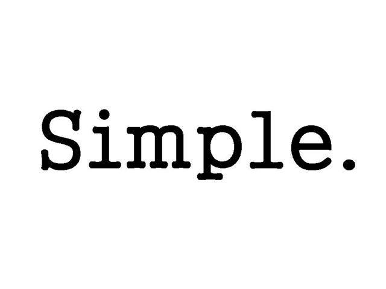

# 简单设计的 4 条规则

> 原文：<https://dev.to/jmir17/the-4-rules-of-simple-design-14eo>

*简单设计:开发速度快，前期投资低，易于更改*

这个原则的意图是在软件项目生命周期中最小化成本，最大化收益。这一原则的采用只可能基于重构迭代的开发，例如 TDD。我们这里讲设计，只讲软件本身，不讲产品设计，也不讲战略设计。用户或采购订单要求应在本实践之外处理。

这四个设计规则是由 Kent Beck 在 90 年代末首次定义的，从那时起，这些规则就概述了软件设计的基本概念。它是极限编程(XP)的核心实践的一部分，同样，这种实践追求质量的提高和提高适应不断变化的需求的能力。

### **简单设计的 4 大法则:**

这些规则按优先级顺序列出。工作软件首先最大化内聚，后期最小化耦合。

**1。——通过所有测试**
这是你能从你的系统得到的最快的反馈。如果你在上面改了什么，它会告诉你到底弄坏了什么。这就是为什么在 TDD 中只通过测试进行重构如此重要。你的软件应该像预期的那样工作，测试只是保证这一点。

**2。——揭示意图**
一目了然，任何一段代码都应该告诉它做什么，这里命名是一个关键因素。软件工程是一项社会活动，和其他人类一起。因此，代码不仅应该是机器可以理解的，也应该是其他人可以理解的。对于公司来说，购买一堆额外的 CPU 来运行一个进程比几个开发人员来帮助理解代码要便宜得多。因此，在大多数情况下，无论性能提高多少，都没有必要编写神秘的算法。
可读的代码很容易更改，所以随着时间的推移，它真的会有回报。

**3。——无重复**
这并不像看起来那么简单。它不仅仅是两个相同的代码块。它也适用于与业务相关的结构或概念。两段代码可能看起来相同，但性质完全不同，合并它们没有意义，而且您可能需要以不同方式实现您的域的表示，因此应该合并它们。这就是为什么这些重复很难发现，除非你有一个系统和领域的概述。

**4。**
-最少元素如果其他规则都没有被违反，这最后一条规则，是很容易达到的。你不应该害怕删除任何使代码更可读和更容易理解的东西，要特别注意复制规则。
这一规则鼓励进化设计，而不是为未来的变化引入目前不需要的复杂性。只要变化是不可预测的，通过持续的重构，只在需要的时候引入复杂性。
同样，你应该清理所有这些过去的设计决策，这些决策在当时是有意义的，但现在不是了，它们可能已经是代码的味道了。

**需要牢记的事情**
即使我们不明确需要预先设计任何东西，但这需要一些设计经验。简单不代表琐碎。出色的设计不会因为你遵循实践而出现，它直接来自开发团队。设计是一种伴随岁月而来的能力。