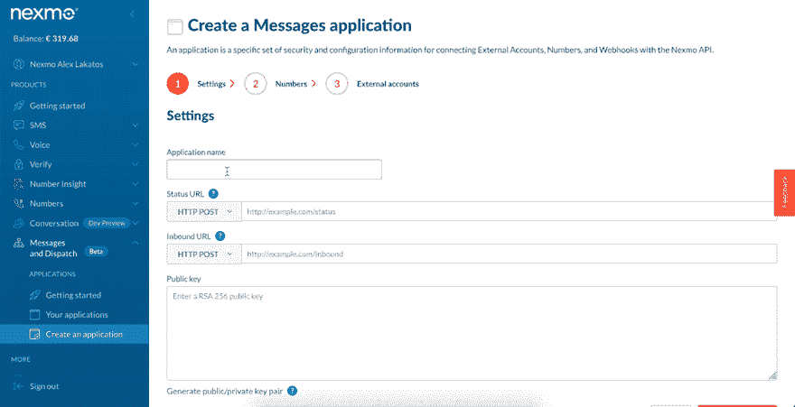
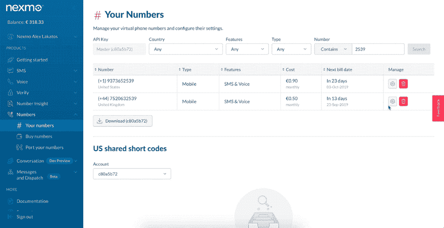
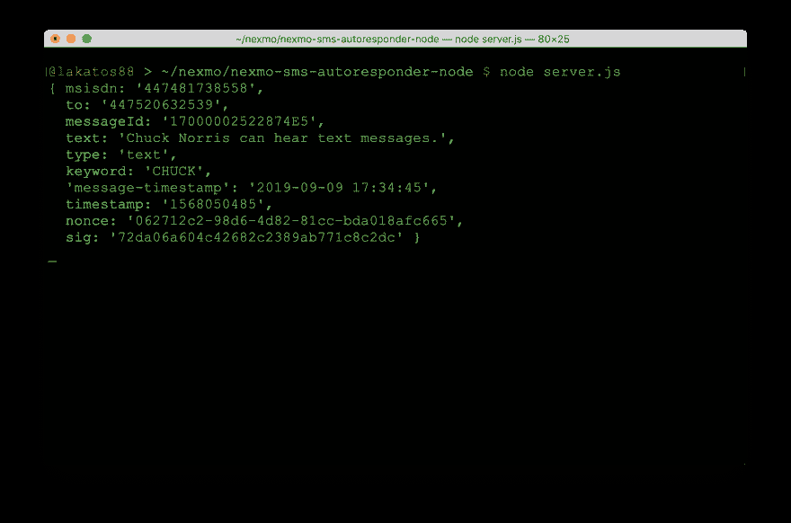

# 如何用 Node.js 和 Express 收发短信

> 原文：<https://dev.to/vonagedev/how-to-send-and-receive-sms-messages-with-node-js-and-express-4g46>

*这篇文章最初出现在[Nexmo 博客](https://www.nexmo.com/blog/2019/09/16/how-to-send-and-receive-sms-messages-with-node-js-and-express-dr)上，但是我想为它添加一些内容，特别是针对 dev.to 社区。如果你不想继续下去，但你只是想尝试一下，我已经在 Glitch 上输入了我的[代码，并用几个不同国家的 Nexmo 电话号码设置了一个 Nexmo 应用程序，你可以发送短信到+442038973497 或+19373652539，并使用自动回复器。如果你想让我为你的国家设置一个号码，只需在 Twitter 上](https://glitch.com/edit/#!/nexmo-sms-autoresponder?path=server.js:1:0)[告诉我](https://twitter.com/lakatos88)，我会在这里提供并更新帖子供其他人使用。*

Nexmo 有几个 API，允许你在世界任何地方发送和接收大量的短信。一旦您获得了虚拟电话号码，您就可以使用 API 来管理出站消息(“发送”)和入站消息(“接收”)。在本文中，您将学习如何使用 [Node.js](https://nodejs.org/) 和 [Express](https://expressjs.com/) 发送和接收短信。

我们将首先使用 Node.js 和旧的 [SMS API](https://developer.nexmo.com/messaging/sms/overview) (Nexmo 的第一个 API)发送一条 SMS，然后重写代码以使用新的 [Messages API](https://developer.nexmo.com/messages/overview) 发送相同的 SMS。然后，我们将构建一个可以使用 express 接收 SMS 消息的 Webhook。在本文中，我们将重点关注发送和接收短信，但如果你想用 Facebook Messenger、Viber 或 Whatsapp 发送和接收消息，你也可以用 Messages API 来完成。

您可以扩展我们在此构建的应用程序，以回复收到的 SMS 消息，或者包含更复杂的交互式元素，让您能够根据自己的 SMS 需求构建自动回复器。

本教程的代码可以在 [GitHub](https://github.com/nexmo-community/nexmo-sms-autoresponder-node/) & [Glitch](https://glitch.com/edit/#!/nexmo-sms-autoresponder?path=README.md:1:0) 上找到。

## 先决条件

开始之前，请确保您已经:

*   一个 [Nexmo 账户](https://dashboard.nexmo.com/sign-up)
*   安装在您机器上的 [Node.js](https://nodejs.org/en/download/)
*   使我们本地机器上的代码可以被外界访问
*   [Nexmo CLI](https://developer.nexmo.com/tools) : `npm install -g nexmo-cli`

## 用短信 API 发送短信

SMS API 是第一个 Nexmo API，我们将使用它向您的电话号码发送 SMS 消息。

### 安装 Node.js 依赖项

首先，初始化一个 NPM 包，否则，旧版本的 NPM 会抱怨没有先安装一个包。只需使用 init 的默认值，然后安装`nexmo` Node.js 包。

```
$ npm init
$ npm install nexmo 
```

<svg width="20px" height="20px" viewBox="0 0 24 24" class="highlight-action crayons-icon highlight-action--fullscreen-on"><title>Enter fullscreen mode</title></svg> <svg width="20px" height="20px" viewBox="0 0 24 24" class="highlight-action crayons-icon highlight-action--fullscreen-off"><title>Exit fullscreen mode</title></svg>

### 初始化依赖关系

我们将创建一个新的 JavaScript 文件，姑且称之为`index.js`。

```
$ touch index.js 
```

<svg width="20px" height="20px" viewBox="0 0 24 24" class="highlight-action crayons-icon highlight-action--fullscreen-on"><title>Enter fullscreen mode</title></svg> <svg width="20px" height="20px" viewBox="0 0 24 24" class="highlight-action crayons-icon highlight-action--fullscreen-off"><title>Exit fullscreen mode</title></svg>

我们需要初始化我们之前安装的 Nexmo 节点库，在您创建的`index.js`文件中:

```
const Nexmo = require('nexmo')

const nexmo = new Nexmo({
  apiKey: NEXMO_API_KEY,
  apiSecret: NEXMO_API_SECRET
}) 
```

<svg width="20px" height="20px" viewBox="0 0 24 24" class="highlight-action crayons-icon highlight-action--fullscreen-on"><title>Enter fullscreen mode</title></svg> <svg width="20px" height="20px" viewBox="0 0 24 24" class="highlight-action crayons-icon highlight-action--fullscreen-off"><title>Exit fullscreen mode</title></svg>

用您实际的 API 密钥和秘密替换那里的值。您可以在 [Nexmo 仪表盘](https://dashboard.nexmo.com/getting-started-guide)的“入门”页面上找到这些内容。

### 发送短信

Nexmo 库有一个用 SMS API 发送 SMS 的方法，那就是`nexmo.message.sendSms`。该方法将 3 个字符串和一个对象作为参数:发送 SMS 的 Nexmo 号码、发送 SMS 的电话号码、消息文本和 SMS 编码选项。它还接受在 API 请求完成时调用的回调。

响应数据包含所有已发送消息的数组，以及关于它们状态的信息。在大多数情况下，它将是数组中的一个元素，但如果 SMS 超过 160 个字符，它将被分成多个部分，然后数组包含关于发送的每个部分的数据。如果消息的状态为 0，则 SMS 发送成功，否则，消息的错误数据在消息的`error-text`属性中。

因为我的文本中有一个表情符号，所以我在选项对象中设置了类型`unicode`，否则，该表情符号将作为`?`在网络上发送。

```
let text = "👋Hello from Nexmo";

nexmo.message.sendSms("Nexmo", "TO_NUMBER", text, {
  type: "unicode"
}, (err, responseData) => {
  if (err) {
    console.log(err);
  } else {
    if (responseData.messages[0]['status'] === "0") {
      console.log("Message sent successfully.");
    } else {
      console.log(`Message failed with error: ${responseData.messages[0]['error-text']}`);
    }
  }
}) 
```

<svg width="20px" height="20px" viewBox="0 0 24 24" class="highlight-action crayons-icon highlight-action--fullscreen-on"><title>Enter fullscreen mode</title></svg> <svg width="20px" height="20px" viewBox="0 0 24 24" class="highlight-action crayons-icon highlight-action--fullscreen-off"><title>Exit fullscreen mode</title></svg>

如果您的运营商网络支持字母数字发送者 id，`FROM`可以是文本而不是电话号码(在我的例子中是`Nexmo`)。如果你的网络不支持字母数字发件人 id(例如[在美国](https://help.nexmo.com/hc/en-us/articles/115011781468))，它必须是一个电话号码。

[根据您尝试发送短信的国家](https://help.nexmo.com/hc/en-us/sections/200622473-Country-Specific-Features-and-Restrictions),有规定要求您拥有发送短信的电话号码，因此您必须购买一个 Nexmo 电话号码。您可以在 [Nexmo 仪表盘](https://dashboard.nexmo.com/buy-numbers)中或通过 CLI:
进行操作

```
$ nexmo number:buy --country_code US --confirm 
```

<svg width="20px" height="20px" viewBox="0 0 24 24" class="highlight-action crayons-icon highlight-action--fullscreen-on"><title>Enter fullscreen mode</title></svg> <svg width="20px" height="20px" viewBox="0 0 24 24" class="highlight-action crayons-icon highlight-action--fullscreen-off"><title>Exit fullscreen mode</title></svg>

您可以运行代码并接收短信:

```
$ node index.js 
```

<svg width="20px" height="20px" viewBox="0 0 24 24" class="highlight-action crayons-icon highlight-action--fullscreen-on"><title>Enter fullscreen mode</title></svg> <svg width="20px" height="20px" viewBox="0 0 24 24" class="highlight-action crayons-icon highlight-action--fullscreen-off"><title>Exit fullscreen mode</title></svg>

## 使用新消息 API 发送短信

有一个较新的处理发送文本消息的 Nexmo API，称为 Messages API。它是一个多通道 API，可以通过不同的通道发送消息，如 SMS、Facebook Messenger、Viber 和 Whatsapp。该 API 目前处于测试阶段，所以如果我们想用它来发送相同的 SMS 消息，我们需要安装 Nexmo 节点库的测试版本。

```
$ npm install nexmo@beta 
```

<svg width="20px" height="20px" viewBox="0 0 24 24" class="highlight-action crayons-icon highlight-action--fullscreen-on"><title>Enter fullscreen mode</title></svg> <svg width="20px" height="20px" viewBox="0 0 24 24" class="highlight-action crayons-icon highlight-action--fullscreen-off"><title>Exit fullscreen mode</title></svg>

### 运行 ngrok

如果你以前没有用过 ngrok，有一篇[博客文章](https://www.nexmo.com/blog/2017/07/04/local-development-nexmo-ngrok-tunnel-dr)解释了如何使用它。如果你熟悉 ngrok，在 3000 端口上用`http`运行它。

```
$ ngrok http 3000 
```

<svg width="20px" height="20px" viewBox="0 0 24 24" class="highlight-action crayons-icon highlight-action--fullscreen-on"><title>Enter fullscreen mode</title></svg> <svg width="20px" height="20px" viewBox="0 0 24 24" class="highlight-action crayons-icon highlight-action--fullscreen-off"><title>Exit fullscreen mode</title></svg>

ngrok 运行后，它会给你一个随机的 URL，我们稍后会把它作为我们的 Webhooks 的基础。我的长这样:`http://5b5c1bd0.ngrok.io`。

### 创建一个消息应用程序

为了与 Messages API 交互，我们需要在 Nexmo 平台上创建一个 Messages 应用程序来验证我们的请求。把应用程序想象成容器，元数据，把你所有的数据放在 Nexmo 平台上。我们将[使用 Nexmo 仪表板](https://dashboard.nexmo.com/messages/create-application)创建一个，这需要一个名称、入站 URL 和状态 URL。

我们还将在磁盘上保存一个密钥文件。应用程序使用公钥/私钥系统，因此当您创建应用程序时，会生成一个公钥并保存在 Nexmo 中，而生成一个私钥，而不是保存在 Nexmo 中，并通过应用程序的创建返回给您。稍后，我们将使用私钥来验证我们的库调用。

使用您在上一步中获得的 ngrok URL，并填充各个字段，为各个字段添加`/webhooks/status`和`/webhooks/inbound`。当消息到达消息 API 时，关于消息的数据被发送到入站 URL。当您使用 API 发送消息时，关于消息状态的数据被发送到状态 URL。

[](https://res.cloudinary.com/practicaldev/image/fetch/s--m2AtfgAK--/c_limit%2Cf_auto%2Cfl_progressive%2Cq_66%2Cw_880/https://www.nexmo.com/wp-content/uploads/2019/09/create-messages-application.gif)

#### 初始化依赖关系

让我们替换之前创建的文件的内容。我们需要初始化我们之前安装的 Nexmo 节点库，在您创建的`index.js`文件中:

```
const Nexmo = require('nexmo')

const nexmo = new Nexmo({
  apiKey: NEXMO_API_KEY,
  apiSecret: NEXMO_API_SECRET,
  applicationId: NEXMO_APPLICATION_ID,
  privateKey: NEXMO_APPLICATION_PRIVATE_KEY_PATH
}) 
```

<svg width="20px" height="20px" viewBox="0 0 24 24" class="highlight-action crayons-icon highlight-action--fullscreen-on"><title>Enter fullscreen mode</title></svg> <svg width="20px" height="20px" viewBox="0 0 24 24" class="highlight-action crayons-icon highlight-action--fullscreen-off"><title>Exit fullscreen mode</title></svg>

将其中的值替换为您实际的 API 密钥和密码、您之前刚刚创建的应用程序的应用程序 id 以及您保存的私有密钥的路径。

### 发送相同的短信

为了用 Messages API 发送 SMS 消息，我们将使用 Nexmo 节点库测试版中的`nexmo.channel.send`方法。该方法接受对象作为参数，其中包含有关收件人、发件人和内容的信息。不同的渠道会有所不同，你需要查看其他渠道的 [API 文档](https://developer.nexmo.com/api/messages-olympus)。

对于 SMS，接收者和发送者的类型是`sms`，对象也必须包含一个数字属性。内容对象接受文本类型和文本消息。回调返回一个错误和响应对象，我们将记录关于操作成功或失败的消息。

```
let text = "👋Hello from Nexmo";

nexmo.channel.send(
  { "type": "sms", "number": "TO_NUMBER" },
  { "type": "sms", "number": "Nexmo" },
  {
    "content": {
      "type": "text",
      "text": text
    }
  },
  (err, responseData) => {
    if (err) {
      console.log("Message failed with error:", err);
    } else {
      console.log(`Message ${responseData.message_uuid} sent successfully.`);
    }
  }
); 
```

<svg width="20px" height="20px" viewBox="0 0 24 24" class="highlight-action crayons-icon highlight-action--fullscreen-on"><title>Enter fullscreen mode</title></svg> <svg width="20px" height="20px" viewBox="0 0 24 24" class="highlight-action crayons-icon highlight-action--fullscreen-off"><title>Exit fullscreen mode</title></svg>

您可以运行代码并接收短信:

```
$ node index.js 
```

<svg width="20px" height="20px" viewBox="0 0 24 24" class="highlight-action crayons-icon highlight-action--fullscreen-on"><title>Enter fullscreen mode</title></svg> <svg width="20px" height="20px" viewBox="0 0 24 24" class="highlight-action crayons-icon highlight-action--fullscreen-off"><title>Exit fullscreen mode</title></svg>

就是这样，您已经使用两种不同的 Nexmo APIs 发送了相同的 SMS 消息。您会注意到 Messages API 的用法要冗长得多，而这两种 API 只需要一种方法来完成同样的事情。

## 接收短信

当一个 Nexmo 电话号码收到一条短信时，Nexmo 会将该短信发送到您在 Nexmo 仪表盘中指定的一个 Webhook。为了设置 webhook URL，请在 Nexmo 仪表盘中点击[您的电话号码旁边的小齿轮图标，并在“入站 Webhook URL”字段中填写`YOUR_NGROK_URL/webhooks/inbound`。不要忘记替换你实际的 ngrok 网址。](https://dashboard.nexmo.com/your-numbers)

[](https://res.cloudinary.com/practicaldev/image/fetch/s--fVtRY600--/c_limit%2Cf_auto%2Cfl_progressive%2Cq_66%2Cw_880/https://www.nexmo.com/wp-content/uploads/2019/09/set-inbound-webhook.gif)

### 创建 Web 服务器

我们将使用`express`创建我们的 web 服务器，因为它是用于此目的的最流行和最容易使用的 Node.js 框架之一。我们还将查看入站 URL 的请求体，因此我们需要安装来自 npm 的`body-parser`和`express`。

```
$ npm install express body-parser 
```

<svg width="20px" height="20px" viewBox="0 0 24 24" class="highlight-action crayons-icon highlight-action--fullscreen-on"><title>Enter fullscreen mode</title></svg> <svg width="20px" height="20px" viewBox="0 0 24 24" class="highlight-action crayons-icon highlight-action--fullscreen-off"><title>Exit fullscreen mode</title></svg>

让我们为此创建一个新文件，将其命名为`server.js` :

```
$ touch server.js 
```

<svg width="20px" height="20px" viewBox="0 0 24 24" class="highlight-action crayons-icon highlight-action--fullscreen-on"><title>Enter fullscreen mode</title></svg> <svg width="20px" height="20px" viewBox="0 0 24 24" class="highlight-action crayons-icon highlight-action--fullscreen-off"><title>Exit fullscreen mode</title></svg>

我们将创建一个基本的`express`应用程序，它使用来自`bodyParser`的 JSON 解析器，并将`urlencoded`选项设置为`true`。让我们填写我们创建的`server.js`文件。我们将使用端口 3000 让服务器监听，我们已经在端口 3000 上运行了 ngrok。

```
const app = require('express')()
const bodyParser = require('body-parser')

app.use(bodyParser.json())
app.use(bodyParser.urlencoded({ extended: true }))

app.listen(3000) 
```

<svg width="20px" height="20px" viewBox="0 0 24 24" class="highlight-action crayons-icon highlight-action--fullscreen-on"><title>Enter fullscreen mode</title></svg> <svg width="20px" height="20px" viewBox="0 0 24 24" class="highlight-action crayons-icon highlight-action--fullscreen-off"><title>Exit fullscreen mode</title></svg>

### 为入站 URL 创建 Webhook

对于入站 URL，我们将为`/webhooks/inbound`创建一个 post 处理程序，我们将把请求体记录到控制台。因为 Nexmo 有一个重试机制，如果 URL 没有用`200 OK`响应，它将继续重新发送消息，所以我们将发送回一个`200`状态。

```
app.post('/webhooks/inbound-message', (req, res) => {
  console.log(req.body);

  res.status(200).end();
}); 
```

<svg width="20px" height="20px" viewBox="0 0 24 24" class="highlight-action crayons-icon highlight-action--fullscreen-on"><title>Enter fullscreen mode</title></svg> <svg width="20px" height="20px" viewBox="0 0 24 24" class="highlight-action crayons-icon highlight-action--fullscreen-off"><title>Exit fullscreen mode</title></svg>

您可以使用
运行代码

```
$ node server.js 
```

<svg width="20px" height="20px" viewBox="0 0 24 24" class="highlight-action crayons-icon highlight-action--fullscreen-on"><title>Enter fullscreen mode</title></svg> <svg width="20px" height="20px" viewBox="0 0 24 24" class="highlight-action crayons-icon highlight-action--fullscreen-off"><title>Exit fullscreen mode</title></svg>

### 试试看

现在，从您的手机向您的 Nexmo 号码发送短信。您应该在运行代码的终端窗口中看到记录的消息。它看起来像这样:

[](https://res.cloudinary.com/practicaldev/image/fetch/s--y58M5280--/c_limit%2Cf_auto%2Cfl_progressive%2Cq_auto%2Cw_880/https://www.nexmo.com/wp-content/uploads/2019/09/receive-sms-terminal.png)

我希望它能起作用，并且您已经学会了如何使用 Nexmo APIs 和 Node.js 发送和接收 SMS 消息。

### 自动回复

发送和接收 SMS 消息的最常见的用例之一是自动回复器。我想在这个例子的基础上更进一步，所以让我们用你刚刚学到的东西来构建一个短信自动回复器。如果你把到目前为止学到的两个东西结合起来，在 inbound Webhook 中，你就有了一个 SMS 自动回复器，它可以回复和 SMS 给所有收到的 SMS 消息。

```
app.post('/webhooks/inbound', (req, res) => {
  console.log(req.body);

  nexmo.channel.send(
    { "type": "sms", "number": req.body.msisdn },
    { "type": "sms", "number": req.body.to },
    {
      "content": {
        "type": "text",
        "text": text
      }
    },
    (err, responseData) => {
      if (err) {
        console.log("Message failed with error:", err);
      } else {
        console.log(`Message ${responseData.message_uuid} sent successfully.`);
      }
    }
  );

  res.status(200).end();
}); 
```

<svg width="20px" height="20px" viewBox="0 0 24 24" class="highlight-action crayons-icon highlight-action--fullscreen-on"><title>Enter fullscreen mode</title></svg> <svg width="20px" height="20px" viewBox="0 0 24 24" class="highlight-action crayons-icon highlight-action--fullscreen-off"><title>Exit fullscreen mode</title></svg>

因为我是 NumbersAPI 的粉丝，我想我也可以用它来写自动回复。我想更改自动回复器，以检查传入的 SMS 消息中的文本是否是一个数字，然后使用它从 Numbers API 获取关于该数字的事实。一旦我有了一个事实，我会把它和短信一起发送回去。

首先，我们需要安装一个 HTTP 请求库，我不喜欢 Node.js 中默认的`http`库。巧合的是，它被称为`request`，所以让我们通过`npm` :
来安装它

```
$ npm install request 
```

<svg width="20px" height="20px" viewBox="0 0 24 24" class="highlight-action crayons-icon highlight-action--fullscreen-on"><title>Enter fullscreen mode</title></svg> <svg width="20px" height="20px" viewBox="0 0 24 24" class="highlight-action crayons-icon highlight-action--fullscreen-off"><title>Exit fullscreen mode</title></svg>

每次在`/webhooks/inbound`端点上有 POST 请求时，我们都会向`http://numbersapi.com/${number}`发出请求，其中`number`将是我们收到的 SMS 中的号码。我们需要将文本解析成整数。我会默认为 42 而不是 0，因为 42 是生命的意义。

让我们更新`/webhooks/inbound`路由，以便在回复传入的 SMS 之前向 NumbersAPI 发出请求。

```
app.post('/webhooks/inbound', (req, res) => {
  console.log(req.body)

  var number = parseInt(req.body.text) || 42;

  request(`http://numbersapi.com/${number}`, (error, response, body) => {
    if (error) {
      text = "The Numbers API has thrown an error."
    } else {
      text = body
    }

    nexmo.channel.send(
      { "type": "sms", "number": req.body.msisdn },
      { "type": "sms", "number": req.body.to },
      {
        "content": {
          "type": "text",
          "text": text
        }
      },
      (err, responseData) => {
        if (err) {
          console.log("Message failed with error:", err);
        } else {
          console.log(`Message ${responseData.message_uuid} sent successfully.`);
        }
      }
    );

    res.status(200).end();
  })
}); 
```

<svg width="20px" height="20px" viewBox="0 0 24 24" class="highlight-action crayons-icon highlight-action--fullscreen-on"><title>Enter fullscreen mode</title></svg> <svg width="20px" height="20px" viewBox="0 0 24 24" class="highlight-action crayons-icon highlight-action--fullscreen-off"><title>Exit fullscreen mode</title></svg>

### 试试看

作为参考，你最终的`server.js`文件应该看起来像[这个](https://glitch.com/edit/#!/nexmo-sms-autoresponder?path=server.js:1:0)。如果您已经遵循了这么长时间，您将需要通过在您的终端中再次运行`node server.js`来重启您的服务器，并且您已经准备好了。向您的 Nexmo 电话号码发送带有号码的短信，并开始与您的自动回复器互动。

## 编者按:了解有关 Messages API 的更多信息

*如果您有兴趣了解更多关于 Messages API 的信息，何不来参加我们在旧金山 [Vonage 校园活动](https://www.vonage.com/campus/#developers)？Alex(这篇文章的作者)将在那里举办一个关于构建对话网站的研讨会——他喜欢谈论所有关于 JavaScript 的事情，所以这是一个与 Nexmo 人群交流的好机会。*

帖子[如何用 Node.js 和 Express](https://www.nexmo.com/blog/2019/09/16/how-to-send-and-receive-sms-messages-with-node-js-and-express-dr) 收发短信最早出现在 [Nexmo 开发者博客](https://www.nexmo.com)上。