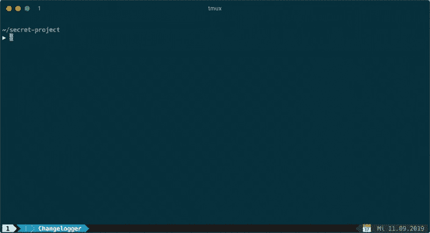

# Changelogger:编写可提交的变更日志

> 原文：<https://dev.to/obstschale/changelogger-writing-comittable-changelogs-58ba>

我们都知道，一个好的项目需要一个变更日志。无论是对其他开发者来说，还是对我们的用户来说，他们都希望了解最新的新特性。如果做得好的话，变更日志是非常有用的。在我们公司，我们为用户保留一个变更日志。但是写它们是一项乏味又耗时的任务。我做了一些研究，最后写了一个 CLI 工具来帮助我们: [Changelogger](https://github.com/churchtools/changelogger) 。

> TL；名为“[变更记录器](https://github.com/churchtools/changelogger)的 dr
> 新 CLI 工具。它为每个变更创建一个单独的文件，这个文件可以被提交，在发布日，它获取所有的日志并将它们添加到`CHANGELOG.md`。

## 问题

我们使用 GitLab，像其他项目一样，我们使用问题来管理每个 bug 或特性。如果事情发生了变化，这需要一个 changelog 条目，我们使用它将日志消息写入问题的主体。

这在一开始是可行的，但现在变得复杂了。程序员忘记添加变更日志，或者审阅者合并了合并请求(MR)，但变更日志丢失。MR 不知道是否添加了更改日志或缺少更改日志。

但是最烦人的工作是在发布期间。我们需要手动将所有日志复制到一个文件中，组织它们，然后发布。如果你处理了 3-5 个问题，这没什么大不了的，但是我们的团队成长了，我们修复了更多的错误，增加了更多的功能，我们知道我们处理了多达 50 个问题。

我们需要帮助！

## 解

我们考虑了这些问题，并设定了一些要求:

*   添加一个变更日志应该很容易
*   变更日志需要在 MR 中可见
*   避免合并冲突

第一个想法是，我们添加一个`CHANGELOG.md`文件，并将每个日志直接写入该文件。坦率地说，这不是一个聪明的主意。因为如果许多开发人员开始添加新日志，合并冲突就会经常发生。所以我做了些调查。

### 保留变更日志

很快，我发现[保持一个变更日志](https://keepachangelog.com/)。这不是标准，而是建议。[奥利弗·拉康](https://olivierlacan.com/)写的，我认为他做得很好。他描述了一个好的变更日志格式，并展示了保存一个好的变更日志的好处。

这个网站很好，但仍然不能解决我们的问题。

### GitLab

我在 GitLab 找到了这个关于[变更日志条目](https://docs.gitlab.com/ee/development/changelog.html)的文档。GitLab 的工程师也遇到了同样的问题，他们编写了一个 bash 脚本，为每个日志创建一个新的 YAML 文件，可以是 comittet。

这是一个好的开始。但是我想要更多。

## 变更记录者

我喜欢开源，我认为写变更日志应该更容易。所以我开始把这个想法写成代码，写了“Changelogger”。这是一个为任何项目添加新日志的 CLI 工具。

[](https://res.cloudinary.com/practicaldev/image/fetch/s--gvaVYJ66--/c_limit%2Cf_auto%2Cfl_progressive%2Cq_66%2Cw_880/https://thepracticaldev.s3.amazonaws.com/i/88mgfw6b5ecdpbo6i5lz.gif)

您可以使用 Composer 将其作为项目的依赖项进行安装，也可以全局安装。如果你不是 PHP 开发人员，可以随意下载 PHAR 文件，这是一种 PHP 可执行的存档格式。

> 重要提示:请注意，该项目仍处于测试阶段。检查[变更日志](https://github.com/churchtools/changelogger/blob/master/CHANGELOG.md)中关于重大变更的信息。还要记住，在 1.0.0 发布之前，小版本中可能会发生重大变化(参见 SemVer)。

### 特性

这个工具的想法很简单。添加一个日志，并在发布期间抓取所有日志并将其添加到 Changelog 中。

*   `changelogger new`:创建新的日志条目。该工具会询问类型
*   `changelogger show`:显示所有未发布的变更
*   `changelogger release <tag>`:将所有未发布的变更添加到`CHANGELOG.md`
*   `changelogger clean`:重新开始。删除所有未发行的变更

### 作者

在 GitLab 中增加了一个`author`字段。对于 GitLab-engineers 来说，这个字段被省略了，但是如果你正在为开源项目做贡献，你可以加上你的名字来获得修改的功劳(即使这只是一个打字错误的修复)。

我认为这很好，它鼓励人们做出贡献。所以使用作者标志`changelogger new --author 'Peter'`你可以填写你的名字。

### 组

这仍然是工作中的一个功能，但我们建立了一个具有许多模块的大型软件。为了保持变更日志的可读性，我们将每个模块的日志分成几个部分。您可以将配置文件添加到项目的根目录，并定义您需要的组。

```
# .changelogger.json
{
  "groups": [
    "Module 1",
    "Module 2",
    "Module 3"
  ]
} 
```

如果组可用，该工具还会要求一个组。

### 清空日志

我们考虑将空日志作为向合并请求添加日志文件的一个选项，但只是为了表明这种改变不需要日志条目。因此，审查者可以看到，这一变化并不意味着在变更日志中列出。

这也允许我们配置 CI 管道来检查日志文件的存在。所以程序员根本没有忘记变更日志，而是声明她/他认为这个变更不需要条目。

### 内部构件

该工具是使用 [Laravel Zero](https://laravel-zero.com/) 用 PHP 编写的。然而，就像我提到的你可以使用 PHAR 直接运行工具。解释器只需要 PHP 7.1+即可。

每个新的日志文件都放在目录`./changelogs/unreleased`中，是一个基本的 YAML 文件。

## 你怎么看？

我想知道，你有没有写一个更新日志，你是带着激情写的，还是更新日志只是浪费时间？

你对 Changelogger 有什么看法？这样的工具能帮助你写更好的变更日志吗？