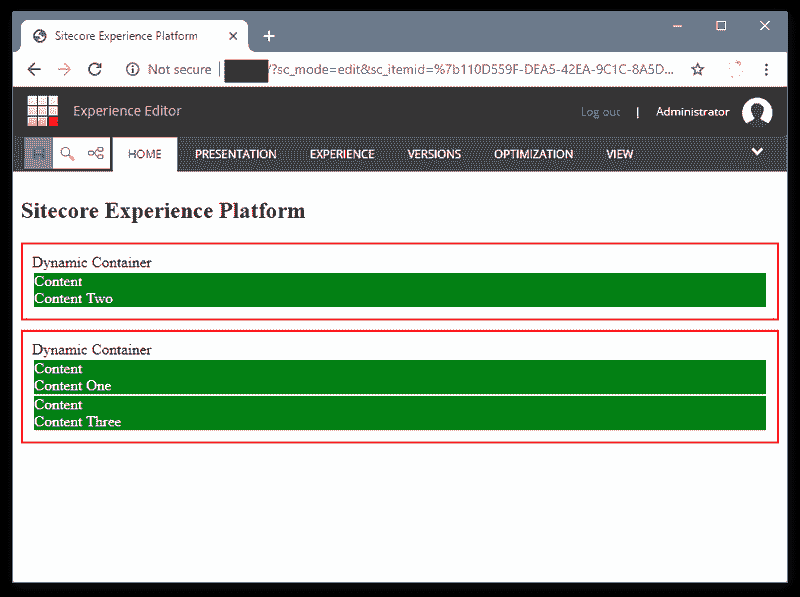
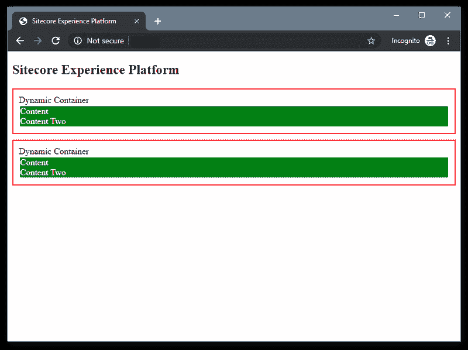
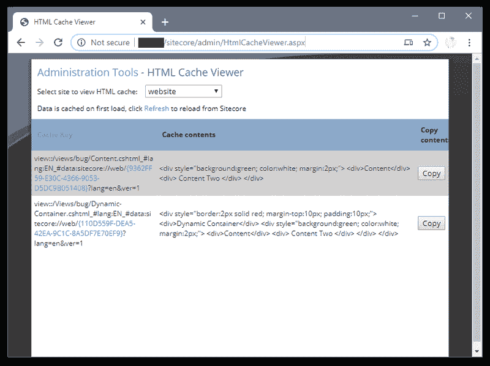
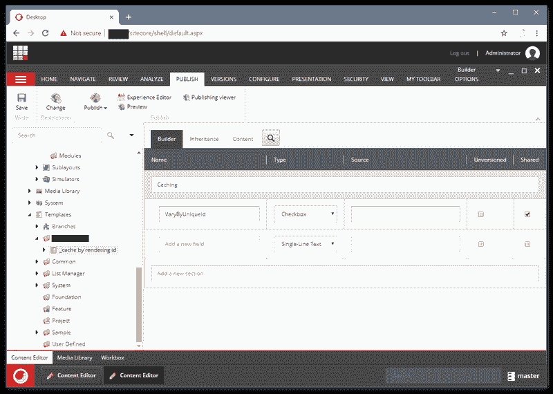
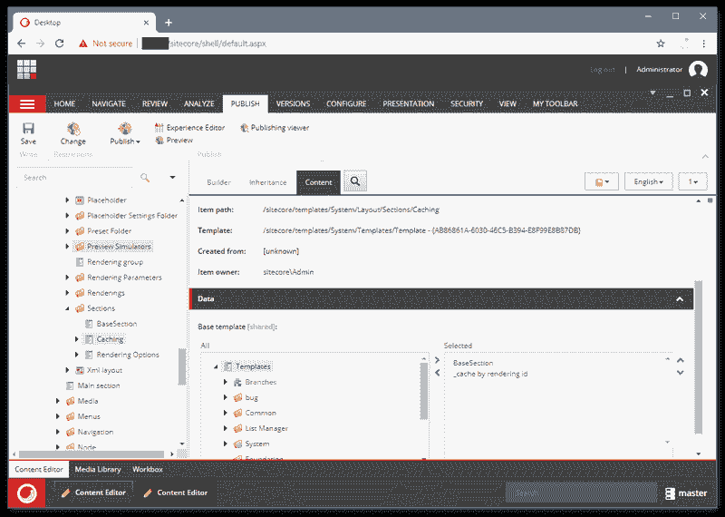
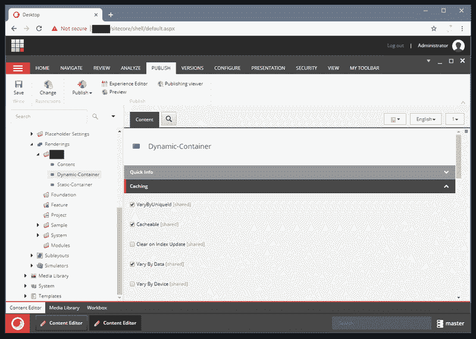
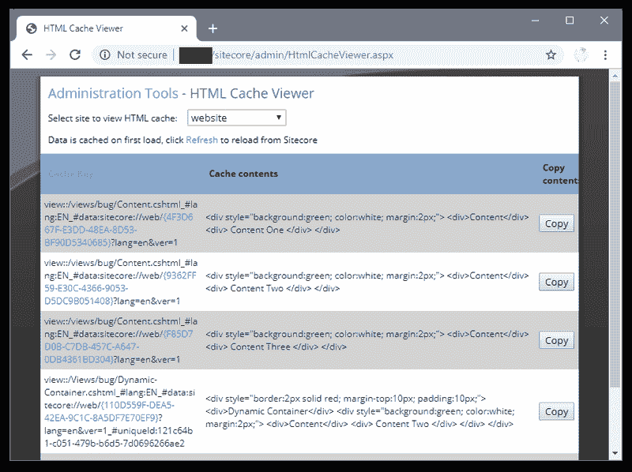
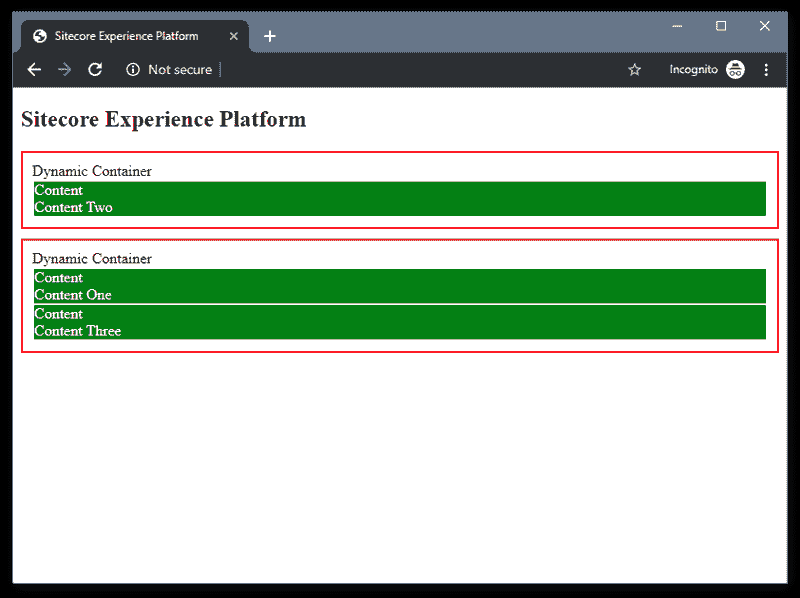

# 当有重复的容器组件时进行缓存

> 原文：<https://dev.to/jermdavis/caching-when-you-have-duplicate-container-components-26m8>

理论上，动态占位符的魔力让我们可以将一个容器组件多次放置在页面上。这在“静态”占位符的旧世界中不起作用，因为渲染引擎不喜欢两个占位符同名。但是，尽管有它的好处，动态实现有一个恼人的边缘情况——您可能无法为您的容器组件启用缓存。我的一个客户最近遇到了这个问题，所以我花了一些时间考虑可能有助于他们解决这个问题的方法。

## 这个问题

假设您有一个容器组件。一个非常简单的就可以了——它真正需要包含的只是一个动态占位符:

```
@using Sitecore.Mvc
<div style="border:2px solid red; margin-top:10px; padding:10px;">
    <div>Dynamic Container</div>
    @Html.Sitecore().DynamicPlaceholder("container")
</div> 
```

<svg width="20px" height="20px" viewBox="0 0 24 24" class="highlight-action crayons-icon highlight-action--fullscreen-on"><title>Enter fullscreen mode</title></svg> <svg width="20px" height="20px" viewBox="0 0 24 24" class="highlight-action crayons-icon highlight-action--fullscreen-off"><title>Exit fullscreen mode</title></svg>

如果您使用该组件的两个实例构建一个页面，并且在每个占位符中包含一些子组件，那么它在 Experience Editor 中看起来会很好:

[](https://jermdavis.files.wordpress.com/2019/09/creatingcontainers.png)

但是，如果容器组件启用了缓存，它在公共站点上看起来就不对了:

[](https://jermdavis.files.wordpress.com/2019/09/wrongui.png)

这是因为代码呈现了第一个容器并缓存了结果。然后它开始呈现第二个，但是缓存命中，所以返回第一个的缓存数据。在缓存中，您会看到:

[](https://jermdavis.files.wordpress.com/2019/09/incorrectcaches.png)

没有适用于“此组件因其子组件而异”的缓存变体，因此只有容器的第一个实例会被渲染和缓存。

我对此感兴趣是因为我收到了一份客户网站的错误报告，上面写着“我们的页面是错误的！”结果就是因为这个问题。我认为有几种主要的方法可以解决这个问题，让客户满意:

## 解决方案一:禁用缓存即可

如果关闭容器组件的缓存设置，一切都会正常。

如果您的容器很少有子容器，或者不经常使用，这可能没什么问题。这种情况下的性能差异可能很小——尤其是如果您能够为容器内的子组件启用缓存的话。

这是一个开发人员可以轻松推出的修复程序(它只是撤销渲染项目的缓存设置)，它根本不会影响编辑器。

## 解决方案二:使用假数据源

您可以使用“随数据源变化”缓存设置来配置容器组件，而不是关闭缓存。如果组件并不真的需要数据源，代码将会忽略 data source 设置所指向的条目，除了缓存。这可以让普通的缓存框架在这里工作。

这不需要部署，这是一个额外的好处。但是对于编辑来说，在不需要的地方添加数据源可能会令人困惑。另外，如果您的容器需要一个数据源，并且您在一个页面上有两个数据源需要相同的数据源，但是有不同的子节点，那么这是不可行的。

所以这可能不是一个好的答案。

### 解决方案三:根据渲染 id 改变缓存

最后，事实证明扩展 Sitecore 的缓存模型并不难，因为它允许“缓存这个特定的渲染实例”。您可以编写一些代码来查看组件的实际子组件，并基于此生成一个缓存键。也许是通过散列来自呈现 XML 的一些数据？但是我突然想到，利用每个渲染实例默认获得的唯一 ID 会更快、更容易(可能结果也差不多)…

为此，您需要创建一个新的数据模板来存储“通过渲染的唯一 id 缓存”标志:

[](https://jermdavis.files.wordpress.com/2019/09/newcacheflag.png)

然后将其添加到标准缓存标志项的继承树中:

[](https://jermdavis.files.wordpress.com/2019/09/extendcachingflags-1.png)

这让您可以在容器呈现上设置缓存标志:

[](https://jermdavis.files.wordpress.com/2019/09/cachesetting.png)

要对这个新标志进行操作，您需要部署一段简单的代码来扩展渲染管道:

```
public class VaryByUniqueIdCacheKey : Sitecore.Mvc.Pipelines.Response.RenderRendering.GenerateCacheKey
{
    protected override string GenerateKey(Rendering rendering, RenderRenderingArgs args)
    {
        var cacheKey = base.GenerateKey(rendering, args);

        var cacheField = (CheckboxField)rendering.RenderingItem.InnerItem.Fields["VaryByUniqueId"];

        if (cacheField.Checked)
        {
            cacheKey += "_#uniqueId:" + rendering.UniqueId.ToString();
        }

        return cacheKey;
    }
} 
```

<svg width="20px" height="20px" viewBox="0 0 24 24" class="highlight-action crayons-icon highlight-action--fullscreen-on"><title>Enter fullscreen mode</title></svg> <svg width="20px" height="20px" viewBox="0 0 24 24" class="highlight-action crayons-icon highlight-action--fullscreen-off"><title>Exit fullscreen mode</title></svg>

它在被渲染的项目上寻找额外的缓存变量标志，如果存在，缓存键用这个渲染实例的惟一 ID 扩展。

您可以通过:
将其修补到您的配置中

```
<?xml version="1.0" encoding="utf-8" ?>
<configuration xmlns:patch="http://www.sitecore.net/xmlconfig/">
  <sitecore>
    <pipelines>
      <mvc.renderRendering>
        <processor patch:instead="processor[@type='Sitecore.Mvc.Pipelines.Response.RenderRendering.GenerateCacheKey, Sitecore.Mvc']" type="Caching.VaryByUniqueIdCacheKey, Caching" />
      </mvc.renderRendering>
    </pipelines>
  </sitecore>
</configuration> 
```

<svg width="20px" height="20px" viewBox="0 0 24 24" class="highlight-action crayons-icon highlight-action--fullscreen-on"><title>Enter fullscreen mode</title></svg> <svg width="20px" height="20px" viewBox="0 0 24 24" class="highlight-action crayons-icon highlight-action--fullscreen-off"><title>Exit fullscreen mode</title></svg>

完成后，您将为容器组件的每个实例获得一个单独的缓存条目:

[](https://jermdavis.files.wordpress.com/2019/09/correctcache.png)

网站的发布版本看起来是正确的:

[](https://jermdavis.files.wordpress.com/2019/09/correctoutput-1.png)

对于您来说，该解决方案是否比禁用缓存“更好”可能取决于呈现每个容器所涉及的工作量。如果他们有一个或两个项目，很可能是不值得的。但是如果您的容器有大量的条目，那么“内存使用与处理时间”的权衡可能是值得的。

这是你的一个选择…