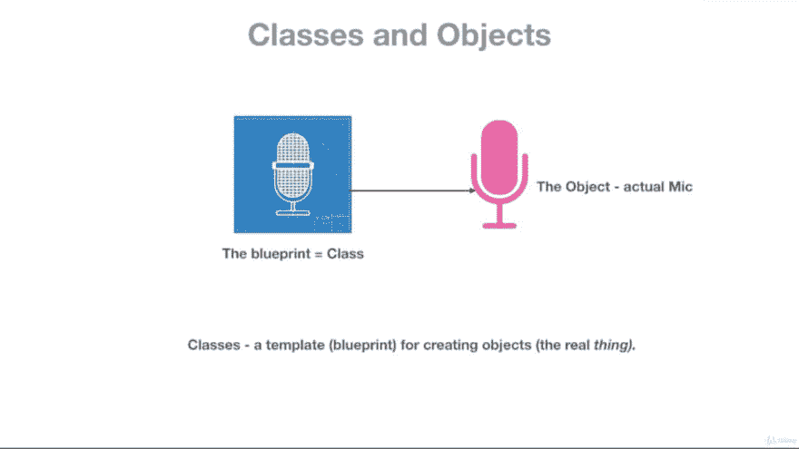
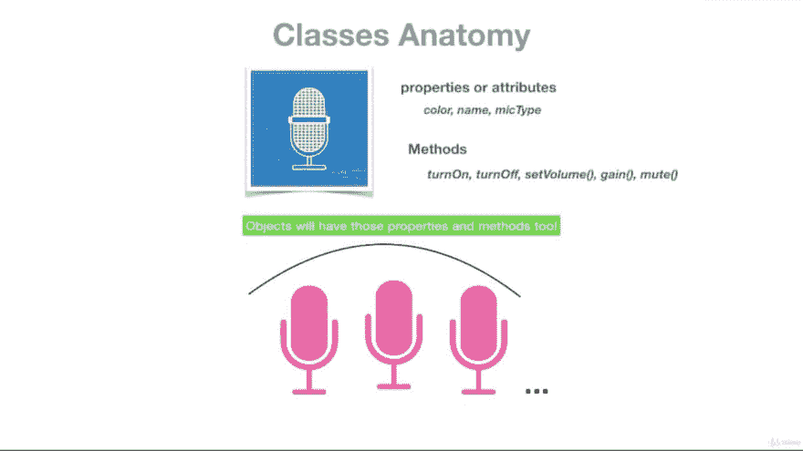

# Dart 中的类和对象

> 原文：<https://dev.to/jay_tillu/classes-and-objects-in-dart-39jp>

> *   No matter which framework you want to learn or use
> *   No matter which language you want to learn and use
> *   No matter what kind of software you want to create
> *   Today, all these are based on the concept of **oops** , and classes and objects are the basis of OOP concept.

在这里，我将通过我的 udemy 导师 Paulo Dichone 给我的一个小例子，向你解释什么是面向对象编程中的类和对象。

如果我们想制造一个麦克风，我们该怎么做？

创建麦克风或任何现实世界事物的第一步是创建它的蓝图。

[](https://res.cloudinary.com/practicaldev/image/fetch/s--5395kADw--/c_limit%2Cf_auto%2Cfl_progressive%2Cq_auto%2Cw_880/https://miro.medium.com/max/1366/1%2AG2qPfTs2ipxuZzk3RWOM3g.jpeg)

在蓝图中，我们将其属性和功能定义如下

*   它的颜色是它的属性
*   它的 **mic 类型**是它的属性
*   其**型号**是其财产等。
*   我们可以设置麦克风的**音量，这是它的功能**
*   我们可以**静音麦克风**，这是它的功能
*   我们可以**打开或关闭**，这是它的功能等。
*   创建一个蓝图后，我们可以使用该蓝图创建多个麦克风。所有麦克风都具有相同的属性和功能。

[](https://res.cloudinary.com/practicaldev/image/fetch/s--DekD8e_A--/c_limit%2Cf_auto%2Cfl_progressive%2Cq_auto%2Cw_880/https://miro.medium.com/max/1366/1%2AiWkXi0n2_TLeCIgjlas3pQ.jpeg)

## 从编程的角度来看

* * *

*   同样的概念也适用于类和对象的术语。
*   蓝图被称为类，麦克风或任何其他设备在这里被称为对象。
*   类是一个蓝图，我们可以从中创建许多对象。所有对象都可以访问所有属性和方法。您还可以根据需要修改访问权限。

在面向对象编程中，类由四个主要部分组成

1.  属性(实例变量)
2.  方法(功能)
3.  Getters 和 Setters
4.  构造器

*   这些组件也被称为类的数据成员。

*   记住这里属性也可以叫做实例变量，方法也可以叫做函数。

## 声明类的语法

* * *

```
class class_name {
   // Properties (Instance Variables)
   // Constructor
   // Methods (Functions)
   // Getters and Setters
} 
```

<svg width="20px" height="20px" viewBox="0 0 24 24" class="highlight-action crayons-icon highlight-action--fullscreen-on"><title>Enter fullscreen mode</title></svg> <svg width="20px" height="20px" viewBox="0 0 24 24" class="highlight-action crayons-icon highlight-action--fullscreen-off"><title>Exit fullscreen mode</title></svg>

*   ***class*** 关键字用于声明一个类。

#### 样本代码

```
class Mobile {
  String color;
  String brandName;

  String calling() {
    return "Mobile can do calling";
  }

  String musicPlay() {
    return "Mobile can play Music";
  }
} 
```

<svg width="20px" height="20px" viewBox="0 0 24 24" class="highlight-action crayons-icon highlight-action--fullscreen-on"><title>Enter fullscreen mode</title></svg> <svg width="20px" height="20px" viewBox="0 0 24 24" class="highlight-action crayons-icon highlight-action--fullscreen-off"><title>Exit fullscreen mode</title></svg>

## 创建对象的语法

* * *

```
var object_name = new class_name (arguments); 
```

<svg width="20px" height="20px" viewBox="0 0 24 24" class="highlight-action crayons-icon highlight-action--fullscreen-on"><title>Enter fullscreen mode</title></svg> <svg width="20px" height="20px" viewBox="0 0 24 24" class="highlight-action crayons-icon highlight-action--fullscreen-off"><title>Exit fullscreen mode</title></svg>

#### 样本代码

```
var myMobile = Mobile(); 
```

<svg width="20px" height="20px" viewBox="0 0 24 24" class="highlight-action crayons-icon highlight-action--fullscreen-on"><title>Enter fullscreen mode</title></svg> <svg width="20px" height="20px" viewBox="0 0 24 24" class="highlight-action crayons-icon highlight-action--fullscreen-off"><title>Exit fullscreen mode</title></svg>

## 访问类的属性和方法

* * *

*   正如我前面提到的，一个类的所有属性和方法都可以通过该类的对象来访问。
*   为了访问类的属性和方法，我们使用“.”(点符号)也称为句号。

#### 访问属性和方法的语法

```
// Accessing Properties
   object_name.property_name;
// Accessing Methods
   object_name.method_name; 
```

<svg width="20px" height="20px" viewBox="0 0 24 24" class="highlight-action crayons-icon highlight-action--fullscreen-on"><title>Enter fullscreen mode</title></svg> <svg width="20px" height="20px" viewBox="0 0 24 24" class="highlight-action crayons-icon highlight-action--fullscreen-off"><title>Exit fullscreen mode</title></svg>

#### 样本代码

```
// Accessing properties
    myMobile.color;
    myMobile.brandName;

// Accessing methods
    myMobile.calling();
    myMobile.musicPlay(); 
```

<svg width="20px" height="20px" viewBox="0 0 24 24" class="highlight-action crayons-icon highlight-action--fullscreen-on"><title>Enter fullscreen mode</title></svg> <svg width="20px" height="20px" viewBox="0 0 24 24" class="highlight-action crayons-icon highlight-action--fullscreen-off"><title>Exit fullscreen mode</title></svg>

### 让我们通过一个完整的程序来理解所有的概念

```
class Mobile {
  String color; // Property
  String brandName;
  String modelName;

  String calling() { // Method Creation
    return "Mobile can do calling";
  }

  String musicPlay() {
    return "Mobile can play Music";
  }

  String videoPlay() {
    return "Mobile can play video";
  }
}

main() {
  var myMobile = new Mobile(); // Creating Object

  myMobile.color = "White"; // Accessing Class's Property
  myMobile.brandName = "Apple Inc.";
  myMobile.modelName = "iPhone 14";

  print(myMobile.color);
  print(myMobile.modelName);
  print(myMobile.brandName);
  print(myMobile.calling());
  print(myMobile.musicPlay());
  print(myMobile.videoPlay());
}

Output
White
iPhone 14
Apple Inc.
Mobile can do calling
Mobile can play Music
Mobile can play video 
```

<svg width="20px" height="20px" viewBox="0 0 24 24" class="highlight-action crayons-icon highlight-action--fullscreen-on"><title>Enter fullscreen mode</title></svg> <svg width="20px" height="20px" viewBox="0 0 24 24" class="highlight-action crayons-icon highlight-action--fullscreen-off"><title>Exit fullscreen mode</title></svg>

*   记住伙计们，类和对象是面向对象编程的基本构件。

*   所有像 **Flutter、React、Django、Angular** 这样的大框架和像 **IDEs 这样的大软件、Web 应用、移动应用、服务器端应用**以及编程语言本身都是基于 OOPs 概念的。

*   所以请对这些概念有一个清晰的认识和强烈的理解。

记住没有老师，没有书，没有视频教程，也没有博客能教会你一切。有人说，学习是一个旅程，旅程永无止境。只是从这里那里收集一些数据，读一读，学一学，练一练，试着去应用。不要因为做不到或者不知道这个概念或者那个概念而犹豫。记住，每个程序员都是从你现在走的这条路上走过的。记住每个大师都曾经是初学者。努力工作，全力以赴。

### 欲了解更多信息，请访问以下链接

*   [Fuchsia OS 官方网站](https://fuchsia.dev/)
*   [Dart 官方网站](https://dart.dev/)
*   [颤振官方网站](https://flutter.dev/)

> 想和我联系吗？以下是链接。我很乐意成为你的朋友。😊
> [Twitter](https://twitter.com/jay_tillu)
> [脸书](https://www.facebook.com/jaytillu.1314/)
> [insta gram](https://www.instagram.com/jay.tillu/)
> [Medium](https://medium.com/jay-tillu)
> 或者直接在[jayviveki13@gmail.com](mailto:jayviveki13@gmail.com)给我发邮件