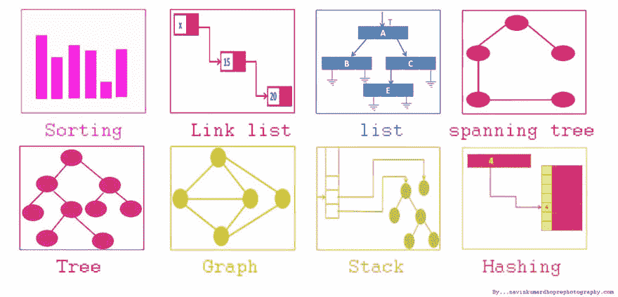
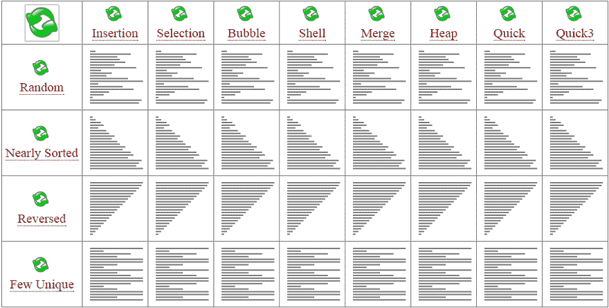
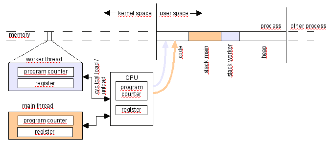
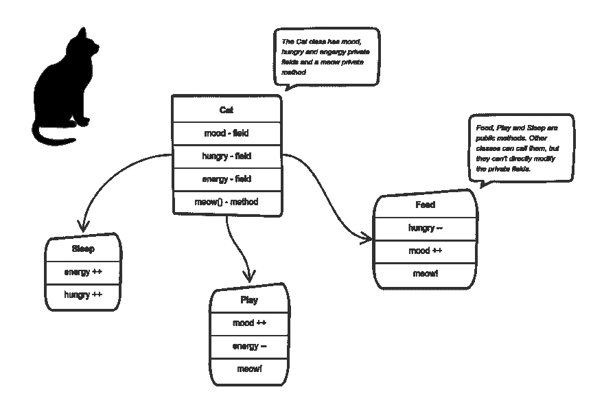

# 软件工程师面试软件工程师面试学习指南

> 原文:[https://dev . to/seattledataguy/the-interview-study-guide-for-software-engineers-764](https://dev.to/seattledataguy/the-interview-study-guide-for-software-engineers-764)

由本·罗戈扬

软件工程面试和其他技术面试一样，需要大量的准备。有许多主题需要涵盖，以确保您准备好连续回答关于算法、数据结构、设计、优化的问题，老实说，只是一个不断增长的主题篮子。

因此，我在上一轮面试中创建了一份清单，涵盖了许多热门话题。

为了帮助你跟踪你的进展，我们已经编制了一份综合的清单，列出了下面的相同问题；这份名单可以在这里找到。

### **温习经典**

1.  [嘶嘶作响](https://www.hackerrank.com/challenges/fizzbuzz/problem)
2.  [560。子阵列和等于 K](https://leetcode.com/problems/subarray-sum-equals-k/)
3.  [数组:左旋转](https://www.hackerrank.com/challenges/ctci-array-left-rotation/problem?h_l=interview&playlist_slugs%5B%5D=interview-preparation-kit&playlist_slugs%5B%5D=arrays)
4.  [字符串:制作字谜](https://www.hackerrank.com/challenges/ctci-making-anagrams/problem?h_l=interview&playlist_slugs%5B%5D=interview-preparation-kit&playlist_slugs%5B%5D=strings)
5.  [第 n 个斐波那契](https://www.algoexpert.io/questions/Nth%20Fibonacci)

你做得怎么样？花一点时间，对这些经典作品进行自我评价。在面试过程中的某个时候，我们会被问到这些问题中的大部分——而且通常是在面试的早期，作为筛选式的问题。它们通常与算法和数据结构关系不大，但仍然需要对循环和数组有很好的理解(没错，数组就是一种数据结构)。

### **算法和数据结构**

#### **预习题**

在浏览关于数据结构和算法的视频内容之前，请考虑尝试下面的这些问题。看看你能不能回答他们。这将有助于你知道应该关注什么。

1.  [985。查询后偶数的总和](https://leetcode.com/problems/sum-of-even-numbers-after-queries/)
2.  [657。机器人返回原点](https://leetcode.com/problems/robot-return-to-origin/)
3.  [961。大小为 2N 的数组中的 n 个重复元素](https://leetcode.com/problems/n-repeated-element-in-size-2n-array/)
4.  [110。平衡二叉树](https://leetcode.com/problems/balanced-binary-tree/)
5.  [3。没有重复字符的最长子串](https://leetcode.com/problems/longest-substring-without-repeating-characters/)
6.  [19。从列表末尾删除第 n 个节点](https://leetcode.com/problems/remove-nth-node-from-end-of-list/)
7.  [23。合并 k 个排序列表](https://leetcode.com/problems/merge-k-sorted-lists/)
8.  31。下一个排列

### 算法和数据结构视频

#### 数据结构

[T2】](https://res.cloudinary.com/practicaldev/image/fetch/s--WlnYH5fq--/c_limit%2Cf_auto%2Cfl_progressive%2Cq_auto%2Cw_880/https://cdn-images-1.medium.com/max/1600/1%2ADyu63sMUVL-gYEZISOE2BQ.jpeg)

1.  数据结构&算法# 1——什么是数据结构？ -视频
2.  [多重调光](https://archive.org/details/0102WhatYouShouldKnow/02_05-multidimensionalArrays.mp4) -视频
3.  [动态数组](https://www.coursera.org/learn/data-structures/lecture/EwbnV/dynamic-arrays) -视频
4.  [调整数组大小](https://archive.org/details/0102WhatYouShouldKnow/03_01-resizableArrays.mp4) -视频
5.  [数据结构:链表](https://youtu.be/njTh_OwMljA) -视频
6.  [核心链表 Vs 数组](https://www.coursera.org/learn/data-structures-optimizing-performance/lecture/rjBs9/core-linked-lists-vs-arrays) -视频
7.  [指针指向指针](https://www.eskimo.com/~scs/cclass/int/sx8.html) -视频
8.  [数据结构:树木](https://youtu.be/oSWTXtMglKE) -视频
9.  [数据结构:堆](https://youtu.be/t0Cq6tVNRBA) -视频
10.  [数据结构:哈希表](https://youtu.be/shs0KM3wKv8) -视频
11.  [电话簿问题](https://www.coursera.org/learn/data-structures/lecture/NYZZP/phone-book-problem) -视频
12.  [数据结构:堆栈和队列](https://youtu.be/wjI1WNcIntg) -视频
13.  [使用堆栈后进先出](https://archive.org/details/0102WhatYouShouldKnow/05_01-usingStacksForLast-inFirst-out.mp4) -视频
14.  [数据结构:计算机科学速成班#14](https://youtu.be/DuDz6B4cqVc) -视频
15.  [数据结构:比试](https://www.youtube.com/watch?v=zIjfhVPRZCg) -视频

#### 算法

[T2】](https://res.cloudinary.com/practicaldev/image/fetch/s--POn2iYyz--/c_limit%2Cf_auto%2Cfl_progressive%2Cq_66%2Cw_880/https://cdn-images-1.medium.com/max/1600/1%2AbPpvELo9_QqQsDz7CSbwXQ.gif)

1.  [算法:图搜索、DFS 和 BFS](https://www.youtube.com/watch?v=zaBhtODEL0w&list=PLX6IKgS15Ue02WDPRCmYKuZicQHit9kFt) -视频
2.  [BFS(广度优先搜索)和 DFS(深度优先搜索)](https://www.youtube.com/watch?v=uWL6FJhq5fM) -视频
3.  [算法:二分搜索法](https://youtu.be/P3YID7liBug) -视频
4.  [二叉查找树评论](https://www.youtube.com/watch?v=x6At0nzX92o&index=1&list=PLA5Lqm4uh9Bbq-E0ZnqTIa8LRaL77ica6) -视频
5.  [Python 算法面试](https://www.youtube.com/watch?v=p65AHm9MX80) -视频
6.  [算法:递归](https://youtu.be/KEEKn7Me-ms) -视频
7.  [算法:冒泡排序](https://youtu.be/6Gv8vg0kcHc) -视频
8.  [算法:合并排序](https://youtu.be/KF2j-9iSf4Q) -视频
9.  [算法:快速排序](https://youtu.be/SLauY6PpjW4) -视频

### **大 O 批注**

1.  [大 O 符号和时间复杂度介绍(数据结构&算法#7)](https://www.youtube.com/watch?v=D6xkbGLQesk) -视频
2.  [哈佛 CS50 -渐近符号](https://www.youtube.com/watch?v=iOq5kSKqeR4) -视频
3.  [算法复杂性分析简介](http://discrete.gr/complexity/) -帖子
4.  [备忘单](http://bigocheatsheet.com/) -帖子

### **动态编程**

1.  [动态编程(像程序员一样思考)-视频](https://www.youtube.com/watch?v=iv_yHjmkv4I)
2.  [算法:记忆和动态编程-视频](https://www.youtube.com/watch?v=P8Xa2BitN3I&t=13s)
3.  6 [.006:动态规划一:斐波那契，最短路径-视频](https://www.youtube.com/watch?v=OQ5jsbhAv_M&t=7s)
4.  [6.006:动态编程 II:文本调整，21 点-视频](https://www.youtube.com/watch?v=ENyox7kNKeY&t=4s)
5.  [动态编程-发布](https://www.topcoder.com/community/competitive-programming/tutorials/dynamic-programming-from-novice-to-advanced/)

### **弦操纵**

1.  [编码面试问答:最长连续字符](https://www.youtube.com/watch?v=qRNB8CV3_LU) -视频
2.  [Sedgewick -子串搜索](https://www.coursera.org/learn/algorithms-part2/home/week/4) -视频

#### 面试问题演练

1.  [谷歌编码访谈-通用价值树问题](https://www.youtube.com/watch?v=7HgsS8bRvjo) -视频
2.  [谷歌编码面试问答#1:第一个重复出现的人物](https://www.youtube.com/watch?v=GJdiM-muYqc) -视频
3.  [找到二叉查找树中的最小和最大元素](https://www.youtube.com/watch?v=Ut90klNN264&index=30&list=PL2_aWCzGMAwI3W_JlcBbtYTwiQSsOTa6P) -视频
4.  [找到二叉树的高度](https://www.youtube.com/watch?v=_pnqMz5nrRs&list=PL2_aWCzGMAwI3W_JlcBbtYTwiQSsOTa6P&index=31) -视频
5.  [检查一棵二叉树是否是二叉查找树](https://www.youtube.com/watch?v=yEwSGhSsT0U&index=35&list=PL2_aWCzGMAwI3W_JlcBbtYTwiQSsOTa6P) -视频
6.  [什么是尾部递归？为什么这么糟糕？](https://www.quora.com/What-is-tail-recursion-Why-is-it-so-bad) -视频

### **课后习题**

现在你已经学了一点，看了几个视频，让我们尝试一些更多的问题！

1.  [越大越好](https://www.hackerrank.com/challenges/bigger-is-greater/problem)
2.  [6。之字形转换](https://leetcode.com/problems/zigzag-conversion/)
3.  [7。反向整数](https://leetcode.com/problems/reverse-integer/)
4.  40。组合和二
5.  [43。乘法字符串](https://leetcode.com/problems/multiply-strings/)
6.  [拉里的阵列](https://www.hackerrank.com/challenges/larrys-array/problem)
7.  [短回文](https://www.hackerrank.com/challenges/short-palindrome/problem)
8.  65。有效数字
9.  [越大越好](https://www.hackerrank.com/challenges/bigger-is-greater/problem)
10.  [全计数排序](https://www.hackerrank.com/challenges/countingsort4/problem)
11.  [莉莉的作业](https://www.hackerrank.com/challenges/lilys-homework/problem)
12.  [普通儿童](https://www.hackerrank.com/challenges/common-child/problem)
13.  459。重复的子串模式
14.  [27。移除元件](https://leetcode.com/problems/remove-element/)
15.  [450。删除 BST 中的节点](https://leetcode.com/problems/delete-node-in-a-bst/)
16.  659。将数组分割成连续的子序列
17.  [具有有界最大值的子阵列数量](https://leetcode.com/problems/number-of-subarrays-with-bounded-maximum)
18.  [组合和四](https://leetcode.com/problems/combination-sum-iv)
19.  [买卖有冷却期股票的最佳时机](https://leetcode.com/problems/best-time-to-buy-and-sell-stock-with-cooldown)
20.  [最长重复字符替换](https://leetcode.com/problems/longest-repeating-character-replacement)
21.  [成对交换节点](https://leetcode.com/problems/swap-nodes-in-pairs)
22.  [二叉树右侧视图](https://leetcode.com/problems/binary-tree-right-side-view)
23.  [展平嵌套列表迭代器](https://leetcode.com/problems/flatten-nested-list-iterator)
24.  [二叉树层次顺序遍历](https://leetcode.com/problems/binary-tree-level-order-traversal)
25.  [二叉查找树迭代器](https://leetcode.com/problems/binary-search-tree-iterator)
26.  [链条对的最大长度](https://leetcode.com/problems/maximum-length-of-pair-chain)
27.  [将链表分割成几部分](https://leetcode.com/problems/split-linked-list-in-parts)

### **运算编程问题**

有些公司不会问你算法问题。相反，他们可能更关注实施和操作问题。这些通常更适合，并涉及实际问题，如循环数据和执行某种任务。这类问题通常不需要太多的练习，因为它更多的是关于数组和散列表等基本概念，以及跟踪你对它们做了什么。

1.  [袋鼠问题](https://www.hackerrank.com/challenges/kangaroo/problem)
2.  [破纪录](https://www.hackerrank.com/challenges/breaking-best-and-worst-records/problem)
3.  [找一根弦](https://www.hackerrank.com/challenges/find-a-string/problem) [iter](https://www.hackerrank.com/challenges/itertools-permutations/problem)
4.  不知道！
5.  [程序员的日子](https://www.hackerrank.com/challenges/day-of-the-programmer/problem)
6.  [排行榜](https://www.hackerrank.com/challenges/climbing-the-leaderboard/problem)
7.  [语序](https://www.hackerrank.com/challenges/word-order/problem)
8.  [夏洛克和方块](https://www.hackerrank.com/challenges/sherlock-and-squares/problem)
9.  [均衡阵列](https://www.hackerrank.com/challenges/equality-in-a-array/problem)
10.  [苹果和橘子](https://www.hackerrank.com/challenges/apple-and-orange/problem)
11.  [更多操作风格问题](https://www.hackerrank.com/domains/python)

### **系统设计视频**

系统设计问题是显示你不仅仅是一个程序员的关键问题。作为一名工程师，你需要有全局观念。某些服务属于哪里，您需要什么样的服务器，您将如何管理流量，等等。所有这些想法都表明，你能够设计软件，而不仅仅是按照人们告诉你的去编码。

1.  [停车场系统](https://youtu.be/DSGsa0pu8-k) -视频
2.  什么应用程序 -视频
3.  [优步设计](https://youtu.be/umWABit-wbk) -视频
4.  Instagram -视频
5.  [火绒服务](https://www.youtube.com/watch?v=xQnIN9bW0og) -视频

### **操作系统**

操作系统问题比较少见，但是对线程、调度、内存等概念有一个扎实的理解是很好的。，哪怕只是基本的了解。当被问到进程和线程之间的区别时，不知道答案是非常尴尬的。

1.  [常见操作系统面试问题](https://www.geeksforgeeks.org/commonly-asked-operating-systems-interview-questions-set-1/)
2.  什么是翻译后备缓冲区？
3.  [为什么循环调度会避免优先级反转问题？](https://leetcode.com/discuss/interview-question/operating-system/220604/Why-does-Round-Robin-avoid-the-Priority-Inversion-Problem)
4.  [中断 Vs 系统调用——什么是文件系统中的‘inode’？](https://leetcode.com/discuss/interview-question/operating-system/124838/Interrupt-Vs-System-Call)
5.  [操作系统面试问答-第一部分](https://www.youtube.com/watch?v=b18X4uOKjHs)
6.  [什么是内核——加里解释](https://www.youtube.com/watch?v=mycVSMyShk8)
7.  [循环算法教程(CPU 调度)](https://www.youtube.com/watch?v=aWlQYllBZDs)
8.  [LRU 缓存的魔力(谷歌开发 100 天)](https://www.youtube.com/watch?v=R5ON3iwx78M) -视频
9.  麻省理工学院 6.004 L15:记忆层级 -视频
10.  [中断](https://www.youtube.com/watch?v=uFKi2-J-6II&list=PLCiOXwirraUCBE9i_ukL8_Kfg6XNv7Se8&index=3) -视频
11.  [调度](https://www.youtube.com/watch?v=-Gu5mYdKbu4&index=4&list=PLCiOXwirraUCBE9i_ukL8_Kfg6XNv7Se8) -视频

### **线程**

[T2】](https://res.cloudinary.com/practicaldev/image/fetch/s--w-Zvxwl5--/c_limit%2Cf_auto%2Cfl_progressive%2Cq_auto%2Cw_880/https://cdn-images-1.medium.com/max/1600/1%2AuSHd3KSxg363C1frMv2KwQ.png)

1.  [用户级线程 Vs 内核级线程](https://leetcode.com/discuss/interview-question/operating-system/124631/User-Level-thread-Vs-Kernel-Level-thread)
2.  [流程介绍&线程](https://www.youtube.com/watch?v=exbKr6fnoUw) -视频
3.  [进程和线程的区别-佐治亚理工学院-高级操作系统](https://www.youtube.com/watch?v=O3EyzlZxx3g&t=11s) -视频
4.  [分叉和多线程的区别](https://leetcode.com/discuss/interview-question/operating-system/125024/Difference-between-forking-and-multithreading)

### **面向对象**

[T2】](https://res.cloudinary.com/practicaldev/image/fetch/s--rGy_EiWL--/c_limit%2Cf_auto%2Cfl_progressive%2Cq_auto%2Cw_880/https://cdn-images-1.medium.com/max/1600/1%2A8LHiDwWhrU4iegYiNnKX_A.png)

类似于操作系统，不是每个面试都会问你面向对象编程，但是你永远不知道。你要确保你记得你的计算机 162 课程的基础知识。

1.  [Java 编程教程- 49 -继承](https://www.youtube.com/watch?v=9JpNY-XAseg) -视频
2.  [Java 编程教程- 55 -多态性介绍](https://www.youtube.com/watch?v=0xw06loTm1k) -视频
3.  [Java 编程教程- 58 -抽象和具体类](https://www.youtube.com/watch?v=TyPNvt6Zg8c) -视频
4.  [Java 编程教程- 57 -覆盖规则](https://www.youtube.com/watch?v=zN9pKULyoj4&t=3s) -视频
5.  [Java 编程教程- 59 -类容纳对象](https://www.youtube.com/watch?v=slY5Ag7IjM0)
6.  [面向对象编程](https://www.youtube.com/watch?v=lbXsrHGhBAU) -视频

### **设计图案**

如果你像我们一样，我们不会被教导各种各样的设计模式。因此，了解它们是如何工作的以及为什么要使用它们是很有好处的。一些面试问题可以简单到“你为什么要使用工厂类？”

1.  [工厂设计模式](https://www.youtube.com/watch?v=ub0DXaeV6hA) -视频
2.  [观察者设计模式](https://youtu.be/wiQdrH2YpT4) -视频
3.  [适配器设计模式](https://www.youtube.com/watch?v=qG286LQM6BU&list=PLF206E906175C7E07&index=13) -视频
4.  [立面设计图案](https://www.youtube.com/watch?v=B1Y8fcYrz5o&list=PLF206E906175C7E07&index=14) -视频
5.  [责任链设计模式](https://www.youtube.com/watch?v=jDX6x8qmjbA&list=PLF206E906175C7E07&index=22) -视频
6.  [解释器设计模式](https://www.youtube.com/watch?v=6CVymSJQuJE&list=PLF206E906175C7E07&index=23) -视频
7.  [单例设计模式教程](https://www.youtube.com/watch?v=NZaXM67fxbs&list=PLF206E906175C7E07&index=7) -视频
8.  [第六章(第一部分)-模式(视频)](https://youtu.be/LAP2A80Ajrg?list=PLJ9pm_Rc9HesnkwKlal_buSIHA-jTZMpO&t=3344) -视频
9.  [头先设计图案](https://www.amazon.com/Head-First-Design-Patterns-Freeman/dp/0596007124) -视频

### SQL

这是最后一部分。你们中的许多人可能不会被问到那么多 SQL 问题。然而，我总是认为它是好的。

#### SQL -问题

1.  [262。行程和用户](https://leetcode.com/problems/trips-and-users/)
2.  601。体育场的人流量
3.  [185。部门前三名薪资](https://leetcode.com/problems/department-top-three-salaries/)
4.  [626。交换座位](https://leetcode.com/problems/exchange-seats/)
5.  [黑客对报告进行排名](https://www.hackerrank.com/challenges/the-report/problem)
6.  [177。第 n 高工资](https://leetcode.com/problems/nth-highest-salary/)
7.  [对称对](https://www.hackerrank.com/challenges/symmetric-pairs/problem)
8.  [职业](https://www.hackerrank.com/challenges/occupations/problem) [位置](https://www.hackerrank.com/challenges/placements/problem)
9.  [奥利凡德的库存](https://www.hackerrank.com/challenges/harry-potter-and-wands/problem)

#### SQL - Videos

1.  [IQ15: 6 SQL 查询面试问题](https://www.youtube.com/watch?v=uAWWhEA57bE) -视频
2.  [了解行号和分析函数](https://www.youtube.com/watch?v=QFj-hZi8MKk) -视频
3.  [分析功能的高级实现](https://www.youtube.com/watch?v=G3kYPzLWtpo&t=4s) -视频
4.  [分析功能的高级实现第 2 部分](https://www.youtube.com/watch?v=XecU6Ieyu-4&t=54s) -视频
5.  [Wise Owl SQL 视频](https://www.youtube.com/watch?v=2-1XQHAgDsM&list=PL6EDEB03D20332309) -视频

#### 发布 SQL 问题

1.  [二叉树节点](https://www.hackerrank.com/challenges/binary-search-tree-1/problem)
2.  [气象观测站 18](https://www.hackerrank.com/challenges/weather-observation-station-18/problem)
3.  [挑战](https://www.hackerrank.com/challenges/challenges/problem) [打印质数](https://www.hackerrank.com/challenges/print-prime-numbers/problem)
4.  [595。大国](https://leetcode.com/problems/big-countries/)
5.  [626。交换座位](https://leetcode.com/problems/exchange-seats/)
6.  [SQL 面试问题:3 个技术筛选练习(针对数据分析师)](https://data36.com/sql-interview-questions-tech-screening-data-analysts/)

面试可能会很艰难，因为你会觉得自己毫无进展。拥有这份学习指南将有助于你跟踪你的进步，并让你更好地了解你是如何做的！

祝你好运！

此外，如果你希望阅读/观看更多精彩的帖子或视频:
[使用 Jupyter 笔记本在 SaturnCloud 上连接到大查询第 2 部分](https://www.youtube.com/watch?v=O1cBN5gJtdw&t=15s) 
[作为数据科学家你应该阅读的三本书](https://www.coriers.com/three-books-you-must-read-if-you-want-a-career-as-a-data-scientist/)
[Hadoop Vs 关系数据库](http://www.acheronanalytics.com/acheron-blog/hadoop-vs-relational-databases)
[算法如何变得不道德和有偏见](http://www.acheronanalytics.com/acheron-blog/how-do-machines-learn-bias-data-science)
[如何改进你的数据驱动策略](http://www.acheronanalytics.com/acheron-blog/how-to-improve-your-data-driven-strategy)
[如何开发健壮的算法](https://medium.com/better-programming/how-to-develop-a-robust-algorithm-c38e08f32201)