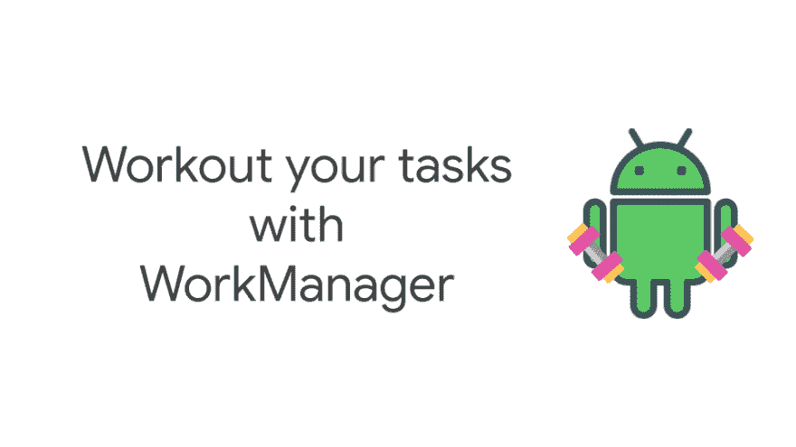
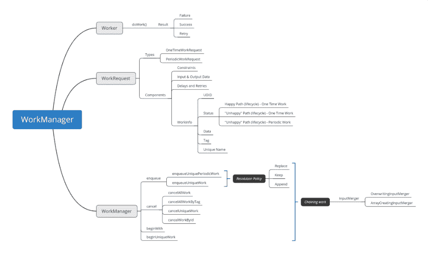

# 使用工作管理器锻炼您的任务—高级主题

> 原文:[https://dev . to/magda miu/workout-your-tasks-with-work manager-advanced-topics-2p 74](https://dev.to/magdamiu/workout-your-tasks-with-workmanager-advanced-topics-2p74)

### 使用工作管理器完成任务—高级主题

*“work manager 是管理* ***可推迟*** *和* ***保证*** *后台工作的库。”*

[T2】](https://res.cloudinary.com/practicaldev/image/fetch/s--ELYWKCYt--/c_limit%2Cf_auto%2Cfl_progressive%2Cq_auto%2Cw_880/https://cdn-images-1.medium.com/max/960/1%2Ayeqx9VaXQkbt-0oDVmItVg.png)

在我之前的两篇关于 [WorkManage](https://developer.android.com/topic/libraries/architecture/workmanager) 的文章中，我讨论了如下主题:

*   Android 内存模型
*   Android 电池优化
*   当前后台处理解决方案
*   工作管理器放在后台工作模式的什么位置
*   工作管理器组件:工作器、工作请求和工作管理器
*   限制
*   输入输出数据

*   [使用工作管理器完成任务—简介](https://dev.to/magdamiu/workout-your-tasks-with-workmanager-intro-pca-temp-slug-2242387)

*   [使用工作管理器训练您的任务—基础知识](https://dev.to/magdamiu/workout-your-tasks-with-workmanager-basics-466d-temp-slug-82140)

在这篇博文中，我将介绍 WorkManager 库的一些额外特性，比如:

*   如何确定一项任务
*   如何获得任务的状态
*   *回退策略*
*   如何组合任务和任务图(链接工作)
*   如何合并输入和输出
*   工作管理器中有哪些线程选项

<figure> 

<figcaption>WorkManager 思维导图</figcaption>

</figure>

#### 1️⃣ **确定任务**

在一个任务(工作)被创建之后，我们会对知道它的状态感兴趣，但是为了获得这个目标，我们应该有一些可以用来识别任务(工作)的机制。有 3 种主要方法可用于识别作品:

1.  **唯一 id (UUID)** :与工作请求相关联的 id 由库生成，它对开发人员不友好
2.  **标签**:一个任务可以包含许多标签
3.  **唯一名称**:一个任务只能有一个唯一名称