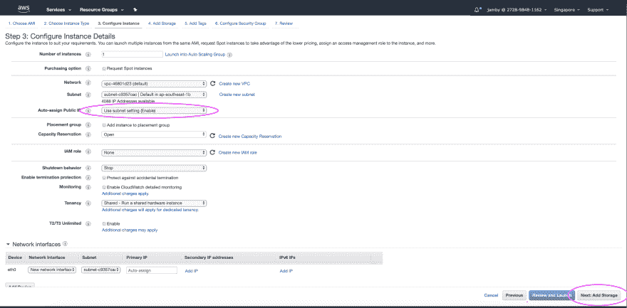
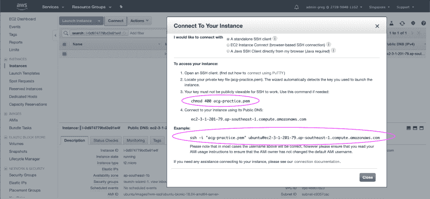
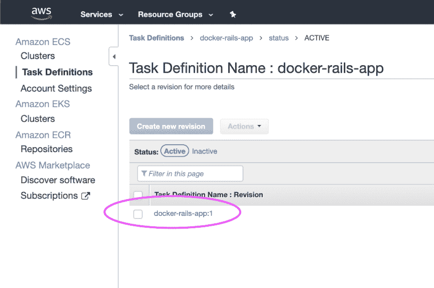
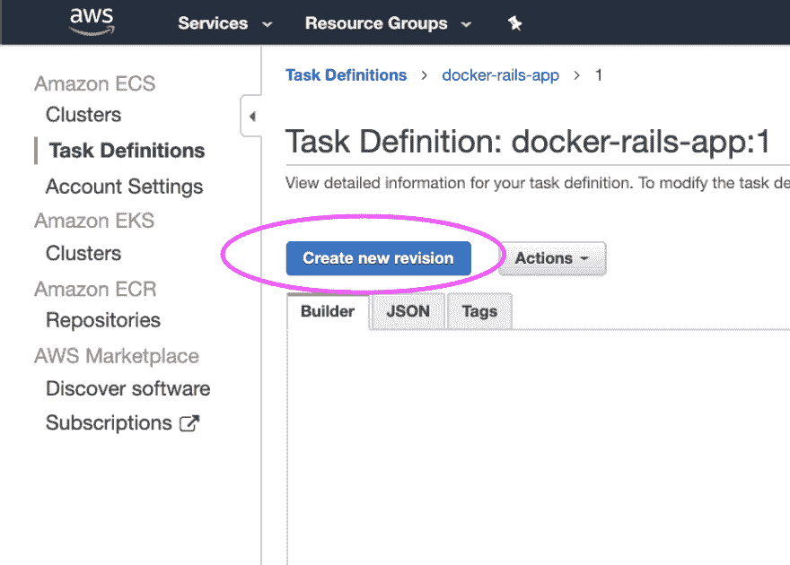
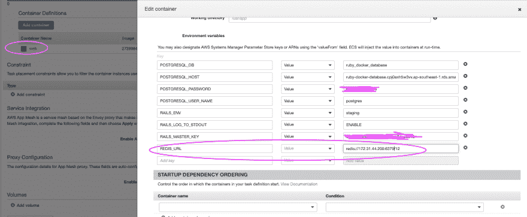
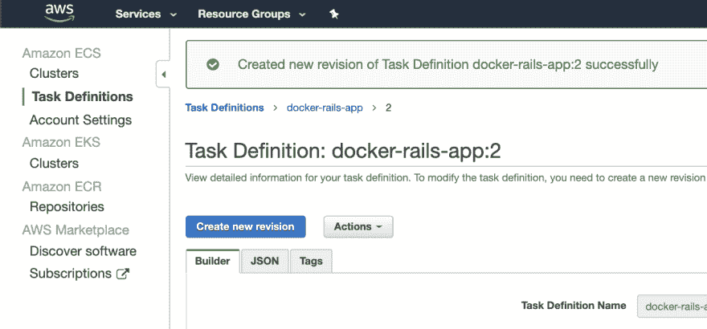
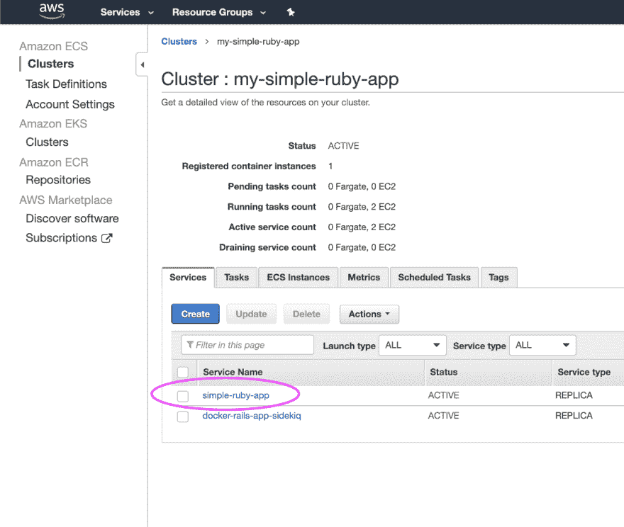
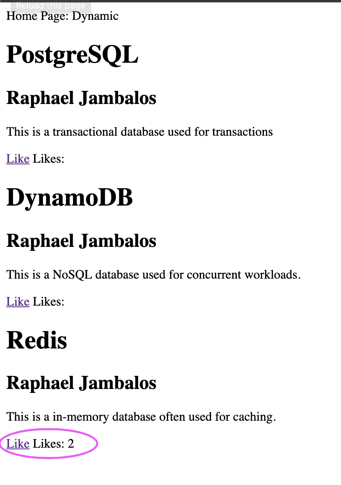

# 在 Amazon ECS 中部署 Rails:第 5 部分——集成 Sidekiq 和 Redis 进行后台处理

> 原文:[https://dev . to/Raphael _ jamba los/deploy-rails-in-Amazon-ECS-part-5-integrate-sidekiq-and-redis-for-background-processing-150 f](https://dev.to/raphael_jambalos/deploy-rails-in-amazon-ecs-part-5-integrate-sidekiq-and-redis-for-background-processing-150f)

这是亚马逊 ECS 帖子*部署 Rails 的第五部分。它是 Docker* 中更广泛的系列*的一部分，而不是“你好世界”。该系列将带您从 Docker 中的 *hello world* 到在 AWS 中部署您的应用程序。*

*   [在 Docker 中构建 Rails + Sidekiq web 应用](https://dev.to/jamby1100/more-than-hello-world-in-docker-run-rails-sidekiq-web-apps-in-docker-1b37)
*   **在亚马逊 ECS 中部署 Rails**
    *   [概念](https://dev.to/jamby1100/deploy-rails-in-amazon-ecs-part-1-concepts-26nl)
    *   [将图像推送到 ECR](https://dev.to/jamby1100/deploy-rails-in-amazon-ecs-part-2-push-an-image-to-ecr-43fl)
    *   [创建 RDS 数据库、任务定义和负载平衡器](https://dev.to/jamby1100/deploy-rails-in-amazon-ecs-part-3-create-the-rds-database-task-definition-and-load-balancer-1ffe)
    *   [创建 ECS 群集并将其全部连接在一起](https://dev.to/jamby1100/deploy-rails-in-amazon-ecs-part-4-create-an-ecs-cluster-338f)
    *   **配置 Sidekiq -我们在这里**
*   [使用 AWS CodeDeploy 自动部署](https://dev.to/raphael_jambalos/automate-deployments-with-aws-codepipeline-52f5)
    *   [深入了解 AWS 代码构建](https://dev.to/jamby1100/automate-docker-build-with-aws-codebuild-9om)

在本帖中，我们将通过添加 Sidekiq 功能来扩展我们构建的 ECS 设置。我们将通过以下方式做到这一点:

*   创建一个 Redis 服务器来保存 Sidekiq 的任务
*   创建托管我们的 Sidekiq 服务器的 ECS 服务
*   将 web 和 Sidekiq 服务连接到此 Redis 服务器

# 13 |为 Sidekiq 创建任务定义

对于该步骤，遵循第 7 节中的说明，但改变以下配置:

*   **(7.3)** 将 *docker-rails-app-sidekiq* 作为任务定义的名称
*   **(7.5)** 用“sidekiq”代替“web”作为容器的名称。
*   **(7.6)** 置`sidekiq,-C,config/sidekiq.yml`为命令。这是运行 Sidekiq 的命令。如果您的配置文件名称不同，您可以指定另一个 yml 配置文件。

# 14 |创建 Sidekiq ECS 服务

对于该步骤，遵循第 10 节中的说明，但改变下面列出的说明。因为这个 Sidekiq 服务永远不会接收流量，所以我们不需要将它连接到负载平衡器。该服务将定期从我们将要创建的 Redis 数据库中获取作业。

*   **(10.2)** 选择 *docker-rails-app-sidekiq* 的任务定义族。对于名称，选择`simple-ruby-app-sidekiq`。
*   **(10.3)** 对于负载平衡器，单击“无”。

# 15 |为 Redis 启动 EC2 实例

Sidekiq 服务需要一个 Redis 数据库来获取任务。这些任务或者被安排定期运行，或者由我们在[上一篇文章](https://dev.to/jamby1100/deploy-rails-in-amazon-ecs-part-4-create-an-ecs-cluster-338f)中创建的 web 服务提供。

为了简单起见，我们将创建一个 EC2 实例来运行 Redis 数据库应用服务器。然后，我们将配置我们的 Sidekiq ECS 服务，以便能够连接到这个 Redis 数据库。

**(15.1)** 启动一个 EC2 实例

对于我们的 EC2 实例，选择 Ubuntu 18.04 t2.micro 实例。对于这个例子，t2.micro 就足够了，但是请注意，这可能会根据您的工作负载使用 Redis 和 Sidekiq 的程度而有所不同。如果您的应用程序也使用 Redis 进行缓存，那么将这个实例变大是一个好主意。

以下是您应该应用的网络选项:

*   确保选择您在第 9 节中[创建 ECS 集群时选择的相同 VPC。](https://dev.to/jamby1100/deploy-rails-in-amazon-ecs-part-4-create-an-ecs-cluster-338f)
*   选择一个公共子网。
*   选择*自动分配公共 IP* 为真。

我们通常不需要 Redis 数据库服务器对公众开放。但是为了简化这个例子，我们希望它可以公开访问，这样我们就可以公开连接到 EC2 实例并安装 Redis。在生产环境中(通常必须更加安全)，您通常首先连接到 jumpbox 实例，然后才能连接到托管 Redis 的 EC2 实例。然后，EC2 实例被放在一个*私有*子网中，并且没有被分配一个公共 IP。

[T2】](https://res.cloudinary.com/practicaldev/image/fetch/s--mHGK4pqT--/c_limit%2Cf_auto%2Cfl_progressive%2Cq_auto%2Cw_880/https://thepracticaldev.s3.amazonaws.com/i/y4ba9n5dxbvk86htrc2r.png)

坚持存储和标记页面的默认设置。

接下来，我们将创建一个名为 *my-docker-redis-sg* 的安全组。创建一个规则，允许来自端口 22(这样您就可以 SSH 到实例中)和来自端口 6379(这样任何人都可以访问我们的 Redis 实例)的流量。

将端口 6379 设置为可供公众访问并不是最佳做法。我们不希望任何人能够连接到这个 Redis 服务器。即使你有一个安全的密码，复杂的暴力攻击也只需要几分钟就能破解。

[T2】](https://res.cloudinary.com/practicaldev/image/fetch/s--yMiOGbRp--/c_limit%2Cf_auto%2Cfl_progressive%2Cq_auto%2Cw_880/https://thepracticaldev.s3.amazonaws.com/i/prb5dygq3kwzjjoizh0g.png)

**(15.2)** 配置 EC2 实例

现在我们已经启动并运行了 EC2 实例，让我们连接它。转到服务选项卡，然后找到 EC2。在左侧菜单中，单击实例。您应该能够看到刚刚创建的实例。一旦其状态变为“正在运行”，单击右上角的连接按钮。您应该能够看到如何连接到实例的说明。

如果你还没有使用你的公钥，你需要做一个`chmod 400 yourkey.pem`来改变它的权限。这是您能够使用密钥的必要步骤。接下来，通过下图所示的 ssh 命令连接到实例。如果这不起作用，它通常会要求你将`root`改为`ubuntu`或`ec2-user`，这取决于你使用的操作系统。

[T2】](https://res.cloudinary.com/practicaldev/image/fetch/s--8eVSiJz---/c_limit%2Cf_auto%2Cfl_progressive%2Cq_auto%2Cw_880/https://thepracticaldev.s3.amazonaws.com/i/hjvigm9grys4zuha9o3i.png)

**(15.3)** 安装铆钉

连接到实例后，使用本[数字海洋文档](https://www.digitalocean.com/community/tutorials/how-to-install-and-secure-redis-on-ubuntu-18-04)中的说明安装 Redis。

**(15.4)** 设置重定向

不过，您必须对 Redis 配置进行一些更改。这些更改将允许我们连接到 Redis 实例。你可以通过`vi /etc/redis/redis.conf`做到这一点。

*   注释掉`bind 127.0.0.1 ::1`
*   使`protected-mode yes`变为`protected-mode no`

**(15.5)** 启动 Redis 服务器

然后，键入`sudo systemctl restart redis.service`使您的更改生效。执行`ps -ef | grep rails`以确保您的流程正在运行:

[T2】](https://res.cloudinary.com/practicaldev/image/fetch/s--aHMW8R5g--/c_limit%2Cf_auto%2Cfl_progressive%2Cq_auto%2Cw_880/https://thepracticaldev.s3.amazonaws.com/i/a9ac3ciqwl5k2kh2akji.png)

# 16 |修改任务定义

现在我们有了一个 Redis 实例和一个 Sidekiq ECS 服务器，缺少的部分是我们如何让 Web ECS 服务将作业扔给 Redis 数据库实例，以及我们如何让 Sidekiq ECS 服务从 Redis 数据库实例获取作业。为此，我们必须更改 Web 和 Sidekiq ECS 服务的任务定义，以包含一个`REDIS_URL`环境变量。

**(16.1)** 在“服务”选项卡上，搜索 ECS 并单击它。点击左侧菜单上的“任务定义”。然后，点选网页的任务定义(`docker-rails-app`)。

[T2】](https://res.cloudinary.com/practicaldev/image/fetch/s--VJzqIx7A--/c_limit%2Cf_auto%2Cfl_progressive%2Cq_auto%2Cw_880/https://thepracticaldev.s3.amazonaws.com/i/yi9sl7qneh8m5xufqpp8.png)

**【16.2】**点击【新建修订】

**(16.3)** 在 web 的容器定义中添加一个`REDIS_URL`环境变量。
[T6】](https://res.cloudinary.com/practicaldev/image/fetch/s--Tdke5HkZ--/c_limit%2Cf_auto%2Cfl_progressive%2Cq_auto%2Cw_880/https://thepracticaldev.s3.amazonaws.com/i/1bmf122xzwha2azg9stn.png)

你应该能看到这样的东西:

**(16.4)** 对 Sidekiq 任务定义(`docker-rails-app-sidekiq`)重复步骤 16.1 至 16.3。

# 17 |更新服务

现在，我们已经为 web 和 Sidekiq 更新了任务定义，是时候部署了！

**(17.1)** 点击*简单红宝石 app* 服务。在该页面上，单击“更新”

[T2】](https://res.cloudinary.com/practicaldev/image/fetch/s--RMvuBg5V--/c_limit%2Cf_auto%2Cfl_progressive%2Cq_auto%2Cw_880/https://thepracticaldev.s3.amazonaws.com/i/me6w11x7c2dv4yx7ukgv.png)

**(17.2)** 选择该服务的任务定义的最新版本。然后勾选“Force New Deployment”以确保这个新版本立即得到部署。

[T2】](https://res.cloudinary.com/practicaldev/image/fetch/s--CH698rBp--/c_limit%2Cf_auto%2Cfl_progressive%2Cq_auto%2Cw_880/https://thepracticaldev.s3.amazonaws.com/i/uo8k2h7frhggrk5it1ai.png)

**(17.3)** 在这里监控你的部署。您的更改需要几分钟才能生效。您应该可以在这里看到您的新版本是否已经部署。如果`PRIMARY`的运行计数为 1+,则您的应用已经部署

[T2】](https://res.cloudinary.com/practicaldev/image/fetch/s--SyzMZPJY--/c_limit%2Cf_auto%2Cfl_progressive%2Cq_auto%2Cw_880/https://thepracticaldev.s3.amazonaws.com/i/jr0py7yt65as48ocp5hl.png)

**(17.4)** 对 Sidekiq 服务(`simple-ruby-app-sidekiq`)重复相同的步骤

# 18 |完了！

使用来自[第 12 节](https://dev.to/jamby1100/deploy-rails-in-amazon-ecs-part-4-create-an-ecs-cluster-338f)的 URL，再次访问网站。您应该可以单击“喜欢”按钮。这个 like 按钮将告诉 web ECS 服务在 Redis 数据库服务器中抛出一个任务。Sidekiq ECS 服务从 Redis 获得这个任务，并按照 worker 上的指示将 like_count 加 1。

[T2】](https://res.cloudinary.com/practicaldev/image/fetch/s--AD8yIFG4--/c_limit%2Cf_auto%2Cfl_progressive%2Cq_auto%2Cw_880/https://thepracticaldev.s3.amazonaws.com/i/nvdbss0ifctwlfol1uda.png)

在生产中部署 Docker 化的 Rails 应用程序在开始时需要做很多繁重的工作，但是一旦设置完成，你就可以享受 Docker 和 ECS 的好处:更低的成本、更快的部署、更快的回滚、更容易的开发和部署等等。

现在，您已经在 Docker 中完成了自己的示例 Rails 应用程序，您可以将它扩展到自己的生产环境中。

如果您有任何意见、建议或者只是想让我知道这个系列对您有什么帮助，欢迎在下面留下您的评论，或者给我发消息！我很想收到你的来信！

*特别感谢我的编辑艾伦，他让我的帖子更加连贯*。