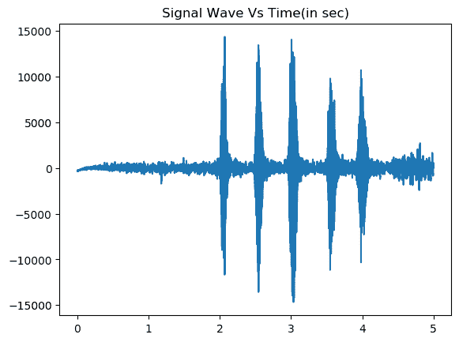

# 环境声音分类

> 原文:[https://dev . to/apoorvadave/environmental-sound-class ification-1 hhl](https://dev.to/apoorvadave/environmental-sound-classification-1hhl)

我们已经看到了机器学习、分类和回归的基础知识。在本文中，我们将更深入一点，研究如何进行音频分类。我们将为此任务训练卷积神经网络、多层感知器和 SVM。同样的代码也可以很容易地扩展来训练其他分类模型。如果您还没有阅读，我强烈建议您阅读以前关于分类基础的文章。

这里的主要问题是我们如何处理音频文件，并将其转换成一种我们可以输入神经网络的形式。

这将需要不到一个小时来设置和获得您的第一个工作音频分类器！所以让我们开始吧！😉

# [](#dependencies)依赖关系

我们将使用 python。在我们开始编码之前，我们需要以下模块。这可以使用 pip 轻松下载。

1.  keras
2.  利布罗萨
3.  声音设备
4.  声音文件
5.  scikit-learn
6.  matplotlib

# [](#dataset)数据集

我们将使用 ESC-10 数据集进行声音分类。它是一组标记的 400 个环境记录(10 个类别，每个类别 40 个剪辑，每个剪辑 5 秒)。它是更大的 [ESC-50 数据集](https://github.com/karoldvl/ESC-50/)的子集

每班 40 人。奥格文件。ESC-10 和 ESC-50 数据集已经预先安排成 5 个统一大小的文件夹，以便从同一原始源记录中提取的剪辑总是包含在单个文件夹中。

# [](#visualize-dataset)可视化数据集

在提取特征和训练模型之前，我们需要可视化数据集中不同类别的波形。

```
import matplotlib.pyplot as plt
import numpy as np
import wave
import soundfile as sf 
```

<svg width="20px" height="20px" viewBox="0 0 24 24" class="highlight-action crayons-icon highlight-action--fullscreen-on"><title>Enter fullscreen mode</title></svg> <svg width="20px" height="20px" viewBox="0 0 24 24" class="highlight-action crayons-icon highlight-action--fullscreen-off"><title>Exit fullscreen mode</title></svg>

下面的函数`visualize_wav()`获取一个 ogg 文件，使用 soundfile 模块读取它，并返回数据和采样率。我们可以使用`sf.wav()`函数为相应的 ogg 文件编写 wav 文件。使用 matplotlib，我们可以绘制信号波形图并生成曲线图。

```
def visualize_wav(oggfile):

    data, samplerate = sf.read(oggfile)

    if not os.path.exists('sample_wav'):
        os.mkdir('sample_wav')

    sf.write('sample_wav/new_file.wav', data, samplerate)
    spf = wave.open('sample_wav/new_file_Fire.wav')
    signal = spf.readframes(-1)
    signal = np.fromstring(signal,'Int16')

    if spf.getnchannels() == 2:
        print('just mono files. not stereo')
        sys.exit(0)

    # plotting x axis in seconds. create time vector spaced linearly with size of audio file. divide size of signal by frame rate to get stop limit
    Time = np.linspace(0,len(signal)/samplerate, num = len(signal))
    plt.figure(1)
    plt.title('Signal Wave Vs Time(in sec)')
    plt.plot(Time, signal)
    plt.savefig('sample_wav/sample_waveplot_Fire.png', bbox_inches='tight')
    plt.show() 
```

<svg width="20px" height="20px" viewBox="0 0 24 24" class="highlight-action crayons-icon highlight-action--fullscreen-on"><title>Enter fullscreen mode</title></svg> <svg width="20px" height="20px" viewBox="0 0 24 24" class="highlight-action crayons-icon highlight-action--fullscreen-off"><title>Exit fullscreen mode</title></svg>

[](https://res.cloudinary.com/practicaldev/image/fetch/s--a3DHCKPY--/c_limit%2Cf_auto%2Cfl_progressive%2Cq_auto%2Cw_880/https://thepracticaldev.s3.amazonaws.com/i/jg8963pxzrad24r6na1v.png) 

<figure>

<figcaption>狗的声音波形图</figcaption>

</figure>

您可以运行相同的代码来为不同的类生成波形图，并直观地显示差异。

# [](#feature-extraction)特征提取

对于数据集中的每个音频文件，我们将提取 MFCC(Mel-频率倒谱-我们将为每个音频样本提供一个图像表示)及其分类标签。为此，我们将使用 Librosa 的`mfcc()`函数，该函数从时间序列音频数据中生成 MFCC。

`get_features()`需要一个。ogg 文件并使用 Librosa 库提取 mfcc。

```
def get_features(file_name):

    if file_name: 
        X, sample_rate = sf.read(file_name, dtype='float32')

    # mfcc (mel-frequency cepstrum)
    mfccs = librosa.feature.mfcc(y=X, sr=sample_rate, n_mfcc=40)
    mfccs_scaled = np.mean(mfccs.T,axis=0)
    return mfccs_scaled 
```

<svg width="20px" height="20px" viewBox="0 0 24 24" class="highlight-action crayons-icon highlight-action--fullscreen-on"><title>Enter fullscreen mode</title></svg> <svg width="20px" height="20px" viewBox="0 0 24 24" class="highlight-action crayons-icon highlight-action--fullscreen-off"><title>Exit fullscreen mode</title></svg>

数据集被下载到“数据集”文件夹中。我们将遍历子目录(每个类)并从它们的 ogg 文件中提取特征。最后，我们将创建一个具有 mfcc 特性和相应类标签的数据帧。

```
def extract_features():

    # path to dataset containing 10 subdirectories of .ogg files
    sub_dirs = os.listdir('dataset')
    sub_dirs.sort()
    features_list = []
    for label, sub_dir in enumerate(sub_dirs):  
        for file_name in glob.glob(os.path.join('dataset',sub_dir,"*.ogg")):
            print("Extracting file ", file_name)
            try:
                mfccs = get_features(file_name)
            except Exception as e:
                print("Extraction error")
                continue
            features_list.append([mfccs,label])

    features_df = pd.DataFrame(features_list,columns = ['feature','class_label'])
    print(features_df.head())    
    return features_df 
```

<svg width="20px" height="20px" viewBox="0 0 24 24" class="highlight-action crayons-icon highlight-action--fullscreen-on"><title>Enter fullscreen mode</title></svg> <svg width="20px" height="20px" viewBox="0 0 24 24" class="highlight-action crayons-icon highlight-action--fullscreen-off"><title>Exit fullscreen mode</title></svg>

# [](#train-model)列车型号

一旦我们提取了特征，我们就需要将它们转换成 numpy 数组，这样它们就可以输入到神经网络中。

```
def get_numpy_array(features_df):

    X = np.array(features_df.feature.tolist())
    y = np.array(features_df.class_label.tolist())
    # encode classification labels
    le = LabelEncoder()
    # one hot encoded labels
    yy = to_categorical(le.fit_transform(y))
    return X,yy,le 
```

<svg width="20px" height="20px" viewBox="0 0 24 24" class="highlight-action crayons-icon highlight-action--fullscreen-on"><title>Enter fullscreen mode</title></svg> <svg width="20px" height="20px" viewBox="0 0 24 24" class="highlight-action crayons-icon highlight-action--fullscreen-off"><title>Exit fullscreen mode</title></svg>

`X`和`yy`按照 80-20 的比例拆分成训练和测试数据。

```
def get_train_test(X,y):

    X_train, X_test, y_train, y_test = train_test_split(X,y,test_size = 0.2, random_state = 42)
    return  X_train, X_test, y_train, y_test 
```

<svg width="20px" height="20px" viewBox="0 0 24 24" class="highlight-action crayons-icon highlight-action--fullscreen-on"><title>Enter fullscreen mode</title></svg> <svg width="20px" height="20px" viewBox="0 0 24 24" class="highlight-action crayons-icon highlight-action--fullscreen-off"><title>Exit fullscreen mode</title></svg>

现在我们将定义我们的模型架构。我们将使用 Keras 来创建我们的多层感知器网络。

```
def create_mlp(num_labels):

    model = Sequential()
    model.add(Dense(256,input_shape = (40,)))
    model.add(Activation('relu'))
    model.add(Dropout(0.5))

    model.add(Dense(256,input_shape = (40,)))
    model.add(Activation('relu'))
    model.add(Dropout(0.5))

    model.add(Dense(num_labels))
    model.add(Activation('softmax'))
    return model 
```

<svg width="20px" height="20px" viewBox="0 0 24 24" class="highlight-action crayons-icon highlight-action--fullscreen-on"><title>Enter fullscreen mode</title></svg> <svg width="20px" height="20px" viewBox="0 0 24 24" class="highlight-action crayons-icon highlight-action--fullscreen-off"><title>Exit fullscreen mode</title></svg>

一旦定义了模型，我们需要通过定义损失、指标和优化器来编译它。然后将模型与训练数据`X_train`和`y_train`进行拟合。我们的模型被训练 100 个历元，批次大小为 32。训练好的模型最终以. hd5 文件的形式保存在磁盘中。该模型可以在以后加载用于预测。

```
 def train(model,X_train, X_test, y_train, y_test,model_file):    

    # compile the model 
    model.compile(loss = 'categorical_crossentropy',metrics=['accuracy'],optimizer='adam')

    print(model.summary())

    print("training for 100 epochs with batch size 32")

    model.fit(X_train,y_train,batch_size= 32, epochs = 100, validation_data=(X_test,y_test))

    # save model to disk
    print("Saving model to disk")
    model.save(model_file) 
```

<svg width="20px" height="20px" viewBox="0 0 24 24" class="highlight-action crayons-icon highlight-action--fullscreen-on"><title>Enter fullscreen mode</title></svg> <svg width="20px" height="20px" viewBox="0 0 24 24" class="highlight-action crayons-icon highlight-action--fullscreen-off"><title>Exit fullscreen mode</title></svg>

就是这个！我们已经训练了我们的环境声音分类器！！😃

# [](#compute-accuracy)计算准确度

现在，很明显，我们想检查我们的模型表现如何😛

```
def compute(X_test,y_test,model_file):

    # load model from disk
    loaded_model = load_model(model_file)
    score = loaded_model.evaluate(X_test,y_test)
    return score[0],score[1]*100 
```

<svg width="20px" height="20px" viewBox="0 0 24 24" class="highlight-action crayons-icon highlight-action--fullscreen-on"><title>Enter fullscreen mode</title></svg> <svg width="20px" height="20px" viewBox="0 0 24 24" class="highlight-action crayons-icon highlight-action--fullscreen-off"><title>Exit fullscreen mode</title></svg>

```
Test loss 1.5628961682319642
Test accuracy 78.7 
```

<svg width="20px" height="20px" viewBox="0 0 24 24" class="highlight-action crayons-icon highlight-action--fullscreen-on"><title>Enter fullscreen mode</title></svg> <svg width="20px" height="20px" viewBox="0 0 24 24" class="highlight-action crayons-icon highlight-action--fullscreen-off"><title>Exit fullscreen mode</title></svg>

# [](#make-predictions)做出预测

我们还可以使用下面的代码来预测我们提供的任何输入文件的类标签-

```
def predict(filename,le,model_file):

    model = load_model(model_file)
    prediction_feature = extract_features.get_features(filename)
    if model_file == "trained_mlp.h5":
        prediction_feature = np.array([prediction_feature])
    elif model_file == "trained_cnn.h5":    
        prediction_feature = np.expand_dims(np.array([prediction_feature]),axis=2)

    predicted_vector = model.predict_classes(prediction_feature)
    predicted_class = le.inverse_transform(predicted_vector)
    print("Predicted class",predicted_class[0])
    predicted_proba_vector = model.predict_proba([prediction_feature])

    predicted_proba = predicted_proba_vector[0]
    for i in range(len(predicted_proba)): 
        category = le.inverse_transform(np.array([i]))
        print(category[0], "\t\t : ", format(predicted_proba[i], '.32f') ) 
```

<svg width="20px" height="20px" viewBox="0 0 24 24" class="highlight-action crayons-icon highlight-action--fullscreen-on"><title>Enter fullscreen mode</title></svg> <svg width="20px" height="20px" viewBox="0 0 24 24" class="highlight-action crayons-icon highlight-action--fullscreen-off"><title>Exit fullscreen mode</title></svg>

这个函数将加载我们预先训练的模型，从您提供的输入 ogg 文件中提取 mfcc，并输出每个类的概率范围。概率最大的就是我们想要的类！😃

对于 dog 类的样本 ogg 文件，以下是概率预测-

```
Predicted class 0
0                :  0.96639919281005859375000000000000
1                :  0.00000196780410988139919936656952
2                :  0.00000063572736053174594417214394
3                :  0.00000597824555370607413351535797
4                :  0.02464177832007408142089843750000
5                :  0.00003698830187204293906688690186
6                :  0.00031352625228464603424072265625
7                :  0.00013375715934671461582183837891
8                :  0.00846461206674575805664062500000
9                :  0.00000165236258453660411760210991 
```

<svg width="20px" height="20px" viewBox="0 0 24 24" class="highlight-action crayons-icon highlight-action--fullscreen-on"><title>Enter fullscreen mode</title></svg> <svg width="20px" height="20px" viewBox="0 0 24 24" class="highlight-action crayons-icon highlight-action--fullscreen-off"><title>Exit fullscreen mode</title></svg>

预测的类别是`0`，它是`Dog`的类别标签。

# [](#conclusion)结论

处理音频文件并没有听起来那么困难。音频文件可以很容易地以时间序列数据的形式表示。我们在 python 中预定义了库，这使得我们的任务更加简单。

你也可以在我的 Github repo 中查看完整的代码。在这里，我已经训练了 SVM，MLP 和美国有线电视新闻网相同的数据集和代码安排在适当的文件，这使得它很容易理解。

[https://github . com/apoorva-Dave/Environmental-Sound-class ification](https://github.com/apoorva-dave/Environmental-Sound-Classification)

虽然我为此训练了 3 个不同的模型，但它们之间的准确性差异很小。如果你发现任何提高分数的方法，请留下评论。

如果你喜欢这篇文章，一定要展示一些❤，请继续关注！在那之前，祝你学习愉快😸