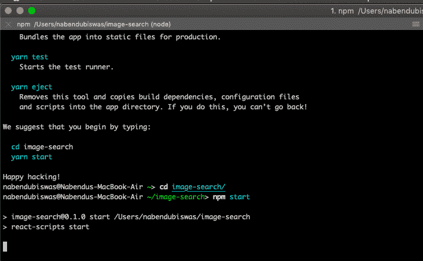
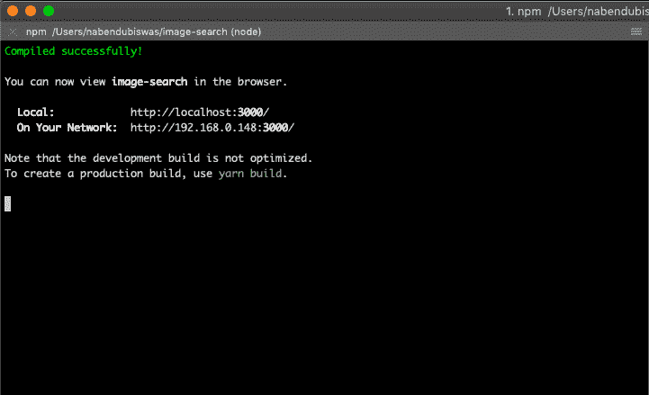
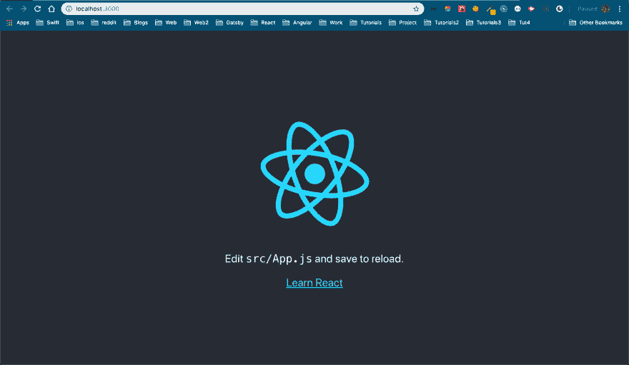
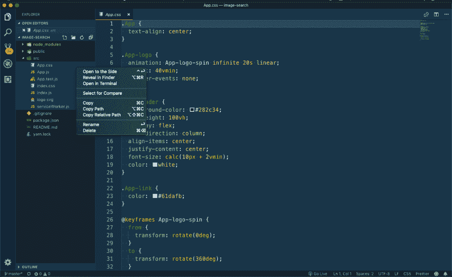
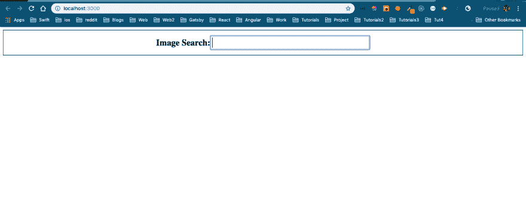

# ReactJS -1 中使用 unsplash API 的图片搜索应用程序

> 原文:[https://dev . to/nabe NDU 82/image-search-app-using-unsplash-API-in-react js-1-54kj](https://dev.to/nabendu82/image-search-app-using-unsplash-api-in-reactjs-1-54kj)

欢迎阅读全新系列，使用 ReactJS 从头构建 web 应用程序。我们将使用 2019 年最新的 ReactJS 语法来创建这个应用程序。这个应用程序是从 udemy 上的 *Stephen Grider* 的伟大课程 *Modern React with Redux* 中学习而创建的。点击可以找到[的链接。](https://www.udemy.com/react-redux/)

让我们开始构建我们的应用程序。去你的终端，通过 *npx 创建-反应-应用图片-搜索*创建一个全新的应用。仅当您安装了 npm 5.2+时，此命令才有效。点击这个[链接](https://github.com/facebook/create-react-app)，了解更多关于 facebook 的这个奇妙工具以及创建一个新的 react 应用程序的其他方法。

[ ](https://res.cloudinary.com/practicaldev/image/fetch/s--qIp4eMlU--/c_limit%2Cf_auto%2Cfl_progressive%2Cq_auto%2Cw_880/https://cdn-images-1.medium.com/max/2000/1%2AOJJm9wSW9iYwokDoWixmdw.png) *创建-反应-app*

现在，如果成功，您将获得 *Happy Hacking* 消息和指令。我们将 cd 放到新创建的文件夹中，并执行 *npm 启动*。

[ ](https://res.cloudinary.com/practicaldev/image/fetch/s--a1vU1ez8--/c_limit%2Cf_auto%2Cfl_progressive%2Cq_auto%2Cw_880/https://cdn-images-1.medium.com/max/2000/1%2AZyg2JUfOZ8P-EWz16CFVIg.png) *快乐黑客*

如果编译成功，您将得到下面的消息。

[ ](https://res.cloudinary.com/practicaldev/image/fetch/s--xaTJD6xh--/c_limit%2Cf_auto%2Cfl_progressive%2Cq_auto%2Cw_880/https://cdn-images-1.medium.com/max/2000/1%2AEprxV63RosjrgDWHqLww5w.png) *成功*

它会自动打开 [http://localhost:3000/](http://localhost:3000/) 或者你用任何现代浏览器打开。它将显示基本的反应应用程序。

[ ](https://res.cloudinary.com/practicaldev/image/fetch/s--xYbIaaFI--/c_limit%2Cf_auto%2Cfl_progressive%2Cq_auto%2Cw_880/https://cdn-images-1.medium.com/max/2880/1%2ATwxpoUbDNJgkTYLJZnj25Q.png) *基础反应 app*

现在，React 就是把我们的应用分成组件。这里，我们也将有两个主要组件-搜索栏和 ImageList。

在 VSCode 中打开项目。选择 src 文件夹中的所有内容(如下图所示)并删除。

[](https://res.cloudinary.com/practicaldev/image/fetch/s--vUVnZnsQ--/c_limit%2Cf_auto%2Cfl_progressive%2Cq_auto%2Cw_880/https://cdn-images-1.medium.com/max/2880/1%2AhRp3Za2vgl5VvRLAyLoZkg.png)T3】开始新的

接下来，在 *src* 里面新建一个文件夹 *components* 和一个文件 *App.js* 。同样，在 *src* 文件夹中创建 *index.js* 。

在 App.js 中，我们现在创建一个基本的功能组件。在 **App.js** 中键入以下代码。

```
import React from 'react';

const App = () => {
    return (
        <div>App</div>
    )
}

export default App; 
```

转到 index.js 并在其中呈现这个 App.js。在 **index.js** 中键入以下代码。

```
import React from 'react';
import ReactDOM from 'react-dom';
import App from './components/App';

ReactDOM.render(<App />, document.querySelector('#root')); 
```

这将在我们的本地主机上显示文本应用程序，如下所示。

[ ](https://res.cloudinary.com/practicaldev/image/fetch/s--EZZU5USF--/c_limit%2Cf_auto%2Cfl_progressive%2Cq_auto%2Cw_880/https://cdn-images-1.medium.com/max/2880/1%2AptpS0Y9DthFtur9Z1By1TQ.png) *基础 app*

我们现在将在组件文件夹中创建 **SearchBar.js** 文件。这将是一个基本的基于类的组件，它将有一个表单内的输入字段。

```
import React from 'react';

class SearchBar extends React.Component {
    render() {
        return (
            <div>
                <form>
                    <input type="text" />
                </form>
            </div>
        )
    }
}

export default SearchBar; 
```

现在转到 **App.js** 来呈现我们的 SearchBar 组件。

```
import React from 'react';
import SearchBar from './SearchBar';

const App = () => {
    return (
        <div>
            <SearchBar />
        </div>
    )
}

export default App; 
```

现在，我们的小搜索栏显示在本地主机。我们很快会设计它。

[ ](https://res.cloudinary.com/practicaldev/image/fetch/s--MToxgl0I--/c_limit%2Cf_auto%2Cfl_progressive%2Cq_auto%2Cw_880/https://cdn-images-1.medium.com/max/2880/1%2AWk5RUqw6ze4Yd8DN9KMY6w.png) *左上角的小搜索栏*

让风格有点我们的搜索栏现在将良好的旧 CSS。转到 **SearchBar.js** 并给出一些*类名*，我们将在 css 文件中使用它们。

```
import React from 'react';
**import './SearchBar.css';**

class SearchBar extends React.Component {
    render() {
        return (
            <div>
                <form **className="flexContainer"**>
                    <label>**<h2>**Image Search: **</h2>**</label>
                    <input **className="inputStyle"** type="text" />
                </form>
            </div>
        )
    }
}

export default SearchBar; 
```

现在在同一个目录下创建一个文件 **SearchBar.css** 并添加一些样式如下。

```
.flexContainer {
    display: flex;
    justify-content: center;
    align-items: center;
    border: 1px solid black;
}

.inputStyle{
    font-size: 1.5em;
    padding: 3px;
    display: inline-block;
    width: 30%;
} 
```

这些简单的 CSS 现在让我们的搜索栏更有风格了。去本地主机看看我们的变化。

[ ](https://res.cloudinary.com/practicaldev/image/fetch/s--9XbQGJUu--/c_limit%2Cf_auto%2Cfl_progressive%2Cq_auto%2Cw_880/https://cdn-images-1.medium.com/max/2880/1%2ApFyMe-Hw9-x-z28iPAE2Kw.png) *样式的搜索栏*

本系列的第 1 部分到此结束。