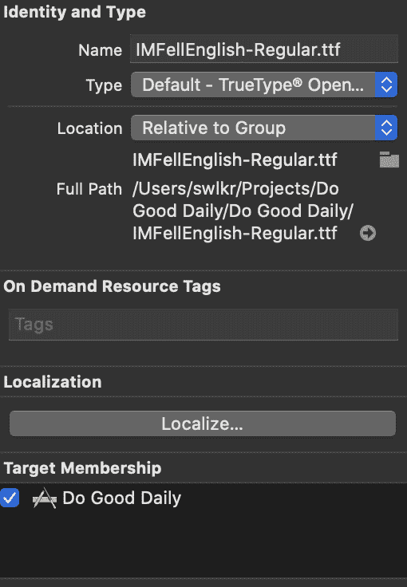

# 每天做好事第三天

> 原文：<https://dev.to/swlkr/do-good-daily-day-3-4cka>

📅2019 年 9 月 14 日
🔥连续三天
📱每日行善
💰0.99 美元的价格
🤑0 销售
⌚️花了 3 个小时
💻更改了 8 个文件，增加了 53 个(+)，删除了 9 个(-)
✅今天的目标:回顾昨天

## 我有生活

这可能会让你吃惊，但实际上除了制作应用程序，我还有自己的生活。我不想用细节来烦你，但是我今天没做多少事。

让我们开始吧。如何设置 swiftUI 视图的初始状态？我是这样做的

## 设置 SwiftUI 初始状态

```
import SwiftUI

struct MorningReminderView: View {
    @State var hour = 5
    @State var minute = 0

    var body: some View {
        VStack {
        }.onAppear {
            let app = Database().load()
            self.hour = app.morningHour
            self.minute = app.morningMinute
        }
    }
} 
```

<svg width="20px" height="20px" viewBox="0 0 24 24" class="highlight-action crayons-icon highlight-action--fullscreen-on"><title>Enter fullscreen mode</title></svg> <svg width="20px" height="20px" viewBox="0 0 24 24" class="highlight-action crayons-icon highlight-action--fullscreen-off"><title>Exit fullscreen mode</title></svg>

## swift ui 中的自定义字体

有三个步骤

1.  将字体添加到项目中，并确保它被添加到目标
2.  将其添加到 info.plist 
3.  在你的代码中调用它

```
let font = "IM_FELL_English_Roman"
Text("Set Your Morning Reminder Time")
            .font(.custom(font, size: 16)) 
```

<svg width="20px" height="20px" viewBox="0 0 24 24" class="highlight-action crayons-icon highlight-action--fullscreen-on"><title>Enter fullscreen mode</title></svg> <svg width="20px" height="20px" viewBox="0 0 24 24" class="highlight-action crayons-icon highlight-action--fullscreen-off"><title>Exit fullscreen mode</title></svg>

## 将应用状态序列化为 json 文件

今天关于 swiftUI 的最后一件事，以犹太人的方式将应用程序状态序列化到 json 文件中。两部分，第一部分是一个处理加载和保存文件以及 json 序列化的类，嘿，它完成了所有的工作！

```
import Foundation

public struct App : Codable {
    public var morningHour:Int
    public var morningMinute:Int
    public var eveningHour:Int
    public var eveningMinute:Int
    public var entries:[Entry]
}

public struct Entry : Codable {
    public var goal:String
    public var accomplished:String
    public var timestamp:Int
}

public class Database {
    let paths = NSSearchPathForDirectoriesInDomains(.documentDirectory, .userDomainMask, true)[0] as String
    let db = "db.json"

    func getDocumentsDirectory() -> URL {
        let paths = FileManager.default.urls(for: .documentDirectory, in: .userDomainMask)
        return paths[0]
    }

    public func save(app: App) {
        let filename: URL = getDocumentsDirectory().appendingPathComponent(db)
        let data: Data = try! JSONEncoder().encode(app)

        try! data.write(to: filename)
    }

    public func load() -> App {
        let filename: URL = getDocumentsDirectory().appendingPathComponent(db)
        do {
            let data = try Data(contentsOf: filename, options: .mappedIfSafe)
            let app = try JSONDecoder().decode(App.self, from: data)

            return app
        } catch {
            return App(morningHour: 7, morningMinute: 30, eveningHour: 21, eveningMinute: 0, entries: [])
        }
    }
} 
```

<svg width="20px" height="20px" viewBox="0 0 24 24" class="highlight-action crayons-icon highlight-action--fullscreen-on"><title>Enter fullscreen mode</title></svg> <svg width="20px" height="20px" viewBox="0 0 24 24" class="highlight-action crayons-icon highlight-action--fullscreen-off"><title>Exit fullscreen mode</title></svg>

第二部分是 SwiftUI 视图

```
import SwiftUI

struct MorningReminderView: View {
    @State var hour = 5
    @State var minute = 0

    var body: some View {
        VStack {
            Button(action: {
                self.saveTime()
            }) {
                Text("Save")
                .frame(width: 200)
                .font(.custom(self.font, size: 24))
                .padding()
                .foregroundColor(Color.black)
                .overlay(
                    RoundedRectangle(cornerRadius: 40)
                        .stroke(Color.black, lineWidth: 2)
                )
            }
        }
    }

    func saveTime() {
        var app = Database().load()
        app.morningHour = self.hour
        app.morningMinute = self.minute
        Database().save(app: app)
    }
} 
```

<svg width="20px" height="20px" viewBox="0 0 24 24" class="highlight-action crayons-icon highlight-action--fullscreen-on"><title>Enter fullscreen mode</title></svg> <svg width="20px" height="20px" viewBox="0 0 24 24" class="highlight-action crayons-icon highlight-action--fullscreen-off"><title>Exit fullscreen mode</title></svg>

这就是今天，我学到了很多，我希望它能帮助你处理任何 swiftUI 应用程序的基础。如果你想学习 swift，请告诉我，我在 twitter 上(可能太多了)或者只是留下评论，如果我能回答你的任何问题，我会的！