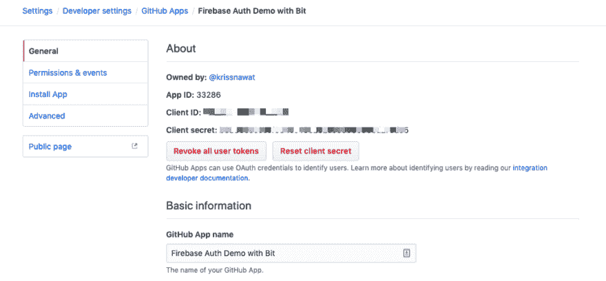

# 使用 Firebase | React | Bit 进行 Github 认证

> 原文:[https://dev . to/krissanawat 101/github-authentic ation-with-firebase-react-bit-3p 51](https://dev.to/krissanawat101/github-authentication-with-firebase-react-bit-3p51)

> 这篇文章包括附属链接；如果您从本文提供的不同链接购买产品或服务，我可能会收到报酬。

#### 分分钟做一个功能齐全的房产 app

通过在几分钟内发布 iOS 和 Android 的房地产应用程序，成为下一个 Trulia、Zillow 或 Airbnb。[下载我们的功能性 React 原生房地产应用程序模板](https://www.instamobile.io/app-templates/real-estate-app-template-react-native/)，与 Firebase 后端集成，立即启动您自己的应用程序。这个用 React Native 编写的漂亮的应用程序模板非常注重细节，代表了启动新移动应用程序开发的最佳方式。

现在，让我们继续用 Firebase 和 React 实现 Github 登录，然后用 Bit 实现 shareable

### 你会学到什么…？

*   React 中如何传道具？
*   如何使用 Firebase 认证？
*   如何创建和设置 Github 应用程序？
*   如何使用 Bit？

第一章已经涵盖了大部分的要点，所以这一章在我们继续学习的时候会让概念更加清晰。

### 要求

这里有一个插件、包和服务的完整列表，我们需要从本教程中获得一些东西:

*   Nodejs v8.x.x 或更高版本与 NPM/yarn 一起安装。
*   Firebase，Github 和 Bit account。
*   已经完成了前一章的项目。
*   火基和钻头包。

### 创建 Github App

首先创建新的 [GitHub 应用](https://github.com/settings/apps/new)

[T2】](https://res.cloudinary.com/practicaldev/image/fetch/s--3i_Ufx2P--/c_limit%2Cf_auto%2Cfl_progressive%2Cq_auto%2Cw_880/https://cdn-images-1.medium.com/max/1024/1%2Af4EkpYyMjXOBDfYDG8oRgQ.png)

并填写所有必要的数据

[T2】](https://res.cloudinary.com/practicaldev/image/fetch/s--15ByzzA5--/c_limit%2Cf_auto%2Cfl_progressive%2Cq_auto%2Cw_880/https://cdn-images-1.medium.com/max/770/1%2ApNEdp-tYi4AP2EFnqjhRqg.png)

GitHub 应用程序很容易创建，现在我们有了新的应用程序

[T2】](https://res.cloudinary.com/practicaldev/image/fetch/s--yBJtHHpY--/c_limit%2Cf_auto%2Cfl_progressive%2Cq_auto%2Cw_880/https://cdn-images-1.medium.com/max/1008/1%2ACXzYIkuPltwcrM2jVwfxvA.png)

获取客户端 ID 和客户端机密

### 配置 FireBase 应用程序

转到我们的应用程序，在 Github 选项卡上打开身份验证>登录方法>粘贴客户端 ID 和客户端密码

[T2】](https://res.cloudinary.com/practicaldev/image/fetch/s--laCu5MFh--/c_limit%2Cf_auto%2Cfl_progressive%2Cq_auto%2Cw_880/https://cdn-images-1.medium.com/max/992/1%2AcSCBx7W6xACiC_7AiplgpQ.png)

现在保存，我们可以在应用程序上使用 Github 登录

### 创建 Github 登录组件

现在，我们复制从上一部分构建的其他组件，并将所有函数、类、文件名更改为 Github

[T2】](https://res.cloudinary.com/practicaldev/image/fetch/s--c1mHXH8M--/c_limit%2Cf_auto%2Cfl_progressive%2Cq_auto%2Cw_880/https://cdn-images-1.medium.com/max/222/1%2APRwGoCEqT909WQdn8Dsp0A.png)

在 GitHubAuth.jsx 中，将所有内容都更改为 Gihutb