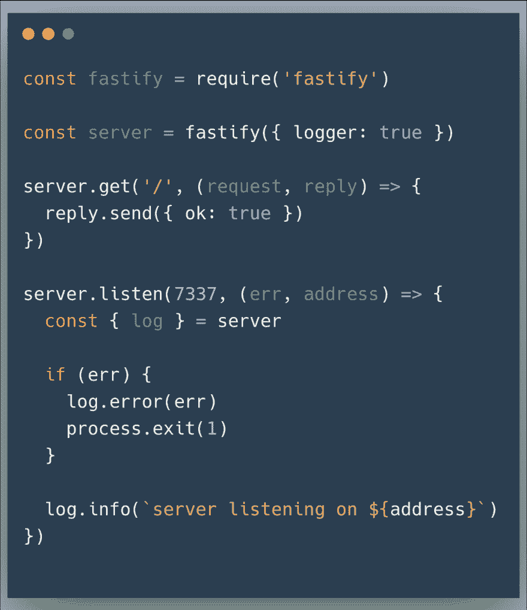
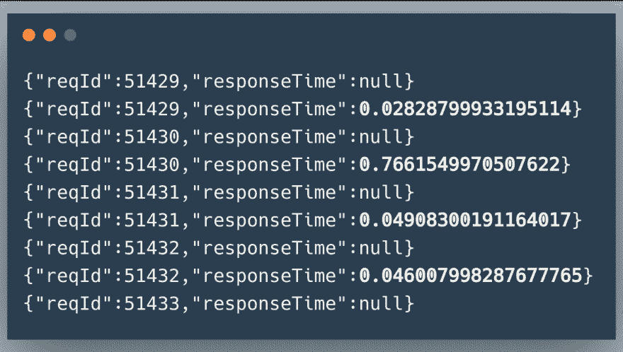
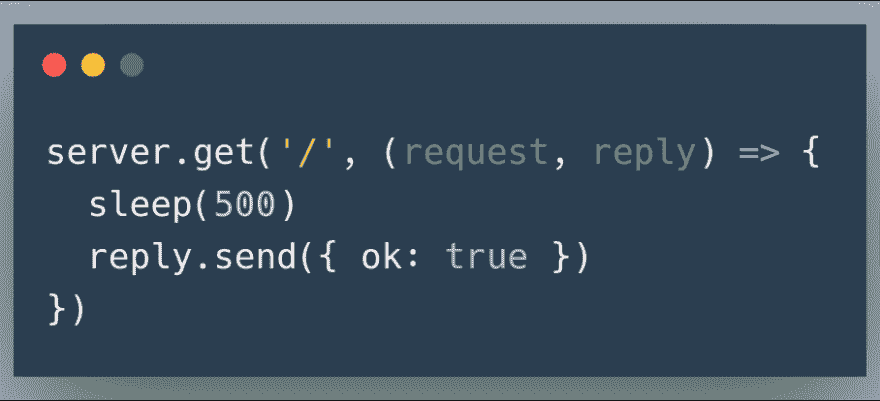
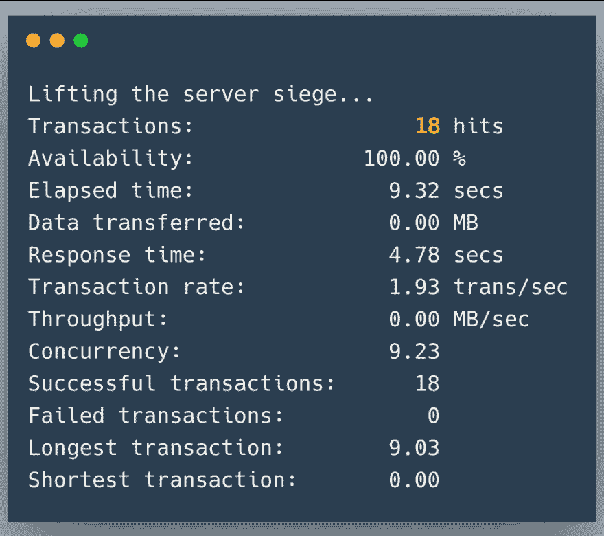
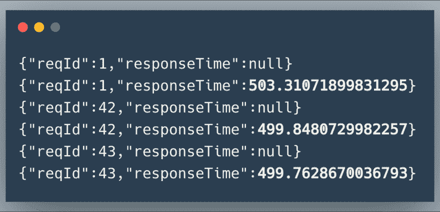
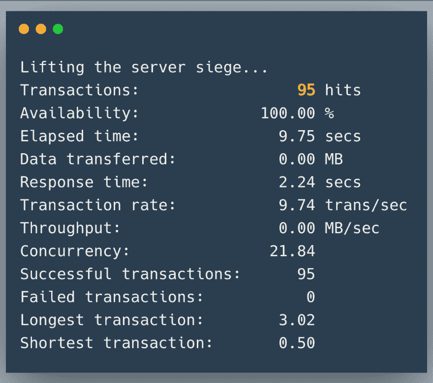

# 扩展和运行 Node.js 应用程序

> [https://dev . to/code 播客/escalation-e-perform-applications-node-js-2j 20](https://dev.to/codecasts/escalando-e-performando-aplicacoes-node-js-2j20)

今天 Node.js 是世界上使用最广泛的开发平台之一。它的生态系统广阔而强大，性能还不错。

由于没有银弹，Node.js 具有注意点，如果没有注意到这些特征，可能会影响使用它创建的应用程序的性能。

## [](#single-tread-e-c%C3%B3digo-bloqueante)单胎面 e código bloqueante

但是，很多人可能已经知道，发型很重要，Node.js 是单个 tread，即使有异步操作(谢谢 [libuv](https://libuv.org/) ，一些操作也被认为是阻塞性的，会阻止所有代码执行。

[T2】](https://res.cloudinary.com/practicaldev/image/fetch/s--6T8y6Kod--/c_limit%2Cf_auto%2Cfl_progressive%2Cq_auto%2Cw_880/https://thepracticaldev.s3.amazonaws.com/i/o7q9za0x0mwygtl4zjxu.png)

[在本例](https://repl.it/@vinicius73/blocking-code)中，我们使用 [`console.time`](https://developer.mozilla.org/pt-BR/docs/Web/API/console/time) 计算一些代码片段的执行情况。

本代码基本上有两个操作，一个是在实现功能`sleep`时与 [`setTimeout`](https://developer.mozilla.org/en-US/docs/Web/API/WindowOrWorkerGlobalScope/setTimeout) 进行异步操作，另一个是同步操作。本代码的异步部分应在 1 秒内运行，但在*定时器*的输出中，代码仅在同步部分运行 3 秒后运行。

> 为了更好地了解这种行为，请阅读关于[事件循环](https://medium.com/reactbrasil/como-o-javascript-funciona-o-event-loop-e-o-surgimento-da-programa%C3%A7%C3%A3o-ass%C3%ADncrona-5-maneiras-de-18d0b8d6849a)。

发生这种情况是因为节点/JS 中的*tread**在一次操作中锁定，一次**阻塞操作**。*

 *### [](#opera%C3%A7%C3%B5es-bloqueantes)歌剧

在上例中，可能有一种想法认为`while`是阻塞操作，这种操作对应用的影响是什么。除了`while`之外，其他结构和功能也具有阻挡作用。[用于](https://developer.mozilla.org/pt-BR/docs/Web/JavaScript/Reference/Statements/for)、 [Array.prototype.forEach](https://developer.mozilla.org/pt-BR/docs/Web/JavaScript/Reference/Global_Objects/Array/forEach) 、 [Array.prototype.map](https://developer.mozilla.org/pt-BR/docs/Web/JavaScript/Reference/Global_Objects/Array/map) 、 [Array.prototype.reduce](https://developer.mozilla.org/pt-BR/docs/Web/JavaScript/Reference/Global_Objects/Array/reduce) 等。

> 我们可以假设每个环路都是一个阻塞操作。

单个阻塞操作在 http 应用程序中具有巨大的破坏性潜力。

[T2】](https://res.cloudinary.com/practicaldev/image/fetch/s--DLfkS1_z--/c_limit%2Cf_auto%2Cfl_progressive%2Cq_auto%2Cw_880/https://thepracticaldev.s3.amazonaws.com/i/skh4o5658clij2tunz59.png)

一个极其简单的 http 服务器，用于测试其性能将使用[胜利](https://github.com/JoeDog/siege)工具。

```
siege http://localhost:7337/ -b -i -t 10s 
```

<svg width="20px" height="20px" viewBox="0 0 24 24" class="highlight-action crayons-icon highlight-action--fullscreen-on"><title>Enter fullscreen mode</title></svg> <svg width="20px" height="20px" viewBox="0 0 24 24" class="highlight-action crayons-icon highlight-action--fullscreen-off"><title>Exit fullscreen mode</title></svg>

[T2】](https://res.cloudinary.com/practicaldev/image/fetch/s--2rqja9ON--/c_limit%2Cf_auto%2Cfl_progressive%2Cq_auto%2Cw_880/https://thepracticaldev.s3.amazonaws.com/i/747hqp14qtmyigkew7jd.png)

10 秒钟内，http 服务器能够接收到 5141525 个相关请求。下面是一些请购单的 _logs

[T2】](https://res.cloudinary.com/practicaldev/image/fetch/s--s3piuqgW--/c_limit%2Cf_auto%2Cfl_progressive%2Cq_auto%2Cw_880/https://thepracticaldev.s3.amazonaws.com/i/2w57e0o8w2tu7790lo8d.png)

显然，这是一个伟大的结果。

在下一个图像中，管线现在运行 500 毫秒的阻塞操作。

[T2】](https://res.cloudinary.com/practicaldev/image/fetch/s--_Sq67c4G--/c_limit%2Cf_auto%2Cfl_progressive%2Cq_auto%2Cw_880/https://thepracticaldev.s3.amazonaws.com/i/4uk59e7sjitghqjd89wm.png)

又是胜利的表现测试。

[T2】](https://res.cloudinary.com/practicaldev/image/fetch/s--hxmrMqvi--/c_limit%2Cf_auto%2Cfl_progressive%2Cq_auto%2Cw_880/https://thepracticaldev.s3.amazonaws.com/i/bunflaq4lw56bu472kcv.png)

在 10 秒钟内，25 个并发进程仅成功完成了 18 个请求。与上次测试相比是急剧下降。以下部分日志 dos *请求*。

[T2】](https://res.cloudinary.com/practicaldev/image/fetch/s--TzGvbjxK--/c_limit%2Cf_auto%2Cfl_progressive%2Cq_auto%2Cw_880/https://thepracticaldev.s3.amazonaws.com/i/ybtj3ppt1cew1bf68mj7.png)

每个请求至少需要 500 毫秒才能得到响应。您可以看到 http 服务器收到 43 个请求，但测试在节点完成请求处理之前已完成。

该节点在 10 秒钟内只能解决 18 个请求:`500ms * 18 = 9000ms = 9s`所有其他请求都“卡住了”。

> 这是在 http node 服务器上执行同步、阻塞操作的价格。

## [](#cluster-mode-m%C3%BAltiplos-servidores)群集模式，多台服务器。

即使这是一个严重的问题，也有有效的方法绕过它。

Node 具有一个名为*的模块。此模块允许您创建进程/服务器 forks，充当“[*负载平衡器*](https://pt.wikipedia.org/wiki/Balanceamento_de_carga)”。*

 *> 你可以在这里了解更多关于这个模块

本文并不是直接讲述*群集模式*，而是讲述一种利用它提供一系列有用功能的工具，这些功能不仅提高了应用程序运行状况等性能。

### [](#pm2)PM2

[PM2 或*process manager 2*T3】是将节点应用程序投入生产时不可或缺的工具。](http://pm2.keymetrics.io/)

您可以将 PM2 的两个主要功能放在其他几个功能中。

#### [](#monitoramento-do-processo)过程监控

PM2 会监视随它启动的每个进程，如果该进程死亡，它会重新启动该进程，无需任何人为干预。

此功能非常有用，可确保应用程序在发生异常而未得到处理的情况下不会退出。

#### [](#m%C3%BAltiplos-processos-por-aplica%C3%A7%C3%A3o)每个应用程序多个进程

除了使应用程序*活着*之外，PM2 还可以为每个应用程序提升多个进程。这样我们就绕过了本文提到的问题。

另一件有趣的事是，可以使用 PM2 升级多个应用程序。如果 http 应用程式需要其他支援的平行处理作业(例如伫列用户)，您可以完全控制它。

### [](#pm2-em-a%C3%A7%C3%A3o)PM2 在行动中

有关如何安装 PM2 及其所有配置选项的信息，请参阅 pm 2 文档。以下是在*群集模式*中使用 PM2 的结果，在此示例中启动了 5 个进程。

```
pm2 start index.js -i 5 
```

<svg width="20px" height="20px" viewBox="0 0 24 24" class="highlight-action crayons-icon highlight-action--fullscreen-on"><title>Enter fullscreen mode</title></svg> <svg width="20px" height="20px" viewBox="0 0 24 24" class="highlight-action crayons-icon highlight-action--fullscreen-off"><title>Exit fullscreen mode</title></svg>

[T2】](https://res.cloudinary.com/practicaldev/image/fetch/s--Ciq-HYQ9--/c_limit%2Cf_auto%2Cfl_progressive%2Cq_auto%2Cw_880/https://thepracticaldev.s3.amazonaws.com/i/46nj8z8zakij0huhvk7k.png)

在这种情况下，http 服务器在 10 秒钟内响应了 95 个请求，高于上一次测试中的 18 个请求。

现在同样的测试有 10 个流程。

```
pm2 start index.js -i 10 
```

<svg width="20px" height="20px" viewBox="0 0 24 24" class="highlight-action crayons-icon highlight-action--fullscreen-on"><title>Enter fullscreen mode</title></svg> <svg width="20px" height="20px" viewBox="0 0 24 24" class="highlight-action crayons-icon highlight-action--fullscreen-off"><title>Exit fullscreen mode</title></svg>

[T2】](https://res.cloudinary.com/practicaldev/image/fetch/s--Em7y8K_Z--/c_limit%2Cf_auto%2Cfl_progressive%2Cq_auto%2Cw_880/https://thepracticaldev.s3.amazonaws.com/i/9nxi84b6yun5nbqkdk1k.png)

现在，该服务能够响应 180 个请求。下一个示例是 20 个进程，然后是 40 个进程。

```
pm2 start index.js -i 20 
```

<svg width="20px" height="20px" viewBox="0 0 24 24" class="highlight-action crayons-icon highlight-action--fullscreen-on"><title>Enter fullscreen mode</title></svg> <svg width="20px" height="20px" viewBox="0 0 24 24" class="highlight-action crayons-icon highlight-action--fullscreen-off"><title>Exit fullscreen mode</title></svg>

[](https://res.cloudinary.com/practicaldev/image/fetch/s--UGTi1HYC--/c_limit%2Cf_auto%2Cfl_progressive%2Cq_auto%2Cw_880/https://thepracticaldev.s3.amazonaws.com/i/r58defwwu04urzek4zxf.png)T3】

```
pm2 start index.js -i 40 
```

<svg width="20px" height="20px" viewBox="0 0 24 24" class="highlight-action crayons-icon highlight-action--fullscreen-on"><title>Enter fullscreen mode</title></svg> <svg width="20px" height="20px" viewBox="0 0 24 24" class="highlight-action crayons-icon highlight-action--fullscreen-off"><title>Exit fullscreen mode</title></svg>

[T2】](https://res.cloudinary.com/practicaldev/image/fetch/s--xAX_U1Yl--/c_limit%2Cf_auto%2Cfl_progressive%2Cq_auto%2Cw_880/https://thepracticaldev.s3.amazonaws.com/i/hsxzzxszro94iuq7tfmo.png)

20 可以使申请数量增加一倍，但 40 个流程不能。这只是因为处理器的竞争越来越激烈。

### [](#ambiente-de-produ%C3%A7%C3%A3o)生产环境

在本示例中，使用了具有 8 个处理内核和 13 GB ram 的计算机。这些值高于许多常用服务器。因此，简单的流程规模是不够的，在构建应用程序时要记住这一点非常重要。很多时候需要使用水平刻度。

每一个伺服器处理核心的处理量会因应用程式而异，因此理想的做法是进行测试，并找出如何撷取机器的最大值，而不将其留在【stress】。

soles como*[自动缩放](http://comunidadecloud.com/post/auto-scaling/)*+[docker](https://www.redhat.com/pt-br/topics/containers/what-is-docker)so altamente recommendas。

## [](#conclus%C3%A3o)结论

即使 Node.js 是单一处理器核心，您也可以充分利用多个处理器核心。还有一个处理[*【treads】*](https://nodejs.org/api/worker_threads.html)的模块，增加了可能性。

使用 Node.js 应用程序时，这不是唯一需要考虑的问题，因此不要局限于本文和此处包含的信息。

纯粹和简单的性能并不是全部，精心编写和测试的代码往往更为重要。甚至应用程序投入生产的方式也很重要。

通过注重交付高质量的东西，遵循良好的写作和组织做法，许多与性能相关的事情很快就解决了。

* * *

如欲了解有关我工作的更多信息，请访问[**【dev . to/com 播客】**](https://dev.to/codecasts) 或 [**博客。code 播客. com .**](https://blog.codecasts.com.br/)。订阅我们的 YouTube 频道，您将在那里观看有关[【JavaScript】](https://www.youtube.com/watch?v=fBInMy61plk&t=0s&list=PLy5T05I_eQYNQs4Pta85XRSucm3IOHx2M&index=2)、[【jquery】](https://www.youtube.com/playlist?index=1&list=PLy5T05I_eQYN8T15w4KLLcDcjAmIXDyu-&playnext=1)、[【gulp】](https://www.youtube.com/watch?v=eukZI7Rcrss&t=0s&index=2&list=PLy5T05I_eQYPl_iF2aJ0T0JBgJMatOLwv)、[是 6】](https://www.youtube.com/watch?v=yRr8Wo4XfYY&list=PLy5T05I_eQYOoUz2TtAqq35RLCc-xBZCe&index=2&t=0s)、【t】的视频也不要忘了在[电报](https://t.me/codecasters)上我们小组联系**