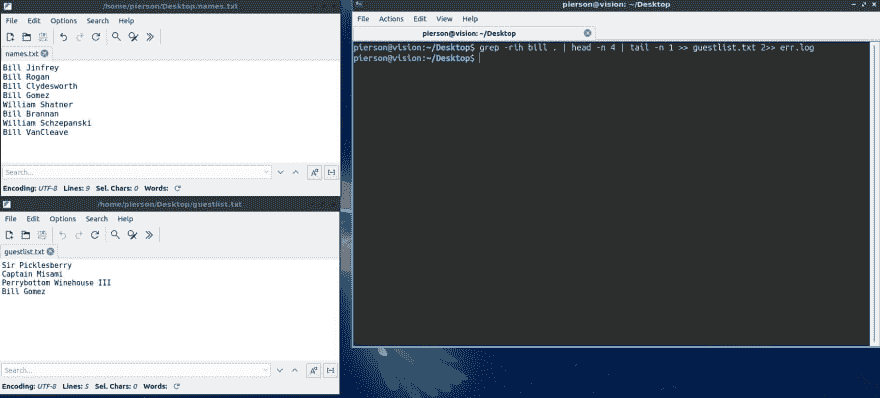

# 愚蠢的缩写:Bash 的|，>，>，>，2 >操作符

> 原文：<https://dev.to/bananabrann/stupid-short-bash-s-2-2-4n1m>

这是为了快速理解这些 Bash 操作符而编写的一个简单的介绍和参考指南:`>`、`1>`、`>>`、`1>>`、`<`、`2>>`、`2>>`。这主要是用一句话和一个例子来完成的。

本指南假设...

1.  ...您正在使用 Bash 终端。(操作系统不相关)
2.  ...您熟悉 CLI 的用法和导航。
3.  ...您熟悉 Bash 程序参数/标志/选项的概念。

## 目录

*   [基本原理的简要说明](#fundamentals)
*   [傻瓜候选人名单](#vocab)
*   [愚蠢-简短解释列表](#meat)

> 注意:对于这个博客，我们将假设我们只写和读文件。

* * *

# 多空基本面

不可否认，在我的编程生涯开始之前，我从未费心去研究 Linux 中的`|` `>` `>>`和`<`操作符是做什么的。如果你曾经按照 GitHub 的指示给你的账户添加了一个 SSH 密钥，那么你已经使用了叫做**的重定向操作符**！

### 程序基础

一个程序有三个输入和输出流及其相应的编号。它有一个标准输入(STDIN)(0)、标准输出(STDOUT)(1)和标准错误(STDERR)(2)。

[](https://res.cloudinary.com/practicaldev/image/fetch/s--p1uSw5GZ--/c_limit%2Cf_auto%2Cfl_progressive%2Cq_auto%2Cw_880/https://thepracticaldev.s3.amazonaws.com/i/lamacqc2g7epx8g8hkb5.png)

> 注:我的美图只是展示常规。如果您构建了自己的程序，您可以有效地将流命名为您喜欢的任何名称，并将流输出到任何输出。但是你不知道。如果你知道，假装你不知道，继续读下去。

例句:让我们来看看好的一面。当您`ls`没有错误时，输入是`./` (Bash 假设 empty 是当前目录)，stdout 是您随后看到的目录列表，stderr 是 nothing(因为没有要捕捉的错误)。

程序流传输 stdout 和 stderr 这是因为它是*而不是*“stdout 或 stderr”，它是“stdout **和** stderr”。运行`ls presentDir notPresentDir`，可以看到 stdout 和 stderr。

默认情况下，stdout、stderr 和 stdin 都在终端中。有了这些重定向操作符，我们就可以简单地**将这些流重定向到别处**。

* * *

# Vocab

**“程序”**:这是终端中调用的可执行文件。每次你`cd`或`ls`，你都在运行一个程序。
**`cat`** :打印给定文件内容的程序。
**`wc -w`** :输出文件字数的程序。
**`pbc`** :我的别名为`xclip -selection clipboard`。对于 Mac 用户来说，这和`pbcopy`完全一样。
**`pbp`** :我粘贴剪贴板的别名。

* * *

# 蠢——短名单

⭐️重定向操作符有三个与输出相关的数字:0 =输入，1 =输出，2 =错误。如果没有给出数字，**默认为 1** 。
⭐️如果文件不存在，**这些操作员创建文件。**

### **`>`** 将 stdout 写入给定文件。

将 stdout 发送到给定的文件，而不是在终端中打印。

```
$ ls -1 > list.txt

$ cat list.txt
lubbock.txt
odessa.txt
baird.txt 
```

<svg width="20px" height="20px" viewBox="0 0 24 24" class="highlight-action crayons-icon highlight-action--fullscreen-on"><title>Enter fullscreen mode</title></svg> <svg width="20px" height="20px" viewBox="0 0 24 24" class="highlight-action crayons-icon highlight-action--fullscreen-off"><title>Exit fullscreen mode</title></svg>

* * *

### **`>>`** 将标准输出附加到给定文件。

将 stdout 添加到文件内容，而不是替换文件内容。

```
$ echo "Flamingo" >> favorite-birds.txt

$ cat favorite-birds.txt
Cardinal
Penguin
Flamingo 
```

<svg width="20px" height="20px" viewBox="0 0 24 24" class="highlight-action crayons-icon highlight-action--fullscreen-on"><title>Enter fullscreen mode</title></svg> <svg width="20px" height="20px" viewBox="0 0 24 24" class="highlight-action crayons-icon highlight-action--fullscreen-off"><title>Exit fullscreen mode</title></svg>

* * *

### **`<`** 将文件重定向为 stdin

将文件内容作为标准输入传递。
例:如果我们使用`wc -w book.txt`，程序会输出 book.txt 的字数和文件名(例如:`2394 book.txt`)。
如果我们使用`wc -w < book.txt`,我们将 book.txt 的内容作为输入“传入”,因此`wc -w < book.txt`将只返回数字(`2394`),就好像我们将整个内容键入终端一样。

```
$ wc -w book.txt
2394 book.txt

$ wc -w < book.txt
2394 
```

<svg width="20px" height="20px" viewBox="0 0 24 24" class="highlight-action crayons-icon highlight-action--fullscreen-on"><title>Enter fullscreen mode</title></svg> <svg width="20px" height="20px" viewBox="0 0 24 24" class="highlight-action crayons-icon highlight-action--fullscreen-off"><title>Exit fullscreen mode</title></svg>

* * *

### **`2>`** :将 stderr 重定向到给定文件。

如果有错误，将 stderr 重定向到一个文件，而不是在终端中打印。

```
$ ls cuteDogPics 2> example.txt

$ cat example.txt
ls: cuteDogPics: No such file or directory 
```

<svg width="20px" height="20px" viewBox="0 0 24 24" class="highlight-action crayons-icon highlight-action--fullscreen-on"><title>Enter fullscreen mode</title></svg> <svg width="20px" height="20px" viewBox="0 0 24 24" class="highlight-action crayons-icon highlight-action--fullscreen-off"><title>Exit fullscreen mode</title></svg>

* * *

### **`2>>`** :向给定文件追加 stderr。

与`>>`和`>`完全一样，除了有 stderr。

```
$ cp ~/Documents/Reports/June2019.xlsx ~/Desktop 2>> ~/error.log

$ cat ~/error.log
cp: /Users/bananabrann/Reports/January2019.xlsx: No such file or directory
cp: /Users/bananabrann/Reports/March2019.xlsx: No such file or directory
cp: /Users/bananabrann/Reports/June2019.xlsx: No such file or directory 
```

<svg width="20px" height="20px" viewBox="0 0 24 24" class="highlight-action crayons-icon highlight-action--fullscreen-on"><title>Enter fullscreen mode</title></svg> <svg width="20px" height="20px" viewBox="0 0 24 24" class="highlight-action crayons-icon highlight-action--fullscreen-off"><title>Exit fullscreen mode</title></svg>

* * *

### **`|`** :使用 stdout 作为下一个程序的 stdin。

使用`|`左边程序的标准输出作为右边程序的标准输入。

```
$ ls -1
buffalo-gap.txt
abilene.txt
clyde.txt
lubbock.txt

$ ls -1 | head -2
buffalo-gap.txt
abilene.txt 
```

<svg width="20px" height="20px" viewBox="0 0 24 24" class="highlight-action crayons-icon highlight-action--fullscreen-on"><title>Enter fullscreen mode</title></svg> <svg width="20px" height="20px" viewBox="0 0 24 24" class="highlight-action crayons-icon highlight-action--fullscreen-off"><title>Exit fullscreen mode</title></svg>

* * *

### 能够菊花链式连接

使用`|`，我们最终可以链接尽可能多的程序，以达到我们想要的结果。
在下图中，我们从`grep`程序中取出 stdout，并将其作为`head`及其参数的 stdin 发送。然后，我们将 stdout 发送到`tail`的 stdin，最后将 stdout 重定向到 guestlist.txt。

[](https://res.cloudinary.com/practicaldev/image/fetch/s--VHXkM6wm--/c_limit%2Cf_auto%2Cfl_progressive%2Cq_auto%2Cw_880/https://thepracticaldev.s3.amazonaws.com/i/l3mekrtpir94xi7dhiun.jpeg)

* * *

希望这对某人有所帮助，或者激发某人对使用这些操作符并自行进一步研究的兴趣！

编码快乐！🍻