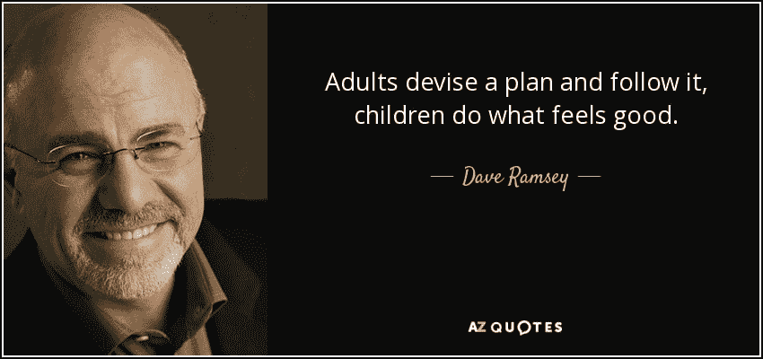
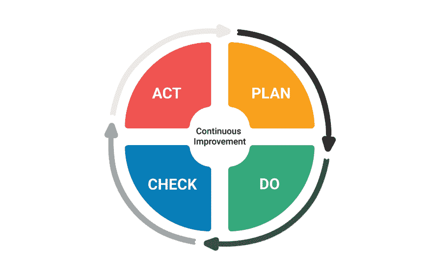

# 作为程序员如何培养自律

> 原文：<https://dev.to/mdhesari/how-to-develop-self-discipline-as-programmers-233m>

如果你读过关于时间管理和成功的书，你可能已经知道自律的重要性以及它如何影响我们的进步。大多数时候，我们拖延很多时间，把最重要的优先事项推迟到第二天，然后我们开始做一些容易但没有价值的事情。

## 什么是自律？

有些人认为自律就是在 24 小时内努力工作，不休息，只是忍受这种情况！不，这只是自律的一部分。
关于自律最重要的因素是心理健康。
一般来说，聪明的人知道什么时候该休息，也知道什么时候该忙碌。变得成熟需要时间，我们通过不断尝试、失败和重复来学习。

我写这篇文章不是告诉你必须在凌晨 4:00 起床并实现你的目标。人们有不同的特质，我所说的是一致性。例如:如果你每天都高效地工作到半夜，那么就遵守这个时间表，永远不要打破它，这就是自律规则。

正如沃伦·巴菲特所说:“我们不必比其他人更聪明；我们必须比其他人更守纪律。”

简单地采取这四个步骤来管理自律。注意:如果有任何建议，我们将非常欢迎。

### 1。制定计划，知道你要去哪里

你需要采取的第一步是在头脑中有一个目标，并有目的地行动。实际上，当你知道目标是什么的时候，你就不会轻易被环境分散注意力。

大多数成功人士和企业家都坚持写目标和成就，那么你还在等什么？从尽可能多地写作开始，最终你会找到你的道路。
我自己亲自动手，从读一本非常棒的书开始，书名是**写下来，让它发生**，作者是 **Klauser，Henriette Anne** ，非常推荐这本书！

老实说，如果你没有足够的耐心去做事，读这类书是没有用的...

### 2。去做吧！

**空谈是廉价的，给我看行动就行了！**

现在是行动的时候了，只是做你已经设计好的，用你所拥有的任何东西，如果不是正确的时间也没关系。例如我，我以前从来没有写过像这样的长篇英语文章，所以就从你有的开始吧，因为如果我害怕看到我的知识，我就不会写下这篇文章了。

记住:人们不会考虑你要做什么，你脑子里有什么想法，他们根本不在乎！！直到你去做，不要只是说说而已，要付诸行动。

### 3。衡量你的进步

收集你做过的所有成功的甚至失败的事情，关于你的过程的细节和事实。
准确地知道原因，仔细地弄清楚结果，比如:弄清楚你为什么成功地完成了 X 任务，为什么没能完成 Y 任务。
它帮助你了解自己的**优势**和**劣势**。

评估你的进展，看看你的清单和你做过的事情，然后开始评估它们，比如你是怎么做的，为什么它是优先事项。

不去衡量自己的进步，不去衡量自己的想法走了多远，就等于没有自律。

[这里有一篇衡量进步的好文章](https://www.quickanddirtytips.com/productivity/project-management/how-to-measure-progress-achieve-goals)

### 4。转换、修改并重试！

不要停下来！！！如果你觉得一切都很完美，你知道一切，那么是时候改变你的想法了，你还有很多路要走。在你前进的过程中，你必须尽你所能做得更多、推动得更大，永远不要因为你已经成功地做了某件事而停下来，除非你预计很快就会失败...

了解自己的优势和劣势后，你有两个选择:

**1。更多地关注弱点，并努力将它们转化为优势。**

**2。如果你的弱点不是那么重要，那就专注于你的优势，并增强它们。**

这真的要视情况而定，需要你的谨慎，如果你做对了 3 步，这一步就没问题了。不要忘记这需要时间和精力，没有什么有价值的事情是容易的，所以这些步骤是相互依赖的，不要试图颠倒这些步骤！

**失败了也没问题**

你失败了？太棒了。说明你在学习，真的在做，那个从不失败，从不做事的人。

### 结论

这是我第一篇关于 dev.to 的英文长文，所以如果有任何问题，你不明白，我很抱歉:)。请不吝提问、批评和建议。

顺便可以关注我:
[insta gram](https://www.instagram.com/mdhesari/)
[Linkeding](https://l.instagram.com/?u=http%3A%2F%2Flinkedin.com%2Fin%2Fmohamad-fazel-hesari-958563177&e=ATP1qfPhZMPwnwnEfP8VUs3lz6xIey6Ij6I6dYP0F6lk7jMMx-HcqOvn5ibdJQ5OuPXNmreLcqwIoaAk)
[Twitter](http://twitter.com/realfazel)

编码快乐，祝你一切顺利。