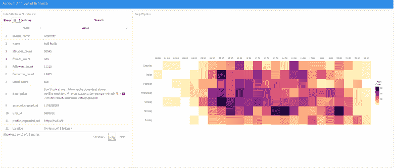

# R 中的 Twitter“帐户分析”

> 原文：<https://dev.to/hrbrmstr/twitter-account-analysis-in-r-2k0j>

在过去的一周里，@propublica 链接到了一个非常好的资源，可以获得一个叫做[账户分析](https://accountanalysis.app/)的 Twitter 用户的个人资料和活动的概况。它有一个漂亮的界面，在手机上和在真正的浏览器上一样好用。它也是完全交互式的，并支持交叉过滤(放大时间轴，其他图形会发生变化)。如果你不是一个程序员，这尤其伟大，但如果你是， [@kearneymw](http://twitter.com/kearneymw) 的 [{rtweet}](https://rtweet.info/) 可以让你得到所有这些信息甚至更多，把 R 的力量放在充满 tweet 的数据框后面。

虽然我们在 [21 食谱](https://rud.is/books/21-recipes/)一书中涉及了相当多的{rtweet}内容，但是没有像 accountanalysis 那样对一个账户进行总结。为了纠正这个疏忽，我拼凑了一个 accountanalysis 的静态克隆，它可以生成独立的 HTML 报告[，就像这个](https://rud.is/dl/hrbrmstr-account-analysis.html)。 [](https://i1.wp.com/rud.is/b/wp-content/uploads/2019/09/Screen-Shot-2019-09-14-at-09.53.37.png?ssl=1)

这是一个完全参数化的 R markdown 文档，这意味着你可以把它作为一个函数调用来运行(或者修改参数并手工编织):

```
rmarkdown::render(
  input = "account-analysis.Rmd", 
  params = list(
    username = "propublica"
  ), 
  output_file = "~/Documents/propublica-analysis.html"
) 
```

Enter fullscreen mode Exit fullscreen mode

默认情况下，它还会将用户信息和检索到的时间表的日期戳副本保存到您生成报告的目录中(在 Rmd 中的保存部分添加一个前缀路径，以便将其存储在一个更好的位置)。

有了所有可用的数据，你可以挖掘并提取你想要/需要的所有信息。

### 鳍

你可以在你最喜欢的社交编码服务上获得 Rmd:

*   [我自己主持的 Gitea](https://git.rud.is/hrbrmstr/ggchicklet.git)
*   [来源帽子](https://git.sr.ht/~hrbrmstr/ggchicklet)
*   [GitLab](https://gitlab.com/hrbrmstr/ggchicklet)
*   [Bitbucket](https://bitbucket.com/hrbrmstr/ggchicklet)
*   [GitHub](https://github.com/hrbrmstr/ggchicklet)