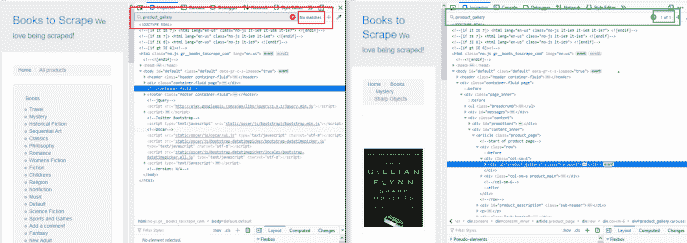

# Python 初学者的 scrapy 教程

> 原文:[https://dev . to/davidmm 1707/crawler-rules-and-link extractor-04-python-scrapy-tutorial-for-初学者-3g4d](https://dev.to/davidmm1707/crawler-rules-and-linkextractor-04-python-scrapy-tutorial-for-beginners-3g4d)

面向初学者的 Python Scrapy 教程–04–爬虫、规则和链接提取器

# [](#python-scrapy-tutorial-for-beginners-04)Python 初学者剪贴簿教程- 04

[T2】](https://res.cloudinary.com/practicaldev/image/fetch/s--8uvr1dxu--/c_limit%2Cf_auto%2Cfl_progressive%2Cq_auto%2Cw_880/https://i2.wp.com/letslearnabout.net/wp-content/uploads/2019/09/scrapy-04.png%3Fw%3D688%26ssl%3D1)

在我们上一课[如何进入下一页](https://letslearnabout.net/tutorial/python-scrapy-tutorial-for-beginners-03-how-to-go-to-the-next-page/)中，我们浏览了整个网站直到最后一本书。但是今天，我们将学习一个工具，它将使我们的网络抓取任务变得更加简单。

我们在谈论爬行蜘蛛。

在这篇文章中，你将学习如何:

*   如何使用新蜘蛛:CrawlSpider
*   什么是规则和链接提取器
*   不费吹灰之力就刮光了整个网站

你准备好了吗？

[https://www.youtube.com/embed/lDWtcPJN9MQ](https://www.youtube.com/embed/lDWtcPJN9MQ)

* * *

### [](#our-gameplan)我们的游戏计划

[T2】](https://res.cloudinary.com/practicaldev/image/fetch/s--qdV8w2mF--/c_limit%2Cf_auto%2Cfl_progressive%2Cq_auto%2Cw_880/https://i0.wp.com/letslearnabout.net/wp-content/uploads/2019/09/aaaaaaaaaaaa.jpg%3Fresize%3D768%252C445%26ssl%3D1)

到目前为止，我们完成的每一项任务都帮助了我们两件事:获取所需的 URL 或提取信息。

我们提取了部分 URL，对它们进行了操作，添加到基本 URL 中以创建绝对 URL，虽然这很有效，但是太多了。嗯，可能不会太多，因为只有几行代码，但是我们可以让它更简单。

简单多了。

这里，我们将再次使用代码的两个部分。一个获取 URL，另一个提取信息。

因为我们将使用相同的结构，我们不应该做任何修改。我们将改进提取网址的方式。

我们要把它变得简单到你都不会相信。

我说的是新的蜘蛛:爬行蜘蛛。

* * *

### [](#the-new-spider-crawlspider)新蜘蛛:爬行蜘蛛

[T2】](https://res.cloudinary.com/practicaldev/image/fetch/s--NRum_HkR--/c_limit%2Cf_auto%2Cfl_progressive%2Cq_auto%2Cw_880/https://i2.wp.com/upload.wikimedia.org/wikipedia/commons/f/fc/Female_Jumping_Spider_-_Phidippus_regius_-_Florida.jpg%3Fw%3D688%26ssl%3D1)

我们从上一课开始学起。这是我们的[当前蜘蛛](https://letslearnabout.net/tutorial/python-scrapy-tutorial-for-beginners-03-how-to-go-to-the-next-page/):

```
# -*- coding: utf-8 -*-
import scrapy

class SpiderSpider(scrapy.Spider):
    name = 'spider'
    allowed_domains = ['books.toscrape.com']
    start_urls = ['http://books.toscrape.com/']
    base_url = 'http://books.toscrape.com/'

    def parse(self, response):
        all_books = response.xpath('//article[@class="product_pod"]')

        for book in all_books:
            book_url = book.xpath('.//h3/a/@href').extract_first()

            if 'catalogue/' not in book_url:
                book_url = 'catalogue/' + book_url

            book_url = self.base_url + book_url

            yield scrapy.Request(book_url, callback=self.parse_book)

        next_page_partial_url = response.xpath(
            '//li[@class="next"]/a/@href').extract_first()

        if next_page_partial_url:
            if 'catalogue/' not in next_page_partial_url:
                next_page_partial_url = "catalogue/" + next_page_partial_url

            next_page_url = self.base_url + next_page_partial_url
            yield scrapy.Request(next_page_url, callback=self.parse)

    def parse_book(self, response):
        title = response.xpath('//div/h1/text()').extract_first()

        relative_image = response.xpath(
            '//div[@class="item active"]/img/@src').extract_first().replace('../..', '')
        final_image = self.base_url + relative_image

        price = response.xpath(
            '//div[contains(@class, "product_main")]/p[@class="price_color"]/text()').extract_first()
        stock = response.xpath(
            '//div[contains(@class, "product_main")]/p[contains(@class, "instock")]/text()').extract()[1].strip()
        stars = response.xpath(
            '//div/p[contains(@class, "star-rating")]/@class').extract_first().replace('star-rating ', '')
        description = response.xpath(
            '//div[@id="product_description"]/following-sibling::p/text()').extract_first()
        upc = response.xpath(
            '//table[@class="table table-striped"]/tr[1]/td/text()').extract_first()
        price_excl_tax = response.xpath(
            '//table[@class="table table-striped"]/tr[3]/td/text()').extract_first()
        price_inc_tax = response.xpath(
            '//table[@class="table table-striped"]/tr[4]/td/text()').extract_first()
        tax = response.xpath(
            '//table[@class="table table-striped"]/tr[5]/td/text()').extract_first()

        yield {
            'Title': title,
            'Image': final_image,
            'Price': price,
            'Stock': stock,
            'Stars': stars,
            'Description': description,
            'Upc': upc,
            'Price after tax': price_excl_tax,
            'Price incl tax': price_inc_tax,
            'Tax': tax,
        } 
```

哇…这个*解析*方法太乱了…对不起！请删除它。

不，我没开玩笑。移除整个函数。

还记得我们将要简化 URL 的提取吗？现在删除那个该死的大*解析*函数..

检查主 SpiderSpider 类。我们继承了 *scrapy.Spider.* 我们不想要那个蜘蛛，它太笨了！所以，我们应该用爬虫代替。去顶部的进口和进口的爬行蜘蛛从刺痒的蜘蛛。让你的蜘蛛蜘蛛继承它:

```
from scrapy.spiders import CrawlSpider

class SpiderSpider(CrawlSpider): 
```

好多了。

但是…记住蜘蛛总是调用*解析*方法来开始读取代码？嗯，不是这个。

在这里，我们不需要寻找一个*解析*方法，我们可以指示这个蜘蛛去做我们想要的事情。但要做到这一点，我们需要制定基本规则，对吗？

* * *

### [](#rules-and-linkextractor)规则和 LinkExtractor

CrawlSpider 除了拥有与普通蜘蛛相同的属性之外，还有一个新的属性:*规则*。

“规则”是一个或多个规则对象的列表，其中每个规则定义了一种用于爬取站点的行为类型。

此外，我们将使用 LinkExtractor:一个定义如何从每个被抓取的页面中提取链接的对象。

规则设定了如何抓取网站的行为，以及如何提取链接。但是我们最好能看到它是如何工作的，对吗？让我们导入规则和 LinkExtractor，然后定义规则:

```
from scrapy.spiders import CrawlSpider, Rule
from scrapy.linkextractors import LinkExtractor

class SpiderSpider(CrawlSpider):
    name = 'spider'
    allowed_domains = ['books.toscrape.com']
    start_urls = ['http://books.toscrape.com/']
    base_url = 'http://books.toscrape.com/'

    rules = [Rule(LinkExtractor(allow='catalogue/'),
                  callback='parse_filter_book', follow=True)] 
```

我们导入资源并创建一个规则:在这个规则中，我们将设置如何提取链接，从哪里提取以及如何处理它们。

首先，我们设置*allow = ' catalog/'*。现在，如果网址中没有“目录/”，我们甚至不会处理它。比我们以前用的如果好多了，对吧？

我们还有一个*回调*:编程中的一个回调就是我们在当前进程完成之后做的事情。在这种情况下，它意味着“在获得一个有效的 URL 之后，调用 *parse_filter_book* 方法。

而 *follow* 只是指定是否应该从每个响应中跟踪链接。当我们将它设置为 True 时，我们将获得任何嵌套的 URL。整个网站。

现在，将 *parse_book* 改为 *parse_filter_book* 并运行代码！

哦…我们有一个错误:

*属性错误:“NoneType”对象没有属性“replace”*

当然:我们正在提取代码中的每个 URL！不仅是书，还有分页(page-1.html，page-2.html 等)和蜘蛛找到的每个网址。

只有当页面是有效的图书 URL 时，我们才应该使用 *parse_filter_book* 方法！

* * *

### [](#filtering-the-urls)过滤网址

在 *parse_filter_book* 中，我们将执行一个小检查:如果 URL 是一个图书 URL，则提取数据。如果不是，什么都不做。

但是我们如何知道一个 URL 是属于一本书还是属于其他 URL 呢？

好吧，让我们检查一个:打开和一个非图书的网址，例如

现在我们需要从书籍中寻找一个非书籍 URL 中没有的元素。例如，我注意到图书有一个 *product_gallery* 类:

[T2】](https://res.cloudinary.com/practicaldev/image/fetch/s--guzXJ_2l--/c_limit%2Cf_auto%2Cfl_progressive%2Cq_auto%2Cw_880/https://i0.wp.com/letslearnabout.net/wp-content/uploads/2019/09/image-12.png%3Ffit%3D688%252C243%26ssl%3D1)

我们可以用这个来区分书籍和非书籍的网址！

像这样修改您的代码:

```
 def parse_filter_book(self, response):
        exists = response.xpath('//div[@id="product_gallery"]').extract_first()
        if exists:
            title = response.xpath('//div/h1/text()').extract_first()

            relative_image = response.xpath(
                '//div[@class="item active"]/img/@src').extract_first()
            final_image = self.base_url + relative_image.replace('../..', '')

            price = response.xpath(
                '//div[contains(@class, "product_main")]/p[@class="price_color"]/text()').extract_first()
            stock = response.xpath(
                '//div[contains(@class, "product_main")]/p[contains(@class, "instock")]/text()').extract()[1].strip()
            stars = response.xpath(
                '//div/p[contains(@class, "star-rating")]/@class').extract_first().replace('star-rating ', '')
            description = response.xpath(
                '//div[@id="product_description"]/following-sibling::p/text()').extract_first()
            upc = response.xpath(
                '//table[@class="table table-striped"]/tr[1]/td/text()').extract_first()
            price_excl_tax = response.xpath(
                '//table[@class="table table-striped"]/tr[3]/td/text()').extract_first()
            price_inc_tax = response.xpath(
                '//table[@class="table table-striped"]/tr[4]/td/text()').extract_first()
            tax = response.xpath(
                '//table[@class="table table-striped"]/tr[5]/td/text()').extract_first()

            yield {
                'Title': title,
                'Image': final_image,
                'Price': price,
                'Stock': stock,
                'Stars': stars,
                'Description': description,
                'Upc': upc,
                'Price after tax': price_excl_tax,
                'Price incl tax': price_inc_tax,
                'Tax': tax,
            }

        else:
            print(response.url) 
```

关键是前两行:我们尝试用“product_gallery”类获取 div。如果存在，我们解析 URL。如果没有，我们就打印出来。

现在让我们运行代码…

[T2】](https://res.cloudinary.com/practicaldev/image/fetch/s--edwe132Z--/c_limit%2Cf_auto%2Cfl_progressive%2Cq_auto%2Cw_880/https://i1.wp.com/letslearnabout.net/wp-content/uploads/2019/09/image-13.png%3Ffit%3D688%252C149%26ssl%3D1)

我们的一千本书都在那里！太好了！

* * *

### [](#conclusion)结论

[T2】](https://res.cloudinary.com/practicaldev/image/fetch/s--pl4FM8X5--/c_limit%2Cf_auto%2Cfl_progressive%2Cq_auto%2Cw_880/https://i2.wp.com/www.thebluediamondgallery.com/typewritimg/summary.jpg%3Fw%3D688)

今天我们学习了如何:

*   履带式工程
*   设置规则和链接提取器
*   提取网站中的每个 URL
*   我们必须过滤收到的网址，从书籍的网址提取数据，而不是每个网址

这不是你网络抓取学习的又一步，这是一个巨大的飞跃。

正如你在本课中所看到的，使用爬虫可以帮助你简化你的代码。

这是一个简单的例子，但是如果像亚马逊和易贝那样，我们有书、乐器、食物等等，而不是书，会怎么样呢？没有爬虫，蜘蛛会变得疯狂。可行，但有点疯狂。欢迎你来试试！

你现在对 Scrapy 有了一个基本的了解。现在我们需要更深入。在下一课的[中，我们将了解管道和物品。](https://letslearnabout.net/python/python-scrapy-tutorial-for-beginners-05-how-to-use-scrapy-items/)

但在此之前…

* * *

### [](#exercise)运动

[T2】](https://res.cloudinary.com/practicaldev/image/fetch/s--5rE2sW1d--/c_limit%2Cf_auto%2Cfl_progressive%2Cq_auto%2Cw_880/https://i2.wp.com/upload.wikimedia.org/wikipedia/commons/thumb/8/8f/Man_Doing_Warm_Up_Exercise_Cartoon.svg/512px-Man_Doing_Warm_Up_Exercise_Cartoon.svg.png%3Fw%3D688%26ssl%3D1)

现在，您已经知道如何使用 Spider 和 CrawlSpider 获取所需的 URL，如何使用 Xpath 提取数据，以及如何将信息生成到文件中。

现在是你自己工作的时候了！找一个容易报废的网站，自己试着报废。

你可以使用一些帮助，比如查找过去的课程、搜索谷歌、查看[剪贴簿文档](https://docs.scrapy.org/en/latest/)等。但是你需要自己去做。

之后，在这里留下你的网站和代码的评论，这样每个人都可以看到你是如何独立完成的，你有多自豪！

* * *

[我的 Youtube 教程视频](https://www.youtube.com/channel/UC9OLm6YFRzr4yjlw4xNWYvg?sub_confirmation=1)

[Github 上的最终代码](https://github.com/david1707/scrapy_tutorial/tree/03_lesson)

[在 Twitter 上联系我](https://twitter.com/DavidMM1707)

[上一课:03–如何进入下一页](https://letslearnabout.net/tutorial/python-scrapy-tutorial-for-beginners-03-how-to-go-to-the-next-page/)