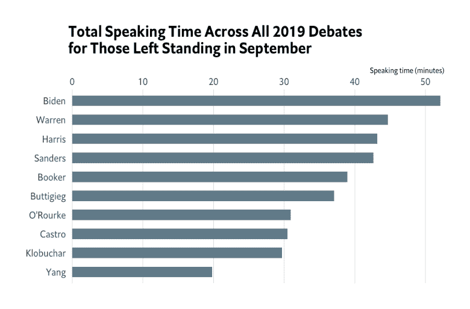
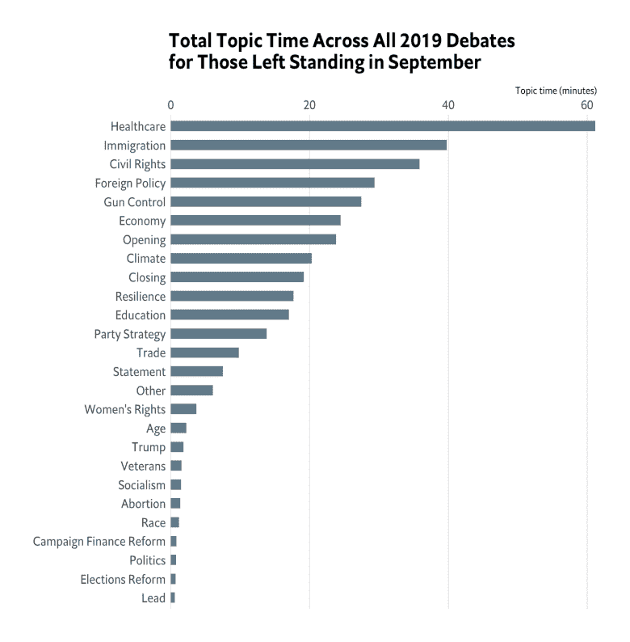

# 2019 年 9 月民主党辩论添加到{ggchicklet}

> 原文：<https://dev.to/hrbrmstr/september-2019-democratic-debates-added-to-ggchicklet-316c>

最新一轮的 2020 年民主党辩论已经结束，所有 2019 年版本的辩论数据都已添加到 [{ggchicklet}](https://cinc.rud.is/web/packages/ggchicklet/) 。`debates2019`内置数据集的结构有一点变化:

```
library(ggchicklet)
library(hrbrthemes)
library(tidyverse)

debates2019
## # A tibble: 641 x 7
## elapsed timestamp speaker topic debate_date debate_group night
## <dbl> <time> <chr> <chr> <date> <dbl> <dbl>
## 1 1.04 21:03:05 Warren Economy 2019-09-13 1 1
## 2 1.13 21:04:29 Klobuchar Economy 2019-09-13 1 1
## 3 1.13 21:06:02 O'Rourke Economy 2019-09-13 1 1
## 4 0.226 21:07:20 O'Rourke Economy 2019-09-13 1 1
## 5 1.06 21:07:54 Booker Economy 2019-09-13 1 1
## 6 0.600 21:09:08 Booker Economy 2019-09-13 1 1
## 7 0.99 21:09:50 Warren Economy 2019-09-13 1 1
## 8 0.872 21:11:03 Castro Economy 2019-09-13 1 1
## 9 1.07 21:12:00 Gabbard Economy 2019-09-13 1 1
## 10 1.11 21:13:20 de Blasio Economy 2019-09-13 1 1
## # … with 631 more rows 
```

Enter fullscreen mode Exit fullscreen mode

现在有了`debate_date`、`debate_group`和`night`栏目，可以更容易地对辩论之夜进行细分或分组。

六月、七月和九月的在线 JavaScript 数据中的主题名称并不统一，所以它们也被清理了:

```
distinct(debates2019, topic) %>% 
  arrange(topic) %>% 
  print(n=nrow(.))
## # A tibble: 26 x 1
## topic                  
## <chr>                  
## 1 Abortion               
## 2 Age                    
## 3 Campaign Finance Reform
## 4 Civil Rights           
## 5 Climate                
## 6 Closing                
## 7 Economy                
## 8 Education              
## 9 Elections Reform       
## 10 Foreign Policy         
## 11 Gun Control            
## 12 Healthcare             
## 13 Immigration            
## 14 Lead                   
## 15 Opening                
## 16 Other                  
## 17 Party Strategy         
## 18 Politics               
## 19 Race                   
## 20 Resilience             
## 21 Socialism              
## 22 Statement              
## 23 Trade                  
## 24 Trump                  
## 25 Veterans               
## 26 Women's Rights 
```

Enter fullscreen mode Exit fullscreen mode

这使得比较辩论中每个主题的发言时间变得更加容易。

以下是如何在 9 月辩论的特色图片槽中生成图表:

```
debates2019 %>%
  filter(debate_group == 3) %>% 
  mutate(speaker = fct_reorder(speaker, elapsed, sum, .desc=FALSE)) %>%
  mutate(topic = fct_inorder(topic)) %>% 
  ggplot(aes(speaker, elapsed, group = timestamp, fill = topic)) +
  geom_chicklet(width = 0.75) +
  scale_y_continuous(
    expand = c(0, 0.0625),
    position = "right",
    breaks = seq(0, 18, 2),
    labels = c(0, sprintf("%d min.", seq(2, 18, 2))),
    limits = c(0, 18)
  ) +
  ggthemes::scale_fill_tableau("Tableau 20") +
  guides(
    fill = guide_legend(nrow = 2)
  ) +
  coord_flip() +
  labs(
    x = NULL, y = NULL, fill = NULL,
    title = "How Long Each Candidate Spoke",
    subtitle = "September 2019 Democratic Debates",
    caption = "Each bar segment represents the length of a candidate’s response to a question.\nOriginal <https://www.nytimes.com/interactive/2019/09/12/us/elections/debate-speaking-time.html>\n#rstats reproduction by @hrbrmstr"
  ) +
  theme_ipsum_rc(grid="X") +
  theme(axis.text.x = element_text(color = "gray60", size = 10)) +
  theme(legend.position = "top") 
```

Enter fullscreen mode Exit fullscreen mode

现在场子被打薄了一点(没错，别人还在跑，但是真的？)我们可以看看目前为止谁在台上唠叨的最多:

```
debates2019 %>%
  filter(debate_group == 3) %>% 
  distinct(speaker) %>% 
  left_join(debates2019) %>% 
  count(speaker, wt=elapsed, sort=TRUE) %>% 
  mutate(speaker = fct_inorder(speaker) %>% fct_rev()) %>% 
  ggplot(aes(speaker, n)) +
  geom_col(fill = ft_cols$slate, width=0.55) +
  coord_flip() +
  scale_y_continuous(expand = c(0, 0.55), position = "right") +
  labs(
    x = NULL, y = "Speaking time (minutes)",
    title = "Total Speaking Time Across All 2019 Debates\nfor Those Left Standing in September"
  ) +
  theme_ipsum_es(grid="X") 
```

Enter fullscreen mode Exit fullscreen mode

[](https://i0.wp.com/rud.is/b/wp-content/uploads/2019/09/2019-debates-total-time-01.png?ssl=1) 

还有，这里是他们一直在宣扬的:

```
debates2019 %>%
  filter(debate_group == 3) %>% 
  distinct(speaker) %>% 
  left_join(debates2019) %>% 
  count(topic, wt=elapsed, sort=TRUE) %>% 
  mutate(topic = fct_inorder(topic) %>% fct_rev()) %>% 
  ggplot(aes(topic, n)) +
  geom_col(fill = ft_cols$slate, width=0.55) +
  coord_flip() +
  scale_y_continuous(expand = c(0, 0.25), position = "right") +
  labs(
    x = NULL, y = "Topic time (minutes)",
    title = "Total Topic Time Across All 2019 Debates\nfor Those Left Standing in September"
  ) +
  theme_ipsum_es(grid="X") 
```

Enter fullscreen mode Exit fullscreen mode

[](https://i0.wp.com/rud.is/b/wp-content/uploads/2019/09/2019-debates-topic-total-time-01.png?ssl=1)