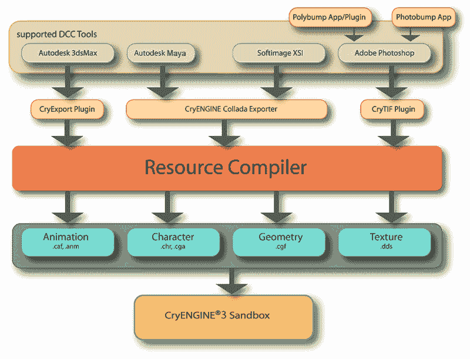
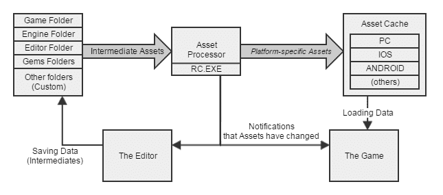

# 贮木场建造

> 原文:[https://dev.to/jeikabu/lumberyard-builds-33i3](https://dev.to/jeikabu/lumberyard-builds-33i3)

对我来说，了解一个游戏引擎的最好方法之一就是获取简单的内容，并在你的目标平台上运行它。在这里，我们将采用 SDK 附带的“SamplesProject”并创建一个 PC 发布版本(就像在[贮木场用户指南](https://docs.aws.amazon.com/lumberyard/latest/userguide/game-build-release.html)中一样)。

## [](#asset-processing)资产处理

首先，我们需要引入**资产处理器**——它负责导入游戏数据(网格、纹理、动画等等)供运行时使用。

### [](#legacy-cryengine)遗留 CryEngine

历史上，CryEngine 需要像 3DS Max、Maya、Photoshop 和其他一些数字内容创建(DCC)工具的插件。这些插件然后调用“资源编译器”以各种[专有文件格式](https://docs.cryengine.com/display/SDKDOC2/DCC+Tool+Basics)保存资产。来自 [CryEngine 3 美术管道](https://docs.cryengine.com/display/SDKDOC2/Art+Pipeline) doc:

[](https://res.cloudinary.com/practicaldev/image/fetch/s--BIv7gVW8--/c_limit%2Cf_auto%2Cfl_progressive%2Cq_auto%2Cw_880/https://rendered-obsolete.github.io/assets/ce3_asset_pipeline.png)

这总是有点痛苦:

*   需要在每位艺术家的计算机上执行额外的设置步骤，并且艺术工作流程涉及使用引擎专用工具进行手动导出
*   DCC 工具需要安装在原始资产将被使用的任何地方；其他工具没有广泛支持中间定制文件格式
*   必须为多个 DCC 工具的每个支持版本维护插件；需要大量额外的第三方 SDK
*   只有受支持的 DCC 工具才能用于资产创建

### [](#lumberyard-asset-processor)贮木场资产处理器

贮木场采取 Unity3D (以及其他引擎)使用的[方式；资产不是从 DCC“推”出来的，而是由引擎“拉”出来的，并且使用了*事实上的*标准 FBX，而不是特定于工具的格式。](https://docs.unity3d.com/Manual/3D-formats.html)

`AssetProcessor.exe`是一个独立的应用程序，位于您的系统托盘中。启动后，它会处理自上次运行以来发生更改的所有文件，并持续在后台运行，转换新的/更改过的文件。当你启动**编辑器**或 PC 游戏客户端时，它会自动启动:

[](https://res.cloudinary.com/practicaldev/image/fetch/s--rSNIQgMt--/c_limit%2Cf_auto%2Cfl_progressive%2Cq_auto%2Cw_880/https://rendered-obsolete.github.io/assets/lmbr_assetproc_notify.png)

图自[贮木场资产管道](https://docs.aws.amazon.com/lumberyard/latest/userguide/asset-pipeline-intro.html) doc:

[](https://res.cloudinary.com/practicaldev/image/fetch/s--xemUNhZM--/c_limit%2Cf_auto%2Cfl_progressive%2Cq_auto%2Cw_880/https://rendered-obsolete.github.io/assets/lmbr_asset_pipeline.png)

[资源编译器](https://docs.aws.amazon.com/lumberyard/latest/userguide/asset-pipeline-rc.html)(RC.exe)仍然存在，但是它正在被 [AZCore 资产系统](https://docs.aws.amazon.com/lumberyard/latest/userguide/asset-pipeline-asset-system-programming.html)和[资产构建器](https://docs.aws.amazon.com/lumberyard/latest/userguide/asset-builder-custom.html)淘汰。

构建资产处理器:

```
./lmbr_waf.bat  build_win_x64_vs2017_profile  -p  asset_processor 
```

<svg width="20px" height="20px" viewBox="0 0 24 24" class="highlight-action crayons-icon highlight-action--fullscreen-on"><title>Enter fullscreen mode</title></svg> <svg width="20px" height="20px" viewBox="0 0 24 24" class="highlight-action crayons-icon highlight-action--fullscreen-off"><title>Exit fullscreen mode</title></svg>

这产生了`AssetProcessor.exe`和`AssetProcessorBatch.exe`，后者简单地处理所有的资产，用于构建脚本。

## [](#remote-shader-compiler)远程着色器编译器

我们需要介绍的第二个工具是**远程着色器编译器** (RSC)。当游戏客户端或工具需要一个它找不到的[着色器](https://en.wikipedia.org/wiki/Shader)时，RSC 会生成并返回它。这有几个目的:

*   跟踪运行时所需的所有着色器排列
*   生成预处理/预编译的着色器以加速加载/渲染
*   无法从源代码编译着色器的平台的进程着色器(例如，游戏控制台和移动设备)

构建 RSC:

```
./lmbr_waf.bat  build_win_x64_vs2017_profile  -p  all  --targets=CrySCompileServer 
```

<svg width="20px" height="20px" viewBox="0 0 24 24" class="highlight-action crayons-icon highlight-action--fullscreen-on"><title>Enter fullscreen mode</title></svg> <svg width="20px" height="20px" viewBox="0 0 24 24" class="highlight-action crayons-icon highlight-action--fullscreen-off"><title>Exit fullscreen mode</title></svg>

运行`.\Tools\CrySCompileServer\x64\profile\CrySCompileServer_vc141x64.exe`启动 RSC:

```
Config file not found
Loading shader cache from D:\XXX\dev\Tools\CrySCompileServer\x64\profile\Cache\Cache.dat

0 shaders loaded from cache
Creating cache backup...
Move D:\XXX\dev\Tools\CrySCompileServer\x64\profile\Cache\Cache.bak to D:\XXX\dev\Tools\CrySCompileServer\x64\profile\Cache\Cache.bak2
Copy D:\XXX\dev\Tools\CrySCompileServer\x64\profile\Cache\Cache.dat to D:\XXX\dev\Tools\CrySCompileServer\x64\profile\Cache\Cache.bak
Cache backup done.

 caching enabled
Ready 
```

<svg width="20px" height="20px" viewBox="0 0 24 24" class="highlight-action crayons-icon highlight-action--fullscreen-on"><title>Enter fullscreen mode</title></svg> <svg width="20px" height="20px" viewBox="0 0 24 24" class="highlight-action crayons-icon highlight-action--fullscreen-off"><title>Exit fullscreen mode</title></svg>

如果你启动了一个游戏并且它连接了，RSC 应该开始输出类似于
的行

```
Loading ShaderList file: D:\XXX\dev\Tools\CrySCompileServer\x64\profile\Cache\SamplesProject/PC-D3D11_FXC-D3D11/ShaderList_D3D11.txt
System: 2 | 11/09 14:48:10 | Compiled [109ms| 0s] (PC - D3D11_FXC - D3D11 - ps_5_0) FPPS
System: 2 | 11/09 14:48:10 | Compiled [109ms| 0s] ( PC ps_5_0) FPPS
System: 2 | 11/09 14:48:11 | Updating: SamplesProject/PC-D3D11_FXC-D3D11/ShaderList_D3D11.txt 
```

<svg width="20px" height="20px" viewBox="0 0 24 24" class="highlight-action crayons-icon highlight-action--fullscreen-on"><title>Enter fullscreen mode</title></svg> <svg width="20px" height="20px" viewBox="0 0 24 24" class="highlight-action crayons-icon highlight-action--fullscreen-off"><title>Exit fullscreen mode</title></svg>

它生成的`ShaderList_D3D11.txt`文件包含运行时请求的着色器排列的描述。我们稍后需要它来创建一个发布版本。

最终，RSC 将一个着色器传递给`dev/Tools/CrySCompileServer/Compiler/`中的一个编译器:

| 编译程序 | 处理 |
| --- | --- |
| `LLVM*/` | [DirectX 着色器编译器](https://github.com/microsoft/DirectXShaderCompiler)使用 LLVM/Clang 转换成 DXIL |
| `PCD3D11/` | [fxc (DirectX 效果-编译工具)](https://docs.microsoft.com/en-us/windows/win32/direct3dtools/fxc) |
| `PCGL/` | HLSLCrossCompiler 转换为 GLSL 用于 OpenGL/Vulkan 和 GLSL ES 用于 OpenGLES |

最后，RSC 将处理后的着色器返回给请求它的游戏客户端或工具。

贮木场文件中的更多信息:

*   [远程着色器编译器](https://docs.aws.amazon.com/lumberyard/latest/userguide/mat-shaders-custom-dev-remote-compiler.html)
*   [生成着色器组合](https://docs.aws.amazon.com/lumberyard/latest/userguide/mat-shaders-custom-dev-combinations.html)

## [](#release-builds)发布构建

有了这两个实用程序，我们可以考虑创建一个“SamplesProject”的 PC 发布版本。[用户指南](https://docs.aws.amazon.com/lumberyard/latest/userguide/game-build-release.html)中的步骤可归结为:

1.  建立资产包

    ```
    ./BuildSamplesProject_Paks_PC.bat 
    ```

2.  构建着色器缓存包

    ```
    # Copy ShaderList produced by RemoteShaderCompiler  cp  .\Tools\CrySCompileServer\x64\profile\Cache\SamplesProject\PC-D3D11_FXC-D3D11\ShaderList_D3D11.txt  .  # Generate ShaderCache paks  # lmbr_pak_shaders.bat <game name> D3D11|GLES3|METAL pc|es3|ios|osx_gl <ShaderList_X.txt>  ./lmbr_pak_shaders.bat  SamplesProject  D3D11  pc  ./ShaderList_D3D11.txt  # Copy ShaderCaches to build  cp  .\build\pc\samplesproject\*.pak  .\samplesproject_pc_paks\samplesproject\ 
    ```

3.  编译游戏

    ```
    # Build release game binaries  ./lmbr_waf.bat  build_win_x64_vs2017_release  -p  game_and_engine  # Copy to build (samplesproject_pc_paks/Bin64vc141.Release/)  cp  -Recurse  .\Bin64vc141.Release  .\samplesproject_pc_paks\ 
    ```

让我们更详细地看看前两步。

### [](#build-asset-paks)建立资产包

在[BuildSamplesProject _ Paks _ PC . bat 源代码](https://github.com/aws/lumberyard/blob/1.20/dev/BuildSamplesProject_Paks_PC.bat)中，有两个重要的步骤。

1.  以批处理模式调用资产处理器，为 PC 准备所有“SamplesProject”资产:

    ```
    .\%BINFOLDER%\AssetProcessorBatch.exe /gamefolder=SamplesProject /platforms=pc 
    ```

2.  在`dev/samplesproject_pc_paks/samplesproject/` :
    中生成一堆`*.pak`文件(zip 存档)

    ```
    .\%BINFOLDER%\rc\rc.exe /job=%BINFOLDER%\rc\RCJob_Generic_MakePaks.xml /p=pc /game=samplesproject 
    ```

[资源编译器(rc.exe)](https://docs.aws.amazon.com/lumberyard/latest/userguide/asset-pipeline-rc.html)使用`dev\Bin64vc141\rc\RCJob_Generic_MakePaks.xml`将所需的文件放入适当的档案中。

### [](#build-shader-cache-paks)构建着色器缓存包

在 [lmbr_pak_shaders.bat 源代码](https://github.com/aws/lumberyard/blob/1.20/dev/lmbr_pak_shaders.bat)中，它做的主要事情是调用另外两个脚本:

1.  [`Tools/PakShaders/gen_shaders.py`](https://github.com/aws/lumberyard/blob/1.20/dev/Tools/PakShaders/gen_shaders.py) :
    *   `ShaderCacheGen.exe`是引擎的精简版本，它采用`ShaderList.txt`(由 RSC 生成)并连接回 RSC，以预处理/预编译所有所需的着色器来填充“着色器缓存”。
2.  [`Tools/PakShaders/pak_shaders.py`](https://github.com/aws/lumberyard/blob/1.20/dev/Tools/PakShaders/pak_shaders.py) :
    *   获取生成的着色器缓存，并通过将它们压缩在一起来创建`shadercache.pak`和`shadercachestartup.pak`。

当我们更详细地讨论着色器时，我们将讨论着色器缓存。

贮木场文件中的更多信息:

*   [为发布版本编译着色器](https://docs.aws.amazon.com/lumberyard/latest/userguide/asset-pipeline-shader-compilation.html)
*   [着色器缓存和生成](https://docs.aws.amazon.com/lumberyard/latest/userguide/mat-shaders-custom-dev-cache-intro.html)