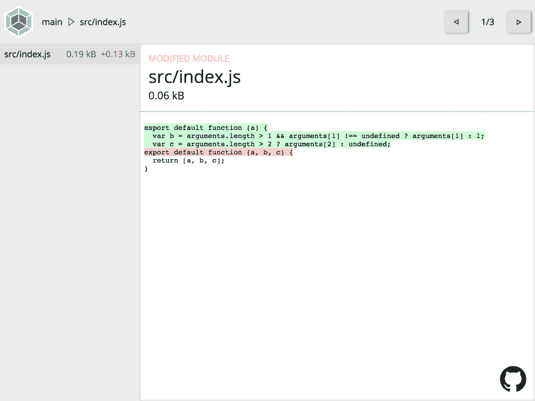
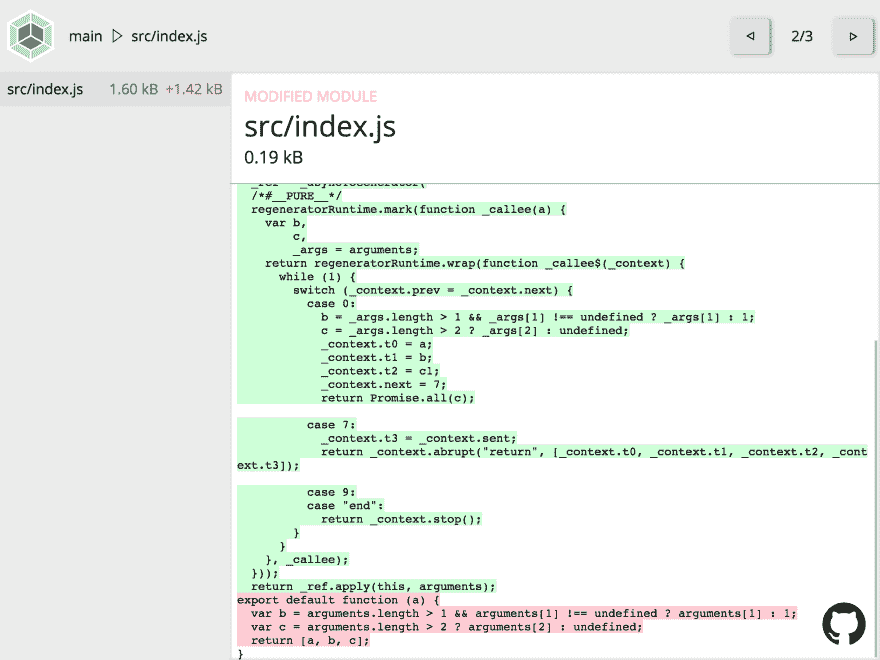
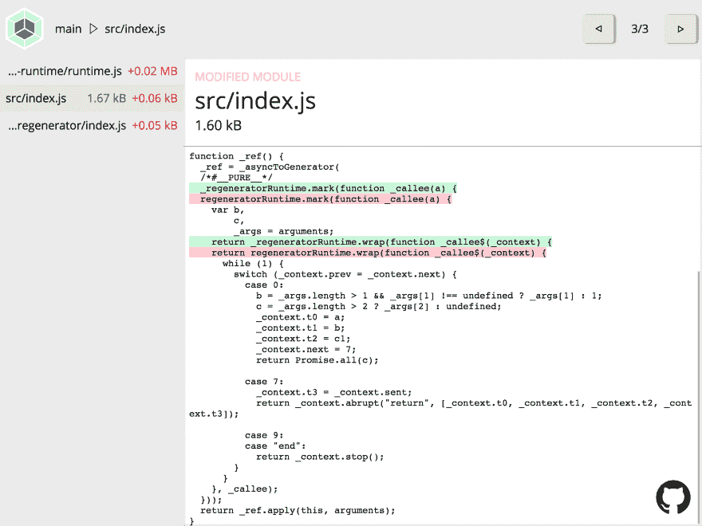
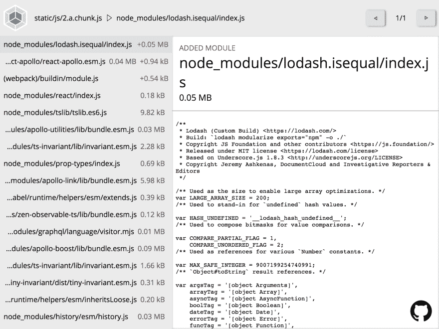

# 为什么你的包会增长？

> 原文：<https://dev.to/erykpiast/why-does-your-bundle-grow-a7n>

# 成长是发展的固有属性

有人可能会说。每当你向你的应用程序添加一些特性时，代码库和结果包的大小都会增加(相反的事情就是他们所说的“重构”)。增长并没有什么错，除非你跟踪这些变化，并确切地知道为什么运送到浏览器的文件比以前更大。这项任务相当困难，因为现在的 web 应用程序非常复杂——它不再仅仅是你的代码，大部分代码(就大小而言)都是外部库。构建系统也很重要——所有的 transpilers 和 bundlers 完全改变了应用程序代码对最终用户的外观。当这些部分中的任何一部分发生变化时，捆绑包也可能发生变化，而且通常是不可预测和意想不到的。通过修改次要版本或改变工具配置中的单个选项，就足以获得额外的千字节，而这可能并不是你所需要的。您如何知道您的包中是否添加了任何不必要的东西，以及它到底是什么？

# 理解是关键

有很多很棒的工具可以可视化捆绑包结构，比如 [Webpack 的分析](http://webpack.github.io/analyse/)和[web pack-bundle-analyzer](https://www.npmjs.com/package/webpack-bundle-analyzer)。它们有助于理解捆绑包由什么组成，但是仍然没有解决跟踪后续构建之间的变更的问题。除非你在玩“发现差异”游戏。

[](https://res.cloudinary.com/practicaldev/image/fetch/s--tWKaIwqk--/c_limit%2Cf_auto%2Cfl_progressive%2Cq_auto%2Cw_880/https://thepracticaldev.s3.amazonaws.com/i/28c91huqt0v4nxmfakhw.png)

对于源代码来说`git diff`是一个完美的工具，但是你构建的工件呢？让他们留在存储库中手动审查编译的代码听起来并不令人兴奋。有一个工具可以帮助解决这种悲惨的情况: [webpack-stats-explorer](https://erykpiast.github.io/webpack-stats-explorer/) 。

[](https://res.cloudinary.com/practicaldev/image/fetch/s--1UnzlDAa--/c_limit%2Cf_auto%2Cfl_progressive%2Cq_auto%2Cw_880/https://thepracticaldev.s3.amazonaws.com/i/nzwvbc74ppded3mxtqnf.png)

# 举例

目前常见的项目设置包括 Babel，它将通常简洁的 ES6+代码转换成相当冗长的 ES5 代码。让我们来看看对源代码的相对较小的更改是如何显著影响最终的包的。

考虑一个非常简单的模块，实际上有 57 个字符长。它实际上是纯 ES5 代码，所以输出是完全可预测的。

```
export default function (a, b, c) {
  return [a, b, c];
} 
```

如果我们添加一些 ES6 特性会怎么样？简单的，比如函数参数的默认值。就四个字包括空格！

```
export default function (a, b = 1, c) {
  return [a, b, c];
} 
```

ES5 的产量会大很多。我说真的- 137 个字符。

```
function _default(a) {
  var b = arguments.length > 1 && arguments[1] !== undefined ? arguments[1] : b;
  var c = arguments.length > 2 ? arguments[2] : undefined;
  return [a, b, c];
} 
```

当然，在交付生产之前，这段代码会被压缩，但仍然是 92 个字符——比您预期的大 23 倍。这就是它在 [webpack-stats-explorer](https://erykpiast.github.io/webpack-stats-explorer/) 中的显示方式。

[](https://res.cloudinary.com/practicaldev/image/fetch/s--ylFyduQr--/c_limit%2Cf_auto%2Cfl_progressive%2Cq_auto%2Cw_880/https://thepracticaldev.s3.amazonaws.com/i/y2rlwbdr67s1mb8o26uf.png)

你可能会说，100 个字节没什么区别。乘以几百倍，你会得到几十千字节。

但是有更多的生物可能会吓到你。让我们看看这个小片段——异步函数。

```
export default async function (a, b = 1, c) {
  return [a, b, await Promise.all(c)];
} 
```

[webpack-stats-explorer](https://erykpiast.github.io/webpack-stats-explorer/) 显示增加了 1，42 kB。在源代码中只有 25 个字符！那是巨大的。

[](https://res.cloudinary.com/practicaldev/image/fetch/s--CZ-lt-Qa--/c_limit%2Cf_auto%2Cfl_progressive%2Cq_auto%2Cw_880/https://thepracticaldev.s3.amazonaws.com/i/38mq8x6f5l7vrm6jsoeh.png)

你知道吗？这个代码都不行。您需要添加整个再生器运行时库，这需要 20 千字节。所以 25 是 22 000 字节。很好的比例，不是吗？

[](https://res.cloudinary.com/practicaldev/image/fetch/s--xgr5LxJe--/c_limit%2Cf_auto%2Cfl_progressive%2Cq_auto%2Cw_880/https://thepracticaldev.s3.amazonaws.com/i/hfx0prapd8q7lc7ihdyg.png)

万一这还不够有说服力，请考虑一种完全不同的情况:升级依赖关系。当它是一个补丁或小的改动，并且您使用的库遵循 semver 约定时，这是一个非常容易和直接的任务。所以你只要启动 [`ncu -u`](https://www.npmjs.com/package/npm-check-updates) 和`npm install`，你运行单元测试，如果它们通过了，`git commit -m "Upgrade dependencies" && git push`。瞧，维护部分完成了，让我们继续做有趣的事情。

但有时事情会变得更糟。如果你用了 [`react-apollo`](https://github.com/apollographql/react-apollo) 一阵子，可能还记得[这期](https://github.com/apollographql/react-apollo/issues/2918)。通过一个小补丁，你可以免费获得近 10 kB 的代码(缩小后)。这个问题过了一段时间就被修复了，所以如果你知道，你可以，嗯，做出反应。比如等待或者帮助解决。

[](https://res.cloudinary.com/practicaldev/image/fetch/s--6IFuv2Mv--/c_limit%2Cf_auto%2Cfl_progressive%2Cq_auto%2Cw_880/https://thepracticaldev.s3.amazonaws.com/i/fp8ntobxg9eszjv58zxc.png)

这只是两个简单的例子，但问题的面要大得多。想想这些时候你的包超出了限制，你只是沉重地叹息着增加了它:“当然，我已经添加了一些代码和碰撞依赖，开发是有成本的”。你确定你没有漏掉任何明显的东西吗？

# 结论

您应该知道代码中发生了什么——不仅是源代码，还包括构建的代码。有了这些知识，你就可以决定，你是否真的需要所有这些不同原因的额外物品。如果用户下载了所有的 JavaScript，需要重新加载每一页。你至少有机会做些什么:调整构建系统配置，跳过升级库或者这次坚持使用`.then`。

如果你的项目中有 Webpack，给 [webpack-stats-explorer](https://erykpiast.github.io/webpack-stats-explorer/) 一个机会。下一次您将一个特性分支合并到`master`时，不仅要检查源代码，还要检查产品包。

### 附录

webpack-stats-explorer 是由 React 和 [ReasonML](https://reasonml.github.io/) 创建的一个开源、非盈利项目。这可能是一个在现实世界中尝试尖端技术的好机会。这里有[一个充满想法的待办事项列表](https://erykpiast.github.io/webpack-stats-explorer/issues)，但也有空间用于 bug 报告和建议。任何帮助都将不胜感激！