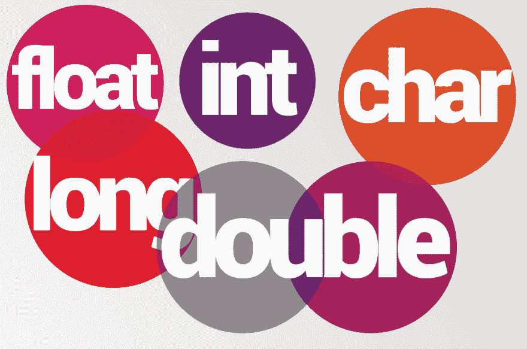
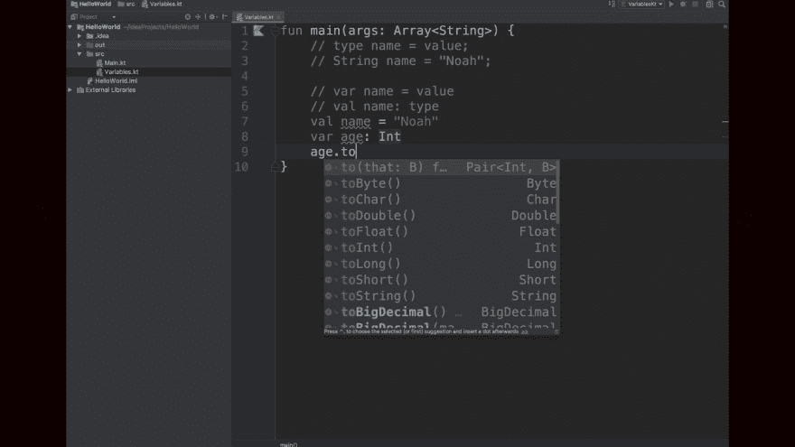

# 科特林中的变量

> 原文：<https://dev.to/edkluivert/variables-in-kotlin-4amc>

欢迎大家回到科特林的另一个简短学习，今天我们将讨论变量。

TADA!!!!

现在让我们开始，首先我想相信你不是编程新手，但如果你是，没问题。

好的，首先你需要在你的电脑上安装 Inteli J Idea，不要忘记 java jdk。以下是获取它们的相应链接。

[https://www . jetbrains . com/idea/download/index . html # section = Linux](https://www.jetbrains.com/idea/download/index.html#section=linux)

[https://www . Oracle . com/tech network/Java/javase/downloads/JDK 12-downloads-5295953 . html](https://www.oracle.com/technetwork/java/javase/downloads/jdk12-downloads-5295953.html)

如果你已经有了，很好，让我们马上开始吧。

所以 kotlin 有数据类型，你问什么是数据类型？将它们视为承载不同信息/数据的容器。

具体怎么做？

假设我们把不同的杯子放在一起，这些杯子是容器，但是它们里面的东西使它们不同。我们用这些不同的数据来建造很酷的东西，并把信息传递给我们的电脑。

数据类型的示例有:

1.Int =整数

1.  字符串=一串字符，如文本或单词。
2.  Double =十进制数字
3.  Float =十进制数字，但小于 double

顾名思义，double 的精度是 float 的 2 倍[1]。一般来说，double 的精度是 15 位小数，而 float 是 7 位。

以下是数字位数的计算方法:

double 有 52 个尾数位+ 1 个隐藏位:log(253)÷log(10) = 15.95 位数

float 有 23 个尾数位+ 1 个隐藏位:log(224)÷log(10) = 7.22 位数

这种精度损失可能导致截断误差更容易出现

1.  Char =个字母的字符
2.  布尔=真或假

接下来:如何在 kotlin 中定义变量

所以，打开你的 Inteli J 想法，创建你的 kotlin 项目。

在 kotlin 中有两种方法声明变量。

使用“var”或“val”

区别:
var 的意思是你可以随时给变量赋一个不同于初始值的不同值。

示例:

//初始值
var kot:Int = 8

//新值

kot = 10

println(kot)

输出= 10

使用 val

val kot:Int = 8

kot = 6

(编辑器抛出错误“kot 无法赋值”)。

那是今天的。对不起，伙计们，但我承诺更多的职位。你也可以随意提问。

下面是如何定义不同数据类型的变量

val a:double = 4.8d
val b:float = 5.0
val c:char =‘g’‘T2’val d:strinfg = " hello "
val e:boolean = true

谢谢你