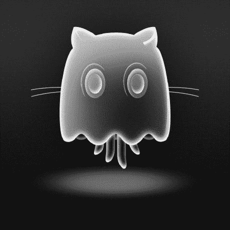
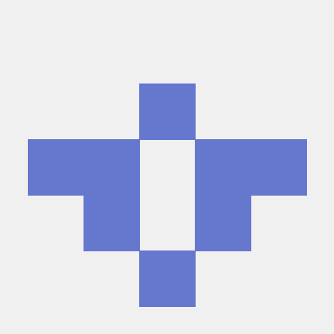

# 有没有一个坚实的分叉？没有数据收集的 NET Core CLI？

> 原文:[https://dev . to/kspeakman/is-there-a-solid-fork-of-net-core-without data-collection-22](https://dev.to/kspeakman/is-there-a-solid-fork-of-net-core-without-data-collection-22)

只是好奇是否有人知道一个被普遍接受的。我的简短搜索没有发现任何东西。

目前，我们在所有机器上设置环境变量来关闭 dotnet core CLI 数据收集。(尽管在某些情况下这似乎并不能阻止它。)我一直讨厌数据收集计划，但鉴于最近的头条新闻，开始采取更积极的措施似乎是明智之举。

**编辑**:我想到有些人可能不熟悉。NET Core CLI。所以我在下面转贴一个解释。

* * *

微软称他们的数据收集为“遥测”，而且是在 dotnet 核心命令行工具中。默认情况下它是启用的，但是您可以通过设置一个环境变量来退出。它不受欢迎。

# [ 。网芯默认不应该窥探用户 #6145](https://github.com/dotnet/sdk/issues/6145) 

 **[ghost](https://github.com/ghost)** posted on [<time datetime="2016-05-18T06:01:42Z">May 18, 2016</time>](https://github.com/dotnet/sdk/issues/6145)

@blackdwarf @piotrMSFT 我很失望地发现。NET core 附带了一个隐藏并启用的间谍实用程序，用于报告其用户。(Lakshanf/issue 2066/telemetry dot net/CLI # 2145)。显然，微软没有从针对 Windows 10 监视用户的反击中吸取任何教训。我怀疑许多人不想安装。因为这个原因，这是一个耻辱，因为。NET core 在其他方面很酷。

[View on GitHub](https://github.com/dotnet/sdk/issues/6145)

这是 2016 年发布的候选版本的脚注。

关于它的 MSDN 页面——以及选择退出的说明——可以在这里找到。尽管有些措辞很低调。

# [ 遥测电文措辞“不准确”【10262 号](https://github.com/dotnet/sdk/issues/10262)

 **[arekbal](https://github.com/arekbal)** posted on [<time datetime="2019-05-10T00:30:34Z">May 10, 2019</time>](https://github.com/dotnet/sdk/issues/10262)

## 步骤重现

只需在控制台中写下`dotnet`,就会有一个关于使用遥测技术以及如何使用环境变量禁用遥测技术的通知。该信息表明遥测数据与社区共享。

## 实际行为

该消息的措辞是不准确和误导的，因为只有“一些”数据“曾经”与社区共享。看[https://docs . Microsoft . com/en-us/dot net/core/tools/telemetry](https://docs.microsoft.com/en-us/dotnet/core/tools/telemetry)告诉我们 13 个中只有 5 个？数据点“曾经”是共享的。此外，数据块不是原始数据，它们已经过预处理，并且缺少许多有用的信息，这些信息是通过遥测技术收集的，但没有公开，例如调用时间。我说的“曾经是”是指，目前可用的最后一个 blob 来自 2017 年底。最新的数据是不公开的(最近 5 个季度的数据)，即使是这种微小的汇总形式。

## 建议修改

我不期望对措辞有太多的--至少是--改变。去掉关于与社区共享数据的句子。或者，考虑到只有一部分收集的数据与机构群体共享，更改措辞。

## 欧盟 GDPR 旁注

根据本页面[https://EC . Europa . eu/info/law/law-topic/data-protection/reform/what-personal-data _ en](https://ec.europa.eu/info/law/law-topic/data-protection/reform/what-personal-data_en)收集的数据，尤其是 MAC 地址(即使明显经过哈希处理)使其成为应谨慎管理的个人信息。

## [【ML.NET】T2 遥测(后添日)](#mlnet-telemetry-added-day-later)

mlnet cli 工具使用以下信息:“数据是匿名的，不包括个人信息或来自数据集的数据。”这也是不准确的，有些误导。将此数据集称为包含匿名数据而不包含个人信息是错误的。我也不知道 mlnet cli 将使用遥测技术。因此，我只是在第一次用 quickstart example 运行它之后才禁用它。基本的`mlnet`命令不会告诉你关于遥测的信息。这有点令人担忧。

## 意见

在我看来，99%匿名(因为几乎不可能交叉检查、关联)遥测技术的某种变体对使用指标有意义...dotnet 用的这个数据，mlnet 没有那么多匿名。仅公开共享部分数据会导致对数据计划用途的不同结论。

[View on GitHub](https://github.com/dotnet/sdk/issues/10262)

注意:目前*没有*收集运行时数据。也就是说，当你用`dotnet MyApp.dll`调用一个内置的应用程序时，它不会收集任何东西。当您出于开发目的使用它时，它确实会记录和报告一些数据点(例如`dotnet run`)，除非您通过设置一个环境变量来选择退出。据报道，即使您选择退出，一些安装后脚本也会发送遥测数据。但事后，应该不会。