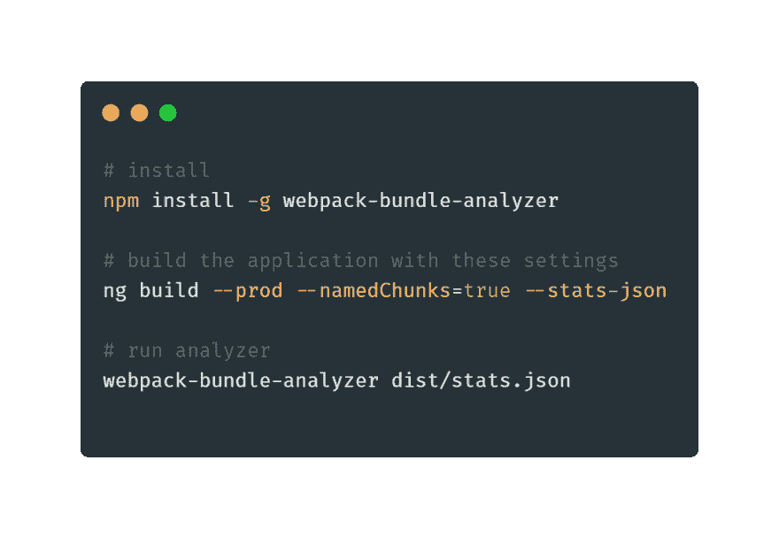
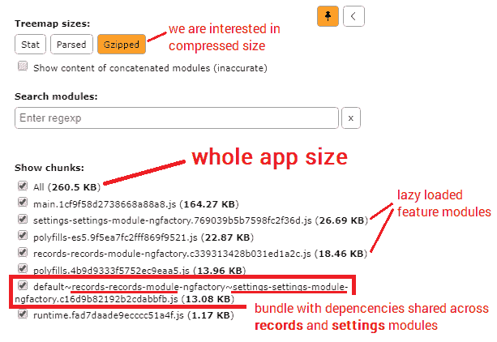
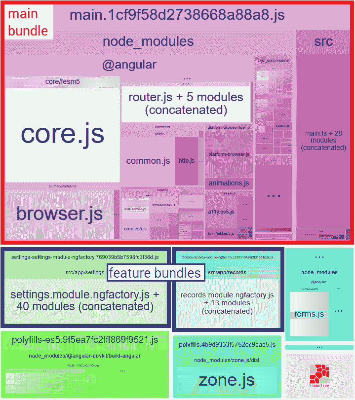

# 【专业提示】如何分析你的角束

> 原文:[https://dev . to/angular/pro-tip-how-to-analyze-your-angular-bundle-297 f](https://dev.to/angular/pro-tip-how-to-analyze-your-angular-bundle-297f)

又到了**角识丸**的时候了！💊学习新东西只需要 10 秒钟🔥比如早上吃维他命😃

假设您正在构建一个包含三个模块的应用程序:

*   **主**模块，
*   **记录**模块(惰性加载特征模块)、
*   **设置**模块(懒加载功能模块)。

现在，您想知道这些模块对整个应用程序的大小有多大贡献！使用 webpack-bundle-analyzer 非常简单！下面看看如何分析您的应用捆绑包。

[T2】](https://res.cloudinary.com/practicaldev/image/fetch/s--ytXhjjWH--/c_limit%2Cf_auto%2Cfl_progressive%2Cq_auto%2Cw_880/https://thepracticaldev.s3.amazonaws.com/i/7pya38jlj63lqc20sdk8.png)

这将给你一个非常详细的应用概述。您可以看到最终的 JavaScript 包的重量以及它们的大小是如何相互引用的！下面的彩色图表是这样构建的，给定的矩形越大，特定的包就越重！

[T2】](https://res.cloudinary.com/practicaldev/image/fetch/s--90ltQte5--/c_limit%2Cf_auto%2Cfl_progressive%2Cq_auto%2Cw_880/https://thepracticaldev.s3.amazonaws.com/i/6kufnkqke4afylhou6m4.png)

[T2】](https://res.cloudinary.com/practicaldev/image/fetch/s--ItF0aYQ---/c_limit%2Cf_auto%2Cfl_progressive%2Cq_auto%2Cw_880/https://thepracticaldev.s3.amazonaws.com/i/qc6a1e4dnn64jkcq5107.png)

如果你想把这种知识药丸直接发到你的邮箱，请在[angular-academy.com/blog/](https://angular-academy.com/blog)订阅。我将定期发送它们！记住，学习新东西只需要 10 秒钟！😃

此外，如果你能在推特上发布这个知识药丸，我将不胜感激！帮助他人发现知识！