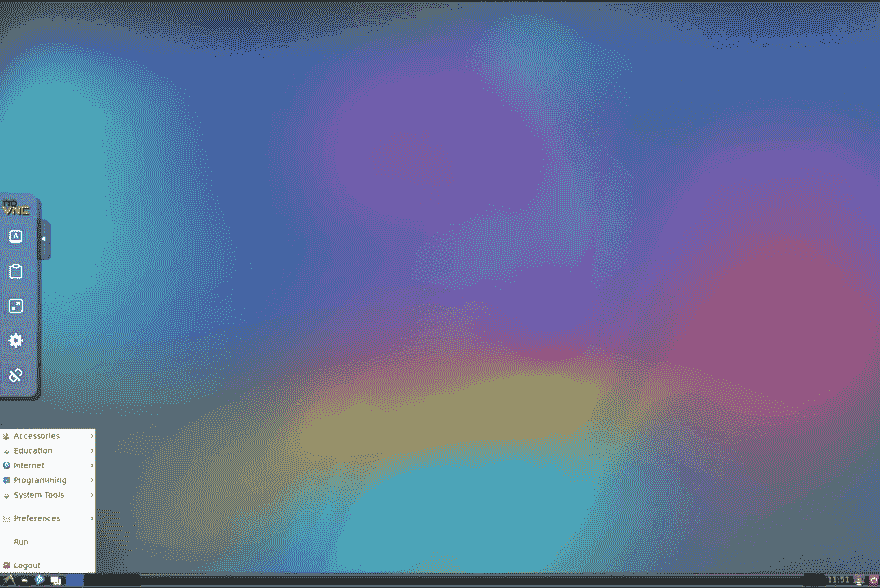
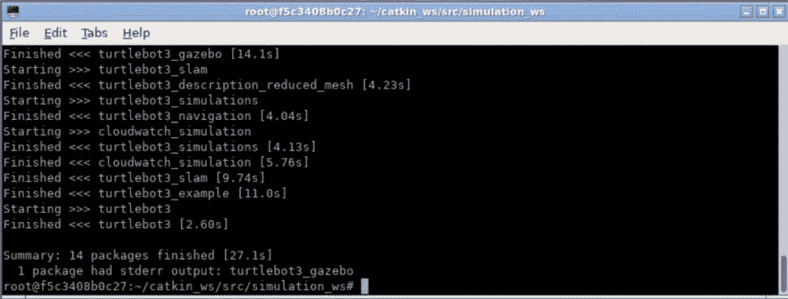
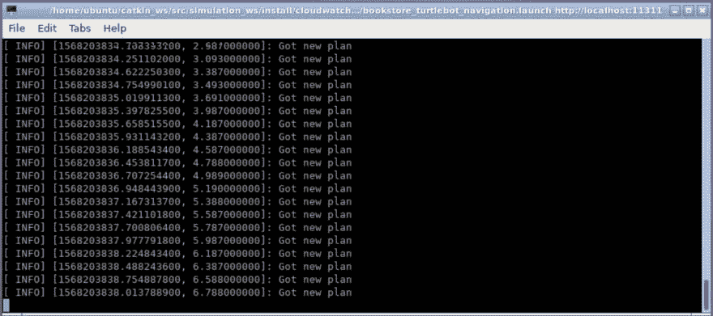
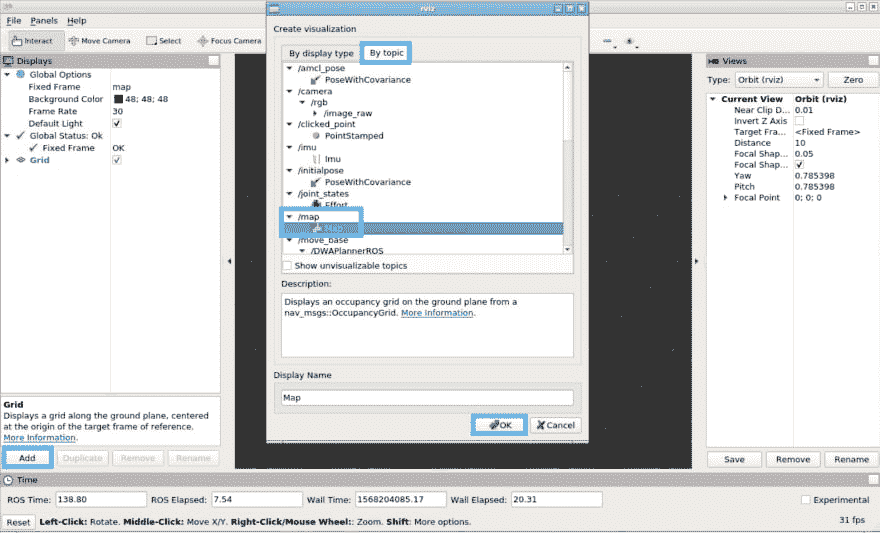
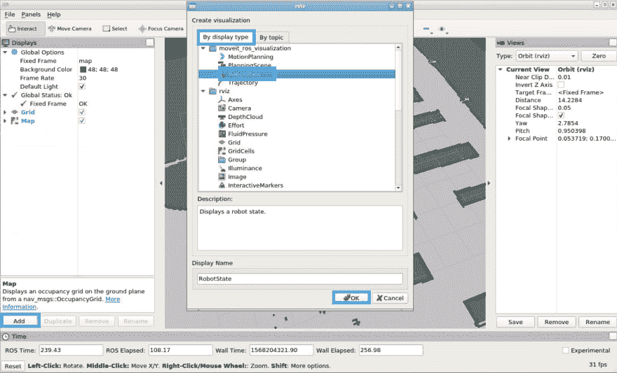
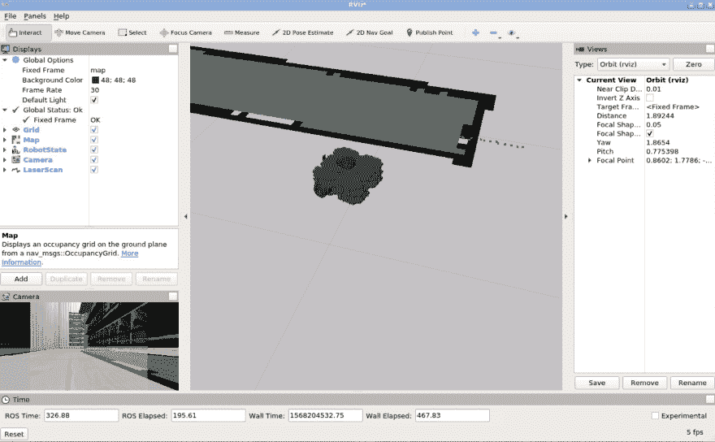
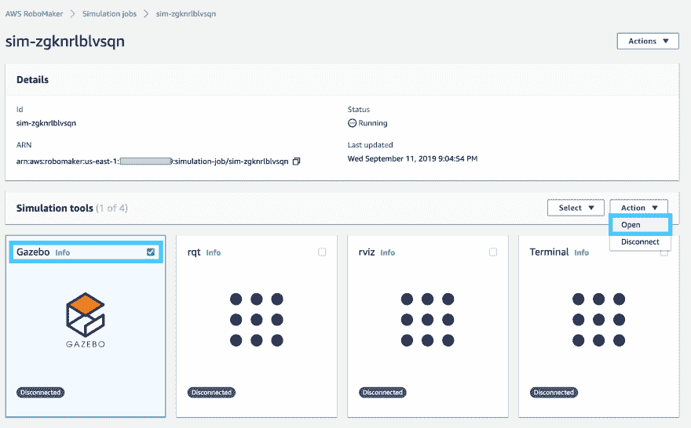
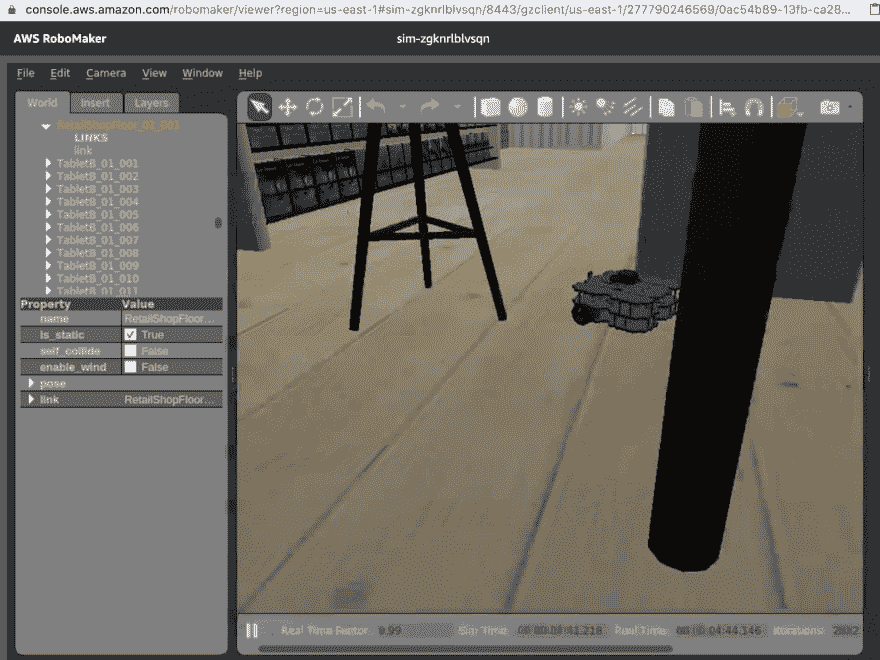

# 机器人模拟初学者指南

> 原文:[https://dev . to/t 04 glovern/AWS-robo maker-初学者-机器人指南-模拟-4hgi](https://dev.to/t04glovern/aws-robomaker-beginner-s-guide-to-robot-simulation-4hgi)

*这个帖子最初写于[devo pstar](https://devopstar.com/)T3。来看看[这里](https://devopstar.com/2019/09/12/aws-robomaker-beginners-guide-to-robot-simulation/)*

乍一看，AWS RoboMaker 可能看起来像是烟雾和镜子。这当然是我在本周好好审视这项服务之前的感受。

AWS RoboMaker 是 ROS(机器人操作系统)的开发、部署和仿真平台。ROS 已经存在了很长时间，并且在整个机器人行业中被广泛使用。因为它的利基，以及它的有用性在工业之外并不明显的事实；毫不奇怪，RoboMaker 在我的 Twitter 圈子里并没有引起很多人的注意。

## [](#introduction)简介

这篇文章的目的是最终引导你在 AWS RoboMaker 上模拟 ROS 包。虽然这不是一个新的话题，但我不认为有人对超级初学者公平。我们不会写任何 ROS 模块，但是我会尽量让你觉得打包现有的很舒服。

在 [AWS Robotics](https://github.com/aws-robotics) github 上有大量 RoboMaker 配置的 ROS 项目的精彩例子。我们在本帖中所做的项目可以与那里的项目互换。

## [](#just-like-the-simulations)就像模拟一样

RoboMaker 的核心是几个软件的管理服务:

*   roscore -节点和程序的集合，是基于 ROS 的系统的先决条件。节点在 roscore 的一个实例上相互通信。
*   rviz-ROS 的 3D 可视化工具。在模拟过程中，我们可以使用 rviz 来可视化机器人正在做什么。RViz 也可以用来与机器人交流，但是这不是我们将要讨论的内容。
*   [凉亭](http://gazebosim.org/) -用合适的物理引擎模拟机器人。

RoboMaker 会自动为你设置所有这些部件，这听起来没什么大不了的；然而，如果你尝试过自己管理这一堆软件，你会意识到有多少移动的部分。

## [](#dockerized-environment)码头化环境

对于这个项目，我已经创建了一个 Dockerized 环境，可以用来完全模拟当地的一切(Gazebo 是一个例外，由于图形通过 VNC 的限制)。拉下存储库，从
开始

```
git clone https://github.com/t04glovern/aws-robomaker-docker
cd aws-robomaker-docker 
```

运行环境的构建和设置就像运行下面的代码一样简单:

```
docker-compose up -d 
```

现在去喝杯咖啡，因为这需要一些时间。一旦完成，运行`docker ps -a`将显示下面正在运行的

```
$ docker ps -a
# CONTAINER ID        IMAGE                      COMMAND             CREATED             STATUS                            PORTS                                          NAMES
# f5c3408b0c27        aws-robomaker-docker_ros   "/startup.sh"       10 seconds ago      Up 9 seconds (health: starting)   0.0.0.0:5900->5900/tcp, 0.0.0.0:6080->80/tcp   catkin 
```

在浏览器中打开 http://localhost:6080 ,您应该会看到一个 VNC 环境会话

[T2】](https://res.cloudinary.com/practicaldev/image/fetch/s--3YW4cjAx--/c_limit%2Cf_auto%2Cfl_progressive%2Cq_auto%2Cw_880/https://thepracticaldev.s3.amazonaws.com/i/fskf1ennu1f13dab29hr.png)

## [](#simulating-locally)局部模拟

首先，让我们在本地模拟 ROS 部署。启动终端并运行以下命令

```
# High level Project Workspace
cd /home/ubuntu/catkin_ws/src

# Simulation Workspace
cd simulation_ws

# Update Workspace & install dependencies
rosws update
rosdep install --from-paths src --ignore-src -r -y 
```

更新工作区将会降低不在 repo 中的任何可能需要的外部依赖项。您可以通过打开`simulation_ws`工作区中的`.rosinstall`文件来检查这些是什么。在这种情况下，您可以在下面看到需要什么。

```
- git: {local-name: src/deps/aws-robomaker-bookstore-world, uri: "https://github.com/aws-robotics/aws-robomaker-bookstore-world", version: v0.0.1}
- git: {local-name: src/deps/turtlebot3, uri: "https://github.com/ROBOTIS-GIT/turtlebot3", version: d3cdcc6647812ae9a83f05e626cdae322923ac84}
- git: {local-name: src/deps/turtlebot3_simulations, uri: "https://github.com/ROBOTIS-GIT/turtlebot3_simulations", version: 1.2.0} 
```

最后一步是构建本地包。为此，我们使用 colcon，它将加速构建所有模块的所有必要步骤。

```
colcon build 
```

如果一切正常，您应该会看到以下内容

[T2】](https://res.cloudinary.com/practicaldev/image/fetch/s--Wuu6Sb-_--/c_limit%2Cf_auto%2Cfl_progressive%2Cq_auto%2Cw_880/https://thepracticaldev.s3.amazonaws.com/i/zc5e702y2mru6az52fhh.png)

### [](#execute-simulation-locally)本地执行模拟

我们现在准备在本地运行模拟。在这个例子中，我们可以选择设置我们想要使用的机器人类型。这是通过如下设置环境变量来实现的:

```
# Options are burger, waffle & waffle_pi
export TURTLEBOT3_MODEL=waffle_pi 
```

接下来用所有必需的 ROS 工作空间配置设置您的 shell 环境

```
# Make sure you're in the workspace above `simulation_ws`
cd ../

# set environment configuration
source simulation_ws/install/local_setup.sh 
```

模拟环境有两个选项:

*   (0，0)处有一些球围绕着乌龟机器人的空世界
*   机器人导航到随机目标的零售空间

从上面选择一个并运行以下命令来启动模拟

```
# Command
roslaunch cloudwatch_simulation [command]

# Example
roslaunch cloudwatch_simulation bookstore_turtlebot_navigation.launch 
```

如果一切顺利，您应该会看到以下内容，这表明机器人正在模拟

[T2】](https://res.cloudinary.com/practicaldev/image/fetch/s--ram5RKXq--/c_limit%2Cf_auto%2Cfl_progressive%2Cq_auto%2Cw_880/https://thepracticaldev.s3.amazonaws.com/i/knnjziysr4awufotm1o9.png)

### [](#viewing-simulation-locally)本地查看模拟

一个终端不是很有趣，有趣的事情实际上是观察机器人。这可以使用 RViz 来完成。打开一个新的终端，运行下面的

```
rviz 
```

你会看到一个界面。从这里开始，您需要添加来自`topic`的`Map`

[T2】](https://res.cloudinary.com/practicaldev/image/fetch/s--qjGYplMP--/c_limit%2Cf_auto%2Cfl_progressive%2Cq_auto%2Cw_880/https://thepracticaldev.s3.amazonaws.com/i/aps5odzwoehppaxs3fn7.png)

和基本显示类型中的机器人状态

[T2】](https://res.cloudinary.com/practicaldev/image/fetch/s--M1XMAV_f--/c_limit%2Cf_auto%2Cfl_progressive%2Cq_auto%2Cw_880/https://thepracticaldev.s3.amazonaws.com/i/50trax7aeo05714yooez.png)

四处游玩，添加一些其他可选显示器。下面是一个`Camera`和`LaserScan`数据的例子。

[T2】](https://res.cloudinary.com/practicaldev/image/fetch/s--tDdutMeh--/c_limit%2Cf_auto%2Cfl_progressive%2Cq_auto%2Cw_880/https://thepracticaldev.s3.amazonaws.com/i/0lc89et3mrzegb19kq2b.png)

完成后，关闭 RViz，让我们进入下一步。

## [](#simulating-on-robomaker)在机器人身上模拟

为了部署到 RoboMaker，我们需要捆绑所有让我们的机器人与众不同的东西。这是使用 colcon 完成的。

```
cd /home/ubuntu/catkin_ws/src/simulation_ws
source install/local_setup.sh
colcon bundle 
```

这一步需要很长时间(在某些情况下需要 30 多分钟)，因为捆扎机需要从零开始拆除运行机器人所需的一切。

一旦完成，它将在`simulation_ws/bundle/output.tar`中吐出一个 output.tar 文件。我们应该把这个焦油下载到本地电脑上。这是在你的实际计算机(不在容器中)上使用下面的 docker 命令完成的

```
docker cp catkin:/home/ubuntu/catkin_ws/src/simulation_ws/bundle/output.tar . 
```

然后，我们需要将这个`.tar`上传到一个 S3 桶，以便在接下来的步骤中使用。我要用我自己的桶`devopstar`，你需要自己做。这是通过运行下面的命令
来完成的

```
aws s3 mb s3://your-bucket-name 
```

**注意** : *在本教程的剩余部分，我将使用下面的文件存储桶和路径。用您自己的*替换这些引用

*   **桶** : devopstar
*   **key _ path**:resources/AWS-robo maker-kickstart

将`tar`上传到 S3 一个名为`input`的文件夹中。命名并不重要，但是这样更容易区分。

```
aws s3 cp output.tar s3://devopstar/resources/aws-robomaker-kickstart/input/simulation_ws.tar 
```

### [](#cdk-deploy)CDK 部署

我已经编写了使用 CDK 所需的 RoboMakerSimulation 和自定义角色的部署，但是这对于本教程来说不是必需的。如果你想知道如何创建本教程中使用的 CloudFormation 模板，你可以运行下面的

```
# Install CDK
npm install -g aws-cdk

cd cdk/
npm install npm run build

# Export a synthisized template
cdk synth --no-staging > template.yaml 
```

如果您想使用 CloudFormation 进行部署，可以从 CLI 或 Web 界面部署`cdk/template.yaml`文件。根据铲斗名称和`.tar`位置，您的参数会有所不同。

记录资源创建的输出。您应该收到以下内容:

*   **RoboMaker 角色**:arn:AWS:iam::123456789010:Role/robo maker-simrole xxxxxxxxxxxxxxxxxxxxx
*   **RoboMaker 应用 ARN**:arn:AWS:robo maker:us-east-1:123456789010:simulation-Application/AWS-robo maker-kickstart/1568206875172

### [](#robomaker-simulation-job)RoboMaker 模拟作业

现在的最后一步是从 [RoboMaker 控制台](https://console.aws.amazon.com/robomaker/home?region=us-east-1#simulationJobs)运行模拟作业。不幸的是，没有简单的方法来使用 CloudFormation 部署这一块。使用上一步中的信息创建以下 json 的一个版本(在`RoboMakerJob.json`中可用)

```
{  "outputLocation":  {  "s3Bucket":  "devopstar",  "s3Prefix":  "resources/aws-robomaker-kickstart/output/"  },  "maxJobDurationInSeconds":  3600,  "iamRole":  "arn:aws:iam::123456789010:role/xxxxxxxxxxxxxxxxxxxxxxxxxxxxxxxxxxxx",  "failureBehavior":  "Continue",  "simulationApplications":  [  {  "application":  "arn:aws:robomaker:us-east-1:123456789010:simulation-application/aws-robomaker-kickstart/1568120923973",  "applicationVersion":  "$LATEST",  "launchConfig":  {  "packageName":  "cloudwatch_simulation",  "launchFile":  "bookstore_turtlebot_navigation.launch",  "environmentVariables":  {  "TURTLEBOT3_MODEL":  "waffle_pi"  }  }  }  ],  "tags":  {  "Project":  "aws-robomaker-kickstart"  }  } 
```

使用 CLI
部署作业

```
aws robomaker create-simulation-job --cli-input-json file://RoboMakerJob.json 
```

前往 [Web 界面](https://console.aws.amazon.com/robomaker/home?region=us-east-1#simulationJobs)，查看您刚刚创建的模拟作业

加载完成后，打开 Gazebo 的一个实例

[T2】](https://res.cloudinary.com/practicaldev/image/fetch/s--abhmBeDI--/c_limit%2Cf_auto%2Cfl_progressive%2Cq_auto%2Cw_880/https://thepracticaldev.s3.amazonaws.com/i/zlkrkx9cyjw5pdqqpia8.png)

现在，您应该能够在 3D 空间中与模拟进行交互。

[T2】](https://res.cloudinary.com/practicaldev/image/fetch/s--nAO9vQoO--/c_limit%2Cf_auto%2Cfl_progressive%2Cq_auto%2Cw_880/https://thepracticaldev.s3.amazonaws.com/i/8yrxt9bqgxxarmg6k5hy.png)

## [](#summary)总结

AWS RoboMaker 是一项普通用户可能几乎没有注意到的服务。然而，给它一些时间后，我肯定能看到它的价值。ROS 可能是一个很难处理的问题，主要是因为不同的版本需要截然不同的 roscore 版本。